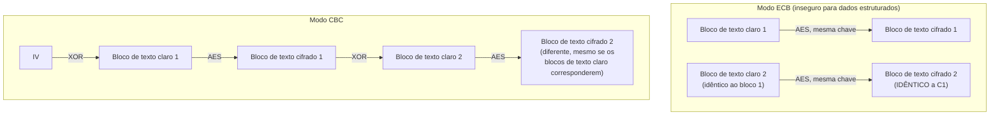

## Objetivos de Aprendizagem

- Distinguir uma cifra de bloco de um modo de operação, e explicar por que as duas são peças separadas e escolhidas independentemente de qualquer esquema de criptografia simétrica real.
- Descrever o AES no nível do que ele promete (uma permutação invertível e com chave sobre blocos de tamanho fixo), sem precisar derivar a sua estrutura de rodadas interna.
- Explicar, com um exemplo visual concreto, exatamente por que o modo ECB vaza a estrutura do texto claro, e por que essa falha é uma propriedade do modo, não do AES em si.
- Descrever os modos CBC e CTR no nível da sua construção de encadeamento/contador, e explicar que propriedade cada um adiciona que o ECB não tem.
- Enunciar por que um modo de operação tipicamente exige um IV ou nonce, e o que dá errado se esse valor é reusado.

## Contexto e Motivação

O one-time pad provou que o sigilo perfeito é alcançável, mas a um custo de gerenciamento de chave que o torna impraticável para essencialmente qualquer sistema real. Toda cifra simétrica prática em uso hoje, AES à frente de todas, deliberadamente abre mão do sigilo perfeito em troca de uma chave muito mais curta e reutilizável, aceitando uma garantia de segurança mais fraca e *computacional*: não "inquebrável por qualquer computador", mas "inquebrável por qualquer atacante com uma quantidade realista de poder computacional, dado o entendimento matemático atual". Este é o trade-off de engenharia central da criptografia aplicada, e vale enunciá-lo claramente em vez de tratá-lo como um compromisso inexplicado: uma chave AES de 256 bits é uma peça fixa, pequena e reutilizável de dados secretos, não uma string aleatória tão longa quanto toda mensagem já enviada sob ela, e essa diferença sozinha é o que torna a comunicação criptografada real e prática possível de todo.

**AES (o Advanced Encryption Standard)**, padronizado pelo NIST no FIPS 197 após uma competição pública aberta de vários anos, é a cifra de bloco que quase todo sistema moderno usa. Mas o AES sozinho só define como criptografar exatamente um bloco de 128 bits, mensagens reais quase nunca têm exatamente 128 bits de comprimento. A questão separada e adicional de como criptografar uma mensagem de comprimento *arbitrário* usando uma cifra que só sabe tratar um bloco de tamanho fixo por vez é respondida por um **modo de operação**, e, este é o ponto que este conceito existe para deixar inequivocamente claro, uma cifra de bloco corretamente implementada combinada com um modo de operação mal escolhido ainda pode falhar catastroficamente em proteger a confidencialidade, mesmo que a própria cifra não tenha falha alguma.

## Teoria Central

### O que uma cifra de bloco promete

Uma cifra de bloco é uma transformação invertível e com chave sobre blocos de tamanho fixo: dada uma chave `k` e um bloco de texto claro `p` de um tamanho fixo (128 bits, para o AES), ela produz um bloco de texto cifrado `c` do mesmo tamanho, e dada a mesma chave e `c`, ela recupera `p` exatamente. Crucialmente, esta transformação deveria se comportar, para qualquer um sem a chave, como uma permutação genuinamente aleatória daquele espaço de blocos de tamanho fixo, indistinguível do aleatório, dado só acesso de oráculo para criptografar/descriptografar sob a chave desconhecida. O AES alcança isto (até onde décadas de criptanálise pública intensa conseguiram determinar, nenhuma quebra completa e prática do próprio AES é conhecida) por meio de múltiplas rodadas internas de operações de substituição e permutação, padronizadas precisamente, byte por byte, no FIPS 197, com três tamanhos de chave (AES-128, AES-192, AES-256) trocando uma chave maior por uma margem de segurança maior contra avanços futuros em criptanálise ou em poder computacional (como, eventualmente, computadores quânticos de larga escala).

Esta disciplina trata a estrutura de rodadas interna do AES como fora do seu escopo, o próprio padrão, e a prova de segurança por trás dele, são o assunto de cursos dedicados de criptografia, e em vez disso foca no que importa para usá-lo corretamente: o AES é uma caixa-preta que, dada uma chave de 128 bits (ou 192 ou 256 bits) e um bloco de 128 bits, produz uma saída de 128 bits indistinguível do aleatório, de forma invertível.

### O problema separado: criptografar mais de um bloco

Um modo de operação especifica como aplicar uma cifra de bloco repetidamente para criptografar uma mensagem mais longa do que um bloco. A abordagem ingênua, dividir a mensagem em blocos de 128 bits e criptografar cada um independentemente sob a mesma chave, é chamada de modo **ECB (Electronic Codebook)**, e ela tem uma falha severa e estrutural que nada tem a ver com qualquer fraqueza no próprio AES: **blocos de texto claro idênticos sempre produzem blocos de texto cifrado idênticos**, porque a mesma chave aplicada à mesma entrada sempre produz a mesma saída. Qualquer estrutura ou repetição presente no texto claro, um padrão repetido, grandes regiões de um único valor, a estrutura de nível de bloco de uma imagem, sobrevive diretamente, visivelmente, no texto cifrado.

O modo **CBC (Cipher Block Chaining)** conserta isto fazendo XOR de cada bloco de texto claro com o *bloco de texto cifrado anterior* antes de criptografá-lo, para que blocos de texto claro idênticos não produzam mais texto cifrado idêntico (porque a criptografia de cada bloco agora depende de tudo que veio antes dele na mensagem):

```text
c₀ = AES_encrypt(k, p₀ ⊕ IV)
c₁ = AES_encrypt(k, p₁ ⊕ c₀)
c₂ = AES_encrypt(k, p₂ ⊕ c₁)
  ... e assim por diante, encadeando para frente
```

O **IV (vetor de inicialização)**, um valor aleatório ou único usado só para o primeiro bloco, garante que mesmo criptografar a exata mesma mensagem duas vezes sob a mesma chave produza um texto cifrado completamente diferente a cada vez, sem ele, o primeiro bloco sofreria o exato mesmo problema de entrada-idêntica-saída-idêntica que o ECB tem, para toda mensagem que por acaso começa com o mesmo texto claro.

O modo **CTR (Counter)** toma uma abordagem inteiramente diferente: em vez de encadear a criptografia dos blocos de texto claro, ele criptografa um valor de contador (começando de um nonce e incrementando a cada bloco) e faz XOR desse keystream contra o texto claro, estruturalmente muito similar ao one-time pad do conceito anterior, mas com o keystream gerado de uma chave curta e contador via AES em vez de precisar ser verdadeiramente aleatório e do comprimento da mensagem. Isto torna o modo CTR paralelizável (qualquer bloco pode ser criptografado ou descriptografado independentemente, já que os valores de contador são todos computáveis de antemão) e transforma o AES em algo funcionalmente como uma cifra de fluxo.



### Por que o reuso de nonce/IV é perigoso

Tanto o IV do CBC quanto o nonce do CTR existem para prevenir o exato problema de entrada-idêntica que o ECB tem no nível da mensagem inteira, não só de blocos individuais dentro dela. Reusar um nonce no modo CTR é especialmente catastrófico e estruturalmente idêntico a reusar uma chave de one-time pad (o conceito anterior): o mesmo bloco de keystream é XORado contra dois blocos de texto claro diferentes, e fazer XOR dos dois textos cifrados resultantes cancela o keystream exatamente como cancelou a chave de one-time pad, recuperando o XOR dos dois textos claros diretamente. Esta não é uma preocupação hipotética, o reuso de nonce causou vulnerabilidades reais e exploradas em sistemas implantados, que é exatamente por que modos autenticados modernos (cobertos dois conceitos à frente) são projetados para tornar o tratamento correto de nonce tão perto de infalível quanto a API consegue tornar.

## Exemplos Resolvidos

### Exemplo 1: O "pinguim ECB", visualizando por que o ECB vaza estrutura

Considere criptografar uma imagem bitmap, bloco por bloco, sob o modo ECB. Uma grande região de cor sólida da imagem (digamos, o fundo) consiste em muitos blocos idênticos de 128 bits de dados de pixel. Sob ECB, cada um desses blocos de texto claro idênticos criptografa para o exato mesmo bloco de texto cifrado:

```text
Imagem em texto claro:  [fundo][fundo][fundo][contorno do pinguim][fundo]...
Texto cifrado ECB:      [X.... ][X.... ][X.... ][Y...............][X.... ]...
                         ^ blocos idênticos produzem blocos de texto cifrado idênticos

Resultado: o CONTORNO do pinguim (ou de qualquer imagem estruturada) permanece
claramente visível na saída "criptografada", porque a repetição de nível de bloco
no texto claro sobrevive diretamente em repetição de nível de bloco no
texto cifrado.
```

Esta é uma ilustração real e amplamente citada (informalmente chamada de "o pinguim ECB", após uma demonstração famosa usando uma imagem de um logo de pinguim) precisamente porque torna a afirmação abstrata "o ECB vaza estrutura" imediatamente, visualmente inegável, nenhuma criptanálise é sequer exigida para ver que algo está muito errado com a confidencialidade de uma imagem criptografada com ECB.

### Exemplo 2: Rastreando uma criptografia CBC de uma mensagem curta e repetida

Criptografe a mensagem `"AA" "AA" "BB"` (três blocos de comprimento idêntico, dois deles idênticos) sob CBC com IV = `V₀`:

```text
Bloco 0 ("AA"): c₀ = AES_encrypt(k, "AA" ⊕ V₀)
Bloco 1 ("AA"): c₁ = AES_encrypt(k, "AA" ⊕ c₀)    -- NÃO a mesma entrada que a chamada
                                                       AES do bloco 0, porque é XORada
                                                       com c₀, não V₀
Bloco 2 ("BB"): c₂ = AES_encrypt(k, "BB" ⊕ c₁)

Mesmo que os blocos de texto claro 0 e 1 sejam IDÊNTICOS ("AA" == "AA"), c₀ ≠ c₁,
porque a entrada AES do bloco 1 foi XORada com c₀ (que depende de V₀ e da
chave), não com V₀ diretamente. O encadeamento é exatamente o que quebra o
problema de entrada-idêntica-saída-idêntica do ECB.
```

### Exemplo 3: Por que reusar um nonce CTR é tão catastrófico quanto reusar uma chave de one-time pad

```text
Mensagem 1, bloco 0: c₁ = m₁ ⊕ AES_encrypt(k, nonce || counter=0)
Mensagem 2, bloco 0: c₂ = m₂ ⊕ AES_encrypt(k, nonce || counter=0)   -- MESMO nonce, reusado!

c₁ ⊕ c₂ = (m₁ ⊕ keystream) ⊕ (m₂ ⊕ keystream) = m₁ ⊕ m₂

O keystream (AES_encrypt(k, nonce || counter=0), idêntico em ambos os casos
porque o nonce e o contador são idênticos) cancela completamente, o
atacante recupera m₁ ⊕ m₂ sem jamais aprender a chave, exatamente como no
ataque de reuso de one-time pad do conceito anterior.
```

Este exemplo é posto deliberadamente ao lado do ataque de reuso de one-time pad: a álgebra subjacente (`c₁ ⊕ c₂ = m₁ ⊕ m₂` sempre que o exato mesmo keystream é usado duas vezes) é idêntica em ambos os casos, que é o ponto inteiro, a lição da cifra mais simples possível transfere direta e exatamente para um modo construído sobre a cifra de bloco padronizada mais forte disponível.

## Equívocos Comuns e Armadilhas

- **"Se o AES é usado, os dados estão seguramente criptografados."** O AES só define a transformação de um único bloco; o modo de operação determina a segurança do esquema geral para mensagens de comprimento realista, e uma escolha de modo ruim (ECB) pode vazar estrutura substancial mesmo com uma cifra subjacente perfeitamente segura, como o exemplo do pinguim ECB mostra diretamente.
- **"ECB é só uma versão levemente mais fraca do CBC, boa para dados que não são imagem."** A falha de bloco-idêntico-saída-idêntica do ECB se aplica a qualquer dado estruturado com blocos repetidos, não só imagens, cabeçalhos repetidos, preenchimento ou substrings comuns em texto ou registros estruturados podem todos vazar da mesma forma; o ECB essencialmente nunca deveria ser usado para mensagens mais longas do que um bloco.
- **"Um IV ou nonce precisa ser mantido secreto, como uma chave."** Um IV/nonce para CBC ou CTR é tipicamente transmitido em claro junto ao texto cifrado, o seu papel é unicidade (e imprevisibilidade, para o IV do CBC especificamente), não sigilo; o que nunca deve acontecer é *reuso* do mesmo nonce com a mesma chave, não divulgação do valor do nonce.
- **"O modo CTR é inerentemente menos seguro do que o CBC porque é 'só XOR'."** O modo CTR é um modo bem analisado, padrão e amplamente implantado precisamente porque transformar uma cifra de bloco num gerador de keystream via um contador é uma construção sólida, dado um nonce nunca reusado, a sua paralelizabilidade é uma vantagem prática genuína sobre o encadeamento inerentemente sequencial do CBC.
- **"Um modo de operação sozinho é o bastante para um canal criptografado seguro."** Nenhum dos modos cobertos aqui (ECB, CBC, CTR) fornece qualquer garantia de integridade, um atacante que não consegue ler o texto claro ainda pode conseguir inverter bits no texto cifrado e causar mudanças previsíveis, às vezes exploráveis, no texto claro descriptografado, que é exatamente a lacuna que códigos de autenticação de mensagem e criptografia autenticada (dois conceitos à frente) são construídos para fechar.

## Resumo

Uma cifra de bloco (AES, padronizada no NIST FIPS 197) e um modo de operação são duas peças separadas e escolhidas independentemente de qualquer esquema de criptografia simétrica real: o AES define uma transformação segura, com chave e invertível sobre um único bloco de tamanho fixo, enquanto o modo define como aplicar essa transformação por uma mensagem inteira de comprimento arbitrário. O modo ECB, a escolha ingênua, criptografa cada bloco independentemente e, por isso, vaza a estrutura de blocos-de-texto-claro-idênticos diretamente no texto cifrado, vividamente ilustrado pelo "pinguim ECB", que é exatamente por que ele essencialmente nunca deveria ser usado. O modo CBC conserta isto encadeando a criptografia de cada bloco ao bloco de texto cifrado anterior via XOR, começando de um IV aleatório; o modo CTR em vez disso transforma a cifra de bloco num gerador de keystream sobre um nonce-mais-contador, estruturalmente similar ao one-time pad mas com uma chave curta e reutilizável. Ambos os modos dependem criticamente de nunca reusar um IV ou nonce sob a mesma chave, fazer isso reproduz, exatamente, a quebra catastrófica `c₁ ⊕ c₂ = m₁ ⊕ m₂` já provada para o reuso de chave de one-time pad. Nenhum destes modos sozinho protege a integridade, o que prepara os próximos vários conceitos: funções de hash criptográficas, depois autenticação de mensagem e criptografia autenticada, que fecham essa lacuna.

## Documentation Links

- [NIST FIPS 197 — Advanced Encryption Standard (AES)](https://csrc.nist.gov/pubs/fips/197/final): o padrão oficial especificando o próprio AES.
- [Stanford CS255 — Introduction to Cryptography, Course Syllabus](https://cs255.stanford.edu/syllabus.html): cobre cifras de bloco, PRPs/PRFs e modos de operação exatamente nesta sequência.
