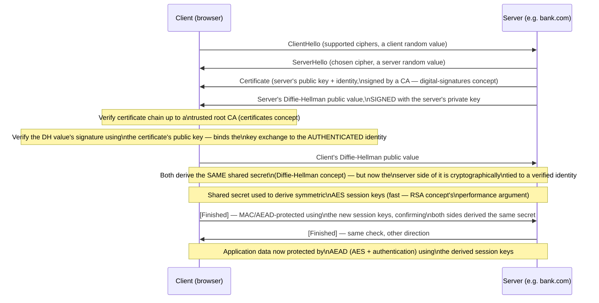

## Learning Objectives

- Trace a modern TLS handshake step by step, naming which specific concept from this discipline each step draws on.
- Explain why TLS combines Diffie-Hellman key exchange with certificate-based authentication, rather than using either mechanism alone.
- Explain why the handshake switches from public-key to symmetric-key (AES) operations partway through, tying this to the performance argument made in the RSA concept.
- Explain how authenticated encryption (AEAD) protects the actual application data once the handshake completes.
- Identify, for a hypothetical attacker at each stage of the handshake, exactly which of this discipline's earlier concepts is the specific reason their attack fails.

## Context & Motivation

Every concept in this discipline, from the CIA triad through firewalls, has been building toward a single, concrete, universally-encountered example: the protocol behind the padlock icon in a browser's address bar, formally called **TLS (Transport Layer Security)**, the successor to the older SSL protocol. TLS is not a novel cryptographic invention — it is a carefully engineered *composition* of nearly every primitive this discipline has covered: Diffie-Hellman key exchange, RSA or certificate-based authentication, AES in an authenticated mode, and a hash function inside an HMAC or an AEAD construction, all sequenced together to solve, simultaneously, every threat named in this discipline's third concept, STRIDE, for exactly the specific case of "two parties who have never met need to communicate securely over a network neither of them controls."

This capstone does not introduce a single new cryptographic idea. Its entire purpose is synthesis: tracing one real, complete protocol from the very first message to the very last, and at every step, naming precisely which earlier concept explains why that step exists and what specific threat it closes off — the same discipline-wide habit the very first concept encouraged, of asking "which goal, against which threat, does this mechanism actually serve," now applied to a protocol securing an enormous fraction of all network traffic in the world.

## Core Theory

### The handshake's two goals, restated from STRIDE

A TLS handshake has to solve two problems simultaneously, both named explicitly in this discipline's threat-modeling concept: **spoofing** (is the browser really talking to the real bank.com, not an attacker impersonating it?) and the need to establish **confidentiality and integrity** for everything that follows (so that subsequent application data — the actual web page, form submissions — cannot be read or tampered with in transit). Neither Diffie-Hellman alone nor certificates alone solve both: Diffie-Hellman (as its own concept showed directly) establishes a shared secret against a passive eavesdropper but authenticates nobody, remaining vulnerable to an active man-in-the-middle; certificates (from the digital-signatures concept) authenticate an identity but don't, by themselves, establish a fresh shared secret for a specific connection. TLS's handshake is precisely the composition that gets both properties from the union of the two mechanisms.

### The handshake, step by step



### Why the signature over the Diffie-Hellman value is the step that defeats man-in-the-middle

The single most important detail in this entire handshake, and the direct answer to Diffie-Hellman's own concept's open vulnerability, is that the server's Diffie-Hellman public value is not sent alone — it is **signed** using the private key corresponding to the server's certificate. A man-in-the-middle attacker (exactly as traced in the Diffie-Hellman concept's Example 3) could still intercept and substitute their own Diffie-Hellman value — but they cannot produce a *valid signature* over it using the real bank.com's private key, since they do not possess it, and the client's certificate-chain verification (tracing back to a trusted root CA, exactly as the certificates concept described) would fail to validate a signature the attacker forged with their own, different key. This is precisely how TLS closes the gap plain Diffie-Hellman left open: authentication (via certificates and signatures) and key exchange (via Diffie-Hellman) are combined so that the key exchange itself becomes tamper-evident, tied cryptographically to a verified identity, rather than running as two independent, separately-defeatable mechanisms.

### Why the handshake switches to symmetric keys for the actual data

Once both sides have derived the same shared secret via Diffie-Hellman, that secret is used to derive symmetric AES session keys for all subsequent application data — exactly the performance argument made explicitly in the RSA concept: public-key operations (RSA, Diffie-Hellman's modular exponentiation) are computationally far more expensive than symmetric operations for large amounts of data, so real protocols use public-key cryptography only for the comparatively small, one-time cost of authenticated key establishment, then switch to fast symmetric ciphers (AES, in an AEAD mode) for the actual, potentially large volume of application traffic. This hybrid pattern — expensive-but-necessary public-key setup, followed by cheap symmetric bulk encryption — is not unique to TLS; it is the standard architecture essentially every real secure-communication protocol uses, for exactly the reason the RSA concept gave.

### Why the actual application data uses AEAD, not encryption alone

The application data exchanged after the handshake completes (the actual web page content, form submissions) is protected using an AEAD mode (the message-authentication-and-authenticated-encryption concept), not plain encryption alone — precisely because plain encryption alone provides no integrity guarantee, exactly as that concept demonstrated with the ciphertext-tampering example. Every byte of application data flowing over an established TLS connection is both encrypted (confidentiality) and authenticated (integrity) by the same AEAD operation, closing off both goals with the single primitive engineered specifically to provide them together safely.

## Worked Examples

### Example 1: Mapping every handshake component back to its originating concept

```text
Handshake component                         Concept this discipline already covered
-------------------------------------------  ------------------------------------------
Client/server random values, cipher          (Setup/negotiation — foundational protocol
  negotiation                                  design, not a specific crypto primitive)
Server's certificate                         Digital signatures and certificates
Certificate chain verification               Digital signatures and certificates
                                              (chain of trust, root CA)
Signed Diffie-Hellman public value           Diffie-Hellman key exchange +
                                              Digital signatures (composed together)
Shared secret derivation                     Diffie-Hellman key exchange
Deriving fast symmetric keys from the        RSA concept's performance argument
  shared secret, instead of using slow          (public-key ops are expensive; use
  public-key ops for all subsequent data        them only for setup)
[Finished] messages, confirming both         Message authentication /
  sides hold the same derived secret           authenticated encryption
Application data protection                  Authenticated encryption (AEAD)
```

Every single row in this table names a concept already built, individually, earlier in this discipline — the handshake contributes no new cryptographic primitive of its own; its contribution is the specific, careful sequencing and composition of primitives that already existed.

### Example 2: Tracing an attempted man-in-the-middle attack against the FULL (authenticated) handshake

```text
1. Attacker (Mallory) intercepts the connection, intending to run
   Diffie-Hellman separately with the client and the real server, as
   in the unauthenticated attack traced in the Diffie-Hellman concept.
2. Mallory forwards a ClientHello to the real server, gets back the
   real server's CERTIFICATE and a Diffie-Hellman value SIGNED by the
   real server's private key.
3. Mallory cannot forward this real, signed value on to the client
   unmodified (that would just let the client and real server talk
   directly, defeating Mallory's interception).
4. Mallory must substitute HER OWN Diffie-Hellman value to establish a
   separate shared secret with the client — but she must also either
   (a) present a certificate for "bank.com" that traces to a trusted
   root (impossible without compromising a CA's private key or a root
   trust store), or (b) sign her own DH value with the real bank.com's
   private key (impossible without that private key).
5. The client's certificate-chain verification FAILS (Mallory's
   certificate isn't validly signed by any trusted root for the
   bank.com identity), and the handshake is aborted.

The exact attack that succeeded against PLAIN Diffie-Hellman (from that
concept's own worked example) fails here, specifically because the
signature-over-the-DH-value step ties the key exchange to an identity
Mallory cannot forge.
```

### Example 3: Why a compromised root CA would still break this entire protocol

```text
If Mallory had somehow compromised a TRUSTED ROOT CA's private key
(the single point of failure named explicitly in the digital-signatures
concept's misconceptions), she COULD forge a validly-signed certificate
for "bank.com" and complete step 4 successfully — the client's
verification would succeed, because it only checks that SOME valid
chain to a trusted root exists, not that the certificate came from the
SPECIFIC CA the real bank.com originally used.

This traces the entire security of the TLS handshake back to exactly
the single point already flagged as the whole system's foundation: root
CA private key security — confirming that the "reduces to trust in a
small set of roots" framing from the certificates concept was not an
abstract simplification, but the literal, load-bearing truth of how
this entire real-world protocol's security ultimately rests.
```

## Common Misconceptions & Pitfalls

- **"TLS is a single cryptographic algorithm, like AES or RSA."** TLS is a protocol — a specific, careful composition and sequencing of the individual primitives this discipline covered separately (Diffie-Hellman, certificates/signatures, AES/AEAD) — not a standalone cryptographic algorithm in its own right.
- **"Diffie-Hellman alone would be sufficient for TLS, since it establishes a shared secret."** As Example 2 shows, plain Diffie-Hellman remains vulnerable to a man-in-the-middle attack; TLS's actual security against that specific threat comes entirely from signing the Diffie-Hellman value with a certificate-authenticated private key, not from the key exchange alone.
- **"Since TLS uses RSA/certificates, it must use RSA for all of the encryption, all the way through."** Public-key operations (RSA or Diffie-Hellman) are used only for the initial, authenticated key-establishment phase; all subsequent application data is protected using fast symmetric AEAD (AES), exactly the hybrid pattern the RSA concept's performance argument predicted.
- **"If the handshake completes without an error, the connection is completely secure against every threat covered in this discipline."** TLS specifically addresses transport-layer confidentiality, integrity, and server authentication — it says nothing about, and provides no protection against, application-layer vulnerabilities like SQL injection or XSS (both covered earlier), which operate entirely within the already-established, correctly-encrypted channel.
- **"Every step of this handshake is equally critical; if one were removed, only that one guarantee would be lost."** The signature over the Diffie-Hellman value is specifically what elevates the protocol from "secure against eavesdropping only" to "secure against active man-in-the-middle attacks too" — removing just that one step would silently regress the entire protocol's authentication guarantee to plain, unauthenticated Diffie-Hellman's known weakness, even though every other step remained unchanged.

## Summary

A TLS handshake is not a new cryptographic primitive but a careful composition of nearly every mechanism this discipline covered: Diffie-Hellman key exchange establishes a shared secret; a certificate, verified up a chain of trust to a pre-trusted root CA, authenticates the server's identity; a signature over the Diffie-Hellman value ties those two mechanisms together, closing off the man-in-the-middle vulnerability plain Diffie-Hellman leaves open on its own; the resulting shared secret derives fast symmetric AES keys for all subsequent traffic, exactly the expensive-setup-then-cheap-bulk-encryption pattern the RSA concept's performance argument predicted; and the actual application data is protected end to end by authenticated encryption, guaranteeing both confidentiality and integrity together. Tracing this one real, universally-encountered protocol end to end, and naming precisely which earlier concept explains each step, is this discipline's final synthesis: every mechanism — from the CIA triad's first vocabulary through firewalls' network-layer policy — exists because some specific step of some specific, real protocol like this one needs it, not as an abstract exercise disconnected from how security actually gets built and deployed in practice.

## Documentation Links

- [Stanford CS255 — Introduction to Cryptography, Course Syllabus](https://cs255.stanford.edu/syllabus.html) — covers authenticated key exchange and SSL/TLS explicitly, as the course's own synthesis of its full cryptography sequence.
- [ACM/IEEE CS2013 — Information Assurance and Security (Privacy and Security) Knowledge Area](https://csed.acm.org/knowledge-areas-privacy-and-security-ps-cs2013/) — lists network security and cryptographic applications for data protection as core curriculum outcomes, of which a TLS handshake is the canonical real-world instance.
