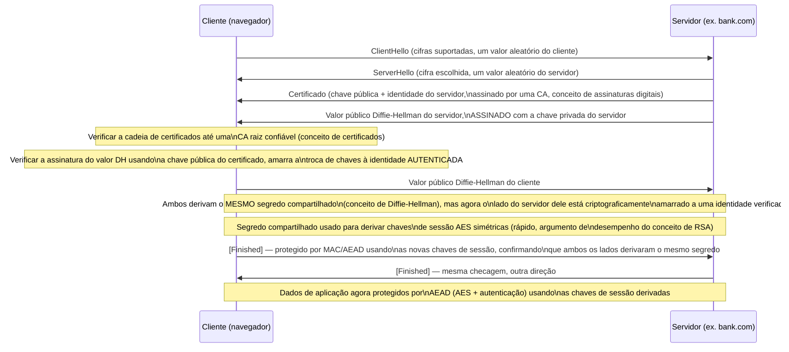

## Objetivos de Aprendizagem

- Rastrear um handshake TLS moderno passo a passo, nomeando em qual conceito específico desta disciplina cada passo se apoia.
- Explicar por que o TLS combina a troca de chaves Diffie-Hellman com autenticação baseada em certificado, em vez de usar qualquer um dos mecanismos sozinho.
- Explicar por que o handshake troca de operações de chave pública para de chave simétrica (AES) no meio do caminho, amarrando isto ao argumento de desempenho feito no conceito de RSA.
- Explicar como a criptografia autenticada (AEAD) protege os dados de aplicação de fato uma vez que o handshake completa.
- Identificar, para um atacante hipotético em cada estágio do handshake, exatamente qual dos conceitos anteriores desta disciplina é a razão específica pela qual o ataque dele falha.

## Contexto e Motivação

Todo conceito nesta disciplina, da tríade CIA aos firewalls, vem construindo em direção a um único exemplo concreto e universalmente encontrado: o protocolo por trás do ícone de cadeado na barra de endereços de um navegador, formalmente chamado de **TLS (Transport Layer Security)**, o sucessor do protocolo SSL mais antigo. O TLS não é uma invenção criptográfica inédita, é uma *composição* cuidadosamente engenheirada de quase todo primitivo que esta disciplina cobriu: troca de chaves Diffie-Hellman, autenticação baseada em RSA ou certificado, AES num modo autenticado, e uma função de hash dentro de um HMAC ou de uma construção AEAD, todos sequenciados juntos para resolver, simultaneamente, toda ameaça nomeada no terceiro conceito desta disciplina, STRIDE, para exatamente o caso específico de "duas partes que nunca se conheceram precisam se comunicar com segurança sobre uma rede que nenhuma delas controla".

Este capstone não introduz uma única ideia criptográfica nova. O seu propósito inteiro é síntese: rastrear um protocolo real e completo da primeira mensagem até a última, e a cada passo, nomear precisamente qual conceito anterior explica por que aquele passo existe e qual ameaça específica ele fecha, o mesmo hábito que atravessa a disciplina que o primeiro conceito encorajou, de perguntar "qual objetivo, contra qual ameaça, este mecanismo de fato serve", agora aplicado a um protocolo que protege uma fração enorme de todo o tráfego de rede no mundo.

## Teoria Central

### Os dois objetivos do handshake, reafirmados a partir do STRIDE

Um handshake TLS tem de resolver dois problemas simultaneamente, ambos nomeados explicitamente no conceito de modelagem de ameaças desta disciplina: **spoofing** (o navegador está realmente falando com o bank.com real, não um atacante o personificando?) e a necessidade de estabelecer **confidencialidade e integridade** para tudo que segue (para que os dados de aplicação subsequentes, a página web de fato, submissões de formulário, não possam ser lidos ou adulterados em trânsito). Nem Diffie-Hellman sozinho nem certificados sozinhos resolvem ambos: Diffie-Hellman (como o seu próprio conceito mostrou diretamente) estabelece um segredo compartilhado contra um bisbilhoteiro passivo mas não autentica ninguém, permanecendo vulnerável a um man-in-the-middle ativo; certificados (do conceito de assinaturas digitais) autenticam uma identidade mas não, por si sós, estabelecem um segredo compartilhado fresco para uma conexão específica. O handshake do TLS é precisamente a composição que obtém ambas as propriedades da união dos dois mecanismos.

### O handshake, passo a passo



### Por que a assinatura sobre o valor Diffie-Hellman é o passo que derrota o man-in-the-middle

O detalhe individual mais importante neste handshake inteiro, e a resposta direta à vulnerabilidade em aberto do próprio conceito de Diffie-Hellman, é que o valor público Diffie-Hellman do servidor não é enviado sozinho, ele é **assinado** usando a chave privada correspondente ao certificado do servidor. Um atacante man-in-the-middle (exatamente como rastreado no Exemplo 3 do conceito de Diffie-Hellman) ainda poderia interceptar e substituir o seu próprio valor Diffie-Hellman, mas não consegue produzir uma *assinatura válida* sobre ele usando a chave privada do bank.com real, já que não a possui, e a verificação de cadeia de certificados do cliente (rastreando de volta a uma CA raiz confiável, exatamente como o conceito de certificados descreveu) falharia em validar uma assinatura que o atacante forjou com a sua própria chave, diferente. É precisamente assim que o TLS fecha a lacuna que o Diffie-Hellman simples deixou aberta: a autenticação (via certificados e assinaturas) e a troca de chaves (via Diffie-Hellman) são combinadas para que a própria troca de chaves se torne à prova de adulteração, amarrada criptograficamente a uma identidade verificada, em vez de rodar como dois mecanismos independentes e separadamente derrotáveis.

### Por que o handshake troca para chaves simétricas para os dados de fato

Uma vez que ambos os lados derivaram o mesmo segredo compartilhado via Diffie-Hellman, esse segredo é usado para derivar chaves de sessão AES simétricas para todos os dados de aplicação subsequentes, exatamente o argumento de desempenho feito explicitamente no conceito de RSA: operações de chave pública (RSA, a exponenciação modular do Diffie-Hellman) são computacionalmente muito mais caras do que operações simétricas para grandes quantidades de dados, então protocolos reais usam criptografia de chave pública só para o custo comparativamente pequeno e único do estabelecimento de chave autenticado, depois trocam para cifras simétricas rápidas (AES, num modo AEAD) para o volume de fato, potencialmente grande, de tráfego de aplicação. Este padrão híbrido, configuração de chave pública cara-mas-necessária, seguida de criptografia simétrica barata em massa, não é único do TLS; é a arquitetura padrão que essencialmente todo protocolo de comunicação segura real usa, exatamente pela razão que o conceito de RSA deu.

### Por que os dados de aplicação de fato usam AEAD, não criptografia sozinha

Os dados de aplicação trocados depois de o handshake completar (o conteúdo da página web de fato, submissões de formulário) são protegidos usando um modo AEAD (o conceito de autenticação de mensagem e criptografia autenticada), não criptografia simples sozinha, precisamente porque a criptografia simples sozinha não fornece garantia de integridade, exatamente como aquele conceito demonstrou com o exemplo de adulteração de texto cifrado. Todo byte de dados de aplicação fluindo sobre uma conexão TLS estabelecida é tanto criptografado (confidencialidade) quanto autenticado (integridade) pela mesma operação AEAD, fechando ambos os objetivos com o único primitivo engenheirado especificamente para fornecê-los juntos com segurança.

## Exemplos Resolvidos

### Exemplo 1: Mapeando cada componente do handshake de volta ao seu conceito de origem

```text
Componente do handshake                      Conceito que esta disciplina já cobriu
-------------------------------------------  ------------------------------------------
Valores aleatórios de cliente/servidor,       (Setup/negociação, design de protocolo
  negociação de cifra                           fundacional, não um primitivo cripto específico)
Certificado do servidor                      Assinaturas digitais e certificados
Verificação de cadeia de certificados        Assinaturas digitais e certificados
                                              (cadeia de confiança, CA raiz)
Valor público Diffie-Hellman assinado        Troca de chaves Diffie-Hellman +
                                              Assinaturas digitais (compostos juntos)
Derivação de segredo compartilhado           Troca de chaves Diffie-Hellman
Derivar chaves simétricas rápidas do         Argumento de desempenho do conceito de RSA
  segredo compartilhado, em vez de usar          (ops de chave pública são caras; use-as
  ops de chave pública lentas para todos         só para a configuração)
  os dados subsequentes
Mensagens [Finished], confirmando que ambos  Autenticação de mensagem /
  os lados guardam o mesmo segredo derivado    criptografia autenticada
Proteção dos dados de aplicação              Criptografia autenticada (AEAD)
```

Cada única linha nesta tabela nomeia um conceito já construído, individualmente, mais cedo nesta disciplina, o handshake não contribui nenhum primitivo criptográfico novo próprio; a sua contribuição é o sequenciamento e a composição específicos e cuidadosos de primitivos que já existiam.

### Exemplo 2: Rastreando um ataque man-in-the-middle tentado contra o handshake COMPLETO (autenticado)

```text
1. O atacante (Mallory) intercepta a conexão, pretendendo rodar
   Diffie-Hellman separadamente com o cliente e o servidor real, como
   no ataque não autenticado rastreado no conceito de Diffie-Hellman.
2. Mallory encaminha um ClientHello ao servidor real, recebe de volta o
   CERTIFICADO do servidor real e um valor Diffie-Hellman ASSINADO pela
   chave privada do servidor real.
3. Mallory não consegue encaminhar este valor real e assinado ao cliente
   não modificado (isso só deixaria o cliente e o servidor real falarem
   diretamente, derrotando a interceptação de Mallory).
4. Mallory tem de substituir o SEU PRÓPRIO valor Diffie-Hellman para estabelecer um
   segredo compartilhado separado com o cliente, mas ela também tem de ou
   (a) apresentar um certificado para "bank.com" que rastreia até uma raiz
   confiável (impossível sem comprometer a chave privada de uma CA ou um
   repositório de confiança raiz), ou (b) assinar o seu próprio valor DH com a chave
   privada do bank.com real (impossível sem essa chave privada).
5. A verificação de cadeia de certificados do cliente FALHA (o certificado de
   Mallory não é validamente assinado por nenhuma raiz confiável para a
   identidade bank.com), e o handshake é abortado.

O exato ataque que teve sucesso contra o Diffie-Hellman SIMPLES (do próprio
exemplo resolvido daquele conceito) falha aqui, especificamente porque o passo
de assinatura-sobre-o-valor-DH amarra a troca de chaves a uma identidade
que Mallory não consegue forjar.
```

### Exemplo 3: Por que uma CA raiz comprometida ainda quebraria este protocolo inteiro

```text
Se Mallory tivesse de alguma forma comprometido a chave privada de uma CA RAIZ
CONFIÁVEL (o único ponto de falha nomeado explicitamente nos equívocos do
conceito de assinaturas digitais), ela PODERIA forjar um certificado validamente
assinado para "bank.com" e completar o passo 4 com sucesso, a verificação do
cliente teria sucesso, porque ela só checa que ALGUMA cadeia válida a uma raiz
confiável existe, não que o certificado veio da CA ESPECÍFICA que o bank.com
real originalmente usou.

Isto rastreia a segurança inteira do handshake TLS de volta exatamente ao
único ponto já sinalizado como a fundação de todo o sistema: a segurança da
chave privada da CA raiz, confirmando que o enquadramento de "reduz-se à confiança
num pequeno conjunto de raízes" do conceito de certificados não era uma
simplificação abstrata, mas a verdade literal e estrutural de como a segurança
deste protocolo inteiro do mundo real em última instância repousa.
```

## Equívocos Comuns e Armadilhas

- **"TLS é um único algoritmo criptográfico, como AES ou RSA."** O TLS é um protocolo, uma composição e um sequenciamento específicos e cuidadosos dos primitivos individuais que esta disciplina cobriu separadamente (Diffie-Hellman, certificados/assinaturas, AES/AEAD), não um algoritmo criptográfico autônomo por si só.
- **"Diffie-Hellman sozinho seria suficiente para o TLS, já que ele estabelece um segredo compartilhado."** Como o Exemplo 2 mostra, o Diffie-Hellman simples permanece vulnerável a um ataque man-in-the-middle; a segurança real do TLS contra essa ameaça específica vem inteiramente de assinar o valor Diffie-Hellman com uma chave privada autenticada por certificado, não da troca de chaves sozinha.
- **"Já que o TLS usa RSA/certificados, ele tem de usar RSA para toda a criptografia, por todo o caminho."** Operações de chave pública (RSA ou Diffie-Hellman) são usadas só para a fase inicial de estabelecimento de chave autenticado; todos os dados de aplicação subsequentes são protegidos usando AEAD simétrico rápido (AES), exatamente o padrão híbrido que o argumento de desempenho do conceito de RSA previu.
- **"Se o handshake completa sem um erro, a conexão está completamente segura contra toda ameaça coberta nesta disciplina."** O TLS especificamente aborda confidencialidade, integridade e autenticação de servidor de nível de transporte, ele nada diz sobre, e não fornece nenhuma proteção contra, vulnerabilidades de nível de aplicação como injeção SQL ou XSS (ambas cobertas antes), que operam inteiramente dentro do canal já estabelecido e corretamente criptografado.
- **"Todo passo deste handshake é igualmente crítico; se um fosse removido, só aquela garantia seria perdida."** A assinatura sobre o valor Diffie-Hellman é especificamente o que eleva o protocolo de "seguro contra bisbilhotagem apenas" para "seguro contra ataques man-in-the-middle ativos também", remover só aquele passo silenciosamente regrediria a garantia de autenticação do protocolo inteiro à fraqueza conhecida do Diffie-Hellman simples e não autenticado, mesmo que todo outro passo permanecesse inalterado.

## Resumo

Um handshake TLS não é um primitivo criptográfico novo, mas uma composição cuidadosa de quase todo mecanismo que esta disciplina cobriu: a troca de chaves Diffie-Hellman estabelece um segredo compartilhado; um certificado, verificado por uma cadeia de confiança até uma CA raiz pré-confiável, autentica a identidade do servidor; uma assinatura sobre o valor Diffie-Hellman amarra esses dois mecanismos juntos, fechando a vulnerabilidade man-in-the-middle que o Diffie-Hellman simples deixa aberta por conta própria; o segredo compartilhado resultante deriva chaves AES simétricas rápidas para todo o tráfego subsequente, exatamente o padrão de configuração-cara-depois-criptografia-barata-em-massa que o argumento de desempenho do conceito de RSA previu; e os dados de aplicação de fato são protegidos de ponta a ponta por criptografia autenticada, garantindo tanto confidencialidade quanto integridade juntas. Rastrear este único protocolo real e universalmente encontrado de ponta a ponta, e nomear precisamente qual conceito anterior explica cada passo, é a síntese final desta disciplina: todo mecanismo, do primeiro vocabulário da tríade CIA pela política de nível de rede dos firewalls, existe porque algum passo específico de algum protocolo específico e real como este precisa dele, não como um exercício abstrato desconectado de como a segurança de fato é construída e implantada na prática.

## Documentation Links

- [Stanford CS255 — Introduction to Cryptography, Course Syllabus](https://cs255.stanford.edu/syllabus.html): cobre troca de chaves autenticada e SSL/TLS explicitamente, como a própria síntese do curso da sua sequência completa de criptografia.
- [ACM/IEEE CS2013 — Information Assurance and Security (Privacy and Security) Knowledge Area](https://csed.acm.org/knowledge-areas-privacy-and-security-ps-cs2013/): lista segurança de rede e aplicações criptográficas para proteção de dados como resultados centrais de currículo, dos quais um handshake TLS é a instância canônica do mundo real.
