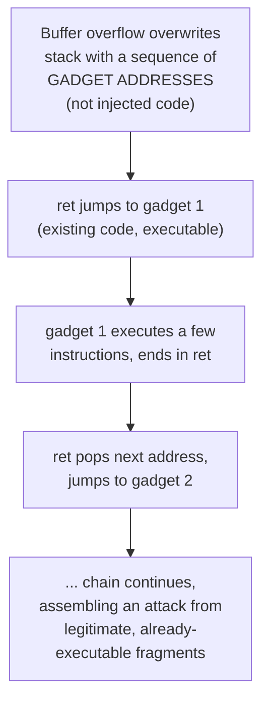

## Learning Objectives

- Describe stack canaries, non-executable memory (W^X/DEP), and ASLR, and explain precisely which specific step of the classic buffer-overflow attack each one disrupts.
- Explain why none of these three defenses is individually sufficient, and why real systems deploy all three together (defense in depth).
- Describe, at a conceptual level, how return-oriented programming (ROP) manages to bypass non-executable memory without needing to inject any new executable code.
- Trace the classic buffer-overflow attack from `c-and-assembly` step by step against a system with each defense present, and identify exactly where the attack is stopped or how it adapts.
- Explain why "defense in depth" is a more honest posture than presenting any single mitigation as a complete fix.

## Context & Motivation

`computer/c-and-assembly`'s coverage of stack smashing established the attack: writing past a stack buffer's bounds can overwrite the saved return address, redirecting a program's control flow to wherever the attacker chooses — classically, to attacker-injected code sitting in the overflowed buffer itself ("shellcode"). The previous concept generalized that pattern to injection vulnerabilities broadly. This concept returns specifically to the memory-safety side and covers the real, deployed defenses systems use against exactly this attack — not as a single silver-bullet fix, but as three separate, complementary mitigations, each closing off one specific step of the attack, none of them complete alone.

This is an important, honest framing that MIT 6.858's own lecture sequence makes explicit: buffer overflows and their defenses are taught as an evolving arms race, not a solved problem — every defense covered here has, historically, eventually been bypassed by some further attack technique, which is exactly why real systems layer multiple defenses rather than relying on any single one, and exactly why "defense in depth" (rather than "here is the fix") is the correct way to think about this material.

## Core Theory

### Stack canaries: detecting the overflow before it's used

A **stack canary** is a known, secret value placed on the stack between a function's local buffers and its saved return address, checked immediately before the function returns. If a buffer overflow has overwritten memory up through the canary's location on its way toward the return address, the canary's value will have changed, and the program can detect this and abort *before* ever executing a `ret` instruction that would jump to a corrupted address. This closes off the *simplest* version of the attack — an overflow that overwrites everything in its path sequentially — but does nothing against an attack that can write to the return address *without* touching the canary (for instance, if the vulnerable write is not a simple sequential buffer overflow but a more targeted out-of-bounds write elsewhere in memory).

### Non-executable memory (W^X / DEP): can't run what you wrote

**W^X** ("write XOR execute," also called DEP, Data Execution Prevention) marks memory pages as either writable or executable, but never both simultaneously. The stack, which needs to be writable (local variables are constantly written), is marked non-executable — so even if an attacker successfully overwrites the return address to point at injected shellcode sitting in the overflowed buffer, the CPU refuses to execute instructions fetched from that (non-executable) memory page, and the attack fails at the execution step rather than the overwrite step. This closes off the classic "inject code, then jump to it" attack entirely — but, as the next section shows, it does not close off every way to hijack control flow, because it does nothing to prevent redirecting execution to code that *already exists* and is *already marked executable* somewhere in the program's own address space.

### ASLR: making the target address unpredictable

**Address-space layout randomization (ASLR)** randomizes the base addresses of a process's stack, heap, and loaded libraries each time it runs, so an attacker cannot reliably predict the exact memory address of any particular piece of data or code — including where any useful "already executable" code (relevant to the next section's attack) actually sits in memory this run. This closes off attacks that depend on hardcoded, predictable addresses, but is defeated by any vulnerability (an information leak, for instance) that reveals the actual runtime addresses to the attacker, at which point ASLR's randomization no longer provides any protection for that specific run.

### Return-oriented programming (ROP): bypassing W^X without injecting new code

**Return-oriented programming** is the attack technique that emerged specifically in response to W^X becoming widespread, and it is worth understanding precisely because it illustrates why "we made memory non-executable" did not end the arms race. Rather than injecting new executable code (which W^X would block), ROP reuses small sequences of instructions that already exist, already marked executable, somewhere in the program's own code or linked libraries — specifically, sequences that end in a `ret` instruction ("gadgets"). By carefully overwriting the stack with a sequence of addresses, each pointing to one gadget, an attacker can chain many small gadgets together: each gadget executes its few instructions, then its trailing `ret` pops the *next* attacker-controlled address off the stack and jumps to *that* gadget, and so on — assembling a sequence of legitimate, already-executable snippets into an attack payload that never requires injecting a single new executable byte, and therefore never triggers W^X's protection at all.



### Why defense in depth, not a single fix

Each defense closes off one specific step of one specific attack variant, and each has a known, real bypass technique: canaries don't protect against overflows that skip past them; W^X is bypassed by ROP; ASLR is bypassed by an information leak revealing real addresses. Real, production-hardened systems deploy all three simultaneously, precisely because an attacker successfully defeating all three at once — finding an information leak to defeat ASLR, *and* constructing a working ROP chain despite W^X, *and* avoiding tripping the stack canary — is a substantially harder combined task than defeating any single mitigation alone, even though none of the three, individually, is a complete guarantee. This is the honest lesson this concept is built to teach: security engineering rarely produces a single, provably complete fix for a real-world attack class; it produces layered, complementary mitigations that collectively raise the cost of a successful attack, sometimes dramatically, even while no individual layer is unbreakable.

## Worked Examples

### Example 1: Tracing the classic attack against a canary-only defense

```text
1. Attacker overflows a stack buffer, writing sequentially past its
   bounds toward the saved return address.
2. On the way, the write passes THROUGH the canary's memory location,
   overwriting it with attacker-controlled (or simply incidental) data.
3. Function prologue-epilogue code (already covered) checks the canary
   value immediately before returning.
4. Canary value does NOT match the known original value.
5. Program detects corruption and ABORTS immediately, before ever
   executing the (corrupted) return address.

Attack STOPPED at step 5 — the canary defense worked, for this specific,
sequential-overflow attack shape.
```

### Example 2: The same buffer overflow against W^X, without and with ROP

```text
WITHOUT ROP (classic shellcode injection):
1. Attacker overflows the buffer, injecting executable shellcode INTO
   the buffer itself, and overwrites the return address to point at it.
2. Function returns, jumping to the injected shellcode's address.
3. CPU attempts to FETCH AND EXECUTE instructions from that address.
4. W^X: that memory page (the stack) is marked non-executable.
5. CPU refuses to execute — program crashes/aborts.

Attack STOPPED at step 5 by W^X.

WITH ROP (bypassing W^X):
1. Attacker overflows the buffer, but instead of injecting new code,
   overwrites the stack with a chain of ADDRESSES pointing to existing,
   already-executable gadgets elsewhere in the program/libraries.
2. Function returns, jumping to the FIRST gadget's address — which IS
   marked executable (it's legitimate, pre-existing program code).
3. W^X allows this — the memory being executed was always executable.
4. The gadget's trailing `ret` pops the NEXT attacker-controlled address,
   continuing the chain.
5. Attack SUCCEEDS, having never executed a single byte of injected,
   non-executable-marked data.

W^X did not stop this variant, because no new code was ever "written and
then executed" — only pre-existing, already-executable code was reused.
```

### Example 3: How ASLR changes the ROP attack's difficulty

```text
Without ASLR: the addresses of useful gadgets are the SAME every time
  the program runs (or across many machines running the identical
  binary) — an attacker can determine gadget addresses once, offline,
  and reuse that exact ROP chain against any vulnerable instance.

With ASLR: gadget addresses shift to a different, unpredictable base
  each time the process starts — a ROP chain built with hardcoded
  addresses from one run will almost certainly jump to the WRONG
  location on a different run, causing the exploit to fail (typically
  crashing the program) rather than succeeding reliably.

ASLR does not prevent ROP in principle — it prevents an attacker from
KNOWING, in advance, which addresses to put in the ROP chain, unless a
separate vulnerability (an information leak) reveals the real, current
addresses for that specific run.
```

## Common Misconceptions & Pitfalls

- **"Non-executable memory (W^X) completely solves buffer overflow attacks."** ROP demonstrates directly that W^X closes off code-injection specifically, but not control-flow hijacking in general — an attacker can still redirect execution through a chain of pre-existing, legitimately-executable code fragments without injecting anything new.
- **"ASLR makes exploitation impossible, since the attacker can't predict addresses."** ASLR only removes the attacker's ability to predict addresses *without additional information* — any vulnerability that leaks real runtime addresses (a separate information-disclosure bug, in STRIDE terms) defeats ASLR's protection for that specific compromised process instance.
- **"A stack canary detects and prevents every buffer overflow."** A canary only detects overflows that write through its specific memory location on the way to the return address; overflows that write elsewhere in memory (heap overflows, or targeted writes that skip past the canary's location) are not caught by this specific mechanism at all.
- **"Since every one of these defenses has a known bypass, deploying them provides no real security benefit."** Layering all three simultaneously requires an attacker to defeat all of them together in a single exploit chain — substantially raising the combined cost and complexity of a successful attack, even though no individual layer is a complete, unbreakable guarantee; this is exactly what "defense in depth" means in practice, not an admission of futility.
- **"These are historical mitigations that modern systems have moved past."** Stack canaries, W^X, and ASLR remain standard, actively deployed defenses in virtually every modern operating system and compiler toolchain today — they are foundational, current practice, not deprecated historical curiosities, even as the ongoing arms race continues to produce and counter new bypass techniques.

## Summary

Stack canaries, non-executable memory (W^X/DEP), and ASLR each disrupt one specific step of the classic buffer-overflow-to-code-execution attack: canaries detect corruption before a corrupted return address is used; W^X prevents executing newly-injected code; ASLR makes target addresses unpredictable without additional information. None is individually complete — return-oriented programming specifically bypasses W^X by chaining together pre-existing, already-executable code fragments rather than injecting new ones, and an information leak can defeat ASLR entirely — which is exactly why real, hardened systems deploy all three together as layered, complementary defenses rather than treating any single one as a complete fix, an honest "defense in depth" posture rather than a claim of having solved the underlying problem. Having covered both memory-safety vulnerabilities and their defenses, the next concept shifts to a different, but related, application-layer setting: web security fundamentals, where the same untrusted-input pattern from two concepts ago resurfaces as cross-site scripting and cross-site request forgery.

## Documentation Links

- [MIT 6.858 — Computer Systems Security (OCW, Fall 2014)](https://ocw.mit.edu/courses/6-858-computer-systems-security-fall-2014/) — the source course for stack canaries, W^X/DEP, ASLR, and return-oriented programming, covered in exactly this sequence as an evolving arms race.
- [Bryant & O'Hallaron — Computer Systems: A Programmer's Perspective (CS:APP)](https://csapp.cs.cmu.edu/) — covers buffer overflow attacks and defenses at the systems level, building directly on the stack-frame material already covered in `computer/c-and-assembly`.
