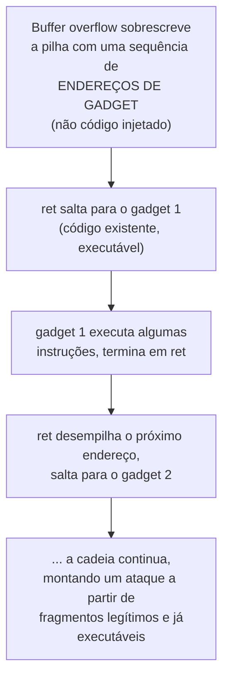

## Objetivos de Aprendizagem

- Descrever canários de pilha, memória não executável (W^X/DEP) e ASLR, e explicar precisamente qual passo específico do ataque clássico de buffer overflow cada um perturba.
- Explicar por que nenhuma destas três defesas é individualmente suficiente, e por que sistemas reais implantam as três juntas (defesa em profundidade).
- Descrever, num nível conceitual, como a programação orientada a retorno (ROP) consegue contornar a memória não executável sem precisar injetar nenhum código executável novo.
- Rastrear o ataque clássico de buffer overflow de `c-and-assembly` passo a passo contra um sistema com cada defesa presente, e identificar exatamente onde o ataque é parado ou como ele se adapta.
- Explicar por que "defesa em profundidade" é uma postura mais honesta do que apresentar qualquer mitigação única como um conserto completo.

## Contexto e Motivação

A cobertura de stack smashing de `computer/c-and-assembly` estabeleceu o ataque: escrever além dos limites de um buffer de pilha pode sobrescrever o endereço de retorno salvo, redirecionando o fluxo de controle de um programa para onde quer que o atacante escolha, classicamente, para código injetado pelo atacante situado no próprio buffer transbordado ("shellcode"). O conceito anterior generalizou esse padrão para vulnerabilidades de injeção de forma ampla. Este conceito volta especificamente ao lado da segurança de memória e cobre as defesas reais e implantadas que sistemas usam contra exatamente este ataque, não como um conserto único e definitivo, mas como três mitigações separadas e complementares, cada uma fechando um passo específico do ataque, nenhuma delas completa sozinha.

Este é um enquadramento importante e honesto que a própria sequência de aulas do MIT 6.858 torna explícito: buffer overflows e as suas defesas são ensinados como uma corrida armamentista em evolução, não um problema resolvido, toda defesa coberta aqui foi, historicamente, eventualmente contornada por alguma técnica de ataque adicional, que é exatamente por que sistemas reais camadam múltiplas defesas em vez de depender de qualquer uma única, e exatamente por que "defesa em profundidade" (em vez de "aqui está o conserto") é a forma correta de pensar sobre este material.

## Teoria Central

### Canários de pilha: detectando o transbordamento antes de ser usado

Um **canário de pilha** é um valor conhecido e secreto posto na pilha entre os buffers locais de uma função e o seu endereço de retorno salvo, checado imediatamente antes de a função retornar. Se um buffer overflow sobrescreveu a memória até a localização do canário no seu caminho em direção ao endereço de retorno, o valor do canário terá mudado, e o programa pode detectar isto e abortar *antes* de jamais executar uma instrução `ret` que saltaria para um endereço corrompido. Isto fecha a versão *mais simples* do ataque, um transbordamento que sobrescreve tudo no seu caminho sequencialmente, mas nada faz contra um ataque que consegue escrever no endereço de retorno *sem* tocar o canário (por exemplo, se a escrita vulnerável não é um buffer overflow sequencial simples mas uma escrita fora dos limites mais direcionada em outro lugar na memória).

### Memória não executável (W^X / DEP): não dá para rodar o que você escreveu

**W^X** ("write XOR execute", também chamado de DEP, Data Execution Prevention) marca páginas de memória como ou graváveis ou executáveis, mas nunca ambos simultaneamente. A pilha, que precisa ser gravável (variáveis locais são constantemente escritas), é marcada como não executável, então mesmo se um atacante sobrescreve com sucesso o endereço de retorno para apontar para o shellcode injetado situado no buffer transbordado, a CPU se recusa a executar instruções buscadas daquela página de memória (não executável), e o ataque falha no passo de execução em vez do passo de sobrescrita. Isto fecha o ataque clássico de "injetar código, depois saltar para ele" inteiramente, mas, como a próxima seção mostra, ele não fecha toda forma de sequestrar o fluxo de controle, porque nada faz para prevenir redirecionar a execução para código que *já existe* e *já está marcado executável* em algum lugar no próprio espaço de endereços do programa.

### ASLR: tornando o endereço-alvo imprevisível

**Randomização de layout do espaço de endereços (ASLR)** randomiza os endereços base da pilha, do heap e das bibliotecas carregadas de um processo cada vez que ele roda, para que um atacante não consiga prever de forma confiável o endereço de memória exato de qualquer pedaço particular de dado ou código, incluindo onde qualquer código útil "já executável" (relevante ao ataque da próxima seção) de fato se situa na memória nesta execução. Isto fecha ataques que dependem de endereços fixos e previsíveis, mas é derrotado por qualquer vulnerabilidade (um vazamento de informação, por exemplo) que revele os endereços reais de tempo de execução ao atacante, ponto no qual a randomização do ASLR não fornece mais nenhuma proteção para aquela execução específica.

### Programação orientada a retorno (ROP): contornando o W^X sem injetar código novo

A **programação orientada a retorno** é a técnica de ataque que emergiu especificamente em resposta ao W^X se tornar difundido, e vale entendê-la precisamente porque ilustra por que "tornamos a memória não executável" não acabou com a corrida armamentista. Em vez de injetar código executável novo (que o W^X bloquearia), o ROP reusa pequenas sequências de instruções que já existem, já marcadas executáveis, em algum lugar no próprio código do programa ou em bibliotecas ligadas, especificamente, sequências que terminam numa instrução `ret` ("gadgets"). Ao cuidadosamente sobrescrever a pilha com uma sequência de endereços, cada um apontando para um gadget, um atacante pode encadear muitos pequenos gadgets juntos: cada gadget executa as suas poucas instruções, depois o seu `ret` final desempilha o *próximo* endereço controlado pelo atacante da pilha e salta para *aquele* gadget, e assim por diante, montando uma sequência de fragmentos legítimos e já executáveis num payload de ataque que nunca exige injetar um único byte executável novo, e portanto nunca dispara a proteção do W^X de todo.



### Por que defesa em profundidade, não um conserto único

Cada defesa fecha um passo específico de uma variante de ataque específica, e cada uma tem uma técnica de bypass conhecida e real: canários não protegem contra transbordamentos que os pulam; W^X é contornado por ROP; ASLR é contornado por um vazamento de informação revelando endereços reais. Sistemas reais e endurecidos para produção implantam as três simultaneamente, precisamente porque um atacante derrotar com sucesso as três de uma vez, encontrar um vazamento de informação para derrotar o ASLR, *e* construir uma cadeia ROP funcional apesar do W^X, *e* evitar disparar o canário de pilha, é uma tarefa combinada substancialmente mais difícil do que derrotar qualquer mitigação única sozinha, mesmo que nenhuma das três, individualmente, seja uma garantia completa. Esta é a lição honesta que este conceito é construído para ensinar: a engenharia de segurança raramente produz um conserto único e comprovadamente completo para uma classe de ataque do mundo real; ela produz mitigações em camadas e complementares que coletivamente elevam o custo de um ataque bem-sucedido, às vezes dramaticamente, mesmo enquanto nenhuma camada individual é inquebrável.

## Exemplos Resolvidos

### Exemplo 1: Rastreando o ataque clássico contra uma defesa só de canário

```text
1. O atacante transborda um buffer de pilha, escrevendo sequencialmente além dos seus
   limites em direção ao endereço de retorno salvo.
2. No caminho, a escrita passa ATRAVÉS da localização de memória do canário,
   sobrescrevendo-o com dados controlados pelo atacante (ou simplesmente incidentais).
3. O código de prólogo-epílogo da função (já coberto) checa o valor do canário
   imediatamente antes de retornar.
4. O valor do canário NÃO corresponde ao valor original conhecido.
5. O programa detecta a corrupção e ABORTA imediatamente, antes de jamais
   executar o endereço de retorno (corrompido).

Ataque PARADO no passo 5, a defesa de canário funcionou, para este formato de
ataque específico, de transbordamento sequencial.
```

### Exemplo 2: O mesmo buffer overflow contra W^X, sem e com ROP

```text
SEM ROP (injeção clássica de shellcode):
1. O atacante transborda o buffer, injetando shellcode executável NO
   próprio buffer, e sobrescreve o endereço de retorno para apontar para ele.
2. A função retorna, saltando para o endereço do shellcode injetado.
3. A CPU tenta BUSCAR E EXECUTAR instruções daquele endereço.
4. W^X: aquela página de memória (a pilha) é marcada como não executável.
5. A CPU se recusa a executar, o programa trava/aborta.

Ataque PARADO no passo 5 pelo W^X.

COM ROP (contornando o W^X):
1. O atacante transborda o buffer, mas em vez de injetar código novo,
   sobrescreve a pilha com uma cadeia de ENDEREÇOS apontando para gadgets
   existentes e já executáveis em outro lugar no programa/bibliotecas.
2. A função retorna, saltando para o endereço do PRIMEIRO gadget, que É
   marcado executável (é código de programa legítimo e pré-existente).
3. W^X permite isto, a memória sendo executada sempre foi executável.
4. O `ret` final do gadget desempilha o PRÓXIMO endereço controlado pelo atacante,
   continuando a cadeia.
5. O ataque TEM SUCESSO, tendo nunca executado um único byte de dados injetados,
   marcados como não executáveis.

O W^X não parou esta variante, porque nenhum código novo foi jamais "escrito e
depois executado", só código pré-existente e já executável foi reusado.
```

### Exemplo 3: Como o ASLR muda a dificuldade do ataque ROP

```text
Sem ASLR: os endereços de gadgets úteis são os MESMOS toda vez que
  o programa roda (ou por entre muitas máquinas rodando o binário
  idêntico), um atacante pode determinar os endereços de gadgets uma vez, offline,
  e reusar essa cadeia ROP exata contra qualquer instância vulnerável.

Com ASLR: os endereços de gadgets mudam para uma base diferente e
  imprevisível cada vez que o processo inicia, uma cadeia ROP construída com
  endereços fixos de uma execução quase certamente saltaria para o LOCAL
  ERRADO numa execução diferente, fazendo o exploit falhar (tipicamente
  travando o programa) em vez de ter sucesso de forma confiável.

O ASLR não previne o ROP em princípio, ele previne um atacante de
SABER, de antemão, quais endereços pôr na cadeia ROP, a menos que uma
vulnerabilidade separada (um vazamento de informação) revele os endereços reais e
atuais para aquela execução específica.
```

## Equívocos Comuns e Armadilhas

- **"Memória não executável (W^X) resolve completamente ataques de buffer overflow."** O ROP demonstra diretamente que o W^X fecha a injeção de código especificamente, mas não o sequestro de fluxo de controle em geral, um atacante ainda pode redirecionar a execução por uma cadeia de fragmentos de código pré-existentes e legitimamente executáveis sem injetar nada novo.
- **"O ASLR torna a exploração impossível, já que o atacante não consegue prever endereços."** O ASLR só remove a habilidade do atacante de prever endereços *sem informação adicional*, qualquer vulnerabilidade que vaze endereços reais de tempo de execução (um bug de divulgação de informação separado, em termos do STRIDE) derrota a proteção do ASLR para aquela instância de processo comprometida específica.
- **"Um canário de pilha detecta e previne todo buffer overflow."** Um canário só detecta transbordamentos que escrevem através da sua localização de memória específica no caminho para o endereço de retorno; transbordamentos que escrevem em outro lugar na memória (overflows de heap, ou escritas direcionadas que pulam a localização do canário) não são pegos por este mecanismo específico de forma alguma.
- **"Já que cada uma destas defesas tem um bypass conhecido, implantá-las não fornece nenhum benefício de segurança real."** Camadar as três simultaneamente exige que um atacante derrote todas elas juntas numa única cadeia de exploit, elevando substancialmente o custo e a complexidade combinados de um ataque bem-sucedido, mesmo que nenhuma camada individual seja uma garantia completa e inquebrável; isto é exatamente o que "defesa em profundidade" significa na prática, não uma admissão de futilidade.
- **"Estas são mitigações históricas que sistemas modernos superaram."** Canários de pilha, W^X e ASLR permanecem defesas padrão e ativamente implantadas em virtualmente todo sistema operacional e toolchain de compilador moderno hoje, elas são prática fundacional e atual, não curiosidades históricas obsoletas, mesmo enquanto a corrida armamentista contínua continua a produzir e contrapor novas técnicas de bypass.

## Resumo

Canários de pilha, memória não executável (W^X/DEP) e ASLR cada um perturba um passo específico do ataque clássico de buffer-overflow-para-execução-de-código: canários detectam a corrupção antes de um endereço de retorno corrompido ser usado; W^X previne executar código recém-injetado; ASLR torna os endereços-alvo imprevisíveis sem informação adicional. Nenhum é individualmente completo, a programação orientada a retorno especificamente contorna o W^X encadeando fragmentos de código pré-existentes e já executáveis em vez de injetar novos, e um vazamento de informação pode derrotar o ASLR inteiramente, que é exatamente por que sistemas reais e endurecidos implantam os três juntos como defesas em camadas e complementares em vez de tratar qualquer um único como um conserto completo, uma postura honesta de "defesa em profundidade" em vez de uma alegação de ter resolvido o problema subjacente. Tendo coberto tanto vulnerabilidades de segurança de memória quanto as suas defesas, o próximo conceito muda para um cenário de nível de aplicação diferente, mas relacionado: fundamentos de segurança web, onde o mesmo padrão de entrada não confiável de dois conceitos atrás ressurge como cross-site scripting e cross-site request forgery.

## Documentation Links

- [MIT 6.858 — Computer Systems Security (OCW, Fall 2014)](https://ocw.mit.edu/courses/6-858-computer-systems-security-fall-2014/): o curso fonte para canários de pilha, W^X/DEP, ASLR e programação orientada a retorno, cobertos exatamente nesta sequência como uma corrida armamentista em evolução.
- [Bryant & O'Hallaron — Computer Systems: A Programmer's Perspective (CS:APP)](https://csapp.cs.cmu.edu/): cobre ataques de buffer overflow e defesas no nível de sistemas, construindo diretamente sobre o material de quadro de pilha já coberto em `computer/c-and-assembly`.
