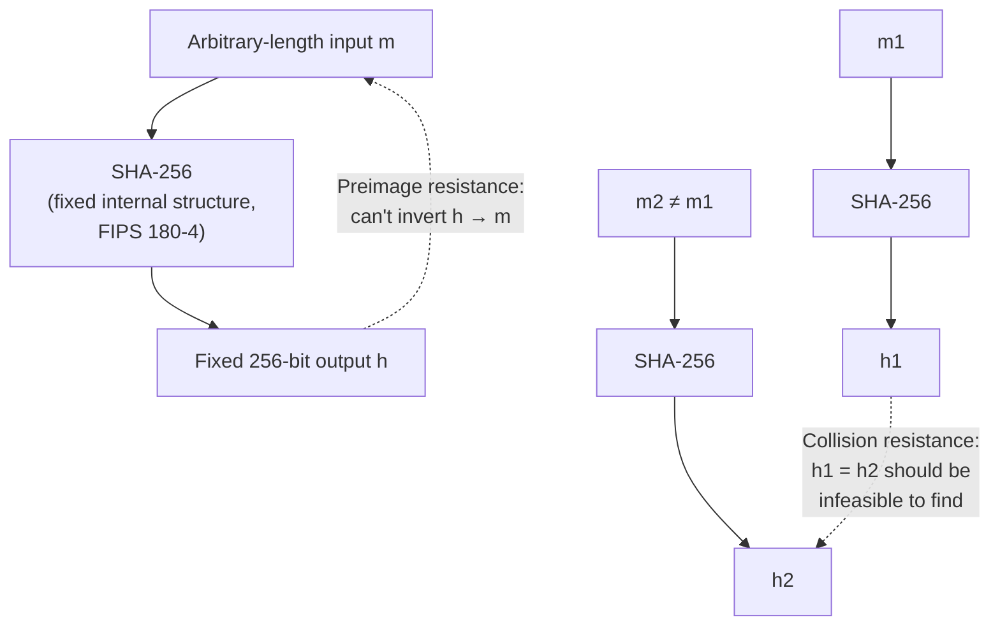

## Learning Objectives

- Define the three security properties a cryptographic hash function must have — preimage resistance, second-preimage resistance, and collision resistance — and distinguish them from each other precisely.
- Explain why these are a fundamentally different, much stronger contract than the properties required of a hash function used for a hash table.
- Describe the avalanche effect and explain why it is a necessary (though not sufficient) consequence of the security properties above.
- State the birthday bound and explain why it makes collision resistance dramatically harder to achieve than preimage resistance for the same output length.
- Name SHA-256 as the standardized function this discipline relies on going forward, and identify at least two real applications (file integrity checking, password storage as one ingredient, blockchain) that depend on its properties.

## Context & Motivation

`foundations/data-structures-i` already introduced hash functions as the engine behind hash tables: a function mapping keys to array indices, chosen to be fast and to spread real-world keys roughly evenly across buckets, with collisions treated as an expected, manageable event handled by chaining or open addressing. That hash function has exactly one job — speed and reasonable distribution — and absolutely no obligation to resist a deliberate, motivated adversary trying to find two keys that collide on purpose; in fact, for a data-structures hash table, an adversary who *can* find such collisions on purpose is exploiting a real but different problem (algorithmic-complexity denial-of-service attacks against a hash table with a predictable hash function), not breaking the table's correctness.

A **cryptographic hash function** is built to a completely different, much stronger specification: it must remain safe even when an adversary actively, computationally tries to break it, and "break" here has three separate, precisely defined meanings that all have to hold simultaneously. This concept exists to make that contrast explicit and precise, because "hash function" is genuinely used to mean two different things in computer science, and conflating them — using a fast, non-cryptographic hash function anywhere a security property is actually needed — is a real and recurring class of vulnerability. SHA-256, standardized by NIST in FIPS 180-4, is the specific cryptographic hash function this discipline uses as its running example and building block for everything from here forward: message authentication (next concept), digital signatures (three concepts ahead), and the TLS handshake this discipline's capstone traces end to end.

## Core Theory

### The three security properties

A cryptographic hash function `H` maps an input of arbitrary length to a fixed-length output (256 bits, for SHA-256), and is required to satisfy three properties, each answering a different "can an attacker do X?" question:

1. **Preimage resistance**: given only a hash output `h`, it should be computationally infeasible to find *any* input `m` such that `H(m) = h`. Informally: you can't reverse the hash to recover something that produces it.
2. **Second-preimage resistance**: given a specific input `m₁`, it should be computationally infeasible to find a *different* input `m₂ ≠ m₁` such that `H(m₁) = H(m₂)`. Informally: given one document, you can't forge a different one with the same hash.
3. **Collision resistance**: it should be computationally infeasible to find *any* pair of distinct inputs `m₁ ≠ m₂` (neither one fixed in advance) such that `H(m₁) = H(m₂)`. Informally: you can't even find two arbitrary inputs that happen to collide, let alone one matching a specific target.

Collision resistance is the strongest of the three (it implies second-preimage resistance for most reasonable hash function constructions), and it is the one most often invoked when someone informally says a hash function is "cryptographically secure" — but note that all three are logically distinct claims, and a specific application typically depends on one specific property, not automatically all three: verifying a downloaded file against a published hash mostly needs second-preimage resistance (nobody should be able to craft a different, malicious file with the same published hash), while a digital signature scheme (covered later) typically leans on collision resistance directly.

### Why this is a fundamentally different contract than a hash table's hash function

A hash table's hash function is evaluated by *average-case* performance over *typical, non-adversarial* input distributions — a function that is fast and spreads real keys well is doing its job, even if a sufficiently clever attacker who knows the exact hash function could, in principle, construct a pile of keys that all collide (a genuine, separate concern known as algorithmic-complexity attacks against hash tables, which real systems mitigate with randomized hash seeds — but that mitigation is about degrading *worst-case performance*, not about the three cryptographic properties above). A cryptographic hash function makes no such peace with a clever adversary at all: preimage, second-preimage, and collision resistance are required to hold against the *best* attack an adversary with realistic computing power can mount, not merely against typical, non-adversarial inputs. This is exactly the same shift in posture — "must survive a deliberate attacker, not just typical inputs" — that distinguishes every topic in this discipline from ordinary algorithm design, first named explicitly back in the discipline's very first concept.

### The avalanche effect

A necessary consequence of these properties (though on its own not sufficient to guarantee them) is the **avalanche effect**: flipping a single input bit should change roughly half of the output bits, in an unpredictable way. If a hash function instead produced only small, predictable output changes for small input changes, an attacker could use that structure to search for collisions or preimages far more efficiently than brute force — the avalanche effect is a visible, easily-tested symptom of a hash function that isn't leaking exploitable structure.

### The birthday bound: why collision resistance is harder than it looks

For an `n`-bit hash output, finding *some* input that hashes to a *specific* target value (breaking preimage resistance) requires, on average, trying about `2ⁿ` candidates by brute force. But finding *any* pair of inputs that collide with each other (breaking collision resistance) requires only about `2^(n/2)` attempts on average — a dramatically smaller number for large `n` — because of the same combinatorial phenomenon behind the "birthday paradox" (in a room of just 23 people, there's already better than even odds that two share a birthday, far fewer than the 366 needed to guarantee a match, because you're comparing every pair, not searching for one specific date). This is why cryptographic hash functions need roughly *double* the output length to achieve a given security level against collisions compared to what would be needed against preimages alone — SHA-256's 256-bit output gives roughly 2^128 collision resistance, which is exactly the "birthday bound" for that output length, and is judged (as of current cryptanalysis and foreseeable computing power) to be far beyond any feasible brute-force attack.



## Worked Examples

### Example 1: Contrasting a data-structures hash function with SHA-256 on the exact same requirement

```text
Requirement                          Hash table hash function      SHA-256
------------------------------------  ------------------------------  ---------------------
Fast to compute on typical keys       YES — this is the main goal    Yes, but deliberately
                                                                       slower per byte, by
                                                                       design, to resist
                                                                       brute-force search
Output size fixed and small           Often yes (array index range)  Always 256 bits,
                                                                       regardless of table
                                                                       size or use case
Resists a DELIBERATE adversary        NOT required — average-case    Required — must resist
finding two colliding inputs          collisions are expected and     the best attack an
                                       handled (chaining, probing)     adversary can mount
Safe to publish the function's        Fine — no security property     Fine — the algorithm
exact algorithm publicly              depends on secrecy              is a published NIST
                                                                       standard; security
                                                                       relies on the math,
                                                                       not on obscurity
```

The last row is worth emphasizing: SHA-256's exact algorithm is fully public (published as a standard, precisely so it can be independently analyzed by the entire cryptographic research community) — its security does not, and structurally cannot, depend on attackers not knowing how it works, which is a recurring theme across this entire discipline (a cipher or hash function whose security depends on its algorithm staying secret is considered fundamentally broken by design, a principle known as Kerckhoffs's principle).

### Example 2: File integrity verification, using second-preimage resistance directly

A software project publishes a large installer file alongside its SHA-256 hash, `a3f2...` (truncated), on its official download page.

```text
1. User downloads the installer from a (possibly untrusted) mirror server.
2. User computes SHA-256 of the downloaded file locally.
3. User compares the computed hash to the one published on the official page.

If they match: second-preimage resistance guarantees that finding a
DIFFERENT file (e.g. one with malware injected) that happens to produce
the exact same published hash is computationally infeasible for anyone —
so a match gives strong assurance the downloaded file is exactly the one
the publisher intended, even though it came through an untrusted mirror.
```

This is a direct, real-world application of second-preimage resistance specifically (not collision resistance) — the "target" file (the legitimate installer) is fixed in advance by the publisher, and an attacker is trying to forge a *different* file matching that one specific, already-published hash.

### Example 3: Illustrating the birthday-bound gap with concrete numbers

```text
Hash output size:  256 bits (SHA-256)

Brute-force PREIMAGE attack (find any m with H(m) = specific target h):
  Expected attempts ≈ 2^256  — utterly infeasible; more attempts than
  there are atoms in the observable universe, by a vast margin.

Brute-force COLLISION attack (find ANY m1 ≠ m2 with H(m1) = H(m2)):
  Expected attempts ≈ 2^128 (the "birthday bound", ≈ square root of 2^256)
  — still astronomically infeasible with any foreseeable computing
  power, but a genuinely, dramatically smaller number than 2^256.
```

This numeric gap is exactly why hash functions are designed with output sizes chosen to keep the *smaller* (collision) bound safely infeasible, rather than only checking that the *preimage* bound looks safe — a hash function with, say, a 64-bit output might have a preimage bound that sounds large (2^64) while its collision bound (2^32, only about four billion) is well within reach of an ordinary attacker, which is exactly why older, shorter-output hash functions like MD5 (128-bit output, 2^64 birthday bound) were eventually deprecated for security-sensitive uses once that bound became practically attackable.

## Common Misconceptions & Pitfalls

- **"Any hash function that's 'good enough' for a hash table is good enough for security."** A hash table's hash function has no obligation to resist a deliberate adversary trying to construct a collision on purpose, while a cryptographic hash function's entire value proposition is exactly that resistance — using a fast, non-cryptographic hash function anywhere a security guarantee is needed (checksumming untrusted data, deriving a token) is a real, recurring vulnerability class.
- **"A hash function 'encrypts' the input."** Hashing is one-way and produces a fixed-size, non-reversible-by-design output; it has no key and no corresponding "decryption" operation, which is precisely why preimage resistance — not decryptability — is the relevant security property, unlike the ciphers covered in the previous two concepts.
- **"Collision resistance and second-preimage resistance are the same thing."** They differ in exactly one crucial way: second-preimage resistance fixes one input in advance and asks whether a matching second input can be found; collision resistance allows an attacker to choose *both* colliding inputs freely, which the birthday bound shows is a dramatically easier task for the same output size.
- **"A 256-bit hash and a 128-bit hash are 'about as secure', since both are large numbers."** Because of the birthday bound, a 128-bit hash has only about 2^64 collision resistance — a number that has been within reach of well-resourced attackers for specific older hash functions — while a 256-bit hash's 2^128 collision resistance remains far out of reach; the difference in *bits* understates the difference in practical security.
- **"If two files have the same hash, they must be identical."** This inverts the guarantee: collision resistance means finding two *different* inputs with the same hash should be infeasible for anyone to *construct* deliberately — it does not make it logically impossible in principle (a fixed-size output can never injectively represent unboundedly many possible inputs), only computationally infeasible to find in practice with current mathematical and computational tools.

## Summary

A cryptographic hash function must satisfy three distinct security properties — preimage resistance (can't invert), second-preimage resistance (can't forge a match to one fixed input), and collision resistance (can't even find any two matching inputs) — a fundamentally stronger, adversarial contract than the speed-and-distribution requirement of the hash functions already covered for hash tables. The birthday bound means collision resistance requires roughly double the output length of preimage resistance for the same security margin, which is exactly why SHA-256 (standardized in NIST FIPS 180-4) uses a 256-bit output to keep its ~2^128 collision bound safely infeasible. These properties, together with the avalanche effect they imply, are what make file-integrity verification, password-hash storage, and — as the next concept builds directly on this one — message authentication codes possible, all resting on the same three guarantees introduced here.

## Documentation Links

- [NIST FIPS 180-4 — Secure Hash Standard (SHS)](https://nvlpubs.nist.gov/nistpubs/fips/nist.fips.180-4.pdf) — the official standard specifying SHA-256 and the rest of the SHA-2 family.
- [Stanford CS255 — Introduction to Cryptography, Course Syllabus](https://cs255.stanford.edu/syllabus.html) — covers collision-resistant hashing (Merkle-Damgård construction, SHA family) in exactly this sequence, right before message authentication.
