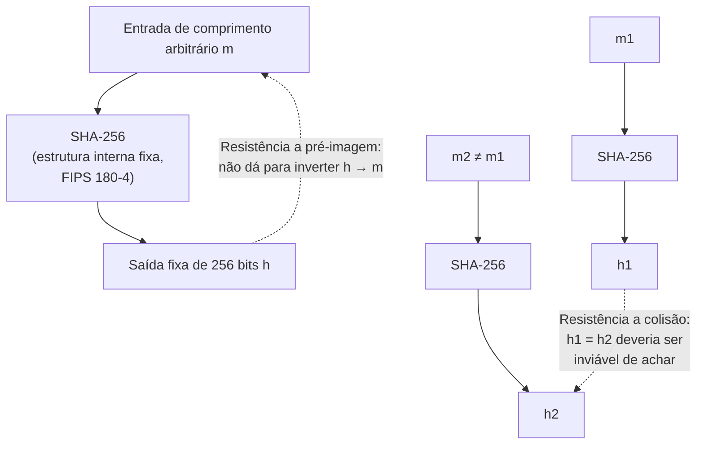

## Objetivos de Aprendizagem

- Definir as três propriedades de segurança que uma função de hash criptográfica tem de ter, resistência a pré-imagem, resistência a segunda pré-imagem e resistência a colisão, e distingui-las umas das outras precisamente.
- Explicar por que estas são um contrato fundamentalmente diferente e muito mais forte do que as propriedades exigidas de uma função de hash usada para uma tabela hash.
- Descrever o efeito avalanche e explicar por que ele é uma consequência necessária (embora não suficiente) das propriedades de segurança acima.
- Enunciar o limite de aniversário (birthday bound) e explicar por que ele torna a resistência a colisão dramaticamente mais difícil de alcançar do que a resistência a pré-imagem para o mesmo comprimento de saída.
- Nomear o SHA-256 como a função padronizada na qual esta disciplina se apoia daqui para frente, e identificar pelo menos duas aplicações reais (verificação de integridade de arquivo, armazenamento de senha como um ingrediente, blockchain) que dependem das suas propriedades.

## Contexto e Motivação

`foundations/data-structures-i` já introduziu funções de hash como o motor por trás de tabelas hash: uma função mapeando chaves a índices de array, escolhida para ser rápida e espalhar chaves do mundo real de forma aproximadamente uniforme por baldes, com colisões tratadas como um evento esperado e gerenciável tratado por encadeamento ou endereçamento aberto. Essa função de hash tem exatamente um trabalho, velocidade e distribuição razoável, e absolutamente nenhuma obrigação de resistir a um adversário deliberado e motivado tentando achar duas chaves que colidam de propósito; de fato, para uma tabela hash de estruturas de dados, um adversário que *consegue* achar tais colisões de propósito está explorando um problema real mas diferente (ataques de negação de serviço por complexidade algorítmica contra uma tabela hash com uma função de hash previsível), não quebrando a correção da tabela.

Uma **função de hash criptográfica** é construída para uma especificação completamente diferente e muito mais forte: ela tem de permanecer segura mesmo quando um adversário ativa e computacionalmente tenta quebrá-la, e "quebrar" aqui tem três significados separados e precisamente definidos que todos têm de se manter simultaneamente. Este conceito existe para tornar esse contraste explícito e preciso, porque "função de hash" é genuinamente usado para significar duas coisas diferentes na ciência da computação, e conflatá-las, usar uma função de hash rápida e não criptográfica em qualquer lugar onde uma propriedade de segurança é de fato necessária, é uma classe de vulnerabilidade real e recorrente. SHA-256, padronizado pelo NIST no FIPS 180-4, é a função de hash criptográfica específica que esta disciplina usa como o seu exemplo corrente e bloco de construção para tudo daqui para frente: autenticação de mensagem (próximo conceito), assinaturas digitais (três conceitos à frente) e o handshake TLS que o capstone desta disciplina rastreia de ponta a ponta.

## Teoria Central

### As três propriedades de segurança

Uma função de hash criptográfica `H` mapeia uma entrada de comprimento arbitrário para uma saída de comprimento fixo (256 bits, para o SHA-256), e é exigida a satisfazer três propriedades, cada uma respondendo uma pergunta diferente de "um atacante consegue fazer X?":

1. **Resistência a pré-imagem**: dado só uma saída de hash `h`, deveria ser computacionalmente inviável achar *qualquer* entrada `m` tal que `H(m) = h`. Informalmente: você não consegue reverter o hash para recuperar algo que o produz.
2. **Resistência a segunda pré-imagem**: dada uma entrada específica `m₁`, deveria ser computacionalmente inviável achar uma entrada *diferente* `m₂ ≠ m₁` tal que `H(m₁) = H(m₂)`. Informalmente: dado um documento, você não consegue forjar um diferente com o mesmo hash.
3. **Resistência a colisão**: deveria ser computacionalmente inviável achar *qualquer* par de entradas distintas `m₁ ≠ m₂` (nenhuma delas fixada de antemão) tal que `H(m₁) = H(m₂)`. Informalmente: você não consegue nem achar duas entradas arbitrárias que por acaso colidam, muito menos uma correspondendo a um alvo específico.

A resistência a colisão é a mais forte das três (ela implica a resistência a segunda pré-imagem para a maioria das construções de função de hash razoáveis), e é a mais frequentemente invocada quando alguém informalmente diz que uma função de hash é "criptograficamente segura", mas note que todas as três são afirmações logicamente distintas, e uma aplicação específica tipicamente depende de uma propriedade específica, não automaticamente de todas as três: verificar um arquivo baixado contra um hash publicado precisa majoritariamente de resistência a segunda pré-imagem (ninguém deveria poder elaborar um arquivo diferente e malicioso com o mesmo hash publicado), enquanto um esquema de assinatura digital (coberto depois) tipicamente se apoia na resistência a colisão diretamente.

### Por que isto é um contrato fundamentalmente diferente da função de hash de uma tabela hash

A função de hash de uma tabela hash é avaliada pelo desempenho de *caso médio* sobre distribuições de entrada *típicas e não adversariais*, uma função que é rápida e espalha chaves reais bem está fazendo o seu trabalho, mesmo se um atacante suficientemente esperto que conhece a função de hash exata pudesse, em princípio, construir uma pilha de chaves que todas colidam (uma preocupação genuína e separada conhecida como ataques de complexidade algorítmica contra tabelas hash, que sistemas reais mitigam com sementes de hash randomizadas, mas essa mitigação é sobre degradar o *desempenho de pior caso*, não sobre as três propriedades criptográficas acima). Uma função de hash criptográfica não faz essa paz com um adversário esperto de forma alguma: resistência a pré-imagem, a segunda pré-imagem e a colisão são exigidas a se manter contra o *melhor* ataque que um adversário com poder computacional realista consiga montar, não meramente contra entradas típicas e não adversariais. Esta é exatamente a mesma mudança de postura, "tem de sobreviver a um atacante deliberado, não só a entradas típicas", que distingue todo tópico nesta disciplina do design de algoritmo comum, primeiro nomeada explicitamente lá no primeiro conceito da disciplina.

### O efeito avalanche

Uma consequência necessária destas propriedades (embora por si só não suficiente para garanti-las) é o **efeito avalanche**: inverter um único bit de entrada deveria mudar aproximadamente metade dos bits de saída, de uma forma imprevisível. Se uma função de hash em vez disso produzisse só mudanças de saída pequenas e previsíveis para mudanças de entrada pequenas, um atacante poderia usar essa estrutura para procurar colisões ou pré-imagens muito mais eficientemente do que a força bruta, o efeito avalanche é um sintoma visível e facilmente testável de uma função de hash que não está vazando estrutura explorável.

### O limite de aniversário: por que a resistência a colisão é mais difícil do que parece

Para uma saída de hash de `n` bits, achar *alguma* entrada que faz hash para um valor-alvo *específico* (quebrar a resistência a pré-imagem) exige, em média, tentar cerca de `2ⁿ` candidatos por força bruta. Mas achar *qualquer* par de entradas que colidam uma com a outra (quebrar a resistência a colisão) exige só cerca de `2^(n/2)` tentativas em média, um número dramaticamente menor para `n` grande, por causa do mesmo fenômeno combinatório por trás do "paradoxo de aniversário" (numa sala de só 23 pessoas, já há chances melhores do que pares de que duas compartilhem um aniversário, muito menos do que as 366 necessárias para garantir uma correspondência, porque você está comparando todo par, não procurando uma data específica). É por isso que funções de hash criptográficas precisam de aproximadamente o *dobro* do comprimento de saída para alcançar um dado nível de segurança contra colisões comparado ao que seria necessário contra pré-imagens sozinhas, a saída de 256 bits do SHA-256 dá aproximadamente 2^128 de resistência a colisão, que é exatamente o "limite de aniversário" para aquele comprimento de saída, e é julgado (a partir da criptanálise atual e do poder computacional previsível) estar muito além de qualquer ataque por força bruta viável.



## Exemplos Resolvidos

### Exemplo 1: Contrastando uma função de hash de estruturas de dados com o SHA-256 no exato mesmo requisito

```text
Requisito                             Função de hash de tabela hash   SHA-256
------------------------------------  ------------------------------  ---------------------
Rápida de computar em chaves típicas  SIM, este é o objetivo principal  Sim, mas deliberadamente
                                                                       mais lenta por byte, por
                                                                       design, para resistir à
                                                                       busca por força bruta
Tamanho de saída fixo e pequeno       Frequentemente sim (faixa de    Sempre 256 bits,
                                      índice de array)                independente do tamanho
                                                                       da tabela ou caso de uso
Resiste a um adversário DELIBERADO    NÃO exigido, colisões de        Exigido, tem de resistir
achando duas entradas que colidem     caso médio são esperadas e      ao melhor ataque que um
                                      tratadas (encadeamento, probing)  adversário consiga montar
Seguro publicar o algoritmo exato     Tudo bem, nenhuma propriedade   Tudo bem, o algoritmo
da função publicamente                de segurança depende de sigilo  é um padrão NIST
                                                                       publicado; a segurança
                                                                       se apoia na matemática,
                                                                       não na obscuridade
```

A última linha vale enfatizar: o algoritmo exato do SHA-256 é totalmente público (publicado como um padrão, precisamente para que possa ser independentemente analisado por toda a comunidade de pesquisa criptográfica), a sua segurança não depende, e estruturalmente não pode depender, de atacantes não saberem como ele funciona, que é um tema recorrente por toda esta disciplina (uma cifra ou função de hash cuja segurança depende de o seu algoritmo permanecer secreto é considerada fundamentalmente quebrada por design, um princípio conhecido como princípio de Kerckhoffs).

### Exemplo 2: Verificação de integridade de arquivo, usando a resistência a segunda pré-imagem diretamente

Um projeto de software publica um grande arquivo instalador junto ao seu hash SHA-256, `a3f2...` (truncado), na sua página de download oficial.

```text
1. O usuário baixa o instalador de um servidor espelho (possivelmente não confiável).
2. O usuário computa SHA-256 do arquivo baixado localmente.
3. O usuário compara o hash computado com o publicado na página oficial.

Se eles correspondem: a resistência a segunda pré-imagem garante que achar um
arquivo DIFERENTE (ex. um com malware injetado) que por acaso produza
o exato mesmo hash publicado é computacionalmente inviável para qualquer um,
então uma correspondência dá forte garantia de que o arquivo baixado é exatamente o que
o publicador pretendeu, mesmo que tenha vindo por um espelho não confiável.
```

Esta é uma aplicação direta e do mundo real da resistência a segunda pré-imagem especificamente (não da resistência a colisão), o arquivo "alvo" (o instalador legítimo) é fixado de antemão pelo publicador, e um atacante está tentando forjar um arquivo *diferente* correspondendo àquele único hash específico e já publicado.

### Exemplo 3: Ilustrando a lacuna do limite de aniversário com números concretos

```text
Tamanho da saída de hash:  256 bits (SHA-256)

Ataque de PRÉ-IMAGEM por força bruta (achar qualquer m com H(m) = alvo específico h):
  Tentativas esperadas ≈ 2^256  — totalmente inviável; mais tentativas do que
  há átomos no universo observável, por uma vasta margem.

Ataque de COLISÃO por força bruta (achar QUALQUER m1 ≠ m2 com H(m1) = H(m2)):
  Tentativas esperadas ≈ 2^128 (o "limite de aniversário", ≈ raiz quadrada de 2^256)
  — ainda astronomicamente inviável com qualquer poder computacional
  previsível, mas um número genuína e dramaticamente menor do que 2^256.
```

Esta lacuna numérica é exatamente por que funções de hash são projetadas com tamanhos de saída escolhidos para manter o limite *menor* (de colisão) seguramente inviável, em vez de só checar que o limite de *pré-imagem* parece seguro, uma função de hash com, digamos, uma saída de 64 bits poderia ter um limite de pré-imagem que soa grande (2^64) enquanto o seu limite de colisão (2^32, só cerca de quatro bilhões) está bem ao alcance de um atacante comum, que é exatamente por que funções de hash mais antigas e de saída mais curta como MD5 (saída de 128 bits, limite de aniversário de 2^64) foram eventualmente obsoletadas para usos sensíveis à segurança uma vez que esse limite se tornou praticamente atacável.

## Equívocos Comuns e Armadilhas

- **"Qualquer função de hash 'boa o bastante' para uma tabela hash é boa o bastante para segurança."** A função de hash de uma tabela hash não tem obrigação de resistir a um adversário deliberado tentando construir uma colisão de propósito, enquanto a proposta de valor inteira de uma função de hash criptográfica é exatamente essa resistência, usar uma função de hash rápida e não criptográfica em qualquer lugar onde uma garantia de segurança é necessária (fazer checksum de dados não confiáveis, derivar um token) é uma classe de vulnerabilidade real e recorrente.
- **"Uma função de hash 'criptografa' a entrada."** O hashing é de mão única e produz uma saída de tamanho fixo, não reversível por design; ele não tem chave nem operação de "descriptografia" correspondente, que é precisamente por que a resistência a pré-imagem, não a descriptografabilidade, é a propriedade de segurança relevante, ao contrário das cifras cobertas nos dois conceitos anteriores.
- **"Resistência a colisão e resistência a segunda pré-imagem são a mesma coisa."** Elas diferem em exatamente uma forma crucial: a resistência a segunda pré-imagem fixa uma entrada de antemão e pergunta se uma segunda entrada correspondente pode ser achada; a resistência a colisão permite a um atacante escolher *ambas* as entradas colidentes livremente, que o limite de aniversário mostra ser uma tarefa dramaticamente mais fácil para o mesmo tamanho de saída.
- **"Um hash de 256 bits e um hash de 128 bits são 'mais ou menos tão seguros', já que ambos são números grandes."** Por causa do limite de aniversário, um hash de 128 bits tem só cerca de 2^64 de resistência a colisão, um número que esteve ao alcance de atacantes bem financiados para funções de hash mais antigas específicas, enquanto a resistência a colisão de 2^128 de um hash de 256 bits permanece muito fora de alcance; a diferença em *bits* subestima a diferença em segurança prática.
- **"Se dois arquivos têm o mesmo hash, eles têm de ser idênticos."** Isto inverte a garantia: a resistência a colisão significa que achar duas entradas *diferentes* com o mesmo hash deveria ser inviável para qualquer um *construir* deliberadamente, ela não torna isso logicamente impossível em princípio (uma saída de tamanho fixo nunca pode representar injetivamente ilimitadamente muitas entradas possíveis), só computacionalmente inviável de achar na prática com as ferramentas matemáticas e computacionais atuais.

## Resumo

Uma função de hash criptográfica tem de satisfazer três propriedades de segurança distintas, resistência a pré-imagem (não dá para inverter), resistência a segunda pré-imagem (não dá para forjar uma correspondência a uma entrada fixa) e resistência a colisão (não dá nem para achar quaisquer duas entradas que correspondam), um contrato adversarial fundamentalmente mais forte do que o requisito de velocidade-e-distribuição das funções de hash já cobertas para tabelas hash. O limite de aniversário significa que a resistência a colisão exige aproximadamente o dobro do comprimento de saída da resistência a pré-imagem para a mesma margem de segurança, que é exatamente por que o SHA-256 (padronizado no NIST FIPS 180-4) usa uma saída de 256 bits para manter o seu limite de colisão de ~2^128 seguramente inviável. Estas propriedades, junto com o efeito avalanche que elas implicam, são o que torna a verificação de integridade de arquivo, o armazenamento de hash de senha e, como o próximo conceito constrói diretamente sobre este, os códigos de autenticação de mensagem possíveis, todos repousando sobre as mesmas três garantias introduzidas aqui.

## Documentation Links

- [NIST FIPS 180-4 — Secure Hash Standard (SHS)](https://nvlpubs.nist.gov/nistpubs/fips/nist.fips.180-4.pdf): o padrão oficial especificando o SHA-256 e o resto da família SHA-2.
- [Stanford CS255 — Introduction to Cryptography, Course Syllabus](https://cs255.stanford.edu/syllabus.html): cobre hashing resistente a colisão (construção Merkle-Damgård, família SHA) exatamente nesta sequência, logo antes da autenticação de mensagem.
