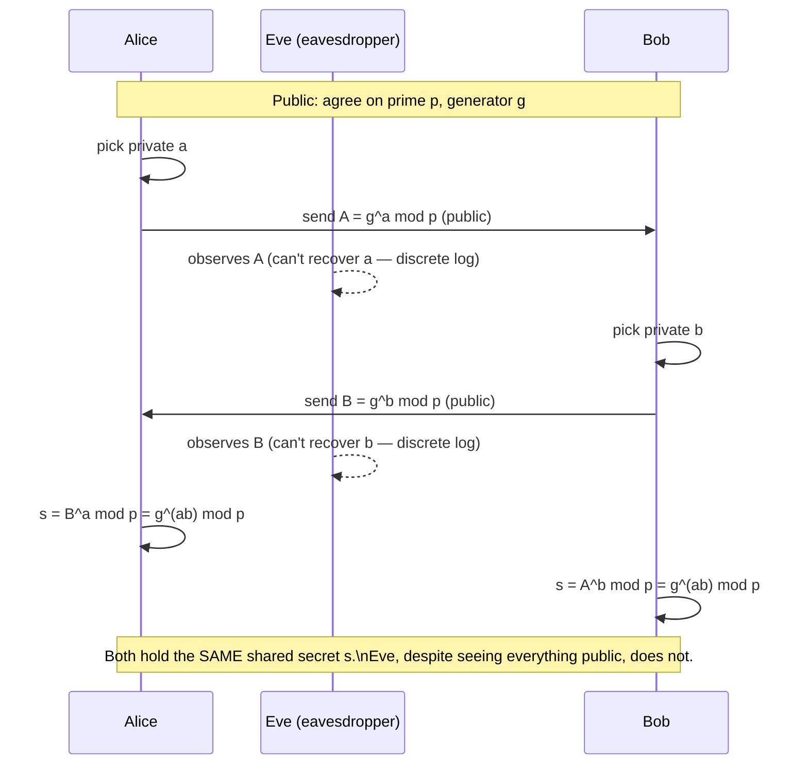

## Learning Objectives

- Describe the Diffie-Hellman protocol step by step, and identify exactly what is transmitted publicly versus kept private by each party.
- Prove algebraically why both parties compute the same shared value at the end of the protocol.
- Execute a full worked example with small, concrete numbers by hand, including choosing private exponents and computing the shared secret.
- Explain why an eavesdropper who observes every message in the protocol still cannot (believed) recover the shared secret, tying this directly to the discrete logarithm problem from the previous concept.
- Describe the man-in-the-middle vulnerability of unauthenticated Diffie-Hellman, and state, in one sentence, what ingredient (covered two concepts ahead) is needed to close it.

## Context & Motivation

The previous concept established that modular exponentiation is easy to compute forward but believed hard to invert (the discrete logarithm problem) — an asymmetry, but on its own, not yet a solution to the problem this discipline is actually trying to solve: two parties with no prior shared secret, communicating over a channel an eavesdropper fully observes, need to agree on a shared key. **Diffie-Hellman key exchange**, published by Whitfield Diffie and Martin Hellman in 1976, was the first published protocol to solve exactly this problem, and it remains, in essentially the same form, one of the two most widely used building blocks of modern secure communication (RSA, covered next, is the other) — it is, for instance, one of the key-exchange mechanisms this discipline's capstone will trace inside a real TLS handshake.

The protocol's cleverness is worth appreciating directly: it turns the discrete logarithm problem's one-way asymmetry into a genuinely constructive tool, letting two parties compute the *same* value from *different* private inputs, using only public communication — something that sounds almost paradoxical until the underlying algebra is worked through explicitly, which is exactly what this concept does.

## Core Theory

### The protocol, step by step

Alice and Bob agree in advance (this part can be entirely public, known to any eavesdropper) on a large prime `p` and a generator `g` (a specific number with particular mathematical properties within that modulus). Then:

1. Alice picks a private, secret integer `a`, and computes `A = gᵃ mod p`. She sends `A` to Bob, publicly.
2. Bob picks a private, secret integer `b`, and computes `B = gᵇ mod p`. He sends `B` to Alice, publicly.
3. Alice computes the shared secret as `s = Bᵃ mod p` (Bob's public value, raised to her own private exponent).
4. Bob computes the shared secret as `s = Aᵇ mod p` (Alice's public value, raised to his own private exponent).

Both arrive at the exact same value `s`, without either one ever transmitting their own private exponent (`a` or `b`) or the shared secret `s` itself over the channel.

### Why both parties compute the same value

The algebra is a direct consequence of how modular exponentiation composes:

```text
Alice computes: s = B^a mod p = (g^b mod p)^a mod p = g^(ba) mod p
Bob computes:   s = A^b mod p = (g^a mod p)^b mod p = g^(ab) mod p

Since ab = ba (ordinary multiplication commutes), both expressions are
exactly g^(ab) mod p — the SAME value, even though Alice computed it by
raising Bob's public value to HER private exponent, and Bob computed it
by raising Alice's public value to HIS private exponent.
```

This is the entire mechanism: the shared secret is `g^(ab) mod p`, and each party can compute it because they hold one of the two exponents (`a` or `b`) and receive the other party's *already-exponentiated* public value — never needing to know the other party's private exponent directly.

### Why an eavesdropper is stuck

An eavesdropper observing the channel sees `p`, `g`, `A = gᵃ mod p`, and `B = gᵇ mod p` — every value transmitted is public. To compute the shared secret `g^(ab) mod p`, the eavesdropper would need either `a` or `b` individually (and then could compute it exactly as Alice or Bob did) — but recovering `a` from `A = gᵃ mod p` is precisely the discrete logarithm problem from the previous concept, believed computationally infeasible for a well-chosen large prime `p`. This is the entire security argument: Diffie-Hellman's security reduces directly and explicitly to the same hardness assumption already introduced, not to a new, separate one.



### The unauthenticated protocol's real vulnerability: man-in-the-middle

Plain Diffie-Hellman, exactly as described above, guarantees that an eavesdropper who only *observes* the channel cannot recover the shared secret — but it guarantees nothing at all about whether Alice is really talking to Bob, as opposed to an active attacker sitting between them. An attacker, Mallory, positioned in the middle of the channel, can run the *entire protocol twice*: once with Alice (pretending to be Bob) establishing a shared secret `s₁`, and once with Bob (pretending to be Alice) establishing a different shared secret `s₂` — then transparently decrypt, read, optionally modify, and re-encrypt every message passing through, with neither Alice nor Bob able to detect it from the key-exchange protocol alone, since each of them successfully established *a* shared secret with someone, just not with each other. Plain Diffie-Hellman authenticates nothing about *identity* — it only guarantees that an eavesdropper who merely watches cannot recover the result. Closing this gap requires an independent mechanism for verifying identity, which is exactly what digital signatures and certificates (two concepts ahead) provide, and real protocols (including the TLS handshake this discipline's capstone traces) combine Diffie-Hellman with exactly that authentication layer rather than ever using it unauthenticated.

## Worked Examples

### Example 1: A complete Diffie-Hellman exchange with small numbers

Agree publicly on `p = 23` and `g = 5`.

```text
Alice picks private a = 6:
  A = 5^6 mod 23 = 15625 mod 23 = 8      (Alice sends A = 8 to Bob)

Bob picks private b = 15:
  B = 5^15 mod 23 = 6103515625 mod 23 = 19   (Bob sends B = 19 to Alice)

Alice computes the shared secret:
  s = B^a mod 23 = 19^6 mod 23 = 2

Bob computes the shared secret:
  s = A^b mod 23 = 8^15 mod 23 = 2

Both arrive at s = 2 — the SAME shared secret — using only the publicly
exchanged values (p, g, A, B) plus their own private exponent, which
neither one ever transmitted.
```

### Example 2: Confirming an eavesdropper is stuck, on this toy example

```text
Eve observed: p = 23, g = 5, A = 8, B = 19.

To find the shared secret directly the way Alice and Bob did, Eve would
need a (from A = 5^a mod 23 = 8) or b (from B = 5^b mod 23 = 19) — the
discrete logarithm problem.

For p = 23 (deliberately tiny, for hand computation), Eve COULD brute-
force check all 22 possible exponents in a moment on any computer:
  5^1=5, 5^2=2, 5^3=10, 5^4=4, 5^5=20, 5^6=8 ← found it! a = 6

This toy example is intentionally small enough to brute-force, exactly
to make the ALGEBRA clear by hand — the security claim only becomes
meaningful once p is a prime several hundred digits long, at which point
the same brute-force search that took a moment here would take longer
than the age of the universe with any foreseeable computing power.
```

### Example 3: Tracing the man-in-the-middle attack against unauthenticated Diffie-Hellman

```text
Alice believes she is exchanging keys with Bob. In reality:

1. Alice sends A = g^a mod p, intending it for Bob.
   Mallory intercepts it, and separately picks her own private m1.
2. Mallory sends her own value g^m1 mod p to Alice, pretending it's
   Bob's public value B. Alice computes a shared secret with MALLORY,
   believing it is shared with Bob.
3. Simultaneously, Mallory runs a SEPARATE exchange with the real Bob,
   pretending to be Alice, establishing a second shared secret with him.
4. Every message Alice sends "to Bob" is actually encrypted under her
   secret shared with Mallory; Mallory decrypts it, reads/modifies it,
   re-encrypts it under her OTHER shared secret with Bob, and forwards
   it — completely transparently to both Alice and Bob.

Nothing in the Diffie-Hellman protocol itself gives Alice or Bob any way
to detect this, because the protocol never verifies WHO is on the other
end — only that SOME shared secret gets established with whoever is
actually there.
```

## Common Misconceptions & Pitfalls

- **"Diffie-Hellman transmits the shared secret, just encrypted."** The shared secret `g^(ab) mod p` is never transmitted at all, in any form — only `A = gᵃ mod p` and `B = gᵇ mod p` cross the wire, and each party computes the final shared value independently and locally by combining the other party's public value with their own private exponent.
- **"An eavesdropper who records the exchange today could decrypt it once quantum computers exist, but that's a distant, separate concern."** This is actually a real, currently-relevant concern known as "harvest now, decrypt later" — an adversary can record today's Diffie-Hellman exchanges now and, if a sufficiently powerful quantum computer solving discrete log efficiently is ever built, decrypt the recorded traffic retroactively; this motivates the post-quantum cryptography research area, outside this discipline's scope but worth knowing exists.
- **"Diffie-Hellman authenticates both parties to each other."** It does not — plain Diffie-Hellman only prevents a passive eavesdropper from recovering the shared secret; it provides no protection against an active man-in-the-middle attacker, as Example 3 demonstrates concretely, which is exactly why real protocols combine it with a separate authentication mechanism (digital signatures/certificates, two concepts ahead).
- **"A larger prime p always means proportionally better security."** The relationship between prime size and discrete-log difficulty is not linear — recommended prime sizes are set based on the best known discrete-log algorithms (which are sub-exponential, not simply exponential, in the number's bit length), which is why real deployments use specific, carefully vetted prime sizes (or, in modern practice, elliptic-curve variants) rather than an arbitrarily chosen large number.
- **"This toy example with p = 23 shows Diffie-Hellman is weak."** The toy example is deliberately small purely to make the arithmetic checkable by hand — the entire point of Example 2 is that the identical algebra remains valid, but the brute-force attack that succeeds instantly here becomes computationally infeasible once p is chosen with the hundreds of digits real deployments actually use.

## Summary

Diffie-Hellman key exchange lets two parties who share no prior secret agree on one over a fully observed public channel: each picks a private exponent, exchanges `g` raised to that exponent modulo a public prime, and each combines the other's public value with their own private exponent to arrive at the identical shared secret `g^(ab) mod p` — a direct consequence of modular exponentiation's exponents commuting under multiplication. An eavesdropper who sees every public value transmitted still cannot (believed) recover the shared secret, because doing so requires solving the discrete logarithm problem introduced in the previous concept. The protocol's real limitation is that it authenticates nothing about identity — an active man-in-the-middle attacker can run the protocol twice, once with each victim, and transparently intercept everything — which is exactly the gap the next two concepts, RSA and then digital signatures/certificates, close by adding a mechanism for verifying who is actually on the other end of the exchange.

## Documentation Links

- [Stanford CS255 — Introduction to Cryptography, Course Syllabus](https://cs255.stanford.edu/syllabus.html) — covers Diffie-Hellman key exchange over finite cyclic groups in exactly this sequence, immediately after the number-theoretic foundations.
- [Boneh & Shoup — A Graduate Course in Applied Cryptography](https://toc.cryptobook.us/) — free textbook with a full, rigorous treatment of Diffie-Hellman and the discrete logarithm assumption it relies on.
