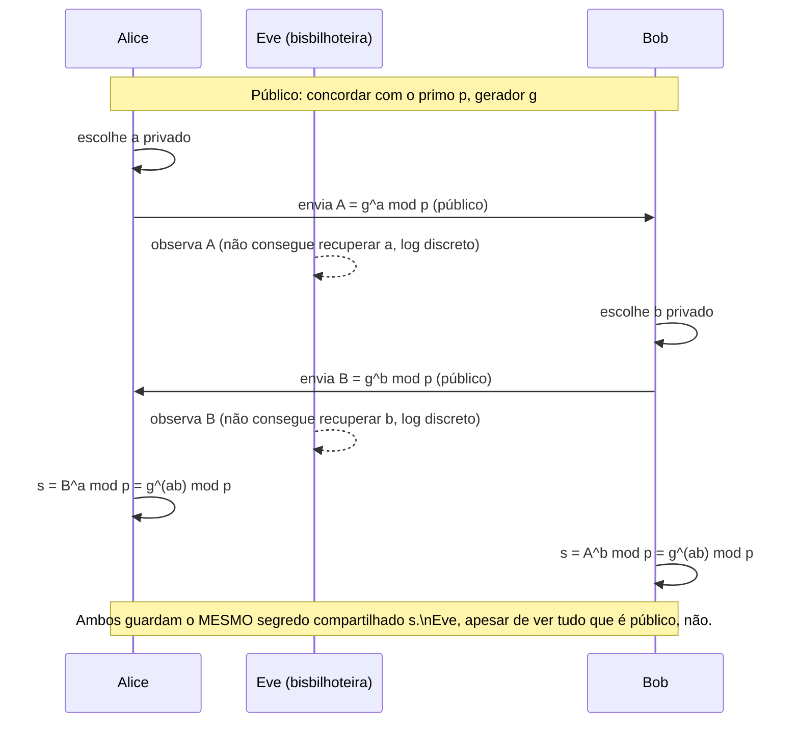

## Objetivos de Aprendizagem

- Descrever o protocolo Diffie-Hellman passo a passo, e identificar exatamente o que é transmitido publicamente versus mantido privado por cada parte.
- Provar algebricamente por que ambas as partes computam o mesmo valor compartilhado ao fim do protocolo.
- Executar um exemplo resolvido completo com números pequenos e concretos à mão, incluindo escolher expoentes privados e computar o segredo compartilhado.
- Explicar por que um bisbilhoteiro que observa toda mensagem no protocolo ainda não consegue (acredita-se) recuperar o segredo compartilhado, amarrando isto diretamente ao problema do logaritmo discreto do conceito anterior.
- Descrever a vulnerabilidade man-in-the-middle do Diffie-Hellman não autenticado, e enunciar, em uma frase, qual ingrediente (coberto dois conceitos à frente) é necessário para fechá-la.

## Contexto e Motivação

O conceito anterior estabeleceu que a exponenciação modular é fácil de computar para frente mas acredita-se difícil de inverter (o problema do logaritmo discreto), uma assimetria, mas, por si só, ainda não uma solução para o problema que esta disciplina de fato está tentando resolver: duas partes sem nenhum segredo compartilhado prévio, comunicando-se sobre um canal que um bisbilhoteiro observa por completo, precisam concordar com uma chave compartilhada. A **troca de chaves Diffie-Hellman**, publicada por Whitfield Diffie e Martin Hellman em 1976, foi o primeiro protocolo publicado a resolver exatamente este problema, e ela permanece, em essencialmente a mesma forma, um dos dois blocos de construção mais amplamente usados da comunicação segura moderna (RSA, coberto em seguida, é o outro), é, por exemplo, um dos mecanismos de troca de chaves que o capstone desta disciplina rastreará dentro de um handshake TLS real.

A engenhosidade do protocolo vale apreciar diretamente: ela transforma a assimetria de mão única do problema do logaritmo discreto numa ferramenta genuinamente construtiva, deixando duas partes computarem o *mesmo* valor a partir de entradas privadas *diferentes*, usando só comunicação pública, algo que soa quase paradoxal até a álgebra subjacente ser trabalhada explicitamente, que é exatamente o que este conceito faz.

## Teoria Central

### O protocolo, passo a passo

Alice e Bob concordam de antemão (esta parte pode ser inteiramente pública, conhecida por qualquer bisbilhoteiro) sobre um primo grande `p` e um gerador `g` (um número específico com propriedades matemáticas particulares dentro daquele módulo). Então:

1. Alice escolhe um inteiro privado e secreto `a`, e computa `A = gᵃ mod p`. Ela envia `A` a Bob, publicamente.
2. Bob escolhe um inteiro privado e secreto `b`, e computa `B = gᵇ mod p`. Ele envia `B` a Alice, publicamente.
3. Alice computa o segredo compartilhado como `s = Bᵃ mod p` (o valor público de Bob, elevado ao seu próprio expoente privado).
4. Bob computa o segredo compartilhado como `s = Aᵇ mod p` (o valor público de Alice, elevado ao seu próprio expoente privado).

Ambos chegam ao exato mesmo valor `s`, sem nenhum dos dois jamais transmitir o seu próprio expoente privado (`a` ou `b`) ou o próprio segredo compartilhado `s` sobre o canal.

### Por que ambas as partes computam o mesmo valor

A álgebra é uma consequência direta de como a exponenciação modular se compõe:

```text
Alice computa: s = B^a mod p = (g^b mod p)^a mod p = g^(ba) mod p
Bob computa:   s = A^b mod p = (g^a mod p)^b mod p = g^(ab) mod p

Já que ab = ba (a multiplicação comum comuta), ambas as expressões são
exatamente g^(ab) mod p, o MESMO valor, mesmo que Alice o tenha computado
elevando o valor público de Bob ao SEU expoente privado, e Bob o tenha computado
elevando o valor público de Alice ao SEU expoente privado.
```

Este é o mecanismo inteiro: o segredo compartilhado é `g^(ab) mod p`, e cada parte consegue computá-lo porque guarda um dos dois expoentes (`a` ou `b`) e recebe o valor público *já exponenciado* da outra parte, nunca precisando conhecer o expoente privado da outra parte diretamente.

### Por que um bisbilhoteiro fica preso

Um bisbilhoteiro observando o canal vê `p`, `g`, `A = gᵃ mod p` e `B = gᵇ mod p`, todo valor transmitido é público. Para computar o segredo compartilhado `g^(ab) mod p`, o bisbilhoteiro precisaria de `a` ou `b` individualmente (e então poderia computá-lo exatamente como Alice ou Bob fizeram), mas recuperar `a` de `A = gᵃ mod p` é precisamente o problema do logaritmo discreto do conceito anterior, acreditado computacionalmente inviável para um primo grande `p` bem escolhido. Este é o argumento de segurança inteiro: a segurança do Diffie-Hellman se reduz direta e explicitamente à mesma suposição de dificuldade já introduzida, não a uma nova e separada.



### A vulnerabilidade real do protocolo não autenticado: man-in-the-middle

O Diffie-Hellman simples, exatamente como descrito acima, garante que um bisbilhoteiro que só *observa* o canal não consiga recuperar o segredo compartilhado, mas não garante nada de forma alguma sobre se Alice está realmente falando com Bob, em oposição a um atacante ativo situado entre eles. Um atacante, Mallory, posicionado no meio do canal, pode rodar o *protocolo inteiro duas vezes*: uma com Alice (fingindo ser Bob) estabelecendo um segredo compartilhado `s₁`, e uma com Bob (fingindo ser Alice) estabelecendo um segredo compartilhado diferente `s₂`, depois descriptografar, ler, opcionalmente modificar e recriptografar transparentemente toda mensagem passando por ele, com nem Alice nem Bob capazes de detectá-lo só pelo protocolo de troca de chaves, já que cada um deles estabeleceu com sucesso *um* segredo compartilhado com alguém, só não um com o outro. O Diffie-Hellman simples não autentica nada sobre *identidade*, ele só garante que um bisbilhoteiro que meramente assiste não consiga recuperar o resultado. Fechar esta lacuna exige um mecanismo independente para verificar identidade, que é exatamente o que assinaturas digitais e certificados (dois conceitos à frente) fornecem, e protocolos reais (incluindo o handshake TLS que o capstone desta disciplina rastreia) combinam o Diffie-Hellman com exatamente essa camada de autenticação em vez de jamais usá-lo não autenticado.

## Exemplos Resolvidos

### Exemplo 1: Uma troca Diffie-Hellman completa com números pequenos

Concordar publicamente com `p = 23` e `g = 5`.

```text
Alice escolhe a privado = 6:
  A = 5^6 mod 23 = 15625 mod 23 = 8      (Alice envia A = 8 a Bob)

Bob escolhe b privado = 15:
  B = 5^15 mod 23 = 6103515625 mod 23 = 19   (Bob envia B = 19 a Alice)

Alice computa o segredo compartilhado:
  s = B^a mod 23 = 19^6 mod 23 = 2

Bob computa o segredo compartilhado:
  s = A^b mod 23 = 8^15 mod 23 = 2

Ambos chegam a s = 2, o MESMO segredo compartilhado, usando só os valores
trocados publicamente (p, g, A, B) mais o seu próprio expoente privado, que
nenhum dos dois jamais transmitiu.
```

### Exemplo 2: Confirmando que um bisbilhoteiro fica preso, neste exemplo de brinquedo

```text
Eve observou: p = 23, g = 5, A = 8, B = 19.

Para achar o segredo compartilhado diretamente da forma que Alice e Bob fizeram, Eve
precisaria de a (de A = 5^a mod 23 = 8) ou b (de B = 5^b mod 23 = 19), o
problema do logaritmo discreto.

Para p = 23 (deliberadamente minúsculo, para computação à mão), Eve PODERIA por
força bruta checar todos os 22 expoentes possíveis num instante em qualquer computador:
  5^1=5, 5^2=2, 5^3=10, 5^4=4, 5^5=20, 5^6=8 ← encontrou! a = 6

Este exemplo de brinquedo é intencionalmente pequeno o bastante para força bruta, exatamente
para tornar a ÁLGEBRA clara à mão, a alegação de segurança só se torna
significativa uma vez que p é um primo de várias centenas de dígitos de comprimento, ponto no qual
a mesma busca por força bruta que levou um instante aqui levaria mais tempo
do que a idade do universo com qualquer poder computacional previsível.
```

### Exemplo 3: Rastreando o ataque man-in-the-middle contra o Diffie-Hellman não autenticado

```text
Alice acredita que está trocando chaves com Bob. Na realidade:

1. Alice envia A = g^a mod p, pretendendo-o para Bob.
   Mallory o intercepta, e separadamente escolhe o seu próprio m1 privado.
2. Mallory envia o seu próprio valor g^m1 mod p a Alice, fingindo que é
   o valor público B de Bob. Alice computa um segredo compartilhado com MALLORY,
   acreditando que é compartilhado com Bob.
3. Simultaneamente, Mallory roda uma troca SEPARADA com o Bob real,
   fingindo ser Alice, estabelecendo um segundo segredo compartilhado com ele.
4. Toda mensagem que Alice envia "para Bob" é na verdade criptografada sob o
   seu segredo compartilhado com Mallory; Mallory a descriptografa, lê/modifica,
   recriptografa sob o seu OUTRO segredo compartilhado com Bob, e a encaminha,
   completamente transparente tanto para Alice quanto para Bob.

Nada no próprio protocolo Diffie-Hellman dá a Alice ou Bob qualquer forma
de detectar isto, porque o protocolo nunca verifica QUEM está do outro
lado, só que ALGUM segredo compartilhado é estabelecido com quem quer que
esteja de fato ali.
```

## Equívocos Comuns e Armadilhas

- **"O Diffie-Hellman transmite o segredo compartilhado, só que criptografado."** O segredo compartilhado `g^(ab) mod p` nunca é transmitido de forma alguma, em nenhuma forma, só `A = gᵃ mod p` e `B = gᵇ mod p` cruzam o fio, e cada parte computa o valor compartilhado final independente e localmente combinando o valor público da outra parte com o seu próprio expoente privado.
- **"Um bisbilhoteiro que grava a troca hoje poderia descriptografá-la quando computadores quânticos existirem, mas essa é uma preocupação distante e separada."** Esta é na verdade uma preocupação real e atualmente relevante conhecida como "colher agora, descriptografar depois", um adversário pode gravar as trocas Diffie-Hellman de hoje agora e, se um computador quântico suficientemente poderoso resolvendo o log discreto eficientemente for jamais construído, descriptografar o tráfego gravado retroativamente; isto motiva a área de pesquisa de criptografia pós-quântica, fora do escopo desta disciplina mas que vale saber que existe.
- **"O Diffie-Hellman autentica ambas as partes uma à outra."** Ele não, o Diffie-Hellman simples só previne que um bisbilhoteiro passivo recupere o segredo compartilhado; ele não fornece nenhuma proteção contra um atacante man-in-the-middle ativo, como o Exemplo 3 demonstra concretamente, que é exatamente por que protocolos reais o combinam com um mecanismo de autenticação separado (assinaturas digitais/certificados, dois conceitos à frente).
- **"Um primo p maior sempre significa segurança proporcionalmente melhor."** A relação entre o tamanho do primo e a dificuldade do log discreto não é linear, tamanhos de primo recomendados são definidos com base nos melhores algoritmos de log discreto conhecidos (que são subexponenciais, não simplesmente exponenciais, no comprimento de bits do número), que é por que implantações reais usam tamanhos de primo específicos e cuidadosamente verificados (ou, na prática moderna, variantes de curva elíptica) em vez de um número grande escolhido arbitrariamente.
- **"Este exemplo de brinquedo com p = 23 mostra que o Diffie-Hellman é fraco."** O exemplo de brinquedo é deliberadamente pequeno puramente para tornar a aritmética checável à mão, o ponto inteiro do Exemplo 2 é que a álgebra idêntica permanece válida, mas o ataque por força bruta que tem sucesso instantaneamente aqui se torna computacionalmente inviável uma vez que p é escolhido com as centenas de dígitos que implantações reais de fato usam.

## Resumo

A troca de chaves Diffie-Hellman deixa duas partes que não compartilham nenhum segredo prévio concordarem com um sobre um canal público totalmente observado: cada uma escolhe um expoente privado, troca `g` elevado a esse expoente módulo um primo público, e cada uma combina o valor público da outra com o seu próprio expoente privado para chegar ao segredo compartilhado idêntico `g^(ab) mod p`, uma consequência direta dos expoentes da exponenciação modular comutarem sob multiplicação. Um bisbilhoteiro que vê todo valor público transmitido ainda não consegue (acredita-se) recuperar o segredo compartilhado, porque fazer isso exige resolver o problema do logaritmo discreto introduzido no conceito anterior. A limitação real do protocolo é que ele não autentica nada sobre identidade, um atacante man-in-the-middle ativo pode rodar o protocolo duas vezes, uma com cada vítima, e interceptar tudo transparentemente, que é exatamente a lacuna que os próximos dois conceitos, RSA e depois assinaturas digitais/certificados, fecham adicionando um mecanismo para verificar quem de fato está do outro lado da troca.

## Documentation Links

- [Stanford CS255 — Introduction to Cryptography, Course Syllabus](https://cs255.stanford.edu/syllabus.html): cobre a troca de chaves Diffie-Hellman sobre grupos cíclicos finitos exatamente nesta sequência, imediatamente após as fundações teórico-numéricas.
- [Boneh & Shoup — A Graduate Course in Applied Cryptography](https://toc.cryptobook.us/): livro-texto gratuito com um tratamento completo e rigoroso do Diffie-Hellman e da suposição de logaritmo discreto na qual ele se apoia.
