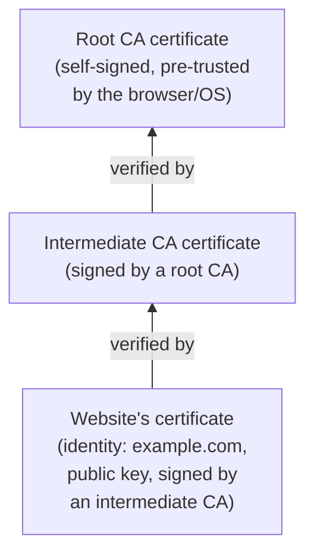

## Learning Objectives

- Explain how RSA signing runs the encryption/decryption trapdoor "in reverse," and why the private key signs while the public key verifies (the opposite direction from RSA encryption).
- Execute a full worked example of signing and verifying a message with small RSA keys.
- Explain why real signature schemes sign a hash of the message rather than the message itself, tying this directly to the collision-resistance property already covered.
- Define a certificate and explain, concretely, what problem it solves that raw public-key cryptography cannot solve on its own.
- Describe a certificate chain and the role of a root certificate authority, and explain why trust in the whole system reduces to trust in a small set of roots.

## Context & Motivation

RSA encryption solved "how does anyone send a message only the recipient can read." A closely related but distinct problem remains: "how does a recipient know a message really came from who it claims to be from, and wasn't tampered with in transit" — exactly the **non-repudiation** goal named back in the threat-modeling concept, and exactly the gap message authentication codes closed for *symmetric* cryptography. **Digital signatures** provide the same guarantee using *public-key* cryptography instead, with one crucial, valuable difference: unlike a MAC (which requires both parties to share a secret key, so either one of them could in principle have produced a valid tag), a digital signature can be verified by *anyone* holding the signer's public key, while only the signer, holding the private key, could have produced it — a property MACs structurally cannot offer, since MAC verification requires the same secret used to produce it.

But a signature alone still leaves one problem unaddressed, the exact same one Diffie-Hellman left unaddressed: how does a verifier know that a given public key really belongs to the person it claims to belong to, rather than to an attacker running a man-in-the-middle attack? **Certificates**, and the certificate authority infrastructure built around them, answer that question — and understanding both pieces together (signing, and the trust infrastructure around public keys) is what makes this discipline's capstone, tracing a real TLS handshake, fully comprehensible rather than a sequence of unexplained steps.

## Core Theory

### RSA signing: the trapdoor in reverse

RSA encryption computes `c = m^e mod n` (using the *public* key) and decryption computes `m = c^d mod n` (using the *private* key). **RSA signing runs this in the opposite direction**: the signer computes a signature using their *private* key, `s = m^d mod n`, and anyone can *verify* it using the signer's *public* key, checking whether `s^e mod n` equals the original message `m`. The same correctness argument from the previous concept (Euler's theorem / Fermat's little theorem) applies symmetrically here, since `e` and `d` are each other's modular inverses regardless of which one is applied first: `(m^d)^e mod n = m^(de) mod n = m` by the exact same algebra as `(m^e)^d mod n = m`.

The security intuition inverts correspondingly: only someone holding the private key `d` can produce a value `s` such that `s^e mod n` correctly equals a chosen message `m` — an attacker without `d` who tries to forge a signature for a message of their choosing faces the same computational hardness (rooted in integer factorization, since recovering `d` from the public `(n, e)` requires factoring `n`) that protected RSA encryption in the previous concept.

### Why real signatures sign a hash, not the raw message

In practice, no real signature scheme signs the raw message directly the way the simplified description above suggests. Instead, the signer first computes a cryptographic hash of the message (SHA-256, already covered) and signs *that* fixed-size hash: `s = H(m)^d mod n`. Two independent reasons make this the standard approach, both already covered separately in this discipline:

1. **Efficiency**: RSA's modular exponentiation operates on a fixed-size number bounded by `n`; a message longer than that would need to be broken into chunks and signed piecewise, which is both slower and introduces its own subtle security pitfalls. Hashing first reduces any message, of any length, to one fixed-size value to sign.
2. **Security**: collision resistance (already covered) is exactly what's needed here — if an attacker could find two different messages `m₁ ≠ m₂` with the same hash, a signature on `H(m₁)` would also validly verify for `m₂`, letting a legitimately-signed document be swapped for a different one with the identical signature still attached. Signing a collision-resistant hash directly closes off that attack.

This is a second, direct, substantive use of the hash-function properties already established — the first was integrity via MACs; this is authenticity via signatures — reinforcing that the same three properties (preimage, second-preimage, collision resistance) underpin multiple, independently important mechanisms across this discipline.

### Certificates: binding a public key to an identity

Digital signatures let a verifier confirm "this message was signed by whoever holds this specific private key" — but say nothing about *whose* key that is. A **certificate** solves exactly this: it is a small, structured document containing a subject's identity (e.g. a domain name), that subject's public key, and — critically — a **digital signature over all of that, produced by a trusted third party**, called a **Certificate Authority (CA)**. Anyone holding the CA's own public key can verify that signature, confirming that the CA vouches for the binding between this specific identity and this specific public key.

### Certificate chains and the root of trust

A single CA signing every certificate directly would be an operational and security bottleneck, so real systems use a **chain of trust**: a small number of highly-protected **root CAs** sign certificates for intermediate CAs, which in turn sign certificates for end-entity (e.g. website) certificates. A verifier checks the chain from the presented certificate up through each intermediate signature, ultimately checking that the top of the chain is signed by a root CA whose public key the verifier already trusts unconditionally (typically pre-installed in an operating system or browser). This structure concentrates the entire system's trust into a small, auditable set of root keys — every certificate's validity ultimately reduces to "is this chain of signatures traceable back to a root I already trust," which is exactly the mechanism that lets a browser trust a website it has never previously encountered.



## Worked Examples

### Example 1: A full RSA sign-and-verify example, continuing the previous concept's keys

Reusing `n = 3233`, `e = 17`, `d = 2753` from the RSA encryption concept, sign the (toy, single-byte) message `m = 65`.

```text
Sign with the private key: s = m^d mod n = 65^2753 mod 3233 = 2790

(Notice this happens to equal the CIPHERTEXT from the encryption
example — a coincidence of this specific toy example's symmetric roles
for e and d, not a general property of RSA signing.)

Verify with the public key: check whether s^e mod n equals m
  2790^17 mod 3233 = 65  ✓ — matches the original message exactly.

Anyone holding the public key (n=3233, e=17) can perform this same
verification and confirm the signature is valid — WITHOUT ever needing
access to the private key d that produced it.
```

### Example 2: Why signing a hash, not the raw message, closes a real attack

```text
Suppose (hypothetically, ignoring hash-function security for a moment)
an attacker could find two DIFFERENT contracts, m1 = "Pay Alice $100"
and m2 = "Pay Alice $100,000", such that H(m1) = H(m2) — a hash
collision.

If a bank legitimately signs H(m1) (intending to authorize the $100
payment), that EXACT SAME signature s = H(m1)^d mod n = H(m2)^d mod n
ALSO validly verifies against m2, since the hashes are identical.

An attacker who can produce such a collision could present m2 (the
$100,000 version) alongside the legitimately-obtained signature, and it
would verify as authentic — this is precisely why collision resistance
(not just preimage resistance) is required of the hash function used in
any signature scheme, and precisely why SHA-256's ~2^128 collision bound
(from the hash-functions concept) matters here specifically, not just
in the abstract.
```

### Example 3: Tracing a certificate chain verification

```text
Browser receives a certificate claiming: "example.com's public key is
(n_site, e_site)", signed by "Intermediate CA X".

Step 1: Browser checks: does "Intermediate CA X"'s signature on this
        certificate verify correctly, using Intermediate CA X's OWN
        public key? → requires Intermediate CA X's certificate.

Step 2: Intermediate CA X's certificate says it was signed by
        "Root CA R". Browser checks THAT signature using Root CA R's
        public key.

Step 3: Root CA R's public key is pre-installed in the browser's trust
        store (shipped with the browser/OS, vetted through a separate,
        out-of-band process) — no further signature to check; it is
        trusted by definition, as the base case of the chain.

If every signature in the chain verifies correctly, the browser accepts
that example.com's public key really is (n_site, e_site) — a chain of
exactly two verified signatures reducing all the way down to one small,
pre-trusted root key.
```

## Common Misconceptions & Pitfalls

- **"A digital signature is the same thing as encrypting a message with the private key."** While RSA signing does compute `m^d mod n` — structurally the same operation as RSA decryption — its *purpose* is entirely different: encryption's private-key operation recovers a message only the private-key holder can read; signing's private-key operation produces a value only the private-key holder could have produced, verifiable (not decryptable) by anyone with the public key.
- **"Signing the raw message directly is simpler and just as safe as signing its hash."** Signing the hash is not merely a convenience shortcut — Example 2 shows it closes a genuine forgery attack that becomes possible if signature schemes operate on messages directly without collision-resistant hashing first.
- **"A certificate proves a website is trustworthy or safe to use."** A certificate only proves that a specific public key is bound to a specific identity (e.g. a domain name), as vouched for by a CA — it says nothing about whether the operator of that domain is honest, competent, or free of other vulnerabilities; conflating "has a valid certificate" with "is safe" is a common and consequential misunderstanding.
- **"Every certificate needs to be individually, manually trusted by the user."** The whole point of the chain-of-trust structure is that only a small, curated set of root CA keys need to be trusted in advance (pre-installed by the browser/OS vendor); every other certificate's trust is derived automatically by verifying signatures up the chain to one of those roots.
- **"If a root CA's private key were ever compromised, only certificates it directly signed would be affected."** Because trust in the entire chain ultimately depends on the root, a compromised root CA key would let an attacker forge a valid certificate (and full chain) for literally any identity, including ones the CA never legitimately certified — which is precisely why root CA private keys are protected with extraordinary operational security, far beyond that of intermediate or end-entity keys.

## Summary

RSA signing runs the same trapdoor used for encryption in reverse: the private key produces a signature, and the public key verifies it, letting anyone confirm authorship without being able to forge it themselves — a capability MACs (requiring a shared secret) cannot offer. Real signature schemes sign a cryptographic hash of the message rather than the message itself, both for efficiency and, critically, because collision resistance (already covered) closes off a genuine forgery attack that signing raw messages would leave open. A certificate binds a public key to an identity via a CA's own signature, and a chain of trust — end-entity certificate, signed by an intermediate CA, signed by a pre-trusted root CA — lets a verifier extend trust from a small set of root keys to any legitimately-issued certificate, without ever needing to have met the certificate's subject before. With confidentiality (symmetric and public-key encryption), integrity (hashing, MACs), and now authenticity/non-repudiation (signatures, certificates) all covered, the next several concepts turn to how these primitives fail in practice — starting with memory-safety and injection vulnerabilities, which connect directly back to the buffer-overflow material already covered in `computer/c-and-assembly`.

## Documentation Links

- [Stanford CS255 — Introduction to Cryptography, Course Syllabus](https://cs255.stanford.edu/syllabus.html) — covers digital signature definitions, RSA signing, and certificates in exactly this sequence.
- [ACM/IEEE CS2013 — Information Assurance and Security (Privacy and Security) Knowledge Area](https://csed.acm.org/knowledge-areas-privacy-and-security-ps-cs2013/) — lists Public Key Infrastructure and digital signing as a core cryptography learning outcome.
