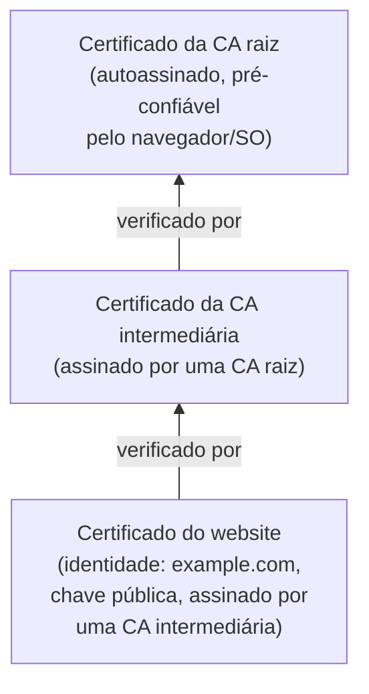

## Objetivos de Aprendizagem

- Explicar como a assinatura RSA roda o trapdoor de criptografia/descriptografia "ao contrário", e por que a chave privada assina enquanto a chave pública verifica (a direção oposta da criptografia RSA).
- Executar um exemplo resolvido completo de assinar e verificar uma mensagem com chaves RSA pequenas.
- Explicar por que esquemas de assinatura reais assinam um hash da mensagem em vez da própria mensagem, amarrando isto diretamente à propriedade de resistência a colisão já coberta.
- Definir um certificado e explicar, concretamente, que problema ele resolve que a criptografia de chave pública crua não consegue resolver por si só.
- Descrever uma cadeia de certificados e o papel de uma autoridade certificadora raiz, e explicar por que a confiança no sistema inteiro se reduz à confiança num pequeno conjunto de raízes.

## Contexto e Motivação

A criptografia RSA resolveu "como é que alguém envia uma mensagem que só o destinatário consegue ler". Um problema estreitamente relacionado mas distinto permanece: "como é que um destinatário sabe que uma mensagem realmente veio de quem ela afirma vir, e não foi adulterada em trânsito", exatamente o objetivo de **não repúdio** nomeado lá no conceito de modelagem de ameaças, e exatamente a lacuna que códigos de autenticação de mensagem fecharam para a criptografia *simétrica*. **Assinaturas digitais** fornecem a mesma garantia usando criptografia de *chave pública* em vez disso, com uma diferença crucial e valiosa: ao contrário de um MAC (que exige que ambas as partes compartilhem uma chave secreta, de forma que qualquer uma delas poderia em princípio ter produzido uma tag válida), uma assinatura digital pode ser verificada por *qualquer um* que guarde a chave pública do signatário, enquanto só o signatário, guardando a chave privada, poderia tê-la produzido, uma propriedade que MACs estruturalmente não conseguem oferecer, já que a verificação de MAC exige o mesmo segredo usado para produzi-lo.

Mas uma assinatura sozinha ainda deixa um problema sem resposta, o exato mesmo que o Diffie-Hellman deixou sem resposta: como é que um verificador sabe que uma dada chave pública realmente pertence à pessoa que ela afirma pertencer, em vez de a um atacante rodando um ataque man-in-the-middle? **Certificados**, e a infraestrutura de autoridade certificadora construída em torno deles, respondem essa pergunta, e entender ambas as peças juntas (assinar, e a infraestrutura de confiança em torno de chaves públicas) é o que torna o capstone desta disciplina, rastreando um handshake TLS real, plenamente compreensível em vez de uma sequência de passos inexplicados.

## Teoria Central

### Assinatura RSA: o trapdoor ao contrário

A criptografia RSA computa `c = m^e mod n` (usando a chave *pública*) e a descriptografia computa `m = c^d mod n` (usando a chave *privada*). **A assinatura RSA roda isto na direção oposta**: o signatário computa uma assinatura usando a sua chave *privada*, `s = m^d mod n`, e qualquer um consegue *verificá-la* usando a chave *pública* do signatário, checando se `s^e mod n` é igual à mensagem original `m`. O mesmo argumento de correção do conceito anterior (teorema de Euler / pequeno teorema de Fermat) se aplica simetricamente aqui, já que `e` e `d` são inversos modulares um do outro independentemente de qual é aplicado primeiro: `(m^d)^e mod n = m^(de) mod n = m` pela exata mesma álgebra que `(m^e)^d mod n = m`.

A intuição de segurança se inverte correspondentemente: só alguém guardando a chave privada `d` consegue produzir um valor `s` tal que `s^e mod n` seja corretamente igual a uma mensagem escolhida `m`, um atacante sem `d` que tenta forjar uma assinatura para uma mensagem da sua escolha enfrenta a mesma dificuldade computacional (enraizada na fatoração de inteiros, já que recuperar `d` da `(n, e)` pública exige fatorar `n`) que protegeu a criptografia RSA no conceito anterior.

### Por que assinaturas reais assinam um hash, não a mensagem crua

Na prática, nenhum esquema de assinatura real assina a mensagem crua diretamente da forma que a descrição simplificada acima sugere. Em vez disso, o signatário primeiro computa um hash criptográfico da mensagem (SHA-256, já coberto) e assina *esse* hash de tamanho fixo: `s = H(m)^d mod n`. Duas razões independentes tornam esta a abordagem padrão, ambas já cobertas separadamente nesta disciplina:

1. **Eficiência**: a exponenciação modular do RSA opera sobre um número de tamanho fixo limitado por `n`; uma mensagem mais longa do que isso precisaria ser quebrada em pedaços e assinada por partes, o que é tanto mais lento quanto introduz as suas próprias armadilhas de segurança sutis. Fazer hash primeiro reduz qualquer mensagem, de qualquer comprimento, a um valor de tamanho fixo para assinar.
2. **Segurança**: a resistência a colisão (já coberta) é exatamente o que é necessário aqui, se um atacante conseguisse achar duas mensagens diferentes `m₁ ≠ m₂` com o mesmo hash, uma assinatura sobre `H(m₁)` também verificaria validamente para `m₂`, deixando um documento legitimamente assinado ser trocado por um diferente com a assinatura idêntica ainda anexada. Assinar um hash resistente a colisão diretamente fecha esse ataque.

Este é um segundo uso direto e substantivo das propriedades de função de hash já estabelecidas, o primeiro foi integridade via MACs; este é autenticidade via assinaturas, reforçando que as mesmas três propriedades (resistência a pré-imagem, a segunda pré-imagem, a colisão) sustentam múltiplos mecanismos independentemente importantes por toda esta disciplina.

### Certificados: amarrando uma chave pública a uma identidade

Assinaturas digitais deixam um verificador confirmar "esta mensagem foi assinada por quem quer que guarde esta chave privada específica", mas nada dizem sobre *de quem* é essa chave. Um **certificado** resolve exatamente isto: ele é um pequeno documento estruturado contendo a identidade de um sujeito (por exemplo, um nome de domínio), a chave pública daquele sujeito, e, criticamente, uma **assinatura digital sobre tudo isso, produzida por um terceiro confiável**, chamado de **Autoridade Certificadora (CA)**. Qualquer um guardando a própria chave pública da CA consegue verificar essa assinatura, confirmando que a CA atesta a amarração entre esta identidade específica e esta chave pública específica.

### Cadeias de certificados e a raiz de confiança

Uma única CA assinando todo certificado diretamente seria um gargalo operacional e de segurança, então sistemas reais usam uma **cadeia de confiança**: um pequeno número de **CAs raiz** altamente protegidas assina certificados para CAs intermediárias, que por sua vez assinam certificados para certificados de entidade final (por exemplo, website). Um verificador checa a cadeia do certificado apresentado para cima por cada assinatura intermediária, por fim checando que o topo da cadeia é assinado por uma CA raiz cuja chave pública o verificador já confia incondicionalmente (tipicamente pré-instalada num sistema operacional ou navegador). Esta estrutura concentra a confiança do sistema inteiro num pequeno conjunto auditável de chaves raiz, a validade de todo certificado em última instância se reduz a "esta cadeia de assinaturas é rastreável de volta a uma raiz em que já confio", que é exatamente o mecanismo que deixa um navegador confiar num website que nunca encontrou antes.



## Exemplos Resolvidos

### Exemplo 1: Um exemplo completo de assinar-e-verificar RSA, continuando as chaves do conceito anterior

Reusando `n = 3233`, `e = 17`, `d = 2753` do conceito de criptografia RSA, assine a mensagem (de brinquedo, de um único byte) `m = 65`.

```text
Assinar com a chave privada: s = m^d mod n = 65^2753 mod 3233 = 2790

(Repare que isto por acaso é igual ao TEXTO CIFRADO do exemplo de
criptografia, uma coincidência dos papéis simétricos deste exemplo de
brinquedo específico para e e d, não uma propriedade geral da assinatura RSA.)

Verificar com a chave pública: checar se s^e mod n é igual a m
  2790^17 mod 3233 = 65  ✓ — corresponde à mensagem original exatamente.

Qualquer um guardando a chave pública (n=3233, e=17) consegue realizar esta mesma
verificação e confirmar que a assinatura é válida, SEM jamais precisar de
acesso à chave privada d que a produziu.
```

### Exemplo 2: Por que assinar um hash, não a mensagem crua, fecha um ataque real

```text
Suponha (hipoteticamente, ignorando a segurança de função de hash por um momento)
que um atacante conseguisse achar dois contratos DIFERENTES, m1 = "Pagar Alice $100"
e m2 = "Pagar Alice $100.000", tais que H(m1) = H(m2), uma colisão de
hash.

Se um banco legitimamente assina H(m1) (pretendendo autorizar o pagamento de
$100), essa EXATA MESMA assinatura s = H(m1)^d mod n = H(m2)^d mod n
TAMBÉM verifica validamente contra m2, já que os hashes são idênticos.

Um atacante que consegue produzir tal colisão poderia apresentar m2 (a
versão de $100.000) junto à assinatura legitimamente obtida, e ela
verificaria como autêntica, isto é precisamente por que a resistência a colisão
(não só a resistência a pré-imagem) é exigida da função de hash usada em
qualquer esquema de assinatura, e precisamente por que o limite de colisão de ~2^128
do SHA-256 (do conceito de funções de hash) importa aqui especificamente, não só
no abstrato.
```

### Exemplo 3: Rastreando uma verificação de cadeia de certificados

```text
O navegador recebe um certificado afirmando: "a chave pública de example.com é
(n_site, e_site)", assinado por "CA Intermediária X".

Passo 1: O navegador checa: a assinatura da "CA Intermediária X" neste
         certificado verifica corretamente, usando a PRÓPRIA chave pública
         da CA Intermediária X? → exige o certificado da CA Intermediária X.

Passo 2: O certificado da CA Intermediária X diz que foi assinado por
         "CA Raiz R". O navegador checa ESSA assinatura usando a chave pública
         da CA Raiz R.

Passo 3: A chave pública da CA Raiz R está pré-instalada no repositório de confiança
         do navegador (enviado com o navegador/SO, verificado por um processo
         separado e fora de banda), nenhuma assinatura adicional a checar; ela é
         confiável por definição, como o caso base da cadeia.

Se toda assinatura na cadeia verifica corretamente, o navegador aceita
que a chave pública de example.com realmente é (n_site, e_site), uma cadeia de
exatamente duas assinaturas verificadas reduzindo-se por todo o caminho a uma pequena
chave raiz pré-confiável.
```

## Equívocos Comuns e Armadilhas

- **"Uma assinatura digital é a mesma coisa que criptografar uma mensagem com a chave privada."** Embora a assinatura RSA de fato compute `m^d mod n`, estruturalmente a mesma operação que a descriptografia RSA, o seu *propósito* é inteiramente diferente: a operação de chave privada da criptografia recupera uma mensagem que só o guardião da chave privada consegue ler; a operação de chave privada da assinatura produz um valor que só o guardião da chave privada poderia ter produzido, verificável (não descriptografável) por qualquer um com a chave pública.
- **"Assinar a mensagem crua diretamente é mais simples e tão seguro quanto assinar o seu hash."** Assinar o hash não é meramente um atalho de conveniência, o Exemplo 2 mostra que ele fecha um ataque de forjamento genuíno que se torna possível se esquemas de assinatura operam sobre mensagens diretamente sem hashing resistente a colisão primeiro.
- **"Um certificado prova que um website é confiável ou seguro de usar."** Um certificado só prova que uma chave pública específica está amarrada a uma identidade específica (por exemplo, um nome de domínio), como atestado por uma CA, ele nada diz sobre se o operador daquele domínio é honesto, competente ou livre de outras vulnerabilidades; conflatar "tem um certificado válido" com "é seguro" é um mal-entendido comum e consequente.
- **"Todo certificado precisa ser individual e manualmente confiado pelo usuário."** O ponto inteiro da estrutura de cadeia-de-confiança é que só um pequeno conjunto curado de chaves de CA raiz precisa ser confiado de antemão (pré-instalado pelo fornecedor do navegador/SO); a confiança de todo outro certificado é derivada automaticamente verificando assinaturas pela cadeia até uma dessas raízes.
- **"Se a chave privada de uma CA raiz fosse jamais comprometida, só certificados que ela assinou diretamente seriam afetados."** Porque a confiança na cadeia inteira em última instância depende da raiz, uma chave de CA raiz comprometida deixaria um atacante forjar um certificado válido (e uma cadeia completa) para literalmente qualquer identidade, incluindo ones que a CA nunca legitimamente certificou, que é precisamente por que chaves privadas de CA raiz são protegidas com segurança operacional extraordinária, muito além da de chaves intermediárias ou de entidade final.

## Resumo

A assinatura RSA roda o mesmo trapdoor usado para criptografia ao contrário: a chave privada produz uma assinatura, e a chave pública a verifica, deixando qualquer um confirmar a autoria sem conseguir forjá-la, uma capacidade que MACs (que exigem um segredo compartilhado) não conseguem oferecer. Esquemas de assinatura reais assinam um hash criptográfico da mensagem em vez da própria mensagem, tanto por eficiência quanto, criticamente, porque a resistência a colisão (já coberta) fecha um ataque de forjamento genuíno que assinar mensagens cruas deixaria aberto. Um certificado amarra uma chave pública a uma identidade via a própria assinatura de uma CA, e uma cadeia de confiança, certificado de entidade final, assinado por uma CA intermediária, assinado por uma CA raiz pré-confiável, deixa um verificador estender a confiança de um pequeno conjunto de chaves raiz a qualquer certificado legitimamente emitido, sem jamais precisar ter conhecido o sujeito do certificado antes. Com confidencialidade (criptografia simétrica e de chave pública), integridade (hashing, MACs), e agora autenticidade/não repúdio (assinaturas, certificados) todos cobertos, os próximos vários conceitos voltam-se a como estes primitivos falham na prática, começando com vulnerabilidades de segurança de memória e injeção, que conectam diretamente de volta ao material de buffer overflow já coberto em `computer/c-and-assembly`.

## Documentation Links

- [Stanford CS255 — Introduction to Cryptography, Course Syllabus](https://cs255.stanford.edu/syllabus.html): cobre definições de assinatura digital, assinatura RSA e certificados exatamente nesta sequência.
- [ACM/IEEE CS2013 — Information Assurance and Security (Privacy and Security) Knowledge Area](https://csed.acm.org/knowledge-areas-privacy-and-security-ps-cs2013/): lista Infraestrutura de Chave Pública e assinatura digital como um resultado central de aprendizagem de criptografia.
