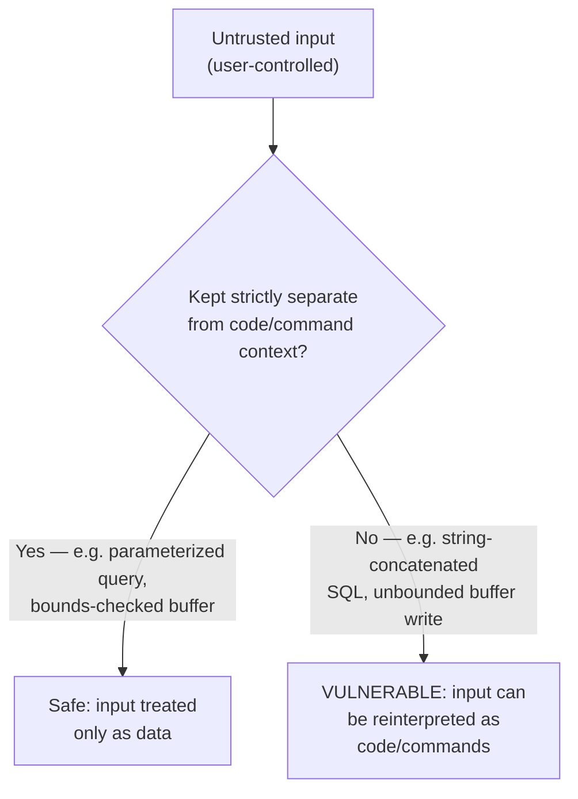

## Learning Objectives

- Explain the structural similarity between a stack buffer overflow (already covered) and a SQL injection vulnerability, in terms of a single unifying pattern.
- Trace a concrete SQL injection attack against an unparameterized query, and explain exactly why a parameterized query closes it.
- Classify a set of real vulnerability examples by which side of the "data vs. code" boundary they violate.
- Explain why the OWASP Top Ten exists and what kind of evidence it is based on, as distinct from a purely theoretical vulnerability taxonomy.
- Explain why this discipline treats memory-safety and injection vulnerabilities as one unified topic rather than two unrelated ones.

## Context & Motivation

`computer/c-and-assembly` already covered stack smashing and buffer overflows in detail: writing past the end of a stack-allocated buffer can overwrite a saved return address, hijacking a program's control flow. That concept was framed as a *memory* bug — a consequence of C's lack of automatic bounds checking. This concept revisits that exact vulnerability from a different angle, one this discipline is specifically positioned to draw out: a buffer overflow and a SQL injection, despite operating in completely different layers of a system (raw memory addresses versus a database query language), are the **exact same underlying mistake**, repeated in a different context. Seeing that pattern clearly is more valuable than memorizing either vulnerability in isolation, because it generalizes: the same mistake recurs again in this discipline's next concept (control-hijacking) and in a different guise in the concept after that (cross-site scripting) — a single unifying idea explaining vulnerability classes that, taught separately, can look like an arbitrary, unrelated list to memorize.

The unifying idea is this: **untrusted input is treated as though it could only ever be inert data, when the underlying system actually has some mechanism that can reinterpret part of that data as instructions or commands.** A stack buffer has no separate "code region" versus "data region" boundary enforced at the point where the overflow happens — writing far enough overwrites the return address, and the CPU's fetch-decode-execute cycle (already covered) will happily fetch and execute whatever bytes end up there, whether or not a programmer intended them as code. A SQL query built by string-concatenating untrusted input has an exactly analogous failure: the database engine's SQL parser cannot distinguish "data the application meant literally" from "additional SQL syntax the attacker snuck in," if that input was inserted into the query string before parsing rather than kept safely separate from it.

## Core Theory

### The unifying pattern: the data/code boundary

Every injection-class vulnerability, across every layer of computing this discipline has touched, follows the same shape:

1. A system accepts input that is supposed to be treated purely as *data*.
2. Somewhere downstream, that input is combined with a *command* or *code* context (a SQL query string, a shell command line, a stack frame's return-address slot, an HTML page rendered by a browser) in a way that does not cleanly separate "the parts the programmer wrote" from "the parts the attacker controls."
3. If the input contains characters or byte sequences that are meaningful in that downstream context (a SQL quote character, a shell metacharacter, a return address's specific bit pattern, an HTML tag), the attacker can use them to make the system interpret part of their "data" as additional commands.



### SQL injection, concretely

Consider an application that builds a database query by directly concatenating user input into a SQL string:

```text
query = "SELECT * FROM users WHERE username = '" + userInput + "' AND password = '" + passwordInput + "'"
```

If `userInput` is the literal string `admin' --`, the resulting query becomes:

```sql
SELECT * FROM users WHERE username = 'admin' --' AND password = '...'
```

In SQL, `--` starts a comment, so everything after it — including the entire password check — is discarded by the parser. The query effectively becomes `SELECT * FROM users WHERE username = 'admin'`, returning the admin row regardless of what password (if any) was supplied. The attacker never needed to know the admin's real password at all; they exploited the fact that their "data" (the username field) was concatenated directly into a command string before that string was parsed, letting them inject additional SQL syntax (the comment marker) that the database engine faithfully interpreted as part of the query.

### Why parameterized queries close this off structurally, not just by "escaping"

The robust fix is not to carefully escape special characters in user input (a fragile, error-prone approach that has repeatedly failed in practice due to missed edge cases and encoding subtleties) but to use a **parameterized query** (also called a prepared statement), which sends the query's fixed structure and the user-supplied values to the database as two entirely separate channels:

```text
query = "SELECT * FROM users WHERE username = ? AND password = ?"
parameters = [userInput, passwordInput]
```

The database engine parses the query structure *first*, with placeholder slots, and only afterward substitutes the parameter values directly as data, never as text that gets re-parsed as SQL syntax. An attacker's `admin' --` supplied as a parameter value is treated as a literal, five-character (plus quote and dash characters) username string to search for — it has no opportunity to be interpreted as SQL syntax at all, because the parsing step that would have interpreted syntax already happened before the parameter value was ever substituted in. This is structurally the same fix pattern as the memory-safety mitigations covered in the very next concept: enforce a hard boundary between data and code/command interpretation, rather than trying to sanitize data so thoroughly that it can never accidentally cross that boundary.

### The OWASP Top Ten: evidence-based, not purely theoretical

The **OWASP Top Ten** is a periodically updated, widely cited list of the most critical web application security risks, maintained by the Open Web Application Security Project — and its entries (injection, broken access control, and others) are not a theoretical taxonomy invented from first principles, but are compiled from real, aggregated vulnerability data contributed by security organizations and testing firms across the industry, alongside a community survey of practitioners. This evidence basis matters: it is why "injection" has remained a persistently high-ranked category across many revisions of the list — not because it is theoretically interesting, but because it keeps showing up, in practice, as one of the most common and damaging classes of vulnerability actually found in deployed systems, decades after the underlying pattern was first understood.

## Worked Examples

### Example 1: Side-by-side comparison of the buffer overflow and SQL injection patterns

```text
                        Buffer overflow            SQL injection
                        (c-and-assembly)           (this concept)
----------------------  -------------------------  -------------------------
"Data" context          Stack-allocated buffer      String-concatenated
                                                     query parameter
"Code/command" context  Saved return address /      SQL syntax parsed by
                        subsequent stack memory     the database engine
Attacker's technique    Write PAST the buffer's     Insert SQL-meaningful
                        bounds to overwrite the     characters (quotes,
                        return address              comment markers) into
                                                     the data
Structural fix          Bounds-checked writes;      Parameterized queries
                        stack canaries; W^X          (data and query
                        (next concept)              structure sent
                                                     separately)
```

### Example 2: A second SQL injection payload, exploiting a different SQL feature

```text
Vulnerable query: "SELECT * FROM products WHERE category = '" + userInput + "'"

Attacker input: ' UNION SELECT username, password, NULL FROM users --

Resulting query:
  SELECT * FROM products WHERE category = ''
  UNION SELECT username, password, NULL FROM users --'

The UNION clause combines the (empty) product results with an entirely
different table's data — usernames and passwords — returned to the
attacker as if they were product rows, because the database faithfully
executed exactly the SQL text it was given, with no way to distinguish
"the developer's intended query" from "additional SQL the attacker
appended via unescaped input."
```

### Example 3: Classifying vulnerabilities by the data/code boundary they violate

```text
Vulnerability                          Data/code boundary crossed
--------------------------------------  ---------------------------------------
Stack buffer overflow                   Buffer contents vs. saved return address
SQL injection                           Query parameter vs. SQL syntax
Command injection (e.g. an application  Filename argument vs. shell command
  building a shell command string           syntax (e.g. injecting ; rm -rf)
  from user input)
Cross-site scripting (next concept)     User-submitted content vs. HTML/
                                            JavaScript executed by a browser
```

Every row names a different downstream context, but the pattern — untrusted input, insufficiently separated from a context that can reinterpret it as instructions — recurs identically across all four, which is exactly the generalization this concept exists to draw out.

## Common Misconceptions & Pitfalls

- **"SQL injection and buffer overflows are unrelated vulnerability classes taught together only because they're both 'serious.'"** They share the exact same structural root cause — untrusted data insufficiently separated from a downstream code/command interpretation context — which is precisely why understanding one deeply makes the other far easier to recognize in an unfamiliar setting.
- **"Escaping special characters (like quotes) in user input is a sufficient defense against SQL injection."** Escaping is fragile and has repeatedly failed in practice due to encoding edge cases, alternate character representations, and simply-missed characters; parameterized queries are the robust fix because they enforce the data/code separation structurally, at the database engine level, rather than relying on the application getting every escaping rule exactly right.
- **"Injection vulnerabilities are only a concern for SQL databases."** The same pattern applies to shell commands (command injection), LDAP queries, XML parsers, and template engines — any context where untrusted input is combined with a command or markup language before that language is parsed is a candidate for the same class of attack.
- **"The OWASP Top Ten is a fixed, permanent ranking of vulnerability severity."** It is periodically revised based on newly aggregated real-world vulnerability data and practitioner surveys, and rankings do shift over time as some vulnerability classes become less common (due to better tooling and awareness) while others emerge or grow.
- **"Modern frameworks and ORMs have made SQL injection an obsolete, historical concern."** While frameworks that default to parameterized queries have substantially reduced the prevalence of this vulnerability, it remains common wherever raw string concatenation is used for convenience, for dynamic query construction, or in legacy code — injection has remained on the OWASP Top Ten across many revisions precisely because it keeps recurring in practice, not because it is a solved, historical problem.

## Summary

A stack buffer overflow and a SQL injection are, structurally, the same underlying mistake occurring in two different layers of a system: untrusted input treated as though it could only ever be inert data, when a downstream mechanism (the CPU's fetch-decode-execute cycle for the overflow; the database's SQL parser for injection) can reinterpret part of that input as code or commands. Parameterized queries close off SQL injection the same way bounds-checked memory operations close off buffer overflows: by enforcing a structural separation between data and code/command interpretation, rather than trying to sanitize data thoroughly enough to never cross that boundary — a fragile, historically unreliable approach. The OWASP Top Ten, an evidence-based ranking drawn from real, aggregated vulnerability data, has kept injection among its most critical categories across many revisions precisely because this pattern continues to recur in deployed systems. The next concept returns to the memory-safety side of this pattern specifically, covering the concrete defenses (stack canaries, non-executable memory, ASLR) that harden against the buffer-overflow-to-code-execution attack already introduced in `computer/c-and-assembly`.

## Documentation Links

- [OWASP Top Ten — Web Application Security Risks](https://owasp.org/www-project-top-ten/) — the evidence-based, periodically updated ranking of the most critical web application vulnerability classes, including injection.
- [MIT 6.858 — Computer Systems Security (OCW, Fall 2014)](https://ocw.mit.edu/courses/6-858-computer-systems-security-fall-2014/) — covers buffer overflows and control-hijacking attacks as its opening technical topic, directly building on this pattern.
