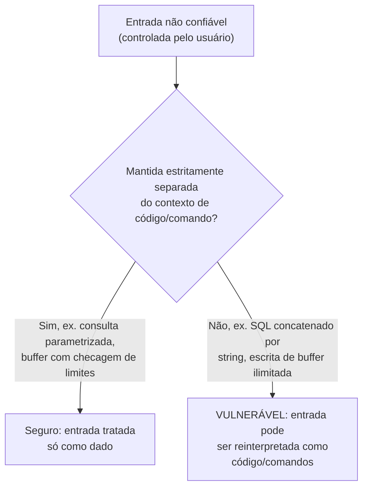

## Objetivos de Aprendizagem

- Explicar a similaridade estrutural entre um buffer overflow de pilha (já coberto) e uma vulnerabilidade de injeção SQL, em termos de um único padrão unificador.
- Rastrear um ataque de injeção SQL concreto contra uma consulta não parametrizada, e explicar exatamente por que uma consulta parametrizada o fecha.
- Classificar um conjunto de exemplos reais de vulnerabilidade por qual lado do limite "dado vs. código" eles violam.
- Explicar por que o OWASP Top Ten existe e em que tipo de evidência ele se baseia, como distinto de uma taxonomia de vulnerabilidade puramente teórica.
- Explicar por que esta disciplina trata vulnerabilidades de segurança de memória e de injeção como um tópico unificado em vez de dois não relacionados.

## Contexto e Motivação

`computer/c-and-assembly` já cobriu stack smashing e buffer overflows em detalhe: escrever além do fim de um buffer alocado na pilha pode sobrescrever um endereço de retorno salvo, sequestrando o fluxo de controle de um programa. Aquele conceito foi enquadrado como um bug de *memória*, uma consequência da falta de checagem automática de limites do C. Este conceito revisita essa exata vulnerabilidade de um ângulo diferente, um que esta disciplina está especificamente posicionada para destacar: um buffer overflow e uma injeção SQL, apesar de operarem em camadas completamente diferentes de um sistema (endereços de memória brutos versus uma linguagem de consulta de banco de dados), são o **exato mesmo erro subjacente**, repetido num contexto diferente. Ver esse padrão claramente é mais valioso do que memorizar qualquer uma das vulnerabilidades isoladamente, porque ele generaliza: o mesmo erro reocorre de novo no próximo conceito desta disciplina (sequestro de controle) e num disfarce diferente no conceito depois dele (cross-site scripting), uma única ideia unificadora explicando classes de vulnerabilidade que, ensinadas separadamente, podem parecer uma lista arbitrária e não relacionada para memorizar.

A ideia unificadora é esta: **entrada não confiável é tratada como se só pudesse jamais ser dado inerte, quando o sistema subjacente de fato tem algum mecanismo que consegue reinterpretar parte desse dado como instruções ou comandos.** Um buffer de pilha não tem nenhum limite separado de "região de código" versus "região de dado" imposto no ponto onde o transbordamento acontece, escrever longe o bastante sobrescreve o endereço de retorno, e o ciclo busca-decodifica-executa da CPU (já coberto) alegremente buscará e executará quaisquer bytes que acabem ali, independentemente de um programador tê-los pretendido como código. Uma consulta SQL construída por concatenação de string de entrada não confiável tem uma falha exatamente análoga: o parser SQL do motor de banco de dados não consegue distinguir "dado que a aplicação pretendeu literalmente" de "sintaxe SQL adicional que o atacante enfiou", se essa entrada foi inserida na string de consulta antes do parsing em vez de mantida com segurança separada dela.

## Teoria Central

### O padrão unificador: o limite dado/código

Toda vulnerabilidade da classe de injeção, por toda camada de computação que esta disciplina tocou, segue o mesmo formato:

1. Um sistema aceita entrada que supostamente deveria ser tratada puramente como *dado*.
2. Em algum lugar a jusante, essa entrada é combinada com um contexto de *comando* ou *código* (uma string de consulta SQL, uma linha de comando de shell, o slot de endereço-de-retorno de um quadro de pilha, uma página HTML renderizada por um navegador) de uma forma que não separa limpamente "as partes que o programador escreveu" de "as partes que o atacante controla".
3. Se a entrada contém caracteres ou sequências de bytes que são significativos naquele contexto a jusante (um caractere de aspas SQL, um metacaractere de shell, o padrão de bits específico de um endereço de retorno, uma tag HTML), o atacante pode usá-los para fazer o sistema interpretar parte do seu "dado" como comandos adicionais.



### Injeção SQL, concretamente

Considere uma aplicação que constrói uma consulta de banco de dados concatenando diretamente entrada de usuário numa string SQL:

```text
query = "SELECT * FROM users WHERE username = '" + userInput + "' AND password = '" + passwordInput + "'"
```

Se `userInput` é a string literal `admin' --`, a consulta resultante se torna:

```sql
SELECT * FROM users WHERE username = 'admin' --' AND password = '...'
```

Em SQL, `--` inicia um comentário, então tudo depois dele, incluindo a checagem inteira de senha, é descartado pelo parser. A consulta efetivamente se torna `SELECT * FROM users WHERE username = 'admin'`, retornando a linha do admin independentemente de qual senha (se alguma) foi fornecida. O atacante nunca precisou conhecer a senha real do admin de forma alguma; ele explorou o fato de que o seu "dado" (o campo de username) foi concatenado diretamente numa string de comando antes de essa string ser parseada, deixando-o injetar sintaxe SQL adicional (o marcador de comentário) que o motor de banco de dados fielmente interpretou como parte da consulta.

### Por que consultas parametrizadas fecham isto estruturalmente, não só por "escaping"

O conserto robusto não é cuidadosamente escapar caracteres especiais na entrada de usuário (uma abordagem frágil e propensa a erros que repetidamente falhou na prática devido a casos de borda perdidos e sutilezas de codificação) mas usar uma **consulta parametrizada** (também chamada de prepared statement), que envia a estrutura fixa da consulta e os valores fornecidos pelo usuário ao banco de dados como dois canais inteiramente separados:

```text
query = "SELECT * FROM users WHERE username = ? AND password = ?"
parameters = [userInput, passwordInput]
```

O motor de banco de dados parseia a estrutura da consulta *primeiro*, com slots de preenchimento, e só depois substitui os valores de parâmetro diretamente como dado, nunca como texto que é reparseado como sintaxe SQL. Um `admin' --` de um atacante fornecido como um valor de parâmetro é tratado como uma string de username literal de cinco caracteres (mais caracteres de aspas e traço) para procurar, ela não tem nenhuma oportunidade de ser interpretada como sintaxe SQL de forma alguma, porque o passo de parsing que teria interpretado a sintaxe já aconteceu antes de o valor de parâmetro jamais ser substituído. Este é estruturalmente o mesmo padrão de conserto que as mitigações de segurança de memória cobertas no próximo conceito: impor um limite rígido entre dado e interpretação de código/comando, em vez de tentar sanitizar o dado tão completamente que ele nunca possa acidentalmente cruzar esse limite.

### O OWASP Top Ten: baseado em evidência, não puramente teórico

O **OWASP Top Ten** é uma lista periodicamente atualizada e amplamente citada dos riscos de segurança de aplicação web mais críticos, mantida pelo Open Web Application Security Project, e as suas entradas (injeção, controle de acesso quebrado, e outras) não são uma taxonomia teórica inventada a partir de primeiros princípios, mas são compiladas de dados de vulnerabilidade reais e agregados contribuídos por organizações de segurança e firmas de teste por toda a indústria, junto a uma pesquisa comunitária de profissionais. Esta base de evidência importa: é por que "injeção" permaneceu uma categoria persistentemente bem classificada por muitas revisões da lista, não porque é teoricamente interessante, mas porque ela continua aparecendo, na prática, como uma das classes de vulnerabilidade mais comuns e danosas de fato encontradas em sistemas implantados, décadas depois de o padrão subjacente ser primeiro entendido.

## Exemplos Resolvidos

### Exemplo 1: Comparação lado a lado dos padrões de buffer overflow e injeção SQL

```text
                        Buffer overflow            Injeção SQL
                        (c-and-assembly)           (este conceito)
----------------------  -------------------------  -------------------------
Contexto de "dado"      Buffer alocado na pilha    Parâmetro de consulta
                                                     concatenado por string
Contexto de "código/    Endereço de retorno salvo /  Sintaxe SQL parseada
comando"                memória de pilha seguinte    pelo motor de banco
Técnica do atacante     Escrever ALÉM dos limites   Inserir caracteres
                        do buffer para sobrescrever  significativos em SQL
                        o endereço de retorno        (aspas, marcadores de
                                                     comentário) no dado
Conserto estrutural     Escritas com checagem de    Consultas parametrizadas
                        limites; canários de pilha;  (dado e estrutura da
                        W^X (próximo conceito)       consulta enviados
                                                     separadamente)
```

### Exemplo 2: Um segundo payload de injeção SQL, explorando um recurso SQL diferente

```text
Consulta vulnerável: "SELECT * FROM products WHERE category = '" + userInput + "'"

Entrada do atacante: ' UNION SELECT username, password, NULL FROM users --

Consulta resultante:
  SELECT * FROM products WHERE category = ''
  UNION SELECT username, password, NULL FROM users --'

A cláusula UNION combina os resultados (vazios) de produto com os dados de uma
tabela inteiramente diferente, usernames e senhas, retornados ao
atacante como se fossem linhas de produto, porque o banco de dados fielmente
executou exatamente o texto SQL que recebeu, sem nenhuma forma de distinguir
"a consulta pretendida pelo desenvolvedor" de "SQL adicional que o atacante
anexou via entrada não escapada".
```

### Exemplo 3: Classificando vulnerabilidades pelo limite dado/código que violam

```text
Vulnerabilidade                        Limite dado/código cruzado
--------------------------------------  ---------------------------------------
Buffer overflow de pilha                Conteúdo do buffer vs. endereço de retorno salvo
Injeção SQL                             Parâmetro de consulta vs. sintaxe SQL
Injeção de comando (ex. uma aplicação   Argumento de nome de arquivo vs. sintaxe
  construindo uma string de comando        de comando de shell (ex. injetar ; rm -rf)
  de shell a partir de entrada de usuário)
Cross-site scripting (próximo conceito) Conteúdo submetido pelo usuário vs. HTML/
                                            JavaScript executado por um navegador
```

Toda linha nomeia um contexto a jusante diferente, mas o padrão, entrada não confiável, insuficientemente separada de um contexto que consegue reinterpretá-la como instruções, reocorre identicamente por todos os quatro, que é exatamente a generalização que este conceito existe para destacar.

## Equívocos Comuns e Armadilhas

- **"Injeção SQL e buffer overflows são classes de vulnerabilidade não relacionadas ensinadas juntas só porque ambas são 'sérias'."** Elas compartilham a exata mesma causa raiz estrutural, dado não confiável insuficientemente separado de um contexto de interpretação de código/comando a jusante, que é precisamente por que entender uma profundamente torna a outra muito mais fácil de reconhecer num cenário desconhecido.
- **"Escapar caracteres especiais (como aspas) na entrada de usuário é uma defesa suficiente contra injeção SQL."** O escaping é frágil e repetidamente falhou na prática devido a casos de borda de codificação, representações alternativas de caracteres, e caracteres simplesmente perdidos; consultas parametrizadas são o conserto robusto porque impõem a separação dado/código estruturalmente, no nível do motor de banco de dados, em vez de depender de a aplicação acertar toda regra de escaping exatamente.
- **"Vulnerabilidades de injeção só são uma preocupação para bancos de dados SQL."** O mesmo padrão se aplica a comandos de shell (injeção de comando), consultas LDAP, parsers XML e motores de template, qualquer contexto onde entrada não confiável é combinada com uma linguagem de comando ou marcação antes de essa linguagem ser parseada é um candidato para a mesma classe de ataque.
- **"O OWASP Top Ten é uma classificação fixa e permanente de severidade de vulnerabilidade."** Ele é periodicamente revisado com base em dados de vulnerabilidade do mundo real recém-agregados e pesquisas de profissionais, e as classificações de fato mudam ao longo do tempo à medida que algumas classes de vulnerabilidade se tornam menos comuns (devido a melhor ferramental e conscientização) enquanto outras emergem ou crescem.
- **"Frameworks e ORMs modernos tornaram a injeção SQL uma preocupação obsoleta e histórica."** Embora frameworks que usam consultas parametrizadas por padrão tenham reduzido substancialmente a prevalência desta vulnerabilidade, ela permanece comum sempre que concatenação de string crua é usada por conveniência, para construção dinâmica de consulta, ou em código legado, a injeção permaneceu no OWASP Top Ten por muitas revisões precisamente porque ela continua reocorrendo na prática, não porque é um problema resolvido e histórico.

## Resumo

Um buffer overflow de pilha e uma injeção SQL são, estruturalmente, o mesmo erro subjacente ocorrendo em duas camadas diferentes de um sistema: entrada não confiável tratada como se só pudesse jamais ser dado inerte, quando um mecanismo a jusante (o ciclo busca-decodifica-executa da CPU para o transbordamento; o parser SQL do banco para a injeção) consegue reinterpretar parte dessa entrada como código ou comandos. Consultas parametrizadas fecham a injeção SQL da mesma forma que operações de memória com checagem de limites fecham buffer overflows: impondo uma separação estrutural entre dado e interpretação de código/comando, em vez de tentar sanitizar o dado completamente o bastante para nunca cruzar esse limite, uma abordagem frágil e historicamente não confiável. O OWASP Top Ten, uma classificação baseada em evidência tirada de dados de vulnerabilidade reais e agregados, manteve a injeção entre as suas categorias mais críticas por muitas revisões precisamente porque este padrão continua reocorrendo em sistemas implantados. O próximo conceito volta ao lado da segurança de memória deste padrão especificamente, cobrindo as defesas concretas (canários de pilha, memória não executável, ASLR) que endurecem contra o ataque de buffer-overflow-para-execução-de-código já introduzido em `computer/c-and-assembly`.

## Documentation Links

- [OWASP Top Ten — Web Application Security Risks](https://owasp.org/www-project-top-ten/): a classificação baseada em evidência e periodicamente atualizada das classes de vulnerabilidade de aplicação web mais críticas, incluindo injeção.
- [MIT 6.858 — Computer Systems Security (OCW, Fall 2014)](https://ocw.mit.edu/courses/6-858-computer-systems-security-fall-2014/): cobre buffer overflows e ataques de sequestro de controle como o seu tópico técnico de abertura, construindo diretamente sobre este padrão.
