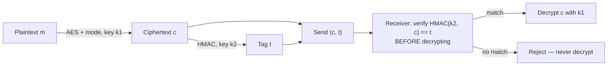

## Learning Objectives

- Explain precisely why encryption alone (confidentiality) does not imply integrity, with a concrete example of a tampering attack against an unauthenticated ciphertext.
- Define a Message Authentication Code (MAC) and explain what guarantee it provides that plain hashing does not (specifically, that it requires a shared secret key).
- Describe HMAC's construction at a high level and explain why it is built from a hash function rather than being a hash function used naively.
- Define authenticated encryption (AEAD) and explain why combining encryption and a MAC as two separate steps is error-prone enough that a single, unified primitive is preferred in practice.
- Trace the "encrypt-then-MAC" composition order and explain why it is the safe default among the three possible orderings.

## Context & Motivation

The previous two concepts covered encryption (AES with a mode of operation) and cryptographic hashing separately, and it would be reasonable to assume that combining them — encrypt a message, and separately compute a hash of it — would be enough to guarantee both confidentiality and integrity simultaneously. It is not, and understanding exactly why not is one of the most practically important lessons in applied cryptography: a plain hash, computed and sent alongside a ciphertext, provides **no** integrity guarantee at all against an active attacker, because the attacker can simply recompute a new, matching hash for whatever tampered ciphertext they produce — nothing about a plain hash function depends on a secret the attacker doesn't have.

This is exactly the gap the CIA triad's first concept flagged as a possible tension: an encryption scheme (serving confidentiality) says nothing on its own about integrity, and the two goals need genuinely separate mechanisms unless a scheme is explicitly designed to provide both together. A **Message Authentication Code (MAC)** closes that gap by requiring a shared secret key to both produce and verify the authentication tag, so that only someone who holds that key can produce a tag that will verify correctly — exactly the missing ingredient a plain hash lacks. **Authenticated encryption (AEAD)** then goes one step further, bundling confidentiality and integrity into a single primitive specifically because, historically, developers combining encryption and a MAC as two separate manual steps have gotten the composition wrong often enough that unifying the two into one foolproof API became the safer engineering default.

## Core Theory

### Why a plain hash provides no integrity against an active attacker

Suppose a system sends a ciphertext `c = AES_encrypt(k, m)` alongside `H(c)`, a plain SHA-256 hash of the ciphertext, intending the hash to let the receiver detect tampering. An attacker who intercepts the message in transit can simply modify `c` into some `c'` of their choosing, recompute `H(c')` (a plain hash requires no secret to compute — anyone can run SHA-256 on any input), and forward the tampered pair `(c', H(c'))` — which will verify successfully, because the hash was never tied to any secret the attacker lacks. The receiver has no way to distinguish "this hash matches because the message is authentic" from "this hash matches because the attacker recomputed it after tampering." This is precisely why integrity against an *active* adversary (one who can modify messages in transit, not just observe them) requires a mechanism built around a secret the attacker does not have — which a plain hash function, by design, never involves.

### MACs: a hash function plus a shared secret key

A **Message Authentication Code** is a function `MAC(k, m)` that takes a secret key `k` (shared in advance between sender and receiver, exactly like a symmetric encryption key) and a message `m`, and produces a short tag `t`. The receiver, who also holds `k`, recomputes `MAC(k, m)` on the received message and checks it against the received tag `t` — a match gives strong assurance both that the message came from someone who holds `k` (a form of authentication) and that it was not modified in transit (integrity), because an attacker without `k` cannot produce a tag that will verify correctly for a message of their choosing, no matter how the message itself was modified.

**HMAC** is the standard, widely-used way to build a MAC from a cryptographic hash function like SHA-256, rather than inventing a new primitive from scratch. It is deliberately *not* as simple as `MAC(k, m) = H(k || m)` (hash of the key concatenated with the message) — that naive construction has known structural weaknesses against certain hash function internals (a "length-extension" attack, where an attacker who knows `H(k || m)` can compute `H(k || m || extra)` for an attacker-chosen `extra`, without knowing `k` at all, for hash functions built on the Merkle-Damgård structure that SHA-256 uses). HMAC instead nests the hash function in a specific, carefully analyzed two-layer construction — `HMAC(k, m) = H((k ⊕ opad) || H((k ⊕ ipad) || m))`, using two different fixed padding constants (`ipad`, `opad`) — that has a full security proof reducing HMAC's security directly to the underlying hash function's properties, closing off the length-extension weakness by construction rather than by convention.

### Authenticated encryption: unifying confidentiality and integrity

Given AES-with-a-mode (confidentiality) and HMAC (integrity), a natural approach is to compose them manually: encrypt the message, then separately compute a MAC. This works, but only if done in exactly the right order and exactly the right way — and history shows that developers get this wrong often enough (using the MAC on the plaintext instead of the ciphertext, reusing the same key for both encryption and the MAC, forgetting to verify the MAC before decrypting) that modern cryptographic libraries strongly prefer **AEAD (Authenticated Encryption with Associated Data)** modes, such as AES-GCM, which combine both operations into a single, unified primitive with one key and one call, engineered so that the easy, natural way to use the API is also the safe way. AEAD additionally supports "associated data" — data (like a message header) that is authenticated (protected against tampering) but not encrypted (sent in the clear), useful when routing or protocol metadata needs to be visible but still tamper-evident.

### The three composition orders, and why "encrypt-then-MAC" is the safe default

When encryption and a MAC are composed manually (rather than using a unified AEAD mode), there are three possible orderings, and they are not equally safe:

| Order | Description | Safety |
|---|---|---|
| MAC-then-encrypt | Compute a MAC of the plaintext, then encrypt (plaintext + MAC) together | Can be unsafe — the receiver must decrypt before verifying, so a malformed ciphertext gets fully decrypted before the failure is detected, and cipher-specific attacks (like padding-oracle attacks against certain block-cipher modes) can exploit exactly that ordering. |
| Encrypt-and-MAC | Encrypt the plaintext, and separately compute a MAC of the *plaintext* (not the ciphertext), send both | Can leak information — the MAC of the plaintext might reveal something about the plaintext independent of the encryption, and some MAC constructions are not designed to be safe as a standalone leak-free function of secret data. |
| Encrypt-then-MAC | Encrypt the plaintext to get a ciphertext, then compute a MAC of the *ciphertext* | The safe default — the receiver can verify the MAC on the ciphertext *before* attempting decryption at all, rejecting tampered data immediately without ever running the decryption algorithm on attacker-controlled input, which closes off an entire class of attacks that depend on observing how decryption fails. |



## Worked Examples

### Example 1: Demonstrating the plain-hash tampering attack concretely

```text
Sender sends:     c = AES_CTR_encrypt(k, "Transfer $10")
                  h = SHA256(c)          -- a PLAIN hash, no secret involved

Attacker intercepts, flips specific ciphertext bits (CTR mode's XOR
structure means flipping ciphertext bits flips the SAME bit positions in
the decrypted plaintext — a real, exploitable property of stream-cipher-
like modes when used without authentication), producing a tampered c'
that will decrypt to "Transfer $90" instead.

Attacker recomputes h' = SHA256(c')     -- trivial; SHA-256 needs no secret
Attacker forwards (c', h')

Receiver checks SHA256(c') == h'  →  MATCHES (attacker recomputed it correctly)
Receiver decrypts c'  →  "Transfer $90"  — tampering succeeded completely,
                                            undetected.
```

This example makes the abstract claim from Core Theory concrete: the plain hash provided the *appearance* of an integrity check while providing none of the actual guarantee, because nothing in its computation required a secret the attacker lacked.

### Example 2: The same scenario, fixed with encrypt-then-MAC

```text
Sender sends:     c = AES_CTR_encrypt(k1, "Transfer $10")
                  t = HMAC(k2, c)         -- REQUIRES the secret key k2

Attacker intercepts, flips ciphertext bits exactly as before, producing c'.
Attacker cannot compute a valid t' = HMAC(k2, c') without knowing k2.
Attacker forwards (c', t) [the OLD tag — the only one available] or
  guesses at a new tag (computationally infeasible to guess correctly).

Receiver checks HMAC(k2, c') == t  →  FAILS (t was computed for the
                                        original c, not the tampered c')
Receiver REJECTS the message without ever decrypting c' — the tampering
attempt is detected and stopped before it can do any damage.
```

The only difference between this example and the previous one is the presence of a secret-key-dependent tag instead of a plain hash — and that single difference is exactly what turns an undetectable tampering attack into a detected, rejected one.

### Example 3: Why encrypt-then-MAC beats MAC-then-encrypt against a padding-oracle-style attack

```text
MAC-then-encrypt: receiver must decrypt FIRST to even access the MAC
  (which was encrypted along with the plaintext), then check it.
  If the block-cipher mode's decryption process behaves differently
  (e.g. a different error, or a different timing) for "valid padding,
  invalid MAC" versus "invalid padding" versus "everything valid", an
  attacker can sometimes exploit those observable differences to learn
  information about the plaintext one bit at a time, purely by sending
  many carefully crafted ciphertexts and observing which kind of
  failure comes back — a real, historically exploited class of attacks
  broadly known as padding-oracle attacks.

Encrypt-then-MAC: the MAC is checked FIRST, against the ciphertext
  directly, before decryption is ever attempted. A tampered ciphertext
  is rejected at the MAC-verification step, and decryption — with all
  its potential to leak information through timing or error behavior —
  is never even invoked on attacker-controlled data.
```

This is precisely why encrypt-then-MAC is recommended as the safe default when composing primitives manually, and why AEAD modes like AES-GCM are built internally to have exactly this "verify before you trust the decrypted output" property baked into the single unified operation.

## Common Misconceptions & Pitfalls

- **"Encrypting a message automatically protects its integrity too."** Encryption and integrity are separate goals requiring separate mechanisms unless a scheme is explicitly designed (as AEAD is) to provide both — an attacker who cannot read an encrypted message can often still tamper with it in predictable, sometimes exploitable ways, as Example 1 shows.
- **"A plain hash sent alongside a message is a valid integrity check."** A plain hash requires no secret to compute, so an active attacker can simply recompute a new, matching hash for any tampered message they produce — real integrity against an active attacker requires a MAC (or a digital signature, covered later), not a plain hash.
- **"HMAC is just SHA-256 applied to the key and message concatenated together."** That naive construction is vulnerable to length-extension attacks against Merkle-Damgård hash functions like SHA-256; HMAC's specific two-layer nested construction with distinct padding constants exists precisely to close off that weakness, with a formal proof reducing its security to the hash function's properties.
- **"Any order of composing encryption and a MAC is equally safe, as long as both are present."** The three orderings are not equally safe — encrypt-then-MAC is the recommended default specifically because it lets tampered ciphertexts be rejected before decryption is ever attempted, closing off an entire class of padding-oracle-style attacks that MAC-then-encrypt remains exposed to.
- **"Modern systems should compose their own encrypt-then-MAC scheme from separate AES and HMAC primitives."** While theoretically sound if done exactly correctly, manually composing separate primitives is exactly the error-prone pattern that motivated unified AEAD modes (like AES-GCM) in the first place — using a standard AEAD mode, rather than hand-composing one, is the safer engineering default in essentially all real systems today.

## Summary

Encryption alone provides confidentiality but no integrity guarantee, and a plain hash sent alongside a ciphertext provides no real protection against an active attacker either, since anyone can recompute a plain hash without needing any secret. A Message Authentication Code closes this gap by requiring a shared secret key to produce a verifiable tag, and HMAC is the standard, formally-analyzed way to build one from a cryptographic hash function like SHA-256, deliberately avoiding the length-extension weakness a naive hash-of-key-and-message construction would have. Composing encryption and a MAC manually is safe only in the right order — encrypt-then-MAC, so tampered ciphertexts are rejected before decryption is ever attempted — but real systems today mostly prefer unified AEAD modes (like AES-GCM) that bundle both guarantees into a single primitive precisely because manual composition has a long history of being implemented incorrectly. With confidentiality (block ciphers), integrity (hashing and MACs), and their combination (AEAD) now covered, the next concept turns to an entirely different branch of cryptography — public-key cryptography — starting from the number-theoretic foundation, already covered in discrete mathematics, that makes it possible.

## Documentation Links

- [Stanford CS255 — Introduction to Cryptography, Course Syllabus](https://cs255.stanford.edu/syllabus.html) — covers message integrity (CBC-MAC, PMAC), collision-resistant hashing, and authenticated encryption in exactly this sequence.
- [Boneh & Shoup — A Graduate Course in Applied Cryptography](https://toc.cryptobook.us/) — free textbook with a full, formal treatment of MACs, HMAC's construction and security proof, and AEAD.
