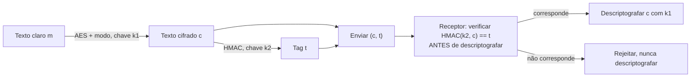

## Objetivos de Aprendizagem

- Explicar precisamente por que a criptografia sozinha (confidencialidade) não implica integridade, com um exemplo concreto de um ataque de adulteração contra um texto cifrado não autenticado.
- Definir um Código de Autenticação de Mensagem (MAC) e explicar que garantia ele fornece que o hashing simples não fornece (especificamente, que ele exige uma chave secreta compartilhada).
- Descrever a construção do HMAC num alto nível e explicar por que ele é construído a partir de uma função de hash em vez de ser uma função de hash usada ingenuamente.
- Definir criptografia autenticada (AEAD) e explicar por que combinar criptografia e um MAC como dois passos separados é propenso a erros o bastante para que um único primitivo unificado seja preferido na prática.
- Rastrear a ordem de composição "encrypt-then-MAC" e explicar por que ela é o padrão seguro entre as três ordenações possíveis.

## Contexto e Motivação

Os dois conceitos anteriores cobriram criptografia (AES com um modo de operação) e hashing criptográfico separadamente, e seria razoável assumir que combiná-los, criptografar uma mensagem e separadamente computar um hash dela, seria o bastante para garantir tanto confidencialidade quanto integridade simultaneamente. Não é, e entender exatamente por que não é uma das lições mais praticamente importantes da criptografia aplicada: um hash simples, computado e enviado junto a um texto cifrado, fornece **nenhuma** garantia de integridade de forma alguma contra um atacante ativo, porque o atacante pode simplesmente recomputar um hash novo e correspondente para qualquer texto cifrado adulterado que produza, nada sobre uma função de hash simples depende de um segredo que o atacante não tem.

Esta é exatamente a lacuna que o primeiro conceito da tríade CIA sinalizou como uma possível tensão: um esquema de criptografia (servindo a confidencialidade) nada diz por si só sobre integridade, e os dois objetivos precisam de mecanismos genuinamente separados a menos que um esquema seja explicitamente projetado para fornecer ambos juntos. Um **Código de Autenticação de Mensagem (MAC)** fecha essa lacuna exigindo uma chave secreta compartilhada para tanto produzir quanto verificar a tag de autenticação, de forma que só alguém que guarda essa chave consegue produzir uma tag que verificará corretamente, exatamente o ingrediente faltante que um hash simples não tem. A **criptografia autenticada (AEAD)** então vai um passo além, agrupando confidencialidade e integridade num único primitivo especificamente porque, historicamente, desenvolvedores combinando criptografia e um MAC como dois passos manuais separados erraram a composição frequentemente o bastante para que unificar os dois numa API à prova de erros se tornasse o padrão de engenharia mais seguro.

## Teoria Central

### Por que um hash simples não fornece integridade contra um atacante ativo

Suponha que um sistema envia um texto cifrado `c = AES_encrypt(k, m)` junto a `H(c)`, um hash SHA-256 simples do texto cifrado, pretendendo que o hash deixe o receptor detectar adulteração. Um atacante que intercepta a mensagem em trânsito pode simplesmente modificar `c` em algum `c'` da sua escolha, recomputar `H(c')` (um hash simples não exige nenhum segredo para computar, qualquer um pode rodar SHA-256 sobre qualquer entrada), e encaminhar o par adulterado `(c', H(c'))`, que verificará com sucesso, porque o hash nunca foi amarrado a nenhum segredo que o atacante não tem. O receptor não tem como distinguir "este hash corresponde porque a mensagem é autêntica" de "este hash corresponde porque o atacante o recomputou depois de adulterar". É precisamente por isso que a integridade contra um adversário *ativo* (um que consegue modificar mensagens em trânsito, não só observá-las) exige um mecanismo construído em torno de um segredo que o atacante não tem, que uma função de hash simples, por design, nunca envolve.

### MACs: uma função de hash mais uma chave secreta compartilhada

Um **Código de Autenticação de Mensagem** é uma função `MAC(k, m)` que recebe uma chave secreta `k` (compartilhada de antemão entre remetente e receptor, exatamente como uma chave de criptografia simétrica) e uma mensagem `m`, e produz uma tag curta `t`. O receptor, que também guarda `k`, recomputa `MAC(k, m)` sobre a mensagem recebida e a checa contra a tag recebida `t`, uma correspondência dá forte garantia tanto de que a mensagem veio de alguém que guarda `k` (uma forma de autenticação) quanto de que ela não foi modificada em trânsito (integridade), porque um atacante sem `k` não consegue produzir uma tag que verificará corretamente para uma mensagem da sua escolha, não importa como a própria mensagem foi modificada.

**HMAC** é a forma padrão e amplamente usada de construir um MAC a partir de uma função de hash criptográfica como SHA-256, em vez de inventar um primitivo novo do zero. Ele é deliberadamente *não* tão simples quanto `MAC(k, m) = H(k || m)` (hash da chave concatenada com a mensagem), essa construção ingênua tem fraquezas estruturais conhecidas contra certos internos de função de hash (um ataque de "extensão de comprimento", onde um atacante que conhece `H(k || m)` consegue computar `H(k || m || extra)` para um `extra` escolhido pelo atacante, sem conhecer `k` de forma alguma, para funções de hash construídas sobre a estrutura Merkle-Damgård que o SHA-256 usa). O HMAC em vez disso aninha a função de hash numa construção específica e cuidadosamente analisada de duas camadas, `HMAC(k, m) = H((k ⊕ opad) || H((k ⊕ ipad) || m))`, usando duas constantes de preenchimento fixas diferentes (`ipad`, `opad`), que tem uma prova de segurança completa reduzindo a segurança do HMAC diretamente às propriedades da função de hash subjacente, fechando a fraqueza de extensão de comprimento por construção em vez de por convenção.

### Criptografia autenticada: unificando confidencialidade e integridade

Dados AES-com-um-modo (confidencialidade) e HMAC (integridade), uma abordagem natural é compô-los manualmente: criptografar a mensagem, depois separadamente computar um MAC. Isto funciona, mas só se feito em exatamente a ordem certa e exatamente da forma certa, e a história mostra que desenvolvedores erram isto frequentemente o bastante (usar o MAC sobre o texto claro em vez do texto cifrado, reusar a mesma chave para tanto a criptografia quanto o MAC, esquecer de verificar o MAC antes de descriptografar) que bibliotecas criptográficas modernas preferem fortemente modos **AEAD (Authenticated Encryption with Associated Data)**, como AES-GCM, que combinam ambas as operações num único primitivo unificado com uma chave e uma chamada, engenheirado de forma que a forma fácil e natural de usar a API seja também a forma segura. O AEAD adicionalmente suporta "dados associados", dados (como um cabeçalho de mensagem) que são autenticados (protegidos contra adulteração) mas não criptografados (enviados em claro), úteis quando metadados de roteamento ou protocolo precisam ser visíveis mas ainda à prova de adulteração.

### As três ordens de composição, e por que "encrypt-then-MAC" é o padrão seguro

Quando criptografia e um MAC são compostos manualmente (em vez de usar um modo AEAD unificado), há três ordenações possíveis, e elas não são igualmente seguras:

| Ordem | Descrição | Segurança |
|---|---|---|
| MAC-then-encrypt | Computar um MAC do texto claro, depois criptografar (texto claro + MAC) juntos | Pode ser inseguro, o receptor tem de descriptografar antes de verificar, então um texto cifrado malformado é totalmente descriptografado antes de a falha ser detectada, e ataques específicos de cifra (como ataques de oráculo de preenchimento contra certos modos de cifra de bloco) podem explorar exatamente essa ordenação. |
| Encrypt-and-MAC | Criptografar o texto claro, e separadamente computar um MAC do *texto claro* (não do texto cifrado), enviar ambos | Pode vazar informação, o MAC do texto claro pode revelar algo sobre o texto claro independentemente da criptografia, e algumas construções de MAC não são projetadas para ser seguras como uma função autônoma sem vazamento de dados secretos. |
| Encrypt-then-MAC | Criptografar o texto claro para obter um texto cifrado, depois computar um MAC do *texto cifrado* | O padrão seguro, o receptor consegue verificar o MAC sobre o texto cifrado *antes* de tentar a descriptografia de todo, rejeitando dados adulterados imediatamente sem jamais rodar o algoritmo de descriptografia sobre entrada controlada pelo atacante, o que fecha uma classe inteira de ataques que dependem de observar como a descriptografia falha. |



## Exemplos Resolvidos

### Exemplo 1: Demonstrando o ataque de adulteração com hash simples concretamente

```text
Remetente envia:  c = AES_CTR_encrypt(k, "Transferir $10")
                  h = SHA256(c)          -- um hash SIMPLES, nenhum segredo envolvido

Atacante intercepta, inverte bits específicos do texto cifrado (a estrutura
de XOR do modo CTR significa que inverter bits do texto cifrado inverte as MESMAS
posições de bit no texto claro descriptografado, uma propriedade real e explorável
de modos parecidos com cifra de fluxo quando usados sem autenticação), produzindo
um c' adulterado que descriptografará para "Transferir $90" em vez disso.

Atacante recomputa h' = SHA256(c')     -- trivial; SHA-256 não precisa de segredo
Atacante encaminha (c', h')

Receptor checa SHA256(c') == h'  →  CORRESPONDE (o atacante o recomputou corretamente)
Receptor descriptografa c'  →  "Transferir $90"  — a adulteração teve sucesso completo,
                                                    não detectada.
```

Este exemplo torna a afirmação abstrata da Teoria Central concreta: o hash simples forneceu a *aparência* de uma checagem de integridade enquanto não fornecia nenhuma da garantia de fato, porque nada na sua computação exigiu um segredo que o atacante não tinha.

### Exemplo 2: O mesmo cenário, consertado com encrypt-then-MAC

```text
Remetente envia:  c = AES_CTR_encrypt(k1, "Transferir $10")
                  t = HMAC(k2, c)         -- EXIGE a chave secreta k2

Atacante intercepta, inverte bits do texto cifrado exatamente como antes, produzindo c'.
Atacante não consegue computar um t' = HMAC(k2, c') válido sem conhecer k2.
Atacante encaminha (c', t) [a tag ANTIGA, a única disponível] ou
  adivinha uma tag nova (computacionalmente inviável de adivinhar corretamente).

Receptor checa HMAC(k2, c') == t  →  FALHA (t foi computado para o
                                        c original, não o c' adulterado)
Receptor REJEITA a mensagem sem jamais descriptografar c', a tentativa de
adulteração é detectada e parada antes de poder fazer qualquer dano.
```

A única diferença entre este exemplo e o anterior é a presença de uma tag dependente de chave secreta em vez de um hash simples, e essa única diferença é exatamente o que transforma um ataque de adulteração indetectável num detectado e rejeitado.

### Exemplo 3: Por que encrypt-then-MAC vence MAC-then-encrypt contra um ataque de estilo oráculo de preenchimento

```text
MAC-then-encrypt: o receptor tem de descriptografar PRIMEIRO para sequer acessar o MAC
  (que foi criptografado junto ao texto claro), depois checá-lo.
  Se o processo de descriptografia do modo de cifra de bloco se comporta diferente
  (ex. um erro diferente, ou um tempo diferente) para "preenchimento válido,
  MAC inválido" versus "preenchimento inválido" versus "tudo válido", um
  atacante pode às vezes explorar essas diferenças observáveis para aprender
  informação sobre o texto claro um bit por vez, puramente enviando
  muitos textos cifrados cuidadosamente elaborados e observando que tipo de
  falha volta, uma classe real e historicamente explorada de ataques
  amplamente conhecida como ataques de oráculo de preenchimento.

Encrypt-then-MAC: o MAC é checado PRIMEIRO, contra o texto cifrado
  diretamente, antes de a descriptografia ser jamais tentada. Um texto cifrado adulterado
  é rejeitado no passo de verificação de MAC, e a descriptografia, com todo
  o seu potencial de vazar informação por meio de comportamento de tempo ou erro,
  nunca é sequer invocada sobre dados controlados pelo atacante.
```

Isto é precisamente por que encrypt-then-MAC é recomendado como o padrão seguro ao compor primitivos manualmente, e por que modos AEAD como AES-GCM são construídos internamente para ter exatamente esta propriedade de "verificar antes de confiar na saída descriptografada" assada na única operação unificada.

## Equívocos Comuns e Armadilhas

- **"Criptografar uma mensagem automaticamente protege a sua integridade também."** Criptografia e integridade são objetivos separados exigindo mecanismos separados a menos que um esquema seja explicitamente projetado (como o AEAD é) para fornecer ambos, um atacante que não consegue ler uma mensagem criptografada frequentemente ainda consegue adulterá-la de formas previsíveis e às vezes exploráveis, como o Exemplo 1 mostra.
- **"Um hash simples enviado junto a uma mensagem é uma checagem de integridade válida."** Um hash simples não exige nenhum segredo para computar, então um atacante ativo pode simplesmente recomputar um hash novo e correspondente para qualquer mensagem adulterada que produza, a integridade real contra um atacante ativo exige um MAC (ou uma assinatura digital, coberta depois), não um hash simples.
- **"HMAC é só SHA-256 aplicado à chave e mensagem concatenadas juntas."** Essa construção ingênua é vulnerável a ataques de extensão de comprimento contra funções de hash Merkle-Damgård como SHA-256; a construção aninhada específica de duas camadas do HMAC com constantes de preenchimento distintas existe precisamente para fechar essa fraqueza, com uma prova formal reduzindo a sua segurança às propriedades da função de hash.
- **"Qualquer ordem de compor criptografia e um MAC é igualmente segura, desde que ambos estejam presentes."** As três ordenações não são igualmente seguras, encrypt-then-MAC é o padrão recomendado especificamente porque deixa textos cifrados adulterados serem rejeitados antes de a descriptografia ser jamais tentada, fechando uma classe inteira de ataques de estilo oráculo de preenchimento aos quais MAC-then-encrypt permanece exposto.
- **"Sistemas modernos deveriam compor o seu próprio esquema encrypt-then-MAC a partir de primitivos AES e HMAC separados."** Embora teoricamente sólido se feito exatamente correto, compor manualmente primitivos separados é exatamente o padrão propenso a erros que motivou modos AEAD unificados (como AES-GCM) em primeiro lugar, usar um modo AEAD padrão, em vez de compor um à mão, é o padrão de engenharia mais seguro em essencialmente todos os sistemas reais hoje.

## Resumo

A criptografia sozinha fornece confidencialidade mas nenhuma garantia de integridade, e um hash simples enviado junto a um texto cifrado também não fornece nenhuma proteção real contra um atacante ativo, já que qualquer um pode recomputar um hash simples sem precisar de nenhum segredo. Um Código de Autenticação de Mensagem fecha essa lacuna exigindo uma chave secreta compartilhada para produzir uma tag verificável, e o HMAC é a forma padrão e formalmente analisada de construir um a partir de uma função de hash criptográfica como SHA-256, deliberadamente evitando a fraqueza de extensão de comprimento que uma construção ingênua de hash-de-chave-e-mensagem teria. Compor criptografia e um MAC manualmente é seguro só na ordem certa, encrypt-then-MAC, para que textos cifrados adulterados sejam rejeitados antes de a descriptografia ser jamais tentada, mas sistemas reais hoje em sua maioria preferem modos AEAD unificados (como AES-GCM) que agrupam ambas as garantias num único primitivo precisamente porque a composição manual tem uma longa história de ser implementada incorretamente. Com confidencialidade (cifras de bloco), integridade (hashing e MACs), e a sua combinação (AEAD) agora cobertas, o próximo conceito volta-se a um ramo inteiramente diferente da criptografia, a criptografia de chave pública, começando da fundação teórico-numérica, já coberta em matemática discreta, que a torna possível.

## Documentation Links

- [Stanford CS255 — Introduction to Cryptography, Course Syllabus](https://cs255.stanford.edu/syllabus.html): cobre integridade de mensagem (CBC-MAC, PMAC), hashing resistente a colisão e criptografia autenticada exatamente nesta sequência.
- [Boneh & Shoup — A Graduate Course in Applied Cryptography](https://toc.cryptobook.us/): livro-texto gratuito com um tratamento completo e formal de MACs, da construção e prova de segurança do HMAC, e de AEAD.
