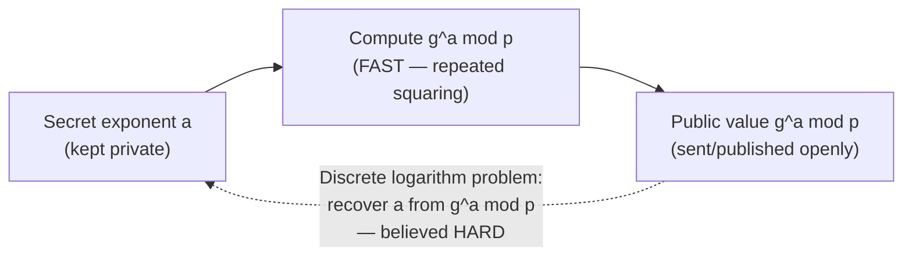

## Learning Objectives

- Recall modular exponentiation and multiplicative inverses (via the extended Euclidean algorithm) from discrete mathematics, and compute both by hand for small numbers.
- State Fermat's little theorem and explain, at a high level, why it guarantees the existence of a multiplicative inverse modulo a prime.
- Explain why modular exponentiation is fast to compute forward but believed hard to invert (the discrete logarithm problem), and why that asymmetry is exactly what public-key cryptography needs.
- Distinguish the discrete logarithm problem from the integer factorization problem, and name which public-key scheme (covered in the next two concepts) relies on each.
- Explain why every public-key scheme in this discipline is, underneath, "just" arithmetic on numbers modulo a large prime (or a product of two large primes) — not a fundamentally different kind of mathematics from what discrete math already covered.

## Context & Motivation

Every cipher covered so far in this discipline — the one-time pad, AES with a mode of operation, HMAC — is **symmetric**: sender and receiver share the exact same secret key in advance, and that shared key is what both encrypts/authenticates and decrypts/verifies. This leaves an obvious, practically enormous problem unaddressed: how do two parties who have never met, and share no prior secret, establish that shared key in the first place, especially over a channel an eavesdropper is fully watching? Symmetric cryptography, by its very structure, cannot answer this question — it *assumes* the shared secret already exists.

**Public-key cryptography** answers it, and every scheme this discipline covers to solve it — Diffie-Hellman key exchange, RSA encryption, and digital signatures, the next three concepts — rests on the exact same small set of number-theoretic facts already proven, rigorously, in `foundations/discrete-math-logic`: divisibility, the Euclidean algorithm for computing greatest common divisors and multiplicative inverses, and modular arithmetic. This concept does not introduce new mathematics; it recaps that material specifically in the form it will be used, and adds exactly one new fact — Fermat's little theorem — that discrete math did not need but public-key cryptography does. The payoff of getting this right is significant: nothing about RSA or Diffie-Hellman is mysterious once these few facts are firmly in place; both schemes are, quite literally, a few lines of modular arithmetic dressed up as a security protocol.

## Core Theory

### Recap: divisibility, the Euclidean algorithm, and modular arithmetic

`foundations/discrete-math-logic` already established: `a` divides `b` if some integer `k` satisfies `b = ak`; the Euclidean algorithm computes the greatest common divisor of two integers by repeated remainder-taking (`gcd(a, b) = gcd(b, a mod b)`, until a remainder of 0 is reached); the *extended* Euclidean algorithm additionally produces integers `x, y` such that `ax + by = gcd(a, b)`, a fact used directly to compute multiplicative inverses; and modular arithmetic works with the remainder of division by some fixed modulus `n`, writing `a ≡ b (mod n)` when `a` and `b` leave the same remainder when divided by `n`. This concept assumes exactly that toolkit and adds nothing new to it — the recap exists only to make the connection explicit before building on it.

### Modular exponentiation and the multiplicative inverse

Public-key cryptography's core operation is **modular exponentiation**: computing `gᵃ mod p` for some base `g`, exponent `a`, and modulus `p`. This is efficiently computable even for enormous exponents via repeated squaring (`g^16 = ((g²)²)²)²`, needing only `log₂(16) = 4` multiplications instead of 15), which matters enormously in practice since real cryptographic exponents are hundreds of digits long.

A **multiplicative inverse** of `a` modulo `n` is a value `a⁻¹` such that `a · a⁻¹ ≡ 1 (mod n)` — the modular analogue of dividing by `a`. It exists exactly when `gcd(a, n) = 1` (a and n are coprime), and the extended Euclidean algorithm computes it directly: since `ax + ny = gcd(a, n) = 1`, reducing both sides modulo `n` gives `ax ≡ 1 (mod n)`, so `x` (reduced modulo `n`) is the inverse.

### Fermat's little theorem

**Fermat's little theorem** states: if `p` is prime and `a` is any integer not divisible by `p`, then `a^(p-1) ≡ 1 (mod p)`. This single fact is the load-bearing beam under both RSA and the number-theoretic reasoning behind Diffie-Hellman: it guarantees that raising a number to a specific, computable exponent (related to `p - 1`) "wraps around" back to 1, which is exactly the structural property RSA's key-generation step exploits to guarantee that encryption followed by decryption returns the original message. An immediate, useful corollary: `a^(p-2) mod p` is the multiplicative inverse of `a` modulo `p` (since `a · a^(p-2) = a^(p-1) ≡ 1`), giving a second, independent way to compute a modular inverse when the modulus is prime — alongside the extended Euclidean algorithm, which works for any coprime modulus, prime or not.

### The one-way street: easy to compute forward, hard to invert

Modular exponentiation has a property essential to everything that follows: computing `gᵃ mod p` from `g`, `a`, and `p` is fast (repeated squaring, as above), but the reverse direction — given `g`, `p`, and the result `gᵃ mod p`, recovering the exponent `a` — is believed to be computationally hard for a well-chosen large prime `p`. This reverse problem is called the **discrete logarithm problem**, and no efficient (polynomial-time) algorithm for it is known on ordinary computers, despite decades of dedicated research — exactly the kind of one-way, easy-forward-hard-backward asymmetry public-key cryptography needs: a legitimate party can compute the forward direction quickly using a secret exponent, while an eavesdropper who only sees the public result is stuck with the hard reverse problem.

A second, related but distinct hard problem underlies RSA specifically (the next concept but one): **integer factorization** — given a large number `n` known to be the product of two large primes, finding those two primes. Multiplying two large primes together is fast; factoring the product back apart is believed hard, for the same reason "easy forward, hard backward" makes for good cryptography.



## Worked Examples

### Example 1: Computing a modular inverse two ways

Find the multiplicative inverse of 3 modulo 11 (a prime).

```text
Method 1 — extended Euclidean algorithm:
  11 = 3·3 + 2
   3 = 1·2 + 1
   2 = 2·1 + 0                     gcd(3, 11) = 1  ✓ (inverse exists)

  Back-substitute:
   1 = 3 - 1·2
   1 = 3 - 1·(11 - 3·3) = 3·4 - 11·1

  So 3·4 ≡ 1 (mod 11)  →  3⁻¹ ≡ 4 (mod 11)
  Check: 3 × 4 = 12 = 1·11 + 1  →  12 mod 11 = 1  ✓

Method 2 — Fermat's little theorem (p = 11, so exponent is p - 2 = 9):
  3⁻¹ ≡ 3^9 (mod 11)
  3^1=3, 3^2=9, 3^4=9²=81≡4, 3^8=4²=16≡5, 3^9=3^8·3^1=5·3=15≡4 (mod 11)

  Both methods agree: 3⁻¹ ≡ 4 (mod 11).
```

### Example 2: Modular exponentiation via repeated squaring

Compute `5^13 mod 23` efficiently (13 in binary is `1101`, i.e. 13 = 8 + 4 + 1).

```text
5^1  mod 23 = 5
5^2  mod 23 = 25 mod 23 = 2
5^4  mod 23 = 2² = 4
5^8  mod 23 = 4² = 16

13 = 8 + 4 + 1, so 5^13 = 5^8 · 5^4 · 5^1 (mod 23)
              = 16 · 4 · 5 (mod 23)
              = 320 mod 23
              = 320 - 13·23 = 320 - 299 = 21

5^13 mod 23 = 21

Only 4 squarings + 2 multiplications were needed, instead of 12
multiplications from naively multiplying 5 by itself 13 times — this
efficiency gap grows enormously for the hundreds-of-digits-long exponents
real cryptographic systems use, where naive repeated multiplication would
be completely infeasible but repeated squaring remains fast.
```

### Example 3: Illustrating the asymmetry that makes this useful for cryptography

```text
Forward (easy): given g = 5, p = 23, and secret exponent a = 13,
  compute 5^13 mod 23 = 21   (as computed above — a handful of steps)

Backward (believed hard, for a well-chosen large p): given g = 5, p = 23,
  and the RESULT 21, find the exponent a such that 5^a ≡ 21 (mod 23),
  without already knowing a = 13.

For this tiny toy example (p = 23), brute-checking all 22 possible
exponents would find a = 13 quickly — the hardness only kicks in once p
is a prime hundreds of digits long, at which point brute-force search
becomes as infeasible as brute-forcing a 256-bit AES key, and no known
algorithm does dramatically better than brute force for a well-chosen p.
```

The honest caveat in this example matters: the discrete logarithm problem's hardness is an *empirical, not proven* fact — no one has proved a fast algorithm cannot exist, only that decades of concerted research have failed to find one for well-chosen parameters, which is the same epistemic status essentially every computational hardness assumption in this discipline rests on, including integer factorization for RSA.

## Common Misconceptions & Pitfalls

- **"Public-key cryptography uses fundamentally different, more advanced math than discrete math already covered."** Every scheme in the next three concepts is built from exactly the divisibility, Euclidean algorithm, and modular arithmetic already proven in `foundations/discrete-math-logic`, plus the one new fact (Fermat's little theorem) introduced here — there is no additional mathematical machinery beyond this.
- **"The discrete logarithm problem and the integer factorization problem are the same thing."** They are different (though both believed hard) problems: discrete log is about inverting modular exponentiation with a fixed prime modulus (the basis for Diffie-Hellman); factorization is about splitting a composite number into its prime factors (the basis for RSA) — a scheme's security assumption should be stated precisely, not generically as "hard math."
- **"Fermat's little theorem only matters for a niche corner of number theory."** It is the single fact that makes RSA's decryption-recovers-the-original-message guarantee provable, and it gives a second, independent method (alongside the extended Euclidean algorithm) for computing modular inverses when the modulus is prime.
- **"Modular exponentiation with huge exponents must be slow."** Repeated squaring computes `gᵃ mod p` in only about `log₂(a)` multiplications rather than `a` multiplications, which is why real systems can use exponents hundreds of digits long without the forward computation itself becoming a bottleneck — only the reverse direction (discrete log) is believed hard.
- **"A hardness assumption like 'discrete log is hard' is a mathematically proven fact."** It is an empirical assumption, not a theorem — no proof exists that no efficient algorithm can solve discrete log (or integer factorization) for well-chosen parameters, only that no such algorithm has been found despite extensive effort, which is the honest epistemic footing all of public-key cryptography stands on.

## Summary

Public-key cryptography exists to solve a problem symmetric cryptography cannot: establishing a shared secret between two parties who have never met, over a channel an eavesdropper fully observes. Every scheme this discipline covers to do that rests on modular arithmetic already proven in discrete mathematics, plus one new fact introduced here — Fermat's little theorem, `a^(p-1) ≡ 1 (mod p)` for prime `p` — which underlies both RSA's correctness and a second method for computing modular inverses. The crucial asymmetry these schemes exploit is that modular exponentiation is fast to compute forward (via repeated squaring) but believed hard to invert — the discrete logarithm problem — and a related but distinct hard problem, integer factorization, underlies RSA specifically. With this number-theoretic toolkit in place, the next concept, Diffie-Hellman key exchange, shows exactly how two parties turn the discrete logarithm problem's one-way asymmetry into a shared secret established in full view of an eavesdropper.

## Documentation Links

- [Stanford CS255 — Introduction to Cryptography, Course Syllabus](https://cs255.stanford.edu/syllabus.html) — covers arithmetic modulo primes and finite cyclic groups as the explicit bridge from symmetric to public-key cryptography, in exactly this sequence.
- [Boneh & Shoup — A Graduate Course in Applied Cryptography](https://toc.cryptobook.us/) — free textbook with a full, rigorous number-theoretic background chapter covering Fermat's little theorem and modular exponentiation.
