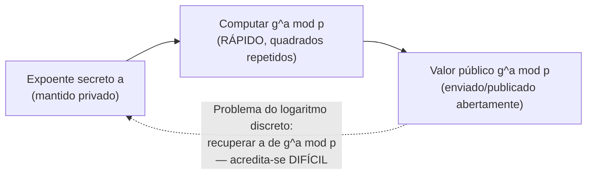

## Objetivos de Aprendizagem

- Relembrar a exponenciação modular e os inversos multiplicativos (via o algoritmo estendido de Euclides) da matemática discreta, e computar ambos à mão para números pequenos.
- Enunciar o pequeno teorema de Fermat e explicar, num alto nível, por que ele garante a existência de um inverso multiplicativo módulo um primo.
- Explicar por que a exponenciação modular é rápida de computar para frente mas acredita-se difícil de inverter (o problema do logaritmo discreto), e por que essa assimetria é exatamente o que a criptografia de chave pública precisa.
- Distinguir o problema do logaritmo discreto do problema da fatoração de inteiros, e nomear qual esquema de chave pública (coberto nos próximos dois conceitos) se apoia em cada um.
- Explicar por que todo esquema de chave pública nesta disciplina é, por baixo, "só" aritmética sobre números módulo um primo grande (ou um produto de dois primos grandes), não um tipo fundamentalmente diferente de matemática do que a matemática discreta já cobriu.

## Contexto e Motivação

Toda cifra coberta até agora nesta disciplina, o one-time pad, AES com um modo de operação, HMAC, é **simétrica**: remetente e receptor compartilham a exata mesma chave secreta de antemão, e essa chave compartilhada é o que tanto criptografa/autentica quanto descriptografa/verifica. Isto deixa um problema óbvio e praticamente enorme sem resposta: como é que duas partes que nunca se conheceram, e não compartilham nenhum segredo prévio, estabelecem essa chave compartilhada em primeiro lugar, especialmente sobre um canal que um bisbilhoteiro observa por completo? A criptografia simétrica, pela sua própria estrutura, não consegue responder essa pergunta, ela *assume* que o segredo compartilhado já existe.

A **criptografia de chave pública** o responde, e todo esquema que esta disciplina cobre para resolvê-lo, troca de chaves Diffie-Hellman, criptografia RSA e assinaturas digitais, os próximos três conceitos, repousa sobre o exato mesmo pequeno conjunto de fatos teórico-numéricos já provados, rigorosamente, em `foundations/discrete-math-logic`: divisibilidade, o algoritmo de Euclides para computar máximos divisores comuns e inversos multiplicativos, e aritmética modular. Este conceito não introduz matemática nova; ele recapitula esse material especificamente na forma em que será usado, e adiciona exatamente um novo fato, o pequeno teorema de Fermat, que a matemática discreta não precisou mas a criptografia de chave pública precisa. O retorno de acertar isto é significativo: nada sobre RSA ou Diffie-Hellman é misterioso uma vez que estes poucos fatos estão firmemente no lugar; ambos os esquemas são, bem literalmente, algumas linhas de aritmética modular vestidas de protocolo de segurança.

## Teoria Central

### Recapitulação: divisibilidade, o algoritmo de Euclides e aritmética modular

`foundations/discrete-math-logic` já estabeleceu: `a` divide `b` se algum inteiro `k` satisfaz `b = ak`; o algoritmo de Euclides computa o máximo divisor comum de dois inteiros por tomada repetida de resto (`gcd(a, b) = gcd(b, a mod b)`, até um resto de 0 ser alcançado); o algoritmo *estendido* de Euclides adicionalmente produz inteiros `x, y` tais que `ax + by = gcd(a, b)`, um fato usado diretamente para computar inversos multiplicativos; e a aritmética modular trabalha com o resto da divisão por algum módulo fixo `n`, escrevendo `a ≡ b (mod n)` quando `a` e `b` deixam o mesmo resto quando divididos por `n`. Este conceito assume exatamente esse kit de ferramentas e nada novo a ele adiciona, a recapitulação existe só para tornar a conexão explícita antes de construir sobre ela.

### Exponenciação modular e o inverso multiplicativo

A operação central da criptografia de chave pública é a **exponenciação modular**: computar `gᵃ mod p` para alguma base `g`, expoente `a` e módulo `p`. Isto é eficientemente computável mesmo para expoentes enormes via quadrados repetidos (`g^16 = ((g²)²)²)²`, precisando de só `log₂(16) = 4` multiplicações em vez de 15), o que importa enormemente na prática já que expoentes criptográficos reais têm centenas de dígitos de comprimento.

Um **inverso multiplicativo** de `a` módulo `n` é um valor `a⁻¹` tal que `a · a⁻¹ ≡ 1 (mod n)`, o análogo modular de dividir por `a`. Ele existe exatamente quando `gcd(a, n) = 1` (a e n são coprimos), e o algoritmo estendido de Euclides o computa diretamente: já que `ax + ny = gcd(a, n) = 1`, reduzir ambos os lados módulo `n` dá `ax ≡ 1 (mod n)`, então `x` (reduzido módulo `n`) é o inverso.

### O pequeno teorema de Fermat

O **pequeno teorema de Fermat** enuncia: se `p` é primo e `a` é qualquer inteiro não divisível por `p`, então `a^(p-1) ≡ 1 (mod p)`. Este único fato é a viga de sustentação sob tanto o RSA quanto o raciocínio teórico-numérico por trás do Diffie-Hellman: ele garante que elevar um número a um expoente específico e computável (relacionado a `p - 1`) "dá a volta" de volta a 1, que é exatamente a propriedade estrutural que o passo de geração de chave do RSA explora para garantir que a criptografia seguida de descriptografia retorne a mensagem original. Um corolário imediato e útil: `a^(p-2) mod p` é o inverso multiplicativo de `a` módulo `p` (já que `a · a^(p-2) = a^(p-1) ≡ 1`), dando uma segunda forma independente de computar um inverso modular quando o módulo é primo, ao lado do algoritmo estendido de Euclides, que funciona para qualquer módulo coprimo, primo ou não.

### A via de mão única: fácil de computar para frente, difícil de inverter

A exponenciação modular tem uma propriedade essencial a tudo que segue: computar `gᵃ mod p` a partir de `g`, `a` e `p` é rápido (quadrados repetidos, como acima), mas a direção reversa, dado `g`, `p` e o resultado `gᵃ mod p`, recuperar o expoente `a`, acredita-se ser computacionalmente difícil para um primo grande `p` bem escolhido. Este problema reverso é chamado de **problema do logaritmo discreto**, e nenhum algoritmo eficiente (de tempo polinomial) para ele é conhecido em computadores comuns, apesar de décadas de pesquisa dedicada, exatamente o tipo de assimetria de mão única, fácil-para-frente-difícil-para-trás, que a criptografia de chave pública precisa: uma parte legítima consegue computar a direção para frente rapidamente usando um expoente secreto, enquanto um bisbilhoteiro que só vê o resultado público fica preso com o problema reverso difícil.

Um segundo problema difícil, relacionado mas distinto, subjaz ao RSA especificamente (o próximo conceito menos um): a **fatoração de inteiros**, dado um número grande `n` sabido ser o produto de dois primos grandes, encontrar esses dois primos. Multiplicar dois primos grandes juntos é rápido; fatorar o produto de volta é acreditado difícil, pela mesma razão que "fácil para frente, difícil para trás" faz boa criptografia.



## Exemplos Resolvidos

### Exemplo 1: Computando um inverso modular de duas formas

Encontre o inverso multiplicativo de 3 módulo 11 (um primo).

```text
Método 1 — algoritmo estendido de Euclides:
  11 = 3·3 + 2
   3 = 1·2 + 1
   2 = 2·1 + 0                     gcd(3, 11) = 1  ✓ (inverso existe)

  Substituir de volta:
   1 = 3 - 1·2
   1 = 3 - 1·(11 - 3·3) = 3·4 - 11·1

  Então 3·4 ≡ 1 (mod 11)  →  3⁻¹ ≡ 4 (mod 11)
  Checar: 3 × 4 = 12 = 1·11 + 1  →  12 mod 11 = 1  ✓

Método 2 — pequeno teorema de Fermat (p = 11, então o expoente é p - 2 = 9):
  3⁻¹ ≡ 3^9 (mod 11)
  3^1=3, 3^2=9, 3^4=9²=81≡4, 3^8=4²=16≡5, 3^9=3^8·3^1=5·3=15≡4 (mod 11)

  Ambos os métodos concordam: 3⁻¹ ≡ 4 (mod 11).
```

### Exemplo 2: Exponenciação modular via quadrados repetidos

Compute `5^13 mod 23` eficientemente (13 em binário é `1101`, isto é, 13 = 8 + 4 + 1).

```text
5^1  mod 23 = 5
5^2  mod 23 = 25 mod 23 = 2
5^4  mod 23 = 2² = 4
5^8  mod 23 = 4² = 16

13 = 8 + 4 + 1, então 5^13 = 5^8 · 5^4 · 5^1 (mod 23)
              = 16 · 4 · 5 (mod 23)
              = 320 mod 23
              = 320 - 13·23 = 320 - 299 = 21

5^13 mod 23 = 21

Só 4 quadrados + 2 multiplicações foram necessários, em vez de 12
multiplicações de multiplicar ingenuamente 5 por si mesmo 13 vezes, esta
lacuna de eficiência cresce enormemente para os expoentes de centenas-de-dígitos
de comprimento que sistemas criptográficos reais usam, onde a multiplicação repetida ingênua
seria completamente inviável mas os quadrados repetidos permanecem rápidos.
```

### Exemplo 3: Ilustrando a assimetria que torna isto útil para criptografia

```text
Para frente (fácil): dados g = 5, p = 23, e expoente secreto a = 13,
  computar 5^13 mod 23 = 21   (como computado acima, um punhado de passos)

Para trás (acredita-se difícil, para um p grande bem escolhido): dados g = 5, p = 23,
  e o RESULTADO 21, encontrar o expoente a tal que 5^a ≡ 21 (mod 23),
  sem já conhecer a = 13.

Para este exemplo de brinquedo minúsculo (p = 23), checar por força bruta todos os 22
expoentes possíveis encontraria a = 13 rapidamente, a dificuldade só entra em ação uma vez que p
é um primo de centenas de dígitos de comprimento, ponto no qual a busca por força bruta
se torna tão inviável quanto quebrar por força bruta uma chave AES de 256 bits, e nenhum algoritmo
conhecido faz dramaticamente melhor do que a força bruta para um p bem escolhido.
```

A ressalva honesta neste exemplo importa: a dificuldade do problema do logaritmo discreto é um fato *empírico, não provado*, ninguém provou que um algoritmo rápido não pode existir, só que décadas de pesquisa concertada falharam em encontrar um para parâmetros bem escolhidos, que é o mesmo status epistêmico sobre o qual essencialmente toda suposição de dificuldade computacional nesta disciplina repousa, incluindo a fatoração de inteiros para o RSA.

## Equívocos Comuns e Armadilhas

- **"A criptografia de chave pública usa matemática fundamentalmente diferente e mais avançada do que a matemática discreta já cobriu."** Todo esquema nos próximos três conceitos é construído a partir de exatamente a divisibilidade, o algoritmo de Euclides e a aritmética modular já provados em `foundations/discrete-math-logic`, mais o um novo fato (pequeno teorema de Fermat) introduzido aqui, não há nenhuma maquinaria matemática adicional além disto.
- **"O problema do logaritmo discreto e o problema da fatoração de inteiros são a mesma coisa."** Eles são problemas diferentes (embora ambos acreditados difíceis): o log discreto é sobre inverter a exponenciação modular com um módulo primo fixo (a base para o Diffie-Hellman); a fatoração é sobre dividir um número composto nos seus fatores primos (a base para o RSA), a suposição de segurança de um esquema deveria ser enunciada precisamente, não genericamente como "matemática difícil".
- **"O pequeno teorema de Fermat só importa para um canto de nicho da teoria dos números."** Ele é o único fato que torna provável a garantia de descriptografia-recupera-a-mensagem-original do RSA, e dá um segundo método independente (ao lado do algoritmo estendido de Euclides) para computar inversos modulares quando o módulo é primo.
- **"A exponenciação modular com expoentes enormes tem de ser lenta."** Os quadrados repetidos computam `gᵃ mod p` em só cerca de `log₂(a)` multiplicações em vez de `a` multiplicações, que é por que sistemas reais conseguem usar expoentes de centenas de dígitos de comprimento sem a própria computação para frente se tornar um gargalo, só a direção reversa (log discreto) é acreditada difícil.
- **"Uma suposição de dificuldade como 'o log discreto é difícil' é um fato matematicamente provado."** É uma suposição empírica, não um teorema, nenhuma prova existe de que nenhum algoritmo eficiente possa resolver o log discreto (ou a fatoração de inteiros) para parâmetros bem escolhidos, só que nenhum tal algoritmo foi encontrado apesar de esforço extenso, que é o alicerce epistêmico honesto sobre o qual toda a criptografia de chave pública se sustenta.

## Resumo

A criptografia de chave pública existe para resolver um problema que a criptografia simétrica não consegue: estabelecer um segredo compartilhado entre duas partes que nunca se conheceram, sobre um canal que um bisbilhoteiro observa por completo. Todo esquema que esta disciplina cobre para fazer isso repousa sobre a aritmética modular já provada em matemática discreta, mais um novo fato introduzido aqui, o pequeno teorema de Fermat, `a^(p-1) ≡ 1 (mod p)` para primo `p`, que subjaz tanto à correção do RSA quanto a um segundo método para computar inversos modulares. A assimetria crucial que estes esquemas exploram é que a exponenciação modular é rápida de computar para frente (via quadrados repetidos) mas acredita-se difícil de inverter, o problema do logaritmo discreto, e um problema difícil relacionado mas distinto, a fatoração de inteiros, subjaz ao RSA especificamente. Com este kit de ferramentas teórico-numérico no lugar, o próximo conceito, a troca de chaves Diffie-Hellman, mostra exatamente como duas partes transformam a assimetria de mão única do problema do logaritmo discreto num segredo compartilhado estabelecido à plena vista de um bisbilhoteiro.

## Documentation Links

- [Stanford CS255 — Introduction to Cryptography, Course Syllabus](https://cs255.stanford.edu/syllabus.html): cobre aritmética módulo primos e grupos cíclicos finitos como a ponte explícita da criptografia simétrica à de chave pública, exatamente nesta sequência.
- [Boneh & Shoup — A Graduate Course in Applied Cryptography](https://toc.cryptobook.us/): livro-texto gratuito com um capítulo de fundo teórico-numérico completo e rigoroso cobrindo o pequeno teorema de Fermat e a exponenciação modular.
