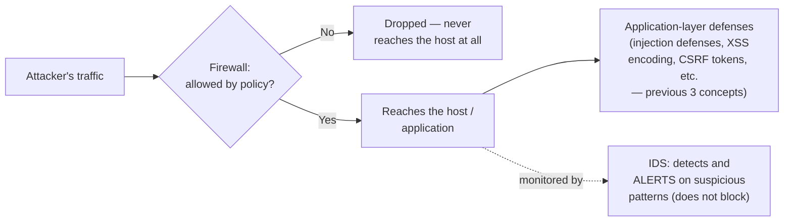

## Learning Objectives

- Explain what a firewall enforces and why it operates at an earlier point in an attack's lifecycle than every defense covered so far in this discipline.
- Distinguish packet-filtering firewalls from stateful firewalls, and explain what additional context a stateful firewall tracks that a packet filter does not.
- Describe an intrusion detection system (IDS) and explain how its role differs from a firewall's — detecting versus blocking.
- Explain why network-layer defenses and application-layer defenses (from the previous three concepts) are complementary, not redundant.
- Give a concrete example of an attack a firewall does and does not stop, to make its scope precise rather than treated as a generic "network security" catch-all.

## Context & Motivation

Every defense covered so far in this discipline — control-hijacking mitigations, parameterized queries, output encoding, anti-CSRF tokens — assumes an attacker's traffic has *already reached* the vulnerable component (a running process, a database query, a page being rendered) and focuses on preventing that traffic from causing harm once it arrives. **Network security**, and firewalls specifically, operate at a genuinely earlier point in the same story: deciding which traffic is allowed to reach a system's network interface *at all*, before any application-layer code ever runs on it.

This is a meaningfully different kind of defense, not a stronger or weaker version of the same idea — a perfectly firewalled system can still be compromised by a SQL injection sent over an allowed connection to its own web server (the firewall correctly let the connection through; the vulnerability lived entirely in the application logic behind it), and a perfectly hardened application can still be knocked offline by an attacker who never gets far enough to reach the application layer at all, because the firewall (or its absence) determined that outcome first. Recognizing this distinction — which layer a given defense operates at, and which threats it can and cannot address — is exactly the kind of precise, mechanism-matched-to-threat thinking this discipline has been building toward since its very first concept on the CIA triad.

## Core Theory

### What a firewall enforces

A **firewall** enforces a policy about which network traffic is permitted to cross a defined boundary — typically between a private network (or a single host) and a less-trusted network, such as the public internet. That policy is expressed as a set of rules, typically matching on attributes like source/destination IP address, port number, and protocol, and each incoming or outgoing packet is checked against those rules to decide whether it is allowed through or dropped.

### Packet-filtering vs. stateful firewalls

A **packet-filtering firewall** evaluates each packet independently, purely against the static rule set, with no memory of any previous packet — a rule might say "allow inbound traffic on port 443" (HTTPS), and every packet matching that description is allowed through regardless of context.

A **stateful firewall** tracks the state of active connections (which outbound connections a machine behind the firewall has initiated, and which inbound packets are legitimate *responses* to those specific connections), and can therefore express much more precise, safer rules — for instance, "allow inbound traffic only if it's a response to a connection this machine itself initiated," rather than "allow all inbound traffic on this port from anyone." This closes off a real weakness of pure packet filtering: without connection state, a packet-filtering rule permissive enough to allow legitimate response traffic on a given port is often, as an unavoidable side effect, also permissive enough to allow an attacker's *unsolicited* traffic on that same port, since the filter has no way to distinguish "a reply to something we asked for" from "an unprompted incoming connection attempt."

### Intrusion detection systems: detecting, not blocking

An **intrusion detection system (IDS)** plays a different role from a firewall: rather than deciding, in real time, whether to allow or block traffic, an IDS monitors traffic (or system activity) and raises an alert when it observes a pattern matching a known attack signature or an anomalous deviation from typical behavior. This is a meaningful distinction from a firewall's blocking role — an IDS's job is to make an attack *visible* to a human or automated response system, not to prevent it from happening in the first place (an **intrusion prevention system**, IPS, extends an IDS's detection with the additional ability to actively block matching traffic, functioning closer to a dynamically-updating firewall).



### Why network-layer and application-layer defenses are complementary, not redundant

A firewall closes off an entire category of threats that application-layer defenses cannot address at all — an attacker attempting to directly connect to an internal database port that should never be reachable from the public internet, for instance, is stopped by network policy before any application code (which might otherwise have its own vulnerabilities) is ever involved. Conversely, a firewall provides no protection whatsoever against attacks carried *within* traffic it has already decided to allow — a SQL injection payload arrives as part of an entirely legitimate-looking HTTPS request to a web server's already-open port 443, and the firewall has no visibility into (nor responsibility for) the SQL query the application constructs from that request's contents once it arrives. This is exactly why this discipline covers both layers rather than treating network security as a substitute for application-layer defenses, or vice versa — each closes a gap the other structurally cannot.

## Worked Examples

### Example 1: An attack a firewall stops completely

```text
Scenario: A company's internal database server should only ever be
reached by the company's own application servers, never directly from
the public internet.

Firewall rule: DENY all inbound connections to the database's port from
  any source EXCEPT the specific internal IP addresses of the
  application servers.

Attacker, scanning the internet for open database ports, attempts to
connect directly to the database server's IP and port from an
arbitrary external address.

Result: firewall rule matches (source is not an authorized internal
  application server) → packet DROPPED. The attacker's connection
  attempt never reaches the database server's software at all — it
  is stopped entirely at the network layer, before any database-level
  vulnerability (weak credentials, an unpatched bug) could even be
  probed.
```

### Example 2: An attack a firewall does NOT stop

```text
Scenario: The same company's public-facing web application, running on
an intentionally, correctly open port 443 (HTTPS), has an unparameterized
SQL query (from the injection-vulnerabilities concept).

Attacker sends a completely normal-looking HTTPS POST request to the
web application's own, legitimately-open endpoint, with a crafted
"username" field containing SQL injection syntax.

Firewall check: is a connection to port 443 allowed from this source?
  YES — this is exactly the kind of traffic the firewall exists to let
  through; the web application is SUPPOSED to be reachable by the
  public.

Result: firewall allows the connection (correctly, per its own policy)
  — the attack succeeds or fails entirely based on whether the
  application code itself is vulnerable, a question the firewall has
  no visibility into and no way to evaluate.
```

The contrast between these two examples is the central point of this concept: firewalls are highly effective against threats defined by *which connections should be allowed at all*, and provide no protection against threats carried *within* connections the policy correctly permits.

### Example 3: Stateful filtering closing a gap that pure packet filtering leaves open

```text
Packet-filtering-only rule: "allow inbound traffic on any port above
  1024" (a common historical rule to permit response traffic to
  outbound connections, since operating systems traditionally used
  high-numbered ports for the client side of outbound connections).

Problem: this rule ALSO allows an attacker to send unsolicited traffic
  directly to any port above 1024, since the filter has no way to
  distinguish "a legitimate response to a connection we initiated" from
  "an attacker's fresh, unsolicited connection attempt" — both look
  identical to a stateless filter checking only the port number.

Stateful firewall equivalent: "allow inbound traffic on any port, but
  ONLY if it matches an existing connection this machine itself
  initiated" — the firewall tracks which outbound connections exist and
  permits only their legitimate responses, closing off the unsolicited-
  traffic loophole the stateless version left open, without needing an
  overly broad, port-range-based rule at all.
```

## Common Misconceptions & Pitfalls

- **"A firewall is a complete network security solution on its own."** A firewall controls which connections are permitted at all; it provides no protection against attacks carried within traffic it has already decided to allow, as Example 2 shows directly — application-layer defenses (the previous three concepts) remain necessary regardless of firewall configuration.
- **"An IDS blocks attacks the way a firewall does."** An IDS's core role is detection and alerting, not blocking — conflating IDS with IPS (which does add blocking capability) misunderstands what a plain IDS deployment actually does and doesn't provide.
- **"If a firewall allows a connection, that traffic must be safe."** A firewall's allow decision reflects only that the connection matches the network-level policy (right source, right port, right protocol) — it says nothing about whether the content of that permitted traffic is malicious once it reaches the application behind it.
- **"Packet filtering and stateful filtering provide the same level of protection, just implemented differently."** Stateful filtering closes off a real class of loopholes pure packet filtering leaves open (Example 3) by tracking connection context that a stateless filter structurally cannot see — the difference is a meaningful capability gap, not just an implementation detail.
- **"Network security defenses make application-layer defenses (encoding, parameterized queries, anti-CSRF tokens) unnecessary."** The two layers address entirely different, complementary threat categories, as this concept's Core Theory makes explicit — neither layer is a substitute for the other, and a system hardened at only one layer remains vulnerable at the other.

## Summary

A firewall enforces policy about which network traffic is permitted to reach a system at all — a genuinely earlier point in an attack's lifecycle than every application-layer defense covered earlier in this discipline, which assume traffic has already arrived. Packet-filtering firewalls evaluate each packet independently against static rules; stateful firewalls additionally track connection context, closing off loopholes (like Example 3's high-port rule) that stateless filtering leaves open. An intrusion detection system plays a complementary, distinct role — detecting and alerting on suspicious patterns rather than blocking traffic outright, a job an IPS extends with active blocking. Network-layer and application-layer defenses are complementary, not redundant or substitutable: a firewall stops an attacker from reaching a service that should never be publicly exposed at all, but provides no protection against a vulnerability carried within traffic it correctly, legitimately allows through — which is exactly why this discipline's capstone, tracing a complete TLS handshake, draws together primitives from every layer covered so far into one coherent, end-to-end protocol.

## Documentation Links

- [Stanford CS155 — Computer and Network Security](https://cs155.stanford.edu/) — covers firewalls, intrusion detection, and network-layer defenses in exactly this context, alongside the web-application-layer material from the previous concept.
- [ACM/IEEE CS2013 — Information Assurance and Security (Privacy and Security) Knowledge Area](https://csed.acm.org/knowledge-areas-privacy-and-security-ps-cs2013/) — lists network security, secure architectures, and defense mechanisms including firewalls and intrusion detection as core curriculum topics.
