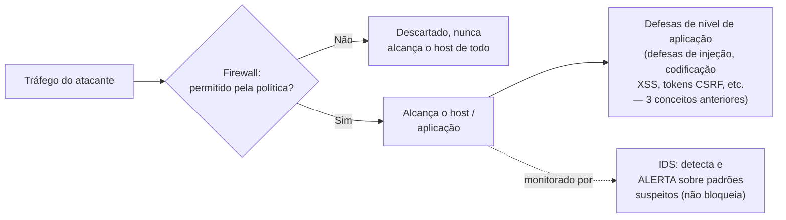

## Objetivos de Aprendizagem

- Explicar o que um firewall impõe e por que ele opera num ponto mais cedo no ciclo de vida de um ataque do que toda defesa coberta até agora nesta disciplina.
- Distinguir firewalls de filtragem de pacotes de firewalls com estado, e explicar que contexto adicional um firewall com estado rastreia que um filtro de pacotes não.
- Descrever um sistema de detecção de intrusão (IDS) e explicar como o seu papel difere do de um firewall, detectar versus bloquear.
- Explicar por que defesas de nível de rede e defesas de nível de aplicação (dos três conceitos anteriores) são complementares, não redundantes.
- Dar um exemplo concreto de um ataque que um firewall para e que não para, para tornar o seu escopo preciso em vez de tratado como um "segurança de rede" genérico que serve para tudo.

## Contexto e Motivação

Toda defesa coberta até agora nesta disciplina, mitigações de sequestro de controle, consultas parametrizadas, codificação de saída, tokens anti-CSRF, assume que o tráfego de um atacante *já alcançou* o componente vulnerável (um processo em execução, uma consulta de banco de dados, uma página sendo renderizada) e foca em prevenir que esse tráfego cause dano uma vez que chega. A **segurança de rede**, e os firewalls especificamente, operam num ponto genuinamente mais cedo na mesma história: decidir qual tráfego tem permissão de alcançar a interface de rede de um sistema *de todo*, antes de qualquer código de nível de aplicação jamais rodar sobre ele.

Este é um tipo de defesa significativamente diferente, não uma versão mais forte ou mais fraca da mesma ideia, um sistema perfeitamente protegido por firewall ainda pode ser comprometido por uma injeção SQL enviada sobre uma conexão permitida ao seu próprio servidor web (o firewall corretamente deixou a conexão passar; a vulnerabilidade viveu inteiramente na lógica de aplicação por trás dele), e uma aplicação perfeitamente endurecida ainda pode ser derrubada por um atacante que nunca chega longe o bastante para alcançar a camada de aplicação de todo, porque o firewall (ou a sua ausência) determinou esse desfecho primeiro. Reconhecer esta distinção, em qual camada uma dada defesa opera, e quais ameaças ela pode e não pode abordar, é exatamente o tipo de pensamento preciso, mecanismo-casado-com-ameaça, em direção ao qual esta disciplina vem construindo desde o seu primeiro conceito sobre a tríade CIA.

## Teoria Central

### O que um firewall impõe

Um **firewall** impõe uma política sobre qual tráfego de rede tem permissão de cruzar um limite definido, tipicamente entre uma rede privada (ou um único host) e uma rede menos confiável, como a internet pública. Essa política é expressa como um conjunto de regras, tipicamente casando com atributos como endereço IP de origem/destino, número de porta e protocolo, e cada pacote de entrada ou saída é checado contra essas regras para decidir se ele é permitido passar ou descartado.

### Filtragem de pacotes vs. firewalls com estado

Um **firewall de filtragem de pacotes** avalia cada pacote independentemente, puramente contra o conjunto de regras estático, sem memória de nenhum pacote anterior, uma regra pode dizer "permitir tráfego de entrada na porta 443" (HTTPS), e todo pacote correspondendo a essa descrição é permitido passar independentemente do contexto.

Um **firewall com estado** rastreia o estado de conexões ativas (quais conexões de saída uma máquina atrás do firewall iniciou, e quais pacotes de entrada são *respostas* legítimas a essas conexões específicas), e consegue portanto expressar regras muito mais precisas e seguras, por exemplo, "permitir tráfego de entrada só se for uma resposta a uma conexão que esta máquina ela mesma iniciou", em vez de "permitir todo tráfego de entrada nesta porta de qualquer um". Isto fecha uma fraqueza real da filtragem de pacotes pura: sem estado de conexão, uma regra de filtragem de pacotes permissiva o bastante para permitir tráfego de resposta legítimo numa dada porta é frequentemente, como um efeito colateral inevitável, também permissiva o bastante para permitir o tráfego *não solicitado* de um atacante naquela mesma porta, já que o filtro não tem como distinguir "uma resposta a algo que pedimos" de "uma tentativa de conexão de entrada não solicitada".

### Sistemas de detecção de intrusão: detectar, não bloquear

Um **sistema de detecção de intrusão (IDS)** desempenha um papel diferente de um firewall: em vez de decidir, em tempo real, se permite ou bloqueia o tráfego, um IDS monitora o tráfego (ou atividade de sistema) e levanta um alerta quando observa um padrão correspondendo a uma assinatura de ataque conhecida ou a um desvio anômalo do comportamento típico. Esta é uma distinção significativa do papel de bloqueio de um firewall, o trabalho de um IDS é tornar um ataque *visível* a um humano ou sistema de resposta automatizado, não preveni-lo de acontecer em primeiro lugar (um **sistema de prevenção de intrusão**, IPS, estende a detecção de um IDS com a habilidade adicional de ativamente bloquear tráfego correspondente, funcionando mais perto de um firewall de atualização dinâmica).



### Por que defesas de nível de rede e de nível de aplicação são complementares, não redundantes

Um firewall fecha uma categoria inteira de ameaças que defesas de nível de aplicação não conseguem abordar de forma alguma, um atacante tentando conectar diretamente a uma porta de banco de dados interna que nunca deveria ser alcançável a partir da internet pública, por exemplo, é parado pela política de rede antes de qualquer código de aplicação (que poderia de outra forma ter as suas próprias vulnerabilidades) jamais estar envolvido. Reciprocamente, um firewall não fornece nenhuma proteção de forma alguma contra ataques carregados *dentro* de tráfego que ele já decidiu permitir, um payload de injeção SQL chega como parte de uma requisição HTTPS de aparência inteiramente legítima à porta 443 já aberta de um servidor web, e o firewall não tem nenhuma visibilidade de (nem responsabilidade por) a consulta SQL que a aplicação constrói a partir do conteúdo dessa requisição uma vez que ela chega. É exatamente por isso que esta disciplina cobre ambas as camadas em vez de tratar a segurança de rede como um substituto para defesas de nível de aplicação, ou vice-versa, cada uma fecha uma lacuna que a outra estruturalmente não consegue.

## Exemplos Resolvidos

### Exemplo 1: Um ataque que um firewall para completamente

```text
Cenário: O servidor de banco de dados interno de uma empresa só deveria jamais ser
alcançado pelos próprios servidores de aplicação da empresa, nunca diretamente da
internet pública.

Regra de firewall: NEGAR todas as conexões de entrada à porta do banco de dados de
  qualquer origem EXCETO os endereços IP internos específicos dos
  servidores de aplicação.

Atacante, varrendo a internet por portas de banco de dados abertas, tenta
conectar diretamente ao IP e porta do servidor de banco de dados de um
endereço externo arbitrário.

Resultado: a regra de firewall corresponde (a origem não é um servidor de aplicação
  interno autorizado) → pacote DESCARTADO. A tentativa de conexão do atacante
  nunca alcança o software do servidor de banco de dados de forma alguma, ela
  é parada inteiramente na camada de rede, antes de qualquer vulnerabilidade de nível
  de banco (credenciais fracas, um bug não corrigido) poder sequer ser
  sondada.
```

### Exemplo 2: Um ataque que um firewall NÃO para

```text
Cenário: A aplicação web voltada ao público da mesma empresa, rodando numa
porta 443 (HTTPS) intencional e corretamente aberta, tem uma consulta SQL
não parametrizada (do conceito de vulnerabilidades de injeção).

Atacante envia uma requisição HTTPS POST de aparência completamente normal à
aplicação web no seu próprio endpoint legitimamente aberto, com um campo
"username" elaborado contendo sintaxe de injeção SQL.

Checagem de firewall: uma conexão à porta 443 é permitida desta origem?
  SIM, este é exatamente o tipo de tráfego que o firewall existe para deixar
  passar; a aplicação web DEVE ser alcançável pelo público.

Resultado: o firewall permite a conexão (corretamente, por sua própria política),
  o ataque tem sucesso ou falha inteiramente com base em se o código da
  aplicação em si é vulnerável, uma questão da qual o firewall não tem
  nenhuma visibilidade e nenhuma forma de avaliar.
```

O contraste entre estes dois exemplos é o ponto central deste conceito: firewalls são altamente eficazes contra ameaças definidas por *quais conexões deveriam ser permitidas de todo*, e não fornecem nenhuma proteção contra ameaças carregadas *dentro* de conexões que a política corretamente permite.

### Exemplo 3: Filtragem com estado fechando uma lacuna que a filtragem de pacotes pura deixa aberta

```text
Regra só de filtragem de pacotes: "permitir tráfego de entrada em qualquer porta acima
  de 1024" (uma regra histórica comum para permitir tráfego de resposta a
  conexões de saída, já que sistemas operacionais tradicionalmente usavam
  portas de número alto para o lado cliente de conexões de saída).

Problema: esta regra TAMBÉM permite a um atacante enviar tráfego não solicitado
  diretamente a qualquer porta acima de 1024, já que o filtro não tem como
  distinguir "uma resposta legítima a uma conexão que iniciamos" de
  "a tentativa de conexão fresca e não solicitada de um atacante", ambas parecem
  idênticas a um filtro sem estado checando só o número da porta.

Equivalente de firewall com estado: "permitir tráfego de entrada em qualquer porta, mas
  SÓ se corresponder a uma conexão existente que esta máquina ela mesma
  iniciou", o firewall rastreia quais conexões de saída existem e
  permite só as suas respostas legítimas, fechando a brecha de tráfego-não-
  solicitado que a versão sem estado deixou aberta, sem precisar de uma
  regra ampla demais, baseada em faixa de portas, de forma alguma.
```

## Equívocos Comuns e Armadilhas

- **"Um firewall é uma solução completa de segurança de rede por conta própria."** Um firewall controla quais conexões são permitidas de todo; ele não fornece nenhuma proteção contra ataques carregados dentro de tráfego que ele já decidiu permitir, como o Exemplo 2 mostra diretamente, defesas de nível de aplicação (os três conceitos anteriores) permanecem necessárias independentemente da configuração do firewall.
- **"Um IDS bloqueia ataques da forma que um firewall faz."** O papel central de um IDS é detecção e alerta, não bloqueio, conflatar IDS com IPS (que de fato adiciona capacidade de bloqueio) mal entende o que uma implantação de IDS simples de fato fornece e não fornece.
- **"Se um firewall permite uma conexão, esse tráfego tem de ser seguro."** A decisão de permitir de um firewall reflete só que a conexão corresponde à política de nível de rede (origem certa, porta certa, protocolo certo), ela nada diz sobre se o conteúdo desse tráfego permitido é malicioso uma vez que alcança a aplicação por trás dele.
- **"Filtragem de pacotes e filtragem com estado fornecem o mesmo nível de proteção, só implementadas de forma diferente."** A filtragem com estado fecha uma classe real de brechas que a filtragem de pacotes pura deixa aberta (Exemplo 3) rastreando contexto de conexão que um filtro sem estado estruturalmente não consegue ver, a diferença é uma lacuna de capacidade significativa, não só um detalhe de implementação.
- **"Defesas de segurança de rede tornam defesas de nível de aplicação (codificação, consultas parametrizadas, tokens anti-CSRF) desnecessárias."** As duas camadas abordam categorias de ameaça inteiramente diferentes e complementares, como a Teoria Central deste conceito torna explícito, nenhuma camada é um substituto para a outra, e um sistema endurecido em só uma camada permanece vulnerável na outra.

## Resumo

Um firewall impõe política sobre qual tráfego de rede tem permissão de alcançar um sistema de todo, um ponto genuinamente mais cedo no ciclo de vida de um ataque do que toda defesa de nível de aplicação coberta antes nesta disciplina, que assumem que o tráfego já chegou. Firewalls de filtragem de pacotes avaliam cada pacote independentemente contra regras estáticas; firewalls com estado adicionalmente rastreiam contexto de conexão, fechando brechas (como a regra de porta alta do Exemplo 3) que a filtragem sem estado deixa abertas. Um sistema de detecção de intrusão desempenha um papel complementar e distinto, detectando e alertando sobre padrões suspeitos em vez de bloquear tráfego de imediato, um trabalho que um IPS estende com bloqueio ativo. Defesas de nível de rede e de nível de aplicação são complementares, não redundantes ou substituíveis: um firewall impede um atacante de alcançar um serviço que nunca deveria ser publicamente exposto de todo, mas não fornece nenhuma proteção contra uma vulnerabilidade carregada dentro de tráfego que ele correta e legitimamente permite passar, que é exatamente por que o capstone desta disciplina, rastreando um handshake TLS completo, reúne primitivos de toda camada coberta até agora num único protocolo coerente e de ponta a ponta.

## Documentation Links

- [Stanford CS155 — Computer and Network Security](https://cs155.stanford.edu/): cobre firewalls, detecção de intrusão e defesas de nível de rede exatamente neste contexto, ao lado do material de nível de aplicação web do conceito anterior.
- [ACM/IEEE CS2013 — Information Assurance and Security (Privacy and Security) Knowledge Area](https://csed.acm.org/knowledge-areas-privacy-and-security-ps-cs2013/): lista segurança de rede, arquiteturas seguras e mecanismos de defesa incluindo firewalls e detecção de intrusão como tópicos centrais de currículo.
