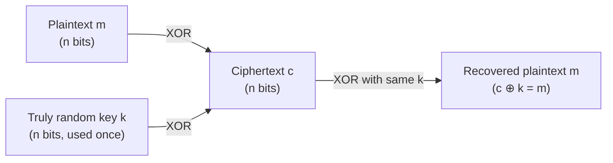

## Learning Objectives

- Define perfect secrecy precisely, in terms of the attacker's posterior belief about the plaintext given the ciphertext.
- Construct the one-time pad cipher from a truly random key and the XOR operation, and encrypt/decrypt a short example by hand.
- Prove, informally but rigorously, why the one-time pad achieves perfect secrecy when its two conditions (true randomness, single use) hold.
- Explain concretely what breaks — and demonstrate the break — the moment either condition is violated.
- Explain why perfect secrecy, despite being the strongest possible guarantee, is not how virtually any real system encrypts data, and what practical guarantee (computational security) takes its place from the next concept forward.

## Context & Motivation

Having established what security goals mean (confidentiality, integrity, availability) and how to think about threats systematically (STRIDE), this discipline turns to its first concrete mechanism: encryption for confidentiality. It starts, deliberately, with the one cipher that achieves the *strongest possible* theoretical guarantee — not because it is practical (it almost never is), but because it establishes an exact, mathematically provable upper bound against which every later, more practical cipher (AES, covered next) can be honestly compared and understood as a deliberate compromise, not an unexplained shortcut.

**Perfect secrecy**, a notion formalized by Claude Shannon in 1949, means that observing the ciphertext gives an eavesdropper *zero* additional information about the plaintext — their belief about what the message says is mathematically identical before and after seeing the encrypted version. This is an extraordinarily strong requirement, and it is genuinely achievable, by a cipher simple enough to describe in one sentence: the **one-time pad**. Understanding exactly why it works, and exactly why its conditions are almost never satisfiable in practice, is the right foundation for everything that follows, because every subsequent cipher in this discipline is, in a precise sense, a practical cipher's answer to "what do we give up, and what do we gain, by relaxing perfect secrecy?"

## Core Theory

### Perfect secrecy, formally stated (informally)

A cipher achieves perfect secrecy if, for every pair of possible plaintext messages `m₀` and `m₁` of the same length, and for every possible ciphertext `c`, the probability of observing `c` when `m₀` was encrypted is exactly equal to the probability of observing `c` when `m₁` was encrypted. In plain language: seeing any specific ciphertext is exactly as likely under any possible plaintext as under any other — the ciphertext carries no information at all that would let an attacker favor one candidate plaintext over another, no matter how much computational power they have. This last clause is important and distinguishes perfect secrecy from every other security notion in this discipline: perfect secrecy holds even against an attacker with *unlimited* computing power, which is exactly why it is the strongest notion of confidentiality that exists.

### Constructing the one-time pad

The one-time pad is remarkably simple to describe:

1. Generate a key `k` that is a sequence of truly random bits, exactly as long as the message `m` to be sent.
2. Encrypt by computing `c = m ⊕ k` (bitwise XOR, exclusive-or, of the message and the key).
3. Decrypt by computing `m = c ⊕ k` (XOR is its own inverse: `(m ⊕ k) ⊕ k = m`, because `k ⊕ k` is all zeros).

That is the entire cipher. Its security rests entirely on the key: a truly random key, used exactly once, means that for any observed ciphertext `c`, every possible plaintext `m'` of the same length is equally consistent with `c`, because there exists exactly one key value (`k' = c ⊕ m'`) that would have produced that ciphertext from that plaintext — and since every key value was equally likely a priori (the key is uniformly random), every plaintext remains equally likely after seeing `c`. This is, precisely, the definition of perfect secrecy satisfied by direct construction, not by an unproven assumption about an attacker's limited computing power (which is how essentially every other cipher in this discipline achieves its weaker, but still practically sufficient, guarantee).

### The two conditions, and why both are essential

Perfect secrecy holds *only* if both conditions are met simultaneously:

- **True randomness**: the key must come from a source with no predictable structure whatsoever — not a password, not a pseudorandom number generator's output (a PRG's output is, by construction, entirely determined by a much shorter seed, which reintroduces exactly the structure perfect secrecy requires to be absent).
- **Single use ("one-time")**: the key must never be reused, even partially, across more than one message. Reusing a key breaks the security *catastrophically*, not just partially, as the next section demonstrates.

Together, these conditions imply a key management problem that is, in general, exactly as hard as the original problem the cipher was meant to solve: a key as long as the message, usable only once, must somehow be distributed to both parties in advance through some channel at least as secure as the one being protected. This circularity — needing a secure channel to establish the key that would let you avoid needing a secure channel — is precisely why the one-time pad, despite its perfect theoretical guarantee, is not how essentially any real communication system works. (Historical exceptions exist — diplomatic and intelligence communications have used physical one-time pads, distributed by trusted couriers, specifically because the key-distribution cost was judged acceptable for extremely high-value, low-volume communication.)



## Worked Examples

### Example 1: Encrypting and decrypting by hand

Encode the 3-character message `"NO!"` in ASCII binary and combine it with a truly random 24-bit key via XOR.

```text
Plaintext  "N"  "O"  "!"
ASCII       78   79   33
Binary   01001110 01001111 00100001

Random key (illustrative, must be truly random in practice):
         10110101 00011010 11101001

Ciphertext = plaintext XOR key:
  01001110 XOR 10110101 = 11111011
  01001111 XOR 00011010 = 01010101
  00100001 XOR 11101001 = 11001000

Decryption: ciphertext XOR SAME key recovers plaintext exactly:
  11111011 XOR 10110101 = 01001110 = "N"  ✓
  01010101 XOR 00011010 = 01001111 = "O"  ✓
  11001000 XOR 11101001 = 00100001 = "!"  ✓
```

Notice that without knowing the key, the ciphertext `11111011 01010101 11001000` is, provably, exactly as consistent with the plaintext `"NO!"` as it is with any other 3-character message — including, for instance, `"YES"` — because there exists some 24-bit key that maps `"YES"` to that exact same ciphertext, and that key was, a priori, exactly as likely to have been chosen as the actual key was.

### Example 2: Demonstrating the catastrophic failure of key reuse

Suppose the same key `k` is mistakenly reused to encrypt two different messages, producing `c₁ = m₁ ⊕ k` and `c₂ = m₂ ⊕ k`. An eavesdropper who intercepts both ciphertexts, without knowing the key at all, can compute:

```text
c₁ ⊕ c₂ = (m₁ ⊕ k) ⊕ (m₂ ⊕ k) = m₁ ⊕ m₂

The key cancels out ENTIRELY — the attacker recovers the XOR of the two
plaintexts directly, without ever learning k.
```

`m₁ ⊕ m₂` is not the plaintexts themselves, but it is a massive amount of structure: if the attacker has any guess about part of one message (say, they suspect `m₁` starts with a common phrase, or is in a known format), they can XOR that guess against `m₁ ⊕ m₂` to recover the corresponding part of `m₂` directly, and real cryptanalytic techniques (frequency analysis on the recovered `m₁ ⊕ m₂` stream, exploiting that natural-language text and structured data are far from random) have historically broken two-time-pad usage completely, most famously in Soviet diplomatic cables during the Venona project, where reused one-time-pad key material let cryptanalysts recover plaintext from intercepted, supposedly perfectly-secret traffic. The lesson generalizes beyond this specific cipher: reusing supposedly single-use cryptographic key material is one of the most catastrophic and recurring real-world cryptographic mistakes, and it recurs later in this discipline in the context of stream-cipher-like modes of block ciphers.

### Example 3: Why a short, memorable "key" cannot achieve perfect secrecy

Suppose someone proposes using a memorable 8-character password, repeated to match the message length, instead of a truly random, full-length key.

```text
Message length:  1000 bits
"Key":           8-character password, repeated ~15 times to fill 1000 bits

Problem: the key has, at most, as much entropy (unpredictability) as an
8-character password can carry — vastly less than 1000 bits of true
randomness. An attacker doesn't need to guess the full 1000-bit key; they
only need to guess the much shorter password and its repetition pattern,
which is an enormously smaller search space, and the repeating structure
itself leaks information (identical key blocks XOR identical plaintext
blocks into a detectable repeating pattern in the ciphertext).
```

This is exactly why "true randomness, as long as the message" is not a minor technicality — any shortcut on key length or randomness quality reduces the cipher to something with a far smaller effective key space than 2^(bit length), breaking the perfect-secrecy proof at its foundation.

## Common Misconceptions & Pitfalls

- **"XOR-based encryption is inherently weak; that's why AES doesn't use it."** XOR itself is not the weakness — the one-time pad's XOR construction is *provably* the strongest possible cipher when its key conditions hold. The weakness is entirely in the practicality of generating and distributing a truly random, message-length, single-use key; AES (covered next) uses XOR internally too, combined with other operations, precisely to get strong security from a much shorter, reusable key.
- **"A one-time pad is just a strong password-based cipher."** A password, however long or complex, has far less entropy than a truly random bit string of the same length, and reusing it (even implicitly, by deriving a repeating keystream from it) destroys the perfect-secrecy guarantee, as Example 3 shows directly.
- **"Perfect secrecy means 'very hard to break.'"** Perfect secrecy is a much stronger, qualitatively different claim: it means unbreakable regardless of computing power, not merely "unbreakable with today's computers" or "unbreakable in reasonable time" — the weaker, computational form of security that essentially every other cipher in this discipline (starting with the next concept) relies on instead.
- **"Reusing a one-time pad key twice is only twice as risky."** As Example 2 shows, reuse doesn't degrade security linearly — it can catastrophically and completely break confidentiality via the `c₁ ⊕ c₂ = m₁ ⊕ m₂` relation, which is why "one-time" is not a soft recommendation but a hard, load-bearing requirement of the proof.
- **"The one-time pad is a historical curiosity with no relevance to modern systems."** The exact failure mode of key/nonce reuse recurs directly in modern stream ciphers and certain modes of block-cipher operation (covered in the next concept) — understanding why it breaks the one-time pad is exactly the reasoning needed to understand why modern systems are so careful never to reuse a nonce.

## Summary

Perfect secrecy — ciphertext revealing zero information about the plaintext, even against an unbounded attacker — is achieved exactly by the one-time pad: XOR the message with a truly random, message-length key used exactly once. The proof follows directly from construction: every possible plaintext is equally consistent with any observed ciphertext, because exactly one key value maps each plaintext to that ciphertext, and every key was equally likely beforehand. Both conditions — true randomness and single use — are essential and non-negotiable: violating single use lets an eavesdropper cancel out the key entirely via `c₁ ⊕ c₂ = m₁ ⊕ m₂`, a catastrophic, historically-realized break, not a minor degradation. The one-time pad's key-distribution requirement (a random key as long as every message, delivered in advance through an equally secure channel) is exactly as hard as the problem it solves, which is why virtually no real system uses it — instead, the next concept introduces block ciphers like AES, which trade the impossibility of perfect secrecy for the practically sufficient, much more usable guarantee of computational security: unbreakable by any attacker with a realistic amount of computing power, though not unbreakable in an absolute, information-theoretic sense.

## Documentation Links

- [Stanford CS255 — Introduction to Cryptography, Course Syllabus](https://cs255.stanford.edu/syllabus.html) — the source course for this discipline's cryptography sequence, opening with exactly this material (one-time pad, stream ciphers, perfect secrecy).
- [Boneh & Shoup — A Graduate Course in Applied Cryptography](https://toc.cryptobook.us/) — free textbook with a full, rigorous treatment of perfect secrecy and the one-time pad, including the Venona-style reuse attack.
