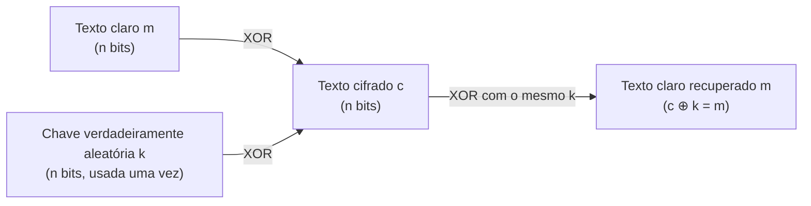

## Objetivos de Aprendizagem

- Definir o sigilo perfeito precisamente, em termos da crença posterior do atacante sobre o texto claro dado o texto cifrado.
- Construir a cifra one-time pad a partir de uma chave verdadeiramente aleatória e da operação XOR, e criptografar/descriptografar um exemplo curto à mão.
- Provar, informal mas rigorosamente, por que o one-time pad alcança sigilo perfeito quando as suas duas condições (aleatoriedade verdadeira, uso único) se mantêm.
- Explicar concretamente o que quebra, e demonstrar a quebra, no momento em que qualquer condição é violada.
- Explicar por que o sigilo perfeito, apesar de ser a garantia mais forte possível, não é como virtualmente qualquer sistema real criptografa dados, e qual garantia prática (segurança computacional) toma o seu lugar do próximo conceito em diante.

## Contexto e Motivação

Tendo estabelecido o que objetivos de segurança significam (confidencialidade, integridade, disponibilidade) e como pensar sobre ameaças sistematicamente (STRIDE), esta disciplina volta-se ao seu primeiro mecanismo concreto: criptografia para confidencialidade. Ela começa, deliberadamente, com a única cifra que alcança a garantia teórica *mais forte possível*, não porque é prática (quase nunca é), mas porque estabelece um limite superior exato e matematicamente provável contra o qual toda cifra posterior e mais prática (AES, coberta em seguida) pode ser honestamente comparada e entendida como um compromisso deliberado, não um atalho inexplicado.

O **sigilo perfeito**, uma noção formalizada por Claude Shannon em 1949, significa que observar o texto cifrado dá a um bisbilhoteiro *zero* informação adicional sobre o texto claro, a sua crença sobre o que a mensagem diz é matematicamente idêntica antes e depois de ver a versão criptografada. Este é um requisito extraordinariamente forte, e ele é genuinamente alcançável, por uma cifra simples o bastante para descrever numa frase: o **one-time pad**. Entender exatamente por que ele funciona, e exatamente por que as suas condições quase nunca são satisfazíveis na prática, é a fundação certa para tudo que segue, porque toda cifra subsequente nesta disciplina é, num sentido preciso, a resposta de uma cifra prática a "o que abrimos mão, e o que ganhamos, ao relaxar o sigilo perfeito?".

## Teoria Central

### Sigilo perfeito, formalmente enunciado (informalmente)

Uma cifra alcança sigilo perfeito se, para todo par de mensagens de texto claro possíveis `m₀` e `m₁` do mesmo comprimento, e para todo texto cifrado possível `c`, a probabilidade de observar `c` quando `m₀` foi criptografado é exatamente igual à probabilidade de observar `c` quando `m₁` foi criptografado. Em linguagem simples: ver qualquer texto cifrado específico é exatamente tão provável sob qualquer texto claro possível quanto sob qualquer outro, o texto cifrado não carrega informação alguma que deixaria um atacante favorecer um texto claro candidato sobre outro, não importa quanto poder computacional ele tenha. Esta última cláusula é importante e distingue o sigilo perfeito de toda outra noção de segurança nesta disciplina: o sigilo perfeito se mantém mesmo contra um atacante com poder computacional *ilimitado*, que é exatamente por que ele é a noção de confidencialidade mais forte que existe.

### Construindo o one-time pad

O one-time pad é notavelmente simples de descrever:

1. Gerar uma chave `k` que é uma sequência de bits verdadeiramente aleatórios, exatamente tão longa quanto a mensagem `m` a ser enviada.
2. Criptografar computando `c = m ⊕ k` (XOR bit a bit, ou-exclusivo, da mensagem e da chave).
3. Descriptografar computando `m = c ⊕ k` (o XOR é o seu próprio inverso: `(m ⊕ k) ⊕ k = m`, porque `k ⊕ k` é todo zeros).

Essa é a cifra inteira. A sua segurança repousa inteiramente na chave: uma chave verdadeiramente aleatória, usada exatamente uma vez, significa que para qualquer texto cifrado observado `c`, todo texto claro possível `m'` do mesmo comprimento é igualmente consistente com `c`, porque existe exatamente um valor de chave (`k' = c ⊕ m'`) que teria produzido esse texto cifrado a partir daquele texto claro, e já que todo valor de chave era igualmente provável a priori (a chave é uniformemente aleatória), todo texto claro permanece igualmente provável depois de ver `c`. Esta é, precisamente, a definição de sigilo perfeito satisfeita por construção direta, não por uma suposição não provada sobre o poder computacional limitado de um atacante (que é como essencialmente toda outra cifra nesta disciplina alcança a sua garantia mais fraca, mas ainda praticamente suficiente).

### As duas condições, e por que ambas são essenciais

O sigilo perfeito se mantém *só* se ambas as condições forem satisfeitas simultaneamente:

- **Aleatoriedade verdadeira**: a chave tem de vir de uma fonte sem nenhuma estrutura previsível de forma alguma, não uma senha, não a saída de um gerador de números pseudoaleatórios (a saída de um PRG é, por construção, inteiramente determinada por uma semente muito mais curta, que reintroduz exatamente a estrutura que o sigilo perfeito exige estar ausente).
- **Uso único ("one-time")**: a chave nunca deve ser reusada, mesmo parcialmente, por mais de uma mensagem. Reusar uma chave quebra a segurança *catastroficamente*, não só parcialmente, como a próxima seção demonstra.

Juntas, estas condições implicam um problema de gerenciamento de chave que é, em geral, exatamente tão difícil quanto o problema original que a cifra deveria resolver: uma chave tão longa quanto a mensagem, usável só uma vez, tem de de alguma forma ser distribuída a ambas as partes de antemão por algum canal pelo menos tão seguro quanto o que está sendo protegido. Esta circularidade, precisar de um canal seguro para estabelecer a chave que deixaria você evitar precisar de um canal seguro, é precisamente por que o one-time pad, apesar da sua garantia teórica perfeita, não é como essencialmente qualquer sistema de comunicação real funciona. (Exceções históricas existem, comunicações diplomáticas e de inteligência usaram one-time pads físicos, distribuídos por mensageiros confiáveis, especificamente porque o custo de distribuição de chave foi julgado aceitável para comunicação de valor extremamente alto e baixo volume.)



## Exemplos Resolvidos

### Exemplo 1: Criptografando e descriptografando à mão

Codifique a mensagem de 3 caracteres `"NO!"` em binário ASCII e combine-a com uma chave verdadeiramente aleatória de 24 bits via XOR.

```text
Texto claro  "N"  "O"  "!"
ASCII         78   79   33
Binário  01001110 01001111 00100001

Chave aleatória (ilustrativa, tem de ser verdadeiramente aleatória na prática):
         10110101 00011010 11101001

Texto cifrado = texto claro XOR chave:
  01001110 XOR 10110101 = 11111011
  01001111 XOR 00011010 = 01010101
  00100001 XOR 11101001 = 11001000

Descriptografia: texto cifrado XOR MESMA chave recupera o texto claro exatamente:
  11111011 XOR 10110101 = 01001110 = "N"  ✓
  01010101 XOR 00011010 = 01001111 = "O"  ✓
  11001000 XOR 11101001 = 00100001 = "!"  ✓
```

Repare que sem conhecer a chave, o texto cifrado `11111011 01010101 11001000` é, provavelmente, exatamente tão consistente com o texto claro `"NO!"` quanto é com qualquer outra mensagem de 3 caracteres, incluindo, por exemplo, `"YES"`, porque existe alguma chave de 24 bits que mapeia `"YES"` para esse exato mesmo texto cifrado, e essa chave era, a priori, exatamente tão provável de ter sido escolhida quanto a chave de fato era.

### Exemplo 2: Demonstrando a falha catastrófica do reuso de chave

Suponha que a mesma chave `k` é erroneamente reusada para criptografar duas mensagens diferentes, produzindo `c₁ = m₁ ⊕ k` e `c₂ = m₂ ⊕ k`. Um bisbilhoteiro que intercepta ambos os textos cifrados, sem conhecer a chave de forma alguma, consegue computar:

```text
c₁ ⊕ c₂ = (m₁ ⊕ k) ⊕ (m₂ ⊕ k) = m₁ ⊕ m₂

A chave cancela INTEIRAMENTE, o atacante recupera o XOR dos dois
textos claros diretamente, sem jamais aprender k.
```

`m₁ ⊕ m₂` não é os textos claros em si, mas é uma quantidade massiva de estrutura: se o atacante tem qualquer palpite sobre parte de uma mensagem (digamos, suspeita que `m₁` começa com uma frase comum, ou está num formato conhecido), ele pode fazer XOR desse palpite contra `m₁ ⊕ m₂` para recuperar a parte correspondente de `m₂` diretamente, e técnicas criptanalíticas reais (análise de frequência sobre o fluxo `m₁ ⊕ m₂` recuperado, explorando que texto de linguagem natural e dados estruturados estão longe de ser aleatórios) historicamente quebraram o uso de two-time-pad completamente, mais famosamente em cabos diplomáticos soviéticos durante o projeto Venona, onde material de chave de one-time-pad reusado deixou criptanalistas recuperarem texto claro de tráfego interceptado e supostamente perfeitamente secreto. A lição generaliza além desta cifra específica: reusar material de chave criptográfica supostamente de uso único é um dos erros criptográficos do mundo real mais catastróficos e recorrentes, e ele reocorre depois nesta disciplina no contexto de modos parecidos com cifra de fluxo de cifras de bloco.

### Exemplo 3: Por que uma "chave" curta e memorável não consegue alcançar sigilo perfeito

Suponha que alguém propõe usar uma senha memorável de 8 caracteres, repetida para corresponder ao comprimento da mensagem, em vez de uma chave verdadeiramente aleatória e de comprimento completo.

```text
Comprimento da mensagem:  1000 bits
"Chave":                  senha de 8 caracteres, repetida ~15 vezes para preencher 1000 bits

Problema: a chave tem, no máximo, tanta entropia (imprevisibilidade) quanto uma
senha de 8 caracteres pode carregar, muito menos do que 1000 bits de
aleatoriedade verdadeira. Um atacante não precisa adivinhar a chave completa de 1000 bits; ele
só precisa adivinhar a senha muito mais curta e o seu padrão de repetição,
que é um espaço de busca enormemente menor, e a estrutura repetitiva
ela mesma vaza informação (blocos de chave idênticos fazem XOR de blocos de texto claro
idênticos num padrão repetitivo detectável no texto cifrado).
```

É exatamente por isso que "aleatoriedade verdadeira, tão longa quanto a mensagem" não é uma tecnicalidade menor, qualquer atalho no comprimento ou na qualidade de aleatoriedade da chave reduz a cifra a algo com um espaço de chave efetivo muito menor do que 2^(comprimento de bits), quebrando a prova de sigilo perfeito na sua fundação.

## Equívocos Comuns e Armadilhas

- **"A criptografia baseada em XOR é inerentemente fraca; é por isso que o AES não a usa."** O XOR em si não é a fraqueza, a construção XOR do one-time pad é *provavelmente* a cifra mais forte possível quando as suas condições de chave se mantêm. A fraqueza está inteiramente na praticidade de gerar e distribuir uma chave verdadeiramente aleatória, do comprimento da mensagem, de uso único; o AES (coberto em seguida) usa XOR internamente também, combinado com outras operações, precisamente para obter segurança forte de uma chave muito mais curta e reutilizável.
- **"Um one-time pad é só uma cifra forte baseada em senha."** Uma senha, por mais longa ou complexa, tem muito menos entropia do que uma string de bits verdadeiramente aleatória do mesmo comprimento, e reusá-la (mesmo implicitamente, derivando um keystream repetitivo dela) destrói a garantia de sigilo perfeito, como o Exemplo 3 mostra diretamente.
- **"Sigilo perfeito significa 'muito difícil de quebrar'."** O sigilo perfeito é uma afirmação muito mais forte e qualitativamente diferente: significa inquebrável independentemente do poder computacional, não meramente "inquebrável com os computadores de hoje" ou "inquebrável em tempo razoável", a forma computacional mais fraca de segurança na qual essencialmente toda outra cifra nesta disciplina (começando pelo próximo conceito) se apoia em vez disso.
- **"Reusar uma chave de one-time pad duas vezes é só duas vezes mais arriscado."** Como o Exemplo 2 mostra, o reuso não degrada a segurança linearmente, ele pode catastrófica e completamente quebrar a confidencialidade via a relação `c₁ ⊕ c₂ = m₁ ⊕ m₂`, que é por que "one-time" não é uma recomendação suave mas um requisito rígido e estrutural da prova.
- **"O one-time pad é uma curiosidade histórica sem relevância para sistemas modernos."** O exato modo de falha de reuso de chave/nonce reocorre diretamente em cifras de fluxo modernas e certos modos de operação de cifra de bloco (cobertos no próximo conceito), entender por que ele quebra o one-time pad é exatamente o raciocínio necessário para entender por que sistemas modernos são tão cuidadosos em nunca reusar um nonce.

## Resumo

O sigilo perfeito, o texto cifrado revelando zero informação sobre o texto claro, mesmo contra um atacante ilimitado, é alcançado exatamente pelo one-time pad: fazer XOR da mensagem com uma chave verdadeiramente aleatória, do comprimento da mensagem, usada exatamente uma vez. A prova segue diretamente da construção: todo texto claro possível é igualmente consistente com qualquer texto cifrado observado, porque exatamente um valor de chave mapeia cada texto claro para esse texto cifrado, e toda chave era igualmente provável de antemão. Ambas as condições, aleatoriedade verdadeira e uso único, são essenciais e inegociáveis: violar o uso único deixa um bisbilhoteiro cancelar a chave inteiramente via `c₁ ⊕ c₂ = m₁ ⊕ m₂`, uma quebra catastrófica e historicamente realizada, não uma degradação menor. O requisito de distribuição de chave do one-time pad (uma chave aleatória tão longa quanto toda mensagem, entregue de antemão por um canal igualmente seguro) é exatamente tão difícil quanto o problema que ele resolve, que é por que virtualmente nenhum sistema real o usa, em vez disso, o próximo conceito introduz cifras de bloco como o AES, que trocam a impossibilidade do sigilo perfeito pela garantia praticamente suficiente e muito mais usável da segurança computacional: inquebrável por qualquer atacante com uma quantidade realista de poder computacional, embora não inquebrável num sentido absoluto e teórico-informacional.

## Documentation Links

- [Stanford CS255 — Introduction to Cryptography, Course Syllabus](https://cs255.stanford.edu/syllabus.html): o curso fonte para a sequência de criptografia desta disciplina, abrindo com exatamente este material (one-time pad, cifras de fluxo, sigilo perfeito).
- [Boneh & Shoup — A Graduate Course in Applied Cryptography](https://toc.cryptobook.us/): livro-texto gratuito com um tratamento completo e rigoroso do sigilo perfeito e do one-time pad, incluindo o ataque de reuso de estilo Venona.
