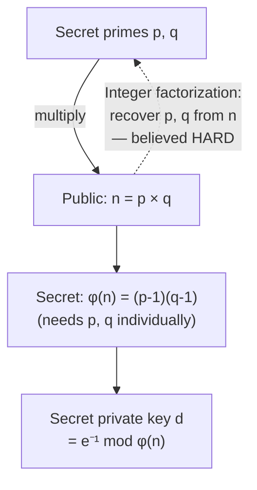

## Learning Objectives

- Execute RSA key generation, encryption, and decryption by hand on small, concrete primes.
- Explain precisely how Fermat's little theorem (from the modular-arithmetic concept) guarantees that RSA decryption recovers the original message.
- State why RSA's security rests on the integer factorization problem, and distinguish this from Diffie-Hellman's reliance on the discrete logarithm problem.
- Explain why production RSA uses primes with hundreds of digits, and why the small examples worked here would be trivially breakable in practice.
- Describe, at a conceptual level, how RSA can be used for encryption and (previewed for the next concept) for signing, and why those are related but distinct uses of the same underlying trapdoor.

## Context & Motivation

Diffie-Hellman solved the problem of establishing a shared secret over a public channel, but left open a related, equally important capability: letting anyone encrypt a message to a specific recipient using only that recipient's *public*, openly-published information, with only the recipient able to decrypt it using a *private* key they alone hold. **RSA**, published in 1977 by Ron Rivest, Adi Shamir, and Leonard Adleman, was the first practical, widely-adopted scheme to provide exactly this capability, and it remains — alongside Diffie-Hellman-family key exchange and its elliptic-curve variants — one of the two foundational pillars of modern public-key cryptography.

RSA's structure differs from Diffie-Hellman's in an important way worth stating up front: Diffie-Hellman is a *key-exchange* protocol (both parties interact to jointly derive a shared secret); RSA is a *public-key encryption and signature* scheme (one party generates a keypair once, publishes the public half, and anyone can then encrypt to them — or, as the next concept covers, verify something they signed — without any further interaction). Both, however, rest on exactly the number-theoretic toolkit already built in the previous two concepts, and this concept's central goal is to make that connection completely explicit: RSA is Fermat's little theorem, the extended Euclidean algorithm, and modular exponentiation, arranged into a specific, provably-correct protocol.

## Core Theory

### Key generation

1. Choose two large, distinct prime numbers `p` and `q` (in production, each several hundred digits long — kept secret after this step, never published).
2. Compute `n = p × q` (this product is published — it becomes part of the public key).
3. Compute `φ(n) = (p - 1)(q - 1)` (Euler's totient of `n` — a count of how many integers less than `n` are coprime to it; kept secret, since computing it requires knowing `p` and `q` individually).
4. Choose a public exponent `e` such that `1 < e < φ(n)` and `gcd(e, φ(n)) = 1` (a common practical choice is `e = 65537`, chosen for its useful bit pattern that makes modular exponentiation efficient, not for any deeper security reason).
5. Compute the private exponent `d` as the multiplicative inverse of `e` modulo `φ(n)` — i.e. `d` such that `e · d ≡ 1 (mod φ(n))` — using the extended Euclidean algorithm, exactly as already covered.

The **public key** is the pair `(n, e)`; the **private key** is `d` (with `p`, `q`, and `φ(n)` typically discarded or kept securely, since they are no longer needed and their exposure would compromise the key).

### Encryption and decryption

To encrypt a message `m` (represented as an integer, `0 ≤ m < n`) using the recipient's public key `(n, e)`:

```text
c = m^e mod n
```

To decrypt the ciphertext `c` using the private key `d`:

```text
m = c^d mod n
```

### Why this recovers the original message: Fermat's little theorem at work

The correctness of RSA — that decryption really does recover the original `m` — follows directly from how `e` and `d` were chosen. Since `e · d ≡ 1 (mod φ(n))`, there exists some integer `k` such that `e · d = 1 + k · φ(n)`. Then:

```text
c^d mod n = (m^e)^d mod n = m^(ed) mod n = m^(1 + k·φ(n)) mod n
          = m · (m^φ(n))^k mod n
```

By a generalization of Fermat's little theorem to a composite modulus `n = pq` (specifically, Euler's theorem, which states `m^φ(n) ≡ 1 (mod n)` whenever `m` is coprime to `n`), the term `(m^φ(n))^k` reduces to `1^k = 1`, leaving:

```text
c^d mod n = m · 1 mod n = m
```

Decryption recovers exactly the original message. This is not a coincidence or an empirical observation — it is a direct, provable algebraic consequence of choosing `d` as `e`'s inverse modulo `φ(n)`, which is precisely why the modular-arithmetic groundwork from two concepts ago (Fermat's little theorem specifically) was introduced before RSA rather than treated as a standalone curiosity.

### Why RSA is secure: the integer factorization problem

An attacker who observes the public key `(n, e)` and a ciphertext `c` needs the private exponent `d` to decrypt — and computing `d` requires knowing `φ(n) = (p-1)(q-1)`, which in turn requires knowing the individual prime factors `p` and `q` of `n`. **Integer factorization** — recovering `p` and `q` from their product `n` — is believed computationally hard for sufficiently large primes, with no known efficient (polynomial-time) algorithm on ordinary computers, despite `n` itself being trivial to compute from `p` and `q` in the forward direction. This is the same "easy forward, hard backward" asymmetry that made Diffie-Hellman work, but grounded in a genuinely different hard problem: Diffie-Hellman's security rests on the discrete logarithm problem (recovering an exponent); RSA's rests on integer factorization (recovering prime factors) — a distinction worth keeping precise, since the two problems, while both believed hard, are not known to be equivalent, and a future breakthrough against one would not automatically break the other.



## Worked Examples

### Example 1: Full RSA key generation, encryption, and decryption by hand

Choose small primes `p = 61`, `q = 53` (genuinely how a textbook example proceeds; production RSA uses primes hundreds of digits long instead — see the caveat in Example 3).

```text
n = p × q = 61 × 53 = 3233
φ(n) = (p-1)(q-1) = 60 × 52 = 3120

Choose e = 17 (check: gcd(17, 3120) = 1  ✓)

Find d = 17⁻¹ mod 3120 via the extended Euclidean algorithm:
  3120 = 183·17 + 9
    17 = 1·9 + 8
     9 = 1·8 + 1
     8 = 8·1 + 0                gcd = 1 ✓
  Back-substituting gives d = 2753
  Check: 17 × 2753 = 46801 = 15·3120 + 1  →  46801 mod 3120 = 1  ✓

Public key: (n=3233, e=17).  Private key: d=2753.

Encrypt m = 65 ("A" in a toy ASCII-like scheme, for illustration):
  c = 65^17 mod 3233 = 2790

Decrypt c = 2790:
  m = 2790^2753 mod 3233 = 65   ✓ recovers the original message exactly
```

(This is, in fact, the exact textbook example originally published alongside the RSA paper, reproduced here because it is small enough to verify by hand while illustrating every step of the real algorithm without simplification.)

### Example 2: Confirming the Fermat's-little-theorem argument numerically

```text
φ(3233) = 3120.  e·d = 17 × 2753 = 46801 = 1 + 15×3120
                  so k = 15 in the derivation above.

The claim: m^(e·d) mod n = m, for m = 65.
  65^46801 mod 3233 should equal 65.

This astronomically large exponentiation is exactly what repeated
squaring (from the modular-arithmetic concept) makes tractable — and
it evaluates, correctly, to 65, confirming the algebraic proof holds
for this concrete instance, not just in the abstract.
```

### Example 3: Why these small primes would be instantly broken in practice

```text
n = 3233 (from Example 1) — factoring this by hand or with a basic
computer program takes a fraction of a second: 3233 = 61 × 53.

Production RSA (as of current recommendations) uses primes such that
n has AT LEAST 2048 bits (roughly 617 decimal digits) — a number so
large that the best known factoring algorithms (the general number
field sieve, among others) would require far more computation than is
feasible with any currently foreseeable computing power, even though
the SAME algorithm (RSA key generation, encryption, decryption) is
being used, unchanged, at both scales.

The worked examples above are deliberately, explicitly toy-sized, purely
to make the arithmetic checkable by hand — they are not a statement
about real-world RSA parameter choices, which differ by roughly two
hundred orders of magnitude in the size of n.
```

## Common Misconceptions & Pitfalls

- **"RSA encrypts and decrypts using the same key, just like AES."** RSA is asymmetric by design: the public key `(n, e)` encrypts, and only the corresponding private key `d` — which cannot be feasibly derived from the public key without factoring `n` — can decrypt; this is the entire point of public-key cryptography, distinguishing it from every symmetric scheme covered earlier in this discipline.
- **"A bigger e or a specific 'magic' choice of e is what makes RSA secure."** The public exponent `e` (commonly 65537) is chosen for computational convenience (an efficient bit pattern for modular exponentiation), not as a secret or a security parameter — RSA's security rests entirely on the difficulty of factoring `n`, which depends on the size and quality of the secret primes `p` and `q`, not on the choice of `e`.
- **"RSA's security proof guarantees no future algorithm can ever factor large numbers efficiently."** Like the discrete logarithm assumption behind Diffie-Hellman, integer factorization's hardness is an empirical, not a proven, assumption — no proof rules out a future breakthrough (classical or, notably, a sufficiently large fault-tolerant quantum computer running Shor's algorithm, which would break both RSA and Diffie-Hellman efficiently) — this is why post-quantum cryptography is an active, serious research area, referenced but out of scope here.
- **"Since φ(n) = (p-1)(q-1) is used, φ(n) can just be published alongside n for convenience."** φ(n) must be kept secret — publishing it, together with the already-public `n`, would let anyone directly solve for `p` and `q` (they become the roots of a simple quadratic derivable from `n` and `φ(n)`), completely bypassing the difficulty of factoring `n` from scratch.
- **"RSA encryption is used to directly encrypt large messages, like AES is."** Because RSA's modular exponentiation is computationally far more expensive than AES for large amounts of data, real systems almost always use RSA only to encrypt a short, random symmetric key (a "session key"), then use that symmetric key with a fast cipher like AES to actually encrypt the message itself — a hybrid approach that combines RSA's key-establishment convenience with AES's raw speed, seen again in this discipline's TLS-handshake capstone.

## Summary

RSA generates a public key `(n, e)` and a private key `d` from two secret primes `p` and `q`, such that encryption (`m^e mod n`) and decryption (`c^d mod n`) are provable inverses of each other — a direct algebraic consequence of choosing `d` as `e`'s multiplicative inverse modulo `φ(n) = (p-1)(q-1)` and applying Euler's theorem (Fermat's little theorem's generalization to a composite modulus). Its security rests on the integer factorization problem — recovering `p` and `q` from their published product `n` is believed computationally infeasible for sufficiently large primes — a different hard problem from Diffie-Hellman's discrete logarithm, though both share the same "easy forward, hard backward" structure. Production deployments use primes hundreds of digits long specifically because the small, hand-computable examples worked here would be instantly factorable; the algorithm itself is identical at both scales, only the parameter size differs. With RSA's encryption use established, the next concept turns to a closely related, equally important use of the same trapdoor: running the operations in reverse to produce a digital signature, and building the certificate infrastructure that lets a public key be trusted in the first place.

## Documentation Links

- [Stanford CS255 — Introduction to Cryptography, Course Syllabus](https://cs255.stanford.edu/syllabus.html) — covers RSA trapdoor permutations immediately after Diffie-Hellman and ElGamal, in exactly this sequence.
- [Boneh & Shoup — A Graduate Course in Applied Cryptography](https://toc.cryptobook.us/) — free textbook with a full, rigorous treatment of RSA, including the correctness proof via Euler's theorem and the factoring-based security argument.
