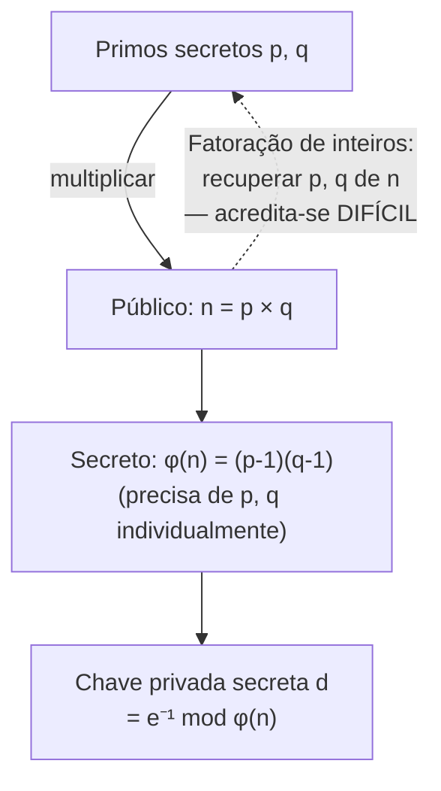

## Objetivos de Aprendizagem

- Executar a geração de chave, criptografia e descriptografia RSA à mão sobre primos pequenos e concretos.
- Explicar precisamente como o pequeno teorema de Fermat (do conceito de aritmética modular) garante que a descriptografia RSA recupera a mensagem original.
- Enunciar por que a segurança do RSA repousa sobre o problema da fatoração de inteiros, e distinguir isto da dependência do Diffie-Hellman do problema do logaritmo discreto.
- Explicar por que o RSA de produção usa primos com centenas de dígitos, e por que os exemplos pequenos trabalhados aqui seriam trivialmente quebráveis na prática.
- Descrever, num nível conceitual, como o RSA pode ser usado para criptografia e (previsto para o próximo conceito) para assinatura, e por que esses são usos relacionados mas distintos do mesmo trapdoor subjacente.

## Contexto e Motivação

O Diffie-Hellman resolveu o problema de estabelecer um segredo compartilhado sobre um canal público, mas deixou em aberto uma capacidade relacionada e igualmente importante: deixar qualquer um criptografar uma mensagem a um destinatário específico usando só a informação *pública* e abertamente publicada daquele destinatário, com só o destinatário capaz de descriptografá-la usando uma chave *privada* que só ele guarda. O **RSA**, publicado em 1977 por Ron Rivest, Adi Shamir e Leonard Adleman, foi o primeiro esquema prático e amplamente adotado a fornecer exatamente essa capacidade, e ele permanece, ao lado da troca de chaves da família Diffie-Hellman e das suas variantes de curva elíptica, um dos dois pilares fundacionais da criptografia de chave pública moderna.

A estrutura do RSA difere da do Diffie-Hellman de uma forma importante que vale enunciar de antemão: o Diffie-Hellman é um protocolo de *troca de chaves* (ambas as partes interagem para derivar conjuntamente um segredo compartilhado); o RSA é um esquema de *criptografia e assinatura de chave pública* (uma parte gera um par de chaves uma vez, publica a metade pública, e qualquer um pode então criptografar para ela, ou, como o próximo conceito cobre, verificar algo que ela assinou, sem nenhuma interação adicional). Ambos, no entanto, repousam exatamente sobre o kit de ferramentas teórico-numérico já construído nos dois conceitos anteriores, e o objetivo central deste conceito é tornar essa conexão completamente explícita: o RSA é o pequeno teorema de Fermat, o algoritmo estendido de Euclides e a exponenciação modular, arranjados num protocolo específico e comprovadamente correto.

## Teoria Central

### Geração de chave

1. Escolher dois números primos grandes e distintos `p` e `q` (em produção, cada um de várias centenas de dígitos de comprimento, mantidos secretos depois deste passo, nunca publicados).
2. Computar `n = p × q` (este produto é publicado, ele se torna parte da chave pública).
3. Computar `φ(n) = (p - 1)(q - 1)` (o totiente de Euler de `n`, uma contagem de quantos inteiros menores do que `n` são coprimos a ele; mantido secreto, já que computá-lo exige conhecer `p` e `q` individualmente).
4. Escolher um expoente público `e` tal que `1 < e < φ(n)` e `gcd(e, φ(n)) = 1` (uma escolha prática comum é `e = 65537`, escolhida pelo seu padrão de bits útil que torna a exponenciação modular eficiente, não por qualquer razão de segurança mais profunda).
5. Computar o expoente privado `d` como o inverso multiplicativo de `e` módulo `φ(n)`, isto é, `d` tal que `e · d ≡ 1 (mod φ(n))`, usando o algoritmo estendido de Euclides, exatamente como já coberto.

A **chave pública** é o par `(n, e)`; a **chave privada** é `d` (com `p`, `q` e `φ(n)` tipicamente descartados ou mantidos com segurança, já que não são mais necessários e a sua exposição comprometeria a chave).

### Criptografia e descriptografia

Para criptografar uma mensagem `m` (representada como um inteiro, `0 ≤ m < n`) usando a chave pública do destinatário `(n, e)`:

```text
c = m^e mod n
```

Para descriptografar o texto cifrado `c` usando a chave privada `d`:

```text
m = c^d mod n
```

### Por que isto recupera a mensagem original: o pequeno teorema de Fermat em ação

A correção do RSA, de que a descriptografia de fato recupera o `m` original, segue diretamente de como `e` e `d` foram escolhidos. Já que `e · d ≡ 1 (mod φ(n))`, existe algum inteiro `k` tal que `e · d = 1 + k · φ(n)`. Então:

```text
c^d mod n = (m^e)^d mod n = m^(ed) mod n = m^(1 + k·φ(n)) mod n
          = m · (m^φ(n))^k mod n
```

Por uma generalização do pequeno teorema de Fermat a um módulo composto `n = pq` (especificamente, o teorema de Euler, que enuncia `m^φ(n) ≡ 1 (mod n)` sempre que `m` é coprimo a `n`), o termo `(m^φ(n))^k` reduz a `1^k = 1`, deixando:

```text
c^d mod n = m · 1 mod n = m
```

A descriptografia recupera exatamente a mensagem original. Isto não é uma coincidência ou uma observação empírica, é uma consequência algébrica direta e provável de escolher `d` como o inverso de `e` módulo `φ(n)`, que é precisamente por que o trabalho de base de aritmética modular de dois conceitos atrás (o pequeno teorema de Fermat especificamente) foi introduzido antes do RSA em vez de tratado como uma curiosidade autônoma.

### Por que o RSA é seguro: o problema da fatoração de inteiros

Um atacante que observa a chave pública `(n, e)` e um texto cifrado `c` precisa do expoente privado `d` para descriptografar, e computar `d` exige conhecer `φ(n) = (p-1)(q-1)`, que por sua vez exige conhecer os fatores primos individuais `p` e `q` de `n`. A **fatoração de inteiros**, recuperar `p` e `q` do seu produto `n`, é acreditada computacionalmente difícil para primos suficientemente grandes, sem nenhum algoritmo eficiente (de tempo polinomial) conhecido em computadores comuns, apesar de o próprio `n` ser trivial de computar a partir de `p` e `q` na direção para frente. Esta é a mesma assimetria "fácil para frente, difícil para trás" que fez o Diffie-Hellman funcionar, mas fundamentada num problema difícil genuinamente diferente: a segurança do Diffie-Hellman repousa sobre o problema do logaritmo discreto (recuperar um expoente); a do RSA repousa sobre a fatoração de inteiros (recuperar fatores primos), uma distinção que vale manter precisa, já que os dois problemas, embora ambos acreditados difíceis, não são sabidos ser equivalentes, e um avanço futuro contra um não quebraria automaticamente o outro.



## Exemplos Resolvidos

### Exemplo 1: Geração de chave, criptografia e descriptografia RSA completa à mão

Escolher primos pequenos `p = 61`, `q = 53` (genuinamente como um exemplo de livro-texto procede; o RSA de produção usa primos de centenas de dígitos de comprimento em vez disso, veja a ressalva no Exemplo 3).

```text
n = p × q = 61 × 53 = 3233
φ(n) = (p-1)(q-1) = 60 × 52 = 3120

Escolher e = 17 (checar: gcd(17, 3120) = 1  ✓)

Encontrar d = 17⁻¹ mod 3120 via o algoritmo estendido de Euclides:
  3120 = 183·17 + 9
    17 = 1·9 + 8
     9 = 1·8 + 1
     8 = 8·1 + 0                gcd = 1 ✓
  Substituir de volta dá d = 2753
  Checar: 17 × 2753 = 46801 = 15·3120 + 1  →  46801 mod 3120 = 1  ✓

Chave pública: (n=3233, e=17).  Chave privada: d=2753.

Criptografar m = 65 ("A" num esquema parecido com ASCII de brinquedo, para ilustração):
  c = 65^17 mod 3233 = 2790

Descriptografar c = 2790:
  m = 2790^2753 mod 3233 = 65   ✓ recupera a mensagem original exatamente
```

(Este é, de fato, o exato exemplo de livro-texto originalmente publicado junto ao artigo do RSA, reproduzido aqui porque é pequeno o bastante para verificar à mão enquanto ilustra todo passo do algoritmo real sem simplificação.)

### Exemplo 2: Confirmando o argumento do pequeno teorema de Fermat numericamente

```text
φ(3233) = 3120.  e·d = 17 × 2753 = 46801 = 1 + 15×3120
                  então k = 15 na derivação acima.

A afirmação: m^(e·d) mod n = m, para m = 65.
  65^46801 mod 3233 deveria ser igual a 65.

Esta exponenciação astronomicamente grande é exatamente o que os quadrados
repetidos (do conceito de aritmética modular) tornam tratável, e
ela avalia, corretamente, para 65, confirmando que a prova algébrica se mantém
para esta instância concreta, não só no abstrato.
```

### Exemplo 3: Por que estes primos pequenos seriam instantaneamente quebrados na prática

```text
n = 3233 (do Exemplo 1) — fatorar isto à mão ou com um programa de
computador básico leva uma fração de segundo: 3233 = 61 × 53.

O RSA de produção (a partir das recomendações atuais) usa primos tais que
n tem PELO MENOS 2048 bits (aproximadamente 617 dígitos decimais), um número tão
grande que os melhores algoritmos de fatoração conhecidos (a peneira de corpo
numérico geral, entre outros) exigiriam muito mais computação do que é
viável com qualquer poder computacional atualmente previsível, mesmo que o
MESMO algoritmo (geração de chave, criptografia, descriptografia RSA) esteja
sendo usado, inalterado, em ambas as escalas.

Os exemplos trabalhados acima são deliberada e explicitamente de tamanho de brinquedo, puramente
para tornar a aritmética checável à mão, eles não são uma declaração
sobre escolhas de parâmetro de RSA do mundo real, que diferem por cerca de
duzentas ordens de magnitude no tamanho de n.
```

## Equívocos Comuns e Armadilhas

- **"O RSA criptografa e descriptografa usando a mesma chave, assim como o AES."** O RSA é assimétrico por design: a chave pública `(n, e)` criptografa, e só a chave privada correspondente `d`, que não pode ser viavelmente derivada da chave pública sem fatorar `n`, consegue descriptografar; este é o ponto inteiro da criptografia de chave pública, distinguindo-a de todo esquema simétrico coberto antes nesta disciplina.
- **"Um e maior ou uma escolha 'mágica' específica de e é o que torna o RSA seguro."** O expoente público `e` (comumente 65537) é escolhido por conveniência computacional (um padrão de bits eficiente para exponenciação modular), não como um segredo ou um parâmetro de segurança, a segurança do RSA repousa inteiramente sobre a dificuldade de fatorar `n`, que depende do tamanho e da qualidade dos primos secretos `p` e `q`, não da escolha de `e`.
- **"A prova de segurança do RSA garante que nenhum algoritmo futuro pode jamais fatorar grandes números eficientemente."** Como a suposição de logaritmo discreto por trás do Diffie-Hellman, a dificuldade da fatoração de inteiros é uma suposição empírica, não provada, nenhuma prova descarta um avanço futuro (clássico ou, notavelmente, um computador quântico tolerante a falhas suficientemente grande rodando o algoritmo de Shor, que quebraria tanto o RSA quanto o Diffie-Hellman eficientemente), é por isso que a criptografia pós-quântica é uma área de pesquisa ativa e séria, referenciada mas fora de escopo aqui.
- **"Já que φ(n) = (p-1)(q-1) é usado, φ(n) pode simplesmente ser publicado junto a n por conveniência."** φ(n) tem de ser mantido secreto, publicá-lo, junto ao já público `n`, deixaria qualquer um resolver diretamente para `p` e `q` (eles se tornam as raízes de uma quadrática simples derivável de `n` e `φ(n)`), contornando completamente a dificuldade de fatorar `n` do zero.
- **"A criptografia RSA é usada para criptografar diretamente mensagens grandes, como o AES é."** Porque a exponenciação modular do RSA é computacionalmente muito mais cara do que o AES para grandes quantidades de dados, sistemas reais quase sempre usam o RSA só para criptografar uma chave simétrica curta e aleatória (uma "chave de sessão"), depois usam essa chave simétrica com uma cifra rápida como o AES para de fato criptografar a própria mensagem, uma abordagem híbrida que combina a conveniência de estabelecimento de chave do RSA com a velocidade bruta do AES, vista de novo no capstone de handshake TLS desta disciplina.

## Resumo

O RSA gera uma chave pública `(n, e)` e uma chave privada `d` a partir de dois primos secretos `p` e `q`, de forma que a criptografia (`m^e mod n`) e a descriptografia (`c^d mod n`) são inversos prováveis uma da outra, uma consequência algébrica direta de escolher `d` como o inverso multiplicativo de `e` módulo `φ(n) = (p-1)(q-1)` e aplicar o teorema de Euler (a generalização do pequeno teorema de Fermat a um módulo composto). A sua segurança repousa sobre o problema da fatoração de inteiros, recuperar `p` e `q` do seu produto publicado `n` é acreditado computacionalmente inviável para primos suficientemente grandes, um problema difícil diferente do logaritmo discreto do Diffie-Hellman, embora ambos compartilhem a mesma estrutura "fácil para frente, difícil para trás". Implantações de produção usam primos de centenas de dígitos de comprimento especificamente porque os exemplos pequenos e computáveis à mão trabalhados aqui seriam instantaneamente fatoráveis; o próprio algoritmo é idêntico em ambas as escalas, só o tamanho do parâmetro difere. Com o uso de criptografia do RSA estabelecido, o próximo conceito volta-se a um uso estreitamente relacionado e igualmente importante do mesmo trapdoor: rodar as operações ao contrário para produzir uma assinatura digital, e construir a infraestrutura de certificado que deixa uma chave pública ser confiada em primeiro lugar.

## Documentation Links

- [Stanford CS255 — Introduction to Cryptography, Course Syllabus](https://cs255.stanford.edu/syllabus.html): cobre permutações trapdoor RSA imediatamente depois do Diffie-Hellman e do ElGamal, exatamente nesta sequência.
- [Boneh & Shoup — A Graduate Course in Applied Cryptography](https://toc.cryptobook.us/): livro-texto gratuito com um tratamento completo e rigoroso do RSA, incluindo a prova de correção via o teorema de Euler e o argumento de segurança baseado em fatoração.
