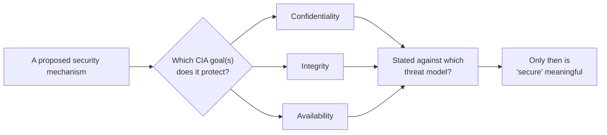

## Learning Objectives

- Define confidentiality, integrity, and availability, and classify a real-world security incident as primarily violating one, two, or all three.
- Explain why these three goals routinely conflict, and give a concrete example of a design that deliberately sacrifices one to protect another.
- Distinguish a security *goal* (what a system is trying to guarantee) from a security *mechanism* (the specific technique used to guarantee it) — encryption, access control, and backups are mechanisms; confidentiality, integrity, and availability are goals.
- State why "secure" is not a binary property of a system in isolation, but only meaningful relative to a stated threat model and a stated set of goals.
- Preview how the rest of this discipline maps onto these three goals: cryptography mostly serves confidentiality and integrity; authentication/authorization and network defenses mostly serve all three at once, in different ways.

## Context & Motivation

Before any cipher, any password check, or any firewall rule makes sense, a designer has to answer a prior question: protect *what*, from *what*? Security engineering, unlike most of the rest of computer science, is adversarial by nature — a sorting algorithm has to be correct against every input, but it does not have to be correct against an input that was deliberately, cleverly constructed by someone who has read the algorithm's source code and wants it to fail. A security mechanism does. That adversarial framing is what makes "security" a genuinely different kind of correctness property, and the CIA triad — confidentiality, integrity, availability — is the standard, decades-old vocabulary computer science uses to state precisely what "correct" means in this adversarial setting.

**Confidentiality** means information is not disclosed to anyone who isn't supposed to see it. A medical record read by an unauthorized employee, a password sniffed off an unencrypted network connection, and a database backup accidentally left on a public cloud bucket are all confidentiality failures, even though they involve completely different mechanisms and completely different attackers.

**Integrity** means information is not modified, whether by an attacker or by an accident, without that modification being detected. A grade changed in a school's database by someone who was never authorized to touch it, a message altered in transit between two banks, and a firmware update silently corrupted by a bit-flip in transit are all integrity failures — notice that the last one involves no attacker at all, which is why "integrity" is broader than "tamper-resistance": it also covers accidental corruption.

**Availability** means a system remains usable by the people who are supposed to be able to use it, when they need to use it. A denial-of-service attack that floods a server with junk traffic until legitimate users can't get through is the classic adversarial example; a hardware failure that takes a service offline is the classic accidental one. Notice, again, that not every availability failure requires an attacker.

The ACM/IEEE CS2013 curriculum guidelines list exactly this triad — confidentiality, integrity, availability, alongside authentication, and non-repudiation — as the foundational vocabulary of the entire Information Assurance and Security area, precisely because nearly every subsequent topic in this discipline is best understood as "a specific mechanism aimed at one or more of these three goals." Cryptographic hash functions and message authentication codes (covered later) exist almost entirely to serve integrity. Encryption exists almost entirely to serve confidentiality. Redundancy, rate limiting, and firewalls (also covered later) exist mostly to serve availability. Learning to ask "which of the three goals is this mechanism actually protecting?" is one of the most useful habits this discipline can build, because it is the fastest way to notice when a proposed defense doesn't actually address the threat it claims to.

## Core Theory

### The three goals, precisely

| Goal | Informal statement | Typical failure mode |
|---|---|---|
| Confidentiality | Only authorized parties can read the information | Eavesdropping, data leak, unauthorized access |
| Integrity | Only authorized parties can modify the information, and any modification (by anyone) is detectable | Tampering, corruption, forgery |
| Availability | Authorized parties can access the information/service when they need to | Denial of service, hardware failure, resource exhaustion |

A single system typically has to satisfy all three simultaneously, for different pieces of data or different actors, and it is entirely normal — not a design flaw — for a system to weight them differently depending on context. A nuclear launch system might sacrifice availability aggressively (multiple independent confirmations required, deliberately slow) in exchange for extremely strong integrity and confidentiality guarantees. A public news website inverts that: availability is paramount (the whole point is that anyone can read it), confidentiality of the *published* content is not a goal at all (it's meant to be public), while integrity of that content absolutely still matters (nobody should be able to silently edit a published article to say something the author never wrote).

### Why the three goals routinely conflict

The triad is not three independent knobs that can all be turned to maximum simultaneously — in practice, strengthening one often costs another.

- **Confidentiality vs. availability**: the strongest confidentiality guarantee is "nobody can ever read this," which is also the worst possible availability. Every real access-control system is a negotiated point between "hard enough to get at that unauthorized parties are kept out" and "easy enough to get at that authorized parties aren't locked out too."
- **Integrity vs. availability**: verifying integrity (checksums, cryptographic signatures, multi-party confirmation) takes time and can reject legitimate requests when the verification itself fails or times out — a system that refuses to serve data it can't fully verify is protecting integrity at availability's direct expense.
- **Confidentiality vs. integrity**: less commonly, encrypting data for confidentiality can make it harder to verify its integrity without first decrypting it, which is exactly why authenticated encryption (covered later in this discipline) was invented — to guarantee both goals from the same operation rather than picking one.

Recognizing these tensions is a core skill: when someone proposes "just encrypt everything" or "just require three-factor authentication for every request," the right first question is which goal that actually strengthens, and which goal it might be quietly weakening.

### Security is relative to a threat model, not an absolute property

"Is this system secure?" is not a well-formed question on its own — a system can be perfectly secure against a curious classmate and trivially broken by a nation-state, and both statements can be true of the exact same system. Every meaningful security claim implicitly or explicitly names a threat model: who the attacker is assumed to be, what capabilities they have (can they read network traffic? modify it? run code on the same machine? only interact through the public API?), and what they're assumed to want. This concept anticipates the next one directly: **threat modeling** is the discipline of making that "who, what, why" explicit and systematic, rather than leaving it as an unstated assumption that different team members quietly disagree about.



## Worked Examples

### Example 1: Classifying a real incident by which goal(s) it violates

A company's customer database is breached: an attacker downloads a full copy of customer emails and hashed passwords, but does not modify any records, and the site stays fully operational throughout.

```text
Confidentiality: VIOLATED — customer data was disclosed to an unauthorized party.
Integrity:       NOT violated — no record was modified; the data customers see is still correct.
Availability:    NOT violated — the site never went down.
```

Contrast this with a ransomware attack against the same company: attackers encrypt the production database with a key only they hold, and the company can neither read nor serve its own data until it pays or restores from backup.

```text
Confidentiality: Possibly violated (if the attacker also exfiltrated a copy) — but not necessarily.
Integrity:       Arguably violated — the data has been transformed without authorization, even
                 though the transformation (encryption) doesn't add false information.
Availability:    SEVERELY violated — legitimate users, including the company itself, cannot
                 access the data at all.
```

The pattern to notice: two incidents that both sound like "the company got hacked" can hit completely different goals, and the appropriate response — investigate for data exfiltration vs. restore from backup and patch the entry point — depends entirely on which goal was actually violated.

### Example 2: A design that deliberately trades availability for confidentiality and integrity

Consider a system that locks a user's account for 15 minutes after 5 failed login attempts. This directly and deliberately sacrifices availability for the legitimate user (if they're the one who mistyped their password five times, they are now locked out) in exchange for confidentiality and integrity (an attacker attempting to guess the password by brute force is slowed down by many orders of magnitude). Whether this tradeoff is "correct" is not a purely technical question — it depends on the threat model (is credential-stuffing a real, observed threat for this system?) and on the acceptable cost of occasionally locking out a real user, which is exactly the kind of judgment call security engineering requires constantly, not a fact derivable from first principles alone.

### Example 3: Mapping later concepts in this discipline back to the triad

```text
Concept (covered later)                       Primary CIA goal(s) served
---------------------------------------------  ---------------------------
Block ciphers / AES                            Confidentiality
Cryptographic hash functions                   Integrity
Message authentication codes (MAC)             Integrity
Digital signatures                             Integrity + (a related, non-CIA
                                                goal called non-repudiation)
Authentication (proving identity)              Confidentiality + Integrity (gate-
                                                keeps who can even attempt access)
Firewalls / rate limiting                      Availability (+ some confidentiality,
                                                by blocking unauthorized connections)
```

This table is worth returning to after finishing the discipline: every mechanism introduced from here forward can be checked against it, and if a mechanism doesn't clearly serve at least one of the three goals against a stated threat, that's a signal something about its justification is missing.

## Common Misconceptions & Pitfalls

- **"Security means encryption."** Encryption serves confidentiality (and, in authenticated modes, integrity) but does nothing at all for availability, and plenty of real security failures — a denial-of-service attack, a misconfigured access-control list, a phished password — have nothing to do with whether data was encrypted.
- **"A more secure system is always better."** Every one of the three goals can be over-optimized at the direct expense of the others and of basic usability; a system so locked down that legitimate users can't get their work done has not achieved good security, it has achieved a different kind of failure.
- **"If nothing was stolen, there was no security incident."** An availability attack (a DoS) or an integrity attack (unauthorized modification, even without exfiltration) is still a real, often costly security incident, even though no data was disclosed.
- **"Security is a property a system either has or doesn't have."** Without a stated threat model, "is this secure" cannot be answered meaningfully — the same system can be adequately secure against one class of attacker and completely inadequate against another.
- **"Integrity is just about attackers, not accidents."** Integrity failures caused by hardware faults, software bugs, or operator error are just as real as deliberate tampering, and many integrity mechanisms (checksums, for instance) don't even distinguish between the two causes — they just detect that *something* changed.

## Summary

The CIA triad — confidentiality (only authorized reading), integrity (only authorized, detectable modification), and availability (the system remains usable by authorized parties) — is the vocabulary this entire discipline is organized around: essentially every mechanism covered later, from block ciphers to firewalls, exists to serve one or more of these three goals against some specific, stated threat model. The three goals routinely conflict with each other and with plain usability, so real security engineering is a continuous, often judgment-heavy negotiation between them rather than a single "maximize security" dial. Critically, "secure" is not meaningful as a property of a system in isolation — it is only meaningful relative to a threat model, which is exactly what the next concept, threat modeling with STRIDE, makes systematic rather than an unstated assumption.

## Documentation Links

- [ACM/IEEE CS2013 — Information Assurance and Security (Privacy and Security) Knowledge Area](https://csed.acm.org/knowledge-areas-privacy-and-security-ps-cs2013/) — curriculum guidelines establishing confidentiality, integrity, availability, authentication, and non-repudiation as the foundational vocabulary of this subject area.
- [MIT 6.858 — Computer Systems Security (OCW, Fall 2014)](https://ocw.mit.edu/courses/6-858-computer-systems-security-fall-2014/) — full course covering threat models and concrete attacks/defenses built on exactly this foundation.
