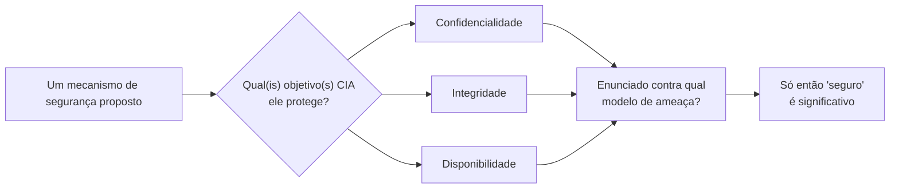

## Objetivos de Aprendizagem

- Definir confidencialidade, integridade e disponibilidade, e classificar um incidente de segurança do mundo real como violando primariamente um, dois ou todos os três.
- Explicar por que estes três objetivos rotineiramente conflitam, e dar um exemplo concreto de um design que deliberadamente sacrifica um para proteger outro.
- Distinguir um *objetivo* de segurança (o que um sistema está tentando garantir) de um *mecanismo* de segurança (a técnica específica usada para garanti-lo), criptografia, controle de acesso e backups são mecanismos; confidencialidade, integridade e disponibilidade são objetivos.
- Enunciar por que "seguro" não é uma propriedade binária de um sistema isoladamente, mas só significativa relativa a um modelo de ameaça enunciado e a um conjunto de objetivos enunciado.
- Prever como o resto desta disciplina mapeia sobre estes três objetivos: a criptografia serve majoritariamente a confidencialidade e a integridade; autenticação/autorização e defesas de rede servem majoritariamente aos três de uma vez, de formas diferentes.

## Contexto e Motivação

Antes de qualquer cifra, qualquer checagem de senha ou qualquer regra de firewall fazer sentido, um projetista tem de responder uma pergunta anterior: proteger *o quê*, de *o quê*? A engenharia de segurança, ao contrário da maior parte do resto da ciência da computação, é adversarial por natureza, um algoritmo de ordenação tem de ser correto contra toda entrada, mas não tem de ser correto contra uma entrada que foi deliberada e espertamente construída por alguém que leu o código-fonte do algoritmo e quer que ele falhe. Um mecanismo de segurança tem. Esse enquadramento adversarial é o que torna a "segurança" um tipo genuinamente diferente de propriedade de correção, e a tríade CIA, confidencialidade, integridade, disponibilidade, é o vocabulário padrão e de décadas que a ciência da computação usa para enunciar precisamente o que "correto" significa neste cenário adversarial.

**Confidencialidade** significa que a informação não é divulgada a ninguém que não deveria vê-la. Um registro médico lido por um empregado não autorizado, uma senha farejada de uma conexão de rede não criptografada, e um backup de banco de dados acidentalmente deixado num bucket de nuvem público são todos falhas de confidencialidade, mesmo que envolvam mecanismos completamente diferentes e atacantes completamente diferentes.

**Integridade** significa que a informação não é modificada, seja por um atacante ou por um acidente, sem que essa modificação seja detectada. Uma nota mudada no banco de dados de uma escola por alguém que nunca foi autorizado a tocá-la, uma mensagem alterada em trânsito entre dois bancos, e uma atualização de firmware silenciosamente corrompida por uma inversão de bit em trânsito são todas falhas de integridade, repare que a última não envolve nenhum atacante de forma alguma, que é por que "integridade" é mais ampla do que "resistência a adulteração": ela também cobre corrupção acidental.

**Disponibilidade** significa que um sistema permanece usável pelas pessoas que supostamente deveriam poder usá-lo, quando precisam usá-lo. Um ataque de negação de serviço que inunda um servidor com tráfego lixo até usuários legítimos não conseguirem passar é o exemplo adversarial clássico; uma falha de hardware que tira um serviço do ar é o acidental clássico. Repare, de novo, que nem toda falha de disponibilidade exige um atacante.

As diretrizes de currículo do ACM/IEEE CS2013 listam exatamente esta tríade, confidencialidade, integridade, disponibilidade, ao lado de autenticação e não repúdio, como o vocabulário fundamental de toda a área de Garantia da Informação e Segurança, precisamente porque quase todo tópico subsequente nesta disciplina é mais bem entendido como "um mecanismo específico mirando um ou mais destes três objetivos". Funções de hash criptográficas e códigos de autenticação de mensagem (cobertos depois) existem quase inteiramente para servir a integridade. A criptografia existe quase inteiramente para servir a confidencialidade. Redundância, limitação de taxa e firewalls (também cobertos depois) existem majoritariamente para servir a disponibilidade. Aprender a perguntar "qual dos três objetivos este mecanismo está de fato protegendo?" é um dos hábitos mais úteis que esta disciplina pode construir, porque é a forma mais rápida de notar quando uma defesa proposta não aborda de fato a ameaça que ela alega abordar.

## Teoria Central

### Os três objetivos, precisamente

| Objetivo | Declaração informal | Modo de falha típico |
|---|---|---|
| Confidencialidade | Só partes autorizadas conseguem ler a informação | Bisbilhotagem, vazamento de dados, acesso não autorizado |
| Integridade | Só partes autorizadas conseguem modificar a informação, e qualquer modificação (por qualquer um) é detectável | Adulteração, corrupção, forjamento |
| Disponibilidade | Partes autorizadas conseguem acessar a informação/serviço quando precisam | Negação de serviço, falha de hardware, esgotamento de recurso |

Um único sistema tipicamente tem de satisfazer os três simultaneamente, para diferentes pedaços de dados ou diferentes atores, e é inteiramente normal, não uma falha de design, para um sistema pesá-los diferentemente dependendo do contexto. Um sistema de lançamento nuclear pode sacrificar a disponibilidade agressivamente (múltiplas confirmações independentes exigidas, deliberadamente lento) em troca de garantias de integridade e confidencialidade extremamente fortes. Um website de notícias público inverte isso: a disponibilidade é primordial (o ponto inteiro é que qualquer um possa lê-lo), a confidencialidade do conteúdo *publicado* não é um objetivo de forma alguma (é feito para ser público), enquanto a integridade desse conteúdo absolutamente ainda importa (ninguém deveria poder editar silenciosamente um artigo publicado para dizer algo que o autor nunca escreveu).

### Por que os três objetivos rotineiramente conflitam

A tríade não é três botões independentes que podem todos ser girados ao máximo simultaneamente, na prática, fortalecer um frequentemente custa outro.

- **Confidencialidade vs. disponibilidade**: a garantia de confidencialidade mais forte é "ninguém pode jamais ler isto", que é também a pior disponibilidade possível. Todo sistema de controle de acesso real é um ponto negociado entre "difícil o bastante de chegar que partes não autorizadas sejam mantidas de fora" e "fácil o bastante de chegar que partes autorizadas não sejam trancadas de fora também".
- **Integridade vs. disponibilidade**: verificar a integridade (checksums, assinaturas criptográficas, confirmação de múltiplas partes) leva tempo e pode rejeitar requisições legítimas quando a própria verificação falha ou dá timeout, um sistema que se recusa a servir dados que não consegue verificar por completo está protegendo a integridade à custa direta da disponibilidade.
- **Confidencialidade vs. integridade**: menos comumente, criptografar dados para confidencialidade pode tornar mais difícil verificar a sua integridade sem primeiro descriptografar, que é exatamente por que a criptografia autenticada (coberta depois nesta disciplina) foi inventada, para garantir ambos os objetivos a partir da mesma operação em vez de escolher um.

Reconhecer estas tensões é uma habilidade central: quando alguém propõe "só criptografar tudo" ou "só exigir autenticação de três fatores para toda requisição", a primeira pergunta certa é qual objetivo isso de fato fortalece, e qual objetivo isso pode estar silenciosamente enfraquecendo.

### A segurança é relativa a um modelo de ameaça, não uma propriedade absoluta

"Este sistema é seguro?" não é uma pergunta bem formada por conta própria, um sistema pode ser perfeitamente seguro contra um colega de classe curioso e trivialmente quebrado por um estado-nação, e ambas as declarações podem ser verdadeiras do exato mesmo sistema. Toda afirmação de segurança significativa nomeia implícita ou explicitamente um modelo de ameaça: quem o atacante é assumido ser, quais capacidades ele tem (ele consegue ler tráfego de rede? modificá-lo? rodar código na mesma máquina? só interagir pela API pública?), e o que ele é assumido querer. Este conceito antecipa o próximo diretamente: a **modelagem de ameaças** é a disciplina de tornar esse "quem, o quê, por quê" explícito e sistemático, em vez de deixá-lo como uma suposição não enunciada sobre a qual diferentes membros da equipe discordam silenciosamente.



## Exemplos Resolvidos

### Exemplo 1: Classificando um incidente real por qual(is) objetivo(s) ele viola

O banco de dados de clientes de uma empresa é violado: um atacante baixa uma cópia completa de emails de clientes e senhas com hash, mas não modifica nenhum registro, e o site permanece totalmente operacional por todo o tempo.

```text
Confidencialidade: VIOLADA, dados de clientes foram divulgados a uma parte não autorizada.
Integridade:       NÃO violada, nenhum registro foi modificado; os dados que os clientes veem ainda estão corretos.
Disponibilidade:   NÃO violada, o site nunca saiu do ar.
```

Contraste isto com um ataque de ransomware contra a mesma empresa: atacantes criptografam o banco de dados de produção com uma chave que só eles guardam, e a empresa não consegue nem ler nem servir os seus próprios dados até pagar ou restaurar de backup.

```text
Confidencialidade: Possivelmente violada (se o atacante também exfiltrou uma cópia), mas não necessariamente.
Integridade:       Discutivelmente violada, os dados foram transformados sem autorização, mesmo
                   que a transformação (criptografia) não adicione informação falsa.
Disponibilidade:   SEVERAMENTE violada, usuários legítimos, incluindo a própria empresa, não conseguem
                   acessar os dados de forma alguma.
```

O padrão a notar: dois incidentes que ambos soam como "a empresa foi hackeada" podem atingir objetivos completamente diferentes, e a resposta apropriada, investigar por exfiltração de dados vs. restaurar de backup e corrigir o ponto de entrada, depende inteiramente de qual objetivo foi de fato violado.

### Exemplo 2: Um design que deliberadamente troca disponibilidade por confidencialidade e integridade

Considere um sistema que tranca a conta de um usuário por 15 minutos após 5 tentativas de login falhas. Isto direta e deliberadamente sacrifica a disponibilidade para o usuário legítimo (se ele for o que digitou a senha errada cinco vezes, ele agora está trancado de fora) em troca de confidencialidade e integridade (um atacante tentando adivinhar a senha por força bruta é desacelerado por muitas ordens de magnitude). Se este trade-off é "correto" não é uma questão puramente técnica, depende do modelo de ameaça (credential-stuffing é uma ameaça real e observada para este sistema?) e do custo aceitável de ocasionalmente trancar de fora um usuário real, que é exatamente o tipo de julgamento que a engenharia de segurança exige constantemente, não um fato derivável de primeiros princípios sozinhos.

### Exemplo 3: Mapeando conceitos posteriores nesta disciplina de volta à tríade

```text
Conceito (coberto depois)                     Objetivo(s) CIA primário(s) servido(s)
---------------------------------------------  ---------------------------
Cifras de bloco / AES                          Confidencialidade
Funções de hash criptográficas                 Integridade
Códigos de autenticação de mensagem (MAC)      Integridade
Assinaturas digitais                           Integridade + (um objetivo relacionado e
                                                não-CIA chamado não repúdio)
Autenticação (provar identidade)               Confidencialidade + Integridade (guarda
                                                quem sequer pode tentar o acesso)
Firewalls / limitação de taxa                  Disponibilidade (+ alguma confidencialidade,
                                                bloqueando conexões não autorizadas)
```

Esta tabela vale voltar depois de terminar a disciplina: todo mecanismo introduzido daqui para frente pode ser checado contra ela, e se um mecanismo não serve claramente pelo menos um dos três objetivos contra uma ameaça enunciada, isso é um sinal de que algo sobre a sua justificativa está faltando.

## Equívocos Comuns e Armadilhas

- **"Segurança significa criptografia."** A criptografia serve a confidencialidade (e, em modos autenticados, a integridade) mas nada faz de forma alguma pela disponibilidade, e muitas falhas de segurança reais, um ataque de negação de serviço, uma lista de controle de acesso mal configurada, uma senha phishada, nada têm a ver com se os dados foram criptografados.
- **"Um sistema mais seguro é sempre melhor."** Cada um dos três objetivos pode ser super-otimizado à custa direta dos outros e da usabilidade básica; um sistema tão trancado que usuários legítimos não conseguem fazer o seu trabalho não alcançou boa segurança, ele alcançou um tipo diferente de falha.
- **"Se nada foi roubado, não houve incidente de segurança."** Um ataque de disponibilidade (um DoS) ou um ataque de integridade (modificação não autorizada, mesmo sem exfiltração) ainda é um incidente de segurança real e frequentemente custoso, mesmo que nenhum dado tenha sido divulgado.
- **"Segurança é uma propriedade que um sistema ou tem ou não tem."** Sem um modelo de ameaça enunciado, "isto é seguro" não pode ser respondido significativamente, o mesmo sistema pode ser adequadamente seguro contra uma classe de atacante e completamente inadequado contra outra.
- **"Integridade é só sobre atacantes, não acidentes."** Falhas de integridade causadas por faltas de hardware, bugs de software ou erro de operador são tão reais quanto adulteração deliberada, e muitos mecanismos de integridade (checksums, por exemplo) nem sequer distinguem entre as duas causas, eles só detectam que *algo* mudou.

## Resumo

A tríade CIA, confidencialidade (só leitura autorizada), integridade (só modificação autorizada e detectável), e disponibilidade (o sistema permanece usável por partes autorizadas), é o vocabulário em torno do qual esta disciplina inteira é organizada: essencialmente todo mecanismo coberto depois, de cifras de bloco a firewalls, existe para servir um ou mais destes três objetivos contra algum modelo de ameaça específico e enunciado. Os três objetivos rotineiramente conflitam uns com os outros e com a usabilidade simples, então a engenharia de segurança real é uma negociação contínua e frequentemente carregada de julgamento entre eles em vez de um único botão de "maximizar a segurança". Criticamente, "seguro" não é significativo como uma propriedade de um sistema isoladamente, ele só é significativo relativo a um modelo de ameaça, que é exatamente o que o próximo conceito, modelagem de ameaças com STRIDE, torna sistemático em vez de uma suposição não enunciada.

## Documentation Links

- [ACM/IEEE CS2013 — Information Assurance and Security (Privacy and Security) Knowledge Area](https://csed.acm.org/knowledge-areas-privacy-and-security-ps-cs2013/): diretrizes de currículo estabelecendo confidencialidade, integridade, disponibilidade, autenticação e não repúdio como o vocabulário fundamental desta área de assunto.
- [MIT 6.858 — Computer Systems Security (OCW, Fall 2014)](https://ocw.mit.edu/courses/6-858-computer-systems-security-fall-2014/): curso completo cobrindo modelos de ameaça e ataques/defesas concretos construídos exatamente sobre esta fundação.
