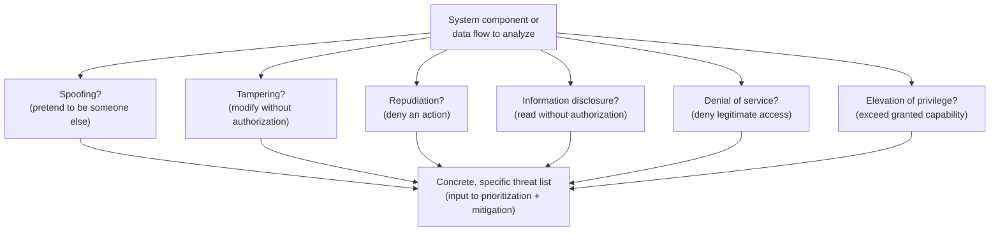

## Learning Objectives

- State the six STRIDE categories from memory and explain, in one sentence each, what kind of attacker goal each one names.
- Apply STRIDE systematically to a small, concrete system (a login feature) and produce a list of specific, actionable threats rather than a vague worry.
- Map each STRIDE category back to the CIA triad (and the related, non-CIA goal of non-repudiation) it primarily threatens.
- Explain why threat modeling is done *before* implementation rather than only during a post-hoc security review, and what is lost by deferring it.
- Distinguish a threat model's output (a list of specific threats) from its mitigations (specific defenses) — this concept produces the former; most of the rest of this discipline supplies the latter.

## Context & Motivation

The previous two concepts established *what* security is trying to protect (confidentiality, integrity, availability) and *who* gets to do what (authentication, authorization) — but neither one gives a systematic procedure for finding out where a specific system is actually vulnerable. "Think about what could go wrong" is true but useless as a method; different engineers thinking unsystematically about the same system will notice different threats, miss different ones, and have no way to confirm they've been reasonably thorough. **Threat modeling** is the practice of making that process systematic, and **STRIDE** — developed at Microsoft in the late 1990s and still one of the most widely taught and used threat-modeling frameworks today — is a mnemonic for six categories of things an attacker might be trying to do to a system, used as a checklist to walk through every component of a design and ask "could this happen here?"

STRIDE stands for: **S**poofing, **T**ampering, **R**epudiation, **I**nformation disclosure, **D**enial of service, **E**levation of privilege. Each letter names a distinct attacker *goal*, not a specific technique — "spoofing" doesn't mean any one particular attack, it means any attack whose goal is to make the system believe an entity is something it isn't. This is precisely what makes STRIDE useful as a checklist rather than a list of specific vulnerabilities to patch: it forces a systematic pass over categories of harm, which surfaces threats a purely intuitive "what could go wrong" brainstorm tends to miss, especially for goals (like repudiation) that don't map onto an obvious, familiar attack story the way "someone steals my password" does.

Threat modeling is deliberately placed early in this discipline, before any cryptographic mechanism has been introduced, because that is also where it belongs in a real engineering process: done *before* a system is built, threat modeling shapes the design itself (which authentication mechanism to use, which data needs encryption, which actions need an audit log); done only *after*, as a post-hoc security review, it can only find problems that are often now expensive or disruptive to fix, because the architecture has already been committed to.

## Core Theory

### The six STRIDE categories, and what each threatens

| Letter | Category | Attacker's goal | Primarily threatens |
|---|---|---|---|
| S | Spoofing | Pretend to be something/someone else | Authentication |
| T | Tampering | Modify data or code without authorization | Integrity |
| R | Repudiation | Deny having performed an action | Non-repudiation |
| I | Information disclosure | Read data without authorization | Confidentiality |
| D | Denial of service | Deny legitimate users access to a service | Availability |
| E | Elevation of privilege | Gain capabilities beyond what was granted | Authorization |

Five of the six map cleanly onto goals already introduced: confidentiality (information disclosure), integrity (tampering), availability (denial of service), authentication (spoofing), and authorization (elevation of privilege). **Repudiation** introduces a genuinely new goal not yet named: **non-repudiation**, the property that an entity cannot credibly deny having performed an action it actually performed. A user who transfers money and later claims "I never authorized that transfer" is attempting repudiation; a system with strong non-repudiation (for instance, one that logs actions alongside a cryptographic signature tied to the acting user's private key, a mechanism covered later in this discipline) can produce evidence that makes that denial not credible.

### Applying STRIDE systematically

STRIDE is applied by walking through a system's components — every data flow, every trust boundary (a point where data crosses from a less-trusted context into a more-trusted one, such as "the public internet" into "the application server") — and asking, for each of the six letters, "could an attacker achieve this goal here?" The output is a concrete list: not "the login page might be insecure" but specific, individually actionable entries like "an attacker could spoof another user's identity by guessing a predictable session token" or "an attacker could deny-of-service the login endpoint by submitting an unbounded number of login attempts per second." Each entry in that list can then be independently evaluated (how likely, how severe) and independently mitigated — which is the whole point: STRIDE turns one vague worry into a list of specific, triageable, and individually fixable problems.



### Threat modeling produces threats, not mitigations

It is worth being explicit about scope: STRIDE, applied correctly, produces a *list of threats* — specific ways a system could be attacked — not a list of fixes. Deciding how to mitigate each threat (which cipher to use, which authentication mechanism, which rate limit) is a separate step that draws on the rest of this discipline's material. This separation matters because it keeps the threat-modeling exercise honest: a team that jumps straight to "we'll just use HTTPS" without first identifying which specific threats HTTPS does and does not address (it protects data in transit; it does nothing about a compromised server, a weak password, or a SQL injection vulnerability) has skipped the step that would have told them HTTPS alone was an incomplete answer.

## Worked Examples

### Example 1: STRIDE applied to a small login feature

Consider a simple login form: a user submits a username and password over HTTPS; the server checks them against a database and, if correct, issues a session cookie.

```text
Category                  Concrete threat identified
-------------------------  ---------------------------------------------------
Spoofing                   An attacker who steals another user's session
                            cookie (e.g. via a network on the same coffee-shop
                            Wi-Fi, if HTTPS were misconfigured) can spoof that
                            user's identity without ever knowing their password.

Tampering                  If the "remember me" preference is stored in a
                            client-side cookie that isn't cryptographically
                            protected, a user could tamper with it to extend
                            their own session beyond the intended limit.

Repudiation                Without a server-side log of login events (time,
                            IP, outcome), a user who performed an unauthorized
                            action after logging in could plausibly deny ever
                            having logged in at all.

Information disclosure     If login failures return a different error message
                            for "wrong username" vs. "wrong password," an
                            attacker can enumerate valid usernames one at a
                            time without ever needing a correct password.

Denial of service          Without a rate limit, an attacker can submit
                            unlimited login attempts per second, both enabling
                            password guessing and potentially overloading the
                            authentication database for legitimate users.

Elevation of privilege     If the session cookie itself encodes a user's role
                            (e.g. in a way a client can edit, rather than the
                            server looking the role up server-side), a user
                            could edit their own cookie to claim an admin role.
```

Notice that this six-line pass surfaced six specific, independently fixable design decisions — none of which required knowing any cryptography yet — simply by asking the same six questions of one small feature. This is the practical value of the framework: it is systematic enough to be taught and checked, unlike an unstructured "think about what could go wrong."

### Example 2: Mapping a real incident back onto STRIDE

Recall the customer-database breach from the previous concept, where an attacker downloaded customer emails and hashed passwords without modifying anything or affecting uptime. In STRIDE terms, that incident is almost purely an **information disclosure** threat that was realized — and naming it that specifically (rather than just "we got hacked") immediately points toward the right category of fix: access controls and encryption-at-rest for stored data, not, say, rate limiting (which addresses denial of service) or a code-signing scheme (which addresses tampering).

### Example 3: Distinguishing a threat from a mitigation

```text
Threat (STRIDE category)                    NOT a mitigation, just a category label:
Spoofing of a user's identity via a          "Use passwords" is not itself specific enough —
  guessable session token                    the actual mitigation requires deciding on
                                              token length, randomness source, expiration,
                                              and transport protection — material covered
                                              across the rest of this discipline (hash
                                              functions for token derivation, TLS for
                                              transport, etc.)
```

The point of this example is procedural: a completed threat model is a list like the left column, deliberately not yet the right column — resisting the urge to jump straight to "just encrypt it" or "just add MFA" before the specific threat is named keeps the eventual mitigation properly matched to the actual problem, rather than a generic security-sounding gesture that may not even address it.

## Common Misconceptions & Pitfalls

- **"Threat modeling is something you do once, during a security review, near the end of a project."** Done that late, it can only find expensive-to-fix problems; STRIDE is most valuable applied during design, before architecture decisions are locked in, and is worth revisiting whenever a system's design changes meaningfully.
- **"STRIDE gives you the fixes."** STRIDE systematically produces a list of *threats*; deciding on specific *mitigations* for each one is a separate step that draws on cryptography, access control, and systems-design knowledge — conflating the two steps leads to vague, unverifiable threat models ("we thought about security") instead of concrete, checkable ones.
- **"Repudiation is just about lying, so it's not really a technical concern."** Non-repudiation is a genuine, technical property (typically built on digital signatures, covered later) that specific systems — financial transactions, legal documents, audit logs — are explicitly engineered to provide, precisely because "the user could just deny it" is a real, exploitable gap if nothing prevents plausible denial.
- **"A system with no known vulnerabilities has 'passed' its threat model."** A threat model's completeness depends on how thoroughly it was applied to every component and trust boundary, not on whether attacks are currently known — new attack techniques against the same threat categories are discovered continuously, which is why threat modeling is a practice to repeat, not a one-time certification.
- **"Elevation of privilege is the same thing as spoofing."** Spoofing is about being believed to be someone you are not; elevation of privilege is about a *correctly identified* entity gaining capabilities beyond what was actually granted to it — the two can combine (spoof an admin, then have admin privileges) but are conceptually and often mechanically distinct failures.

## Summary

STRIDE — Spoofing, Tampering, Repudiation, Information disclosure, Denial of service, Elevation of privilege — is a systematic checklist for threat modeling that maps five of its six categories directly onto the CIA triad plus authentication and authorization already covered, and introduces one genuinely new goal, non-repudiation (the inability to credibly deny a performed action). Applied to every component and trust boundary of a system, it turns a vague "think about what could go wrong" into a list of specific, individually triageable threats — the necessary output before any mitigation decision can be well-targeted. Threat modeling belongs early in a design process, not as a late-stage review, and it deliberately stops at identifying threats rather than prescribing fixes, leaving specific mitigations to the cryptographic and systems mechanisms this discipline covers from here forward — starting with the symmetric-key cryptography that begins with the next concept.

## Documentation Links

- [MIT 6.858 — Computer Systems Security (OCW, Fall 2014)](https://ocw.mit.edu/courses/6-858-computer-systems-security-fall-2014/) — a full course built around identifying and defending against exactly the classes of threats STRIDE names.
- [ACM/IEEE CS2013 — Information Assurance and Security (Privacy and Security) Knowledge Area](https://csed.acm.org/knowledge-areas-privacy-and-security-ps-cs2013/) — lists threat and attack identification as a core learning outcome for this subject area.
