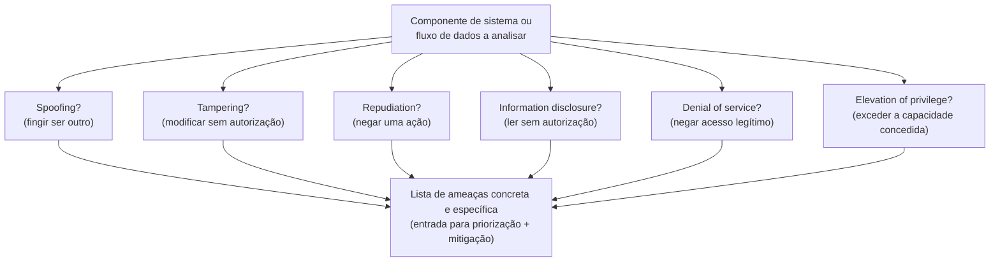

## Objetivos de Aprendizagem

- Enunciar as seis categorias STRIDE de memória e explicar, em uma frase cada, que tipo de objetivo de atacante cada uma nomeia.
- Aplicar o STRIDE sistematicamente a um sistema pequeno e concreto (um recurso de login) e produzir uma lista de ameaças específicas e acionáveis em vez de uma preocupação vaga.
- Mapear cada categoria STRIDE de volta à tríade CIA (e ao objetivo relacionado e não-CIA do não repúdio) que ela ameaça primariamente.
- Explicar por que a modelagem de ameaças é feita *antes* da implementação em vez de só durante uma revisão de segurança post-hoc, e o que se perde ao adiá-la.
- Distinguir a saída de um modelo de ameaça (uma lista de ameaças específicas) das suas mitigações (defesas específicas), este conceito produz a primeira; a maior parte do resto desta disciplina fornece a última.

## Contexto e Motivação

Os dois conceitos anteriores estabeleceram *o que* a segurança está tentando proteger (confidencialidade, integridade, disponibilidade) e *quem* tem permissão de fazer o quê (autenticação, autorização), mas nenhum deles dá um procedimento sistemático para descobrir onde um sistema específico é de fato vulnerável. "Pensar no que pode dar errado" é verdadeiro mas inútil como método; diferentes engenheiros pensando não sistematicamente sobre o mesmo sistema notarão ameaças diferentes, perderão diferentes, e não terão forma de confirmar que foram razoavelmente completos. A **modelagem de ameaças** é a prática de tornar esse processo sistemático, e o **STRIDE**, desenvolvido na Microsoft no fim dos anos 1990 e ainda um dos frameworks de modelagem de ameaças mais ensinados e usados hoje, é um mnemônico para seis categorias de coisas que um atacante poderia estar tentando fazer a um sistema, usado como um checklist para percorrer todo componente de um design e perguntar "isto poderia acontecer aqui?".

STRIDE significa: **S**poofing (personificação), **T**ampering (adulteração), **R**epudiation (repúdio), **I**nformation disclosure (divulgação de informação), **D**enial of service (negação de serviço), **E**levation of privilege (elevação de privilégio). Cada letra nomeia um *objetivo* de atacante distinto, não uma técnica específica, "spoofing" não significa nenhum ataque particular, significa qualquer ataque cujo objetivo é fazer o sistema acreditar que uma entidade é algo que ela não é. Isto é precisamente o que torna o STRIDE útil como um checklist em vez de uma lista de vulnerabilidades específicas a corrigir: ele força uma passagem sistemática sobre categorias de dano, que faz surgir ameaças que um brainstorm puramente intuitivo de "o que pode dar errado" tende a perder, especialmente para objetivos (como repúdio) que não mapeiam sobre uma história de ataque óbvia e familiar da forma que "alguém rouba a minha senha" mapeia.

A modelagem de ameaças é deliberadamente posta cedo nesta disciplina, antes de qualquer mecanismo criptográfico ser introduzido, porque esse é também onde ela pertence num processo de engenharia real: feita *antes* de um sistema ser construído, a modelagem de ameaças molda o próprio design (qual mecanismo de autenticação usar, quais dados precisam de criptografia, quais ações precisam de um log de auditoria); feita só *depois*, como uma revisão de segurança post-hoc, ela só consegue encontrar problemas que são frequentemente agora caros ou disruptivos de consertar, porque a arquitetura já foi comprometida.

## Teoria Central

### As seis categorias STRIDE, e o que cada uma ameaça

| Letra | Categoria | Objetivo do atacante | Ameaça primariamente |
|---|---|---|---|
| S | Spoofing (personificação) | Fingir ser algo/alguém diferente | Autenticação |
| T | Tampering (adulteração) | Modificar dados ou código sem autorização | Integridade |
| R | Repudiation (repúdio) | Negar ter realizado uma ação | Não repúdio |
| I | Information disclosure (divulgação de informação) | Ler dados sem autorização | Confidencialidade |
| D | Denial of service (negação de serviço) | Negar a usuários legítimos acesso a um serviço | Disponibilidade |
| E | Elevation of privilege (elevação de privilégio) | Ganhar capacidades além do que foi concedido | Autorização |

Cinco das seis mapeiam limpamente sobre objetivos já introduzidos: confidencialidade (divulgação de informação), integridade (adulteração), disponibilidade (negação de serviço), autenticação (personificação) e autorização (elevação de privilégio). O **repúdio** introduz um objetivo genuinamente novo ainda não nomeado: o **não repúdio**, a propriedade de que uma entidade não pode credivelmente negar ter realizado uma ação que de fato realizou. Um usuário que transfere dinheiro e depois alega "eu nunca autorizei essa transferência" está tentando o repúdio; um sistema com forte não repúdio (por exemplo, um que registra ações junto a uma assinatura criptográfica amarrada à chave privada do usuário agindo, um mecanismo coberto depois nesta disciplina) consegue produzir evidência que torna essa negação não credível.

### Aplicando o STRIDE sistematicamente

O STRIDE é aplicado percorrendo os componentes de um sistema, todo fluxo de dados, todo limite de confiança (um ponto onde os dados cruzam de um contexto menos confiável para um mais confiável, como "a internet pública" para "o servidor de aplicação") e perguntando, para cada uma das seis letras, "um atacante poderia alcançar este objetivo aqui?". A saída é uma lista concreta: não "a página de login pode ser insegura" mas entradas específicas e individualmente acionáveis como "um atacante poderia personificar a identidade de outro usuário adivinhando um token de sessão previsível" ou "um atacante poderia negar o serviço do endpoint de login submetendo um número ilimitado de tentativas de login por segundo". Cada entrada nessa lista pode então ser independentemente avaliada (quão provável, quão severa) e independentemente mitigada, que é o ponto inteiro: o STRIDE transforma uma preocupação vaga numa lista de problemas específicos, triáveis e individualmente consertáveis.



### A modelagem de ameaças produz ameaças, não mitigações

Vale ser explícito sobre o escopo: o STRIDE, aplicado corretamente, produz uma *lista de ameaças*, formas específicas em que um sistema poderia ser atacado, não uma lista de consertos. Decidir como mitigar cada ameaça (qual cifra usar, qual mecanismo de autenticação, qual limite de taxa) é um passo separado que se apoia no resto do material desta disciplina. Esta separação importa porque mantém o exercício de modelagem de ameaças honesto: uma equipe que salta direto para "vamos só usar HTTPS" sem primeiro identificar quais ameaças específicas o HTTPS aborda e não aborda (ele protege os dados em trânsito; nada faz sobre um servidor comprometido, uma senha fraca ou uma vulnerabilidade de injeção SQL) pulou o passo que teria dito a ela que o HTTPS sozinho era uma resposta incompleta.

## Exemplos Resolvidos

### Exemplo 1: STRIDE aplicado a um pequeno recurso de login

Considere um formulário de login simples: um usuário submete um username e senha sobre HTTPS; o servidor os checa contra um banco de dados e, se corretos, emite um cookie de sessão.

```text
Categoria                  Ameaça concreta identificada
-------------------------  ---------------------------------------------------
Spoofing                   Um atacante que rouba o cookie de sessão de outro
                            usuário (ex. via uma rede no mesmo Wi-Fi de cafeteria,
                            se o HTTPS estivesse mal configurado) consegue personificar
                            a identidade daquele usuário sem jamais conhecer a sua senha.

Tampering                  Se a preferência "lembrar de mim" é armazenada num
                            cookie do lado do cliente que não é criptograficamente
                            protegido, um usuário poderia adulterá-lo para estender
                            a sua própria sessão além do limite pretendido.

Repudiation                Sem um log do lado do servidor de eventos de login (hora,
                            IP, resultado), um usuário que realizou uma ação não
                            autorizada depois de logar poderia plausivelmente negar
                            ter jamais logado de todo.

Information disclosure     Se as falhas de login retornam uma mensagem de erro
                            diferente para "username errado" vs. "senha errada", um
                            atacante consegue enumerar usernames válidos um de cada
                            vez sem jamais precisar de uma senha correta.

Denial of service          Sem um limite de taxa, um atacante consegue submeter
                            tentativas de login ilimitadas por segundo, tanto habilitando
                            a adivinhação de senha quanto potencialmente sobrecarregando o
                            banco de dados de autenticação para usuários legítimos.

Elevation of privilege     Se o próprio cookie de sessão codifica o papel de um usuário
                            (ex. de uma forma que um cliente consegue editar, em vez de o
                            servidor buscar o papel do lado do servidor), um usuário
                            poderia editar o seu próprio cookie para alegar um papel de admin.
```

Repare que esta passagem de seis linhas fez surgir seis decisões de design específicas e independentemente consertáveis, nenhuma das quais exigiu conhecer nenhuma criptografia ainda, simplesmente perguntando as mesmas seis perguntas de um pequeno recurso. Este é o valor prático do framework: ele é sistemático o bastante para ser ensinado e checado, ao contrário de um "pensar no que pode dar errado" não estruturado.

### Exemplo 2: Mapeando um incidente real de volta ao STRIDE

Lembre da brecha de banco de dados de clientes do conceito anterior, onde um atacante baixou emails de clientes e senhas com hash sem modificar nada ou afetar o tempo de atividade. Em termos do STRIDE, aquele incidente é quase puramente uma ameaça de **divulgação de informação** que foi realizada, e nomeá-la assim tão especificamente (em vez de só "fomos hackeados") imediatamente aponta para a categoria certa de conserto: controles de acesso e criptografia em repouso para dados armazenados, não, digamos, limitação de taxa (que aborda a negação de serviço) ou um esquema de assinatura de código (que aborda a adulteração).

### Exemplo 3: Distinguindo uma ameaça de uma mitigação

```text
Ameaça (categoria STRIDE)                   NÃO uma mitigação, só um rótulo de categoria:
Spoofing da identidade de um usuário via um   "Usar senhas" não é em si específico o bastante,
  token de sessão adivinhável                 a mitigação de fato exige decidir sobre
                                              comprimento do token, fonte de aleatoriedade, expiração
                                              e proteção de transporte, material coberto
                                              por todo o resto desta disciplina (funções de
                                              hash para derivação de token, TLS para
                                              transporte, etc.)
```

O ponto deste exemplo é procedural: um modelo de ameaça completo é uma lista como a coluna esquerda, deliberadamente ainda não a coluna direita, resistir ao impulso de saltar direto para "só criptografar" ou "só adicionar MFA" antes de a ameaça específica ser nomeada mantém a eventual mitigação apropriadamente casada com o problema de fato, em vez de um gesto genérico de soar seguro que pode nem sequer abordá-lo.

## Equívocos Comuns e Armadilhas

- **"A modelagem de ameaças é algo que você faz uma vez, durante uma revisão de segurança, perto do fim de um projeto."** Feita tão tarde, ela só consegue encontrar problemas caros de consertar; o STRIDE é mais valioso aplicado durante o design, antes de as decisões de arquitetura serem travadas, e vale revisitar sempre que o design de um sistema muda significativamente.
- **"O STRIDE dá os consertos."** O STRIDE sistematicamente produz uma lista de *ameaças*; decidir sobre *mitigações* específicas para cada uma é um passo separado que se apoia em conhecimento de criptografia, controle de acesso e design de sistemas, conflatar os dois passos leva a modelos de ameaça vagos e não verificáveis ("pensamos na segurança") em vez de concretos e checáveis.
- **"O repúdio é só sobre mentir, então não é realmente uma preocupação técnica."** O não repúdio é uma propriedade técnica genuína (tipicamente construída sobre assinaturas digitais, coberta depois) que sistemas específicos, transações financeiras, documentos legais, logs de auditoria, são explicitamente engenheirados para fornecer, precisamente porque "o usuário poderia só negar isso" é uma lacuna real e explorável se nada previne a negação plausível.
- **"Um sistema sem vulnerabilidades conhecidas 'passou' no seu modelo de ameaça."** A completude de um modelo de ameaça depende de quão completamente ele foi aplicado a todo componente e limite de confiança, não de se ataques são atualmente conhecidos, novas técnicas de ataque contra as mesmas categorias de ameaça são descobertas continuamente, que é por que a modelagem de ameaças é uma prática a repetir, não uma certificação única.
- **"Elevação de privilégio é a mesma coisa que spoofing."** O spoofing é sobre ser acreditado ser alguém que você não é; a elevação de privilégio é sobre uma entidade *corretamente identificada* ganhar capacidades além do que foi de fato concedido a ela, os dois podem combinar (personificar um admin, depois ter privilégios de admin) mas são falhas conceitual e frequentemente mecanicamente distintas.

## Resumo

STRIDE, Spoofing, Tampering, Repudiation, Information disclosure, Denial of service, Elevation of privilege, é um checklist sistemático para modelagem de ameaças que mapeia cinco das suas seis categorias diretamente sobre a tríade CIA mais autenticação e autorização já cobertas, e introduz um objetivo genuinamente novo, o não repúdio (a incapacidade de credivelmente negar uma ação realizada). Aplicado a todo componente e limite de confiança de um sistema, ele transforma um vago "pensar no que pode dar errado" numa lista de ameaças específicas e individualmente triáveis, a saída necessária antes de qualquer decisão de mitigação poder ser bem direcionada. A modelagem de ameaças pertence cedo num processo de design, não como uma revisão de estágio tardio, e ela deliberadamente para em identificar ameaças em vez de prescrever consertos, deixando mitigações específicas para os mecanismos criptográficos e de sistemas que esta disciplina cobre daqui para frente, começando com a criptografia de chave simétrica que começa com o próximo conceito.

## Documentation Links

- [MIT 6.858 — Computer Systems Security (OCW, Fall 2014)](https://ocw.mit.edu/courses/6-858-computer-systems-security-fall-2014/): um curso completo construído em torno de identificar e defender contra exatamente as classes de ameaças que o STRIDE nomeia.
- [ACM/IEEE CS2013 — Information Assurance and Security (Privacy and Security) Knowledge Area](https://csed.acm.org/knowledge-areas-privacy-and-security-ps-cs2013/): lista identificação de ameaças e ataques como um resultado central de aprendizagem para esta área de assunto.
