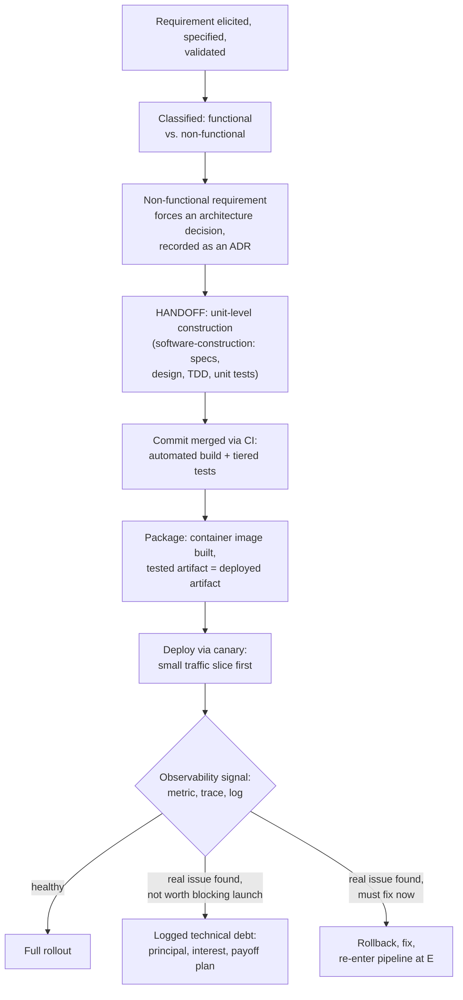

## Learning Objectives

- Trace one requirement through every stage this discipline covers, in order: elicitation, non-functional analysis, architecture decision, construction handoff, CI/CD pipeline, deployment, production observability, and technical debt logging.
- Identify the exact handoff points where this discipline's own work ends and `software-construction`'s begins, and where it picks back up.
- Explain why a production incident, once caught by observability, is not automatically a code fix, but a genuine decision point that can legitimately end in a logged technical debt entry instead.
- State, honestly, what this capstone does and does not close, matching this platform's established capstone pattern of tying concepts together without pretending every loose end resolves neatly.

## Context & Motivation

Every discipline in this curriculum closes with a capstone that traces one concrete scenario through everything the discipline covered, not as a review exercise, but as proof the concepts genuinely connect into a real, usable whole rather than sitting as sixteen independent facts. This discipline's capstone does exactly that, but for the surrounding process of building software rather than for the code itself, which is precisely the discipline's real scope, established back in `swebok-and-the-scope-beyond-construction`: everything SWEBOK treats as knowledge outside Software Design, Construction, and Testing. This capstone deliberately hands off to `software-construction` at the exact point construction begins, and picks the story back up the moment construction's output re-enters this discipline's territory, at the CI pipeline.

## Core Theory

### The full lifecycle, traced as one diagram

The two handoff points marked in this diagram are exactly this discipline's own honest boundary: requirements and architecture decisions are this discipline's territory up to the moment construction begins (handoff to `software-construction`), and CI/CD, deployment, and observability are this discipline's territory again once a construction-level commit is ready to ship.

### Why a caught issue is a genuine decision, not an automatic fix

The diagram's branch after the observability signal is deliberately not a straight line to "fix it." A real issue caught in production is a genuine decision point, exactly the kind `estimation-and-risk-in-software-projects` already treats as requiring an owner and an honest tradeoff: sometimes the right call, under real deadline pressure and a real, small blast radius (canary limits this directly), is to ship the known issue forward and log it honestly as technical debt with a real payoff plan, rather than blocking a launch to fix something the team has already decided, deliberately, is an acceptable, tracked tradeoff for now. Treating every caught issue as an automatic, mandatory fix ignores that `technical-debt-and-engineering-economics` already gave this exact tradeoff a name and a real economic structure.

## Worked Examples

### A concrete scenario, traced end to end

**Requirement.** A stakeholder request, elicited through interviews and a working prototype (`requirements-elicitation-specification-and-validation`), is specified and validated: "Users must be able to schedule a recurring monthly payment, and the system must continue accepting new one-time payments even if the recurring-payment scheduler is temporarily unavailable, for up to 5 minutes."

**Classification.** The first half is functional (the system does this specific new thing); the second half is non-functional, a real availability constraint (`functional-vs-non-functional-requirements`).

**Architecture decision.** The non-functional half forces a real decision, recorded as ADR-027: decouple one-time payment processing from the new recurring-payment scheduler via a message queue, rather than a single synchronous code path, so a scheduler outage cannot block one-time payments (`from-requirements-to-architecture-decisions`). The tradeoff accepted: a scheduled payment now goes through an asynchronous, eventually-processed path instead of an immediate one, requiring a "scheduled, pending" state visible to users.

**Handoff to construction.** `software-construction` takes over here: the queue consumer and producer are specified with real preconditions and postconditions, designed with real coupling and cohesion between the payment module and the new scheduler module, built with test-driven development, and covered by unit, integration, and system tests. This capstone does not re-narrate that work; it is exactly the sibling discipline's own job, already covered there in full.

**CI pipeline.** The finished feature is committed to the mainline, triggering the automated, tiered test suite (`continuous-integration`), then packaged into a container image (`ci-cd-pipeline-stages-and-containerized-builds`), producing one exact artifact that will be deployed.

**Deployment.** Given the change touches payment processing, the team chooses a canary release over blue-green (`deployment-strategies-blue-green-and-canary`): 5% of traffic first, watched closely, growing gradually.

**Observability catches a real issue.** At 5% traffic, a metric shows the queue consumer's processing latency is higher than expected under real load, and a trace narrows this to a slower-than-anticipated database write inside the consumer (`observability-the-three-pillars`). The issue is real, but its actual impact, given the canary's limited exposure, is a few seconds' extra delay before a scheduled payment shows as confirmed, not a failure or a lost payment.

**The decision.** Given a real, hard launch deadline (a marketing campaign already scheduled around this feature) and a real, honestly assessed risk (delay, not failure or data loss), the team makes a deliberate, logged decision: ship the full rollout as planned, and log a technical debt entry (`technical-debt-and-engineering-economics`), principal: the unoptimized database write; interest: a few seconds of extra latency per scheduled payment until fixed; payoff plan: a scheduled optimization pass the following sprint, tracked with a real owner via `requirements-traceability-and-change-management`'s same traceability mechanism used for requirements.

### Why this specific ending, and not a cleaner one

This capstone does not end with "and then the bug was fixed and everything was perfect," because that would misrepresent what this discipline actually teaches: real software engineering routinely makes exactly this kind of deliberate, honest tradeoff, shipping a known, small, well-understood issue forward with a real plan, rather than either ignoring it silently or treating every finding as an automatic blocker. The technical debt entry closing this story is not a failure of the process traced above; it is the process working honestly, exactly as `technical-debt-and-engineering-economics` described it.

## Common Misconceptions & Pitfalls

- **"A capstone should end with every issue resolved cleanly."** This capstone's own ending, a logged technical debt entry rather than an immediate fix, is deliberate: real software engineering makes exactly this tradeoff routinely, and pretending otherwise would misrepresent the discipline this capstone is meant to demonstrate.
- **"This discipline's capstone should re-explain the construction step in detail, to feel complete."** The handoff in Core Theory is explicit and deliberate; re-narrating unit-level design, TDD, and testing here would duplicate `software-construction`'s own, already-published, complete treatment of exactly that step, the same duplication this discipline's entire scope decision (`swebok-and-the-scope-beyond-construction`) was built to avoid.
- **"Canary release and observability are separate, unrelated steps in this story."** The worked example shows canary's own value (Example 2 of `deployment-strategies-blue-green-and-canary`) depends entirely on the observability signal that actually detects the problem while exposure is still small; the two are one connected mechanism in this trace, not two independent ones.

## Summary

This capstone traces one requirement (a recurring payment feature with a real availability constraint) through every stage this discipline covers: elicited and classified into its functional and non-functional halves, the non-functional half forcing a real architecture decision recorded as an ADR, handed off explicitly to `software-construction` for unit-level design and testing, picked back up at a CI pipeline building one exact, tested artifact, deployed via canary specifically because of the change's sensitivity, watched by a real observability signal that catches a genuine, real issue at small exposure, and closed with a deliberate, logged technical debt entry rather than an automatic fix, because the team's own honest, tracked risk assessment judged shipping forward the right call under a real deadline. This is this discipline's version of the amarra-tudo pattern every capstone on this platform uses, applied here to the process surrounding a feature's life rather than to the code inside it, with two explicit, honest handoffs marking exactly where this discipline's own territory ends and where `software-construction`'s begins and ends in turn.

## Documentation Links

- [IEEE Computer Society: SWEBOK v4.0 Guide](https://www.computer.org/education/bodies-of-knowledge/software-engineering): the knowledge area breakdown this entire capstone's structure, and this whole discipline's scope, is traced against directly.
- [Fowler: Continuous Delivery vs. Continuous Deployment](https://martinfowler.com/bliki/ContinuousDelivery.html): the source for the canary-then-full-rollout deployment shape this capstone's worked example follows directly.
