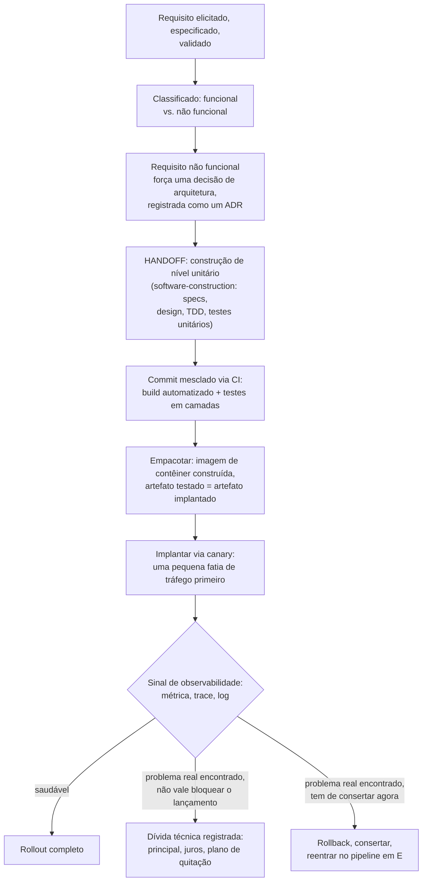

## Objetivos de Aprendizagem

- Rastrear um requisito por cada estágio que esta disciplina cobre, em ordem: elicitação, análise não funcional, decisão de arquitetura, handoff da construção, pipeline de CI/CD, implantação, observabilidade em produção e registro de dívida técnica.
- Identificar os pontos de handoff exatos onde o próprio trabalho desta disciplina termina e o de `software-construction` começa, e onde ele é retomado.
- Explicar por que um incidente de produção, uma vez pego pela observabilidade, não é automaticamente um conserto de código, mas um ponto de decisão genuíno que pode legitimamente terminar numa entrada de dívida técnica registrada em vez disso.
- Enunciar, honestamente, o que este capstone fecha e o que não fecha, correspondendo ao padrão de capstone estabelecido desta plataforma de amarrar conceitos sem fingir que toda ponta solta se resolve de forma limpa.

## Contexto e Motivação

Toda disciplina neste currículo encerra com um capstone que rastreia um cenário concreto por tudo que a disciplina cobriu, não como um exercício de revisão, mas como prova de que os conceitos genuinamente se conectam num todo real e usável em vez de ficarem como dezesseis fatos independentes. O capstone desta disciplina faz exatamente isso, mas para o processo circundante de construir software em vez de para o próprio código, que é precisamente o escopo real da disciplina, estabelecido lá em `swebok-and-the-scope-beyond-construction`: tudo que o SWEBOK trata como conhecimento fora de Design, Construção e Teste de Software. Este capstone deliberadamente faz o handoff para `software-construction` no exato ponto em que a construção começa, e retoma a história no momento em que a saída da construção reentra no território desta disciplina, no pipeline de CI.

## Teoria Central

### O ciclo de vida completo, rastreado como um diagrama

Os dois pontos de handoff marcados neste diagrama são exatamente o limite honesto da própria disciplina: requisitos e decisões de arquitetura são território desta disciplina até o momento em que a construção começa (handoff para `software-construction`), e CI/CD, implantação e observabilidade são território desta disciplina de novo uma vez que um commit de nível de construção está pronto para ser enviado.

### Por que um problema pego é uma decisão genuína, não um conserto automático

O ramo do diagrama depois do sinal de observabilidade deliberadamente não é uma linha reta para "consertar". Um problema real pego em produção é um ponto de decisão genuíno, exatamente o tipo que `estimation-and-risk-in-software-projects` já trata como exigindo um dono e um trade-off honesto: às vezes a decisão certa, sob pressão de prazo real e um raio de impacto real e pequeno (o canary limita isto diretamente), é enviar o problema conhecido adiante e registrá-lo honestamente como dívida técnica com um plano de quitação real, em vez de bloquear um lançamento para consertar algo que a equipe já decidiu, deliberadamente, ser um trade-off aceitável e rastreado por ora. Tratar todo problema pego como um conserto automático e mandatório ignora que `technical-debt-and-engineering-economics` já deu a este exato trade-off um nome e uma estrutura econômica real.

## Exemplos Resolvidos

### Um cenário concreto, rastreado de ponta a ponta

**Requisito.** Um pedido de stakeholder, elicitado por meio de entrevistas e um protótipo funcional (`requirements-elicitation-specification-and-validation`), é especificado e validado: "Usuários têm de poder agendar um pagamento mensal recorrente, e o sistema tem de continuar aceitando novos pagamentos avulsos mesmo se o agendador de pagamento recorrente estiver temporariamente indisponível, por até 5 minutos."

**Classificação.** A primeira metade é funcional (o sistema faz esta coisa nova específica); a segunda metade é não funcional, uma restrição de disponibilidade real (`functional-vs-non-functional-requirements`).

**Decisão de arquitetura.** A metade não funcional força uma decisão real, registrada como ADR-027: desacoplar o processamento de pagamento avulso do novo agendador de pagamento recorrente via uma fila de mensagens, em vez de um único caminho de código síncrono, para que uma indisponibilidade do agendador não possa bloquear pagamentos avulsos (`from-requirements-to-architecture-decisions`). O trade-off aceito: um pagamento agendado agora passa por um caminho assíncrono e eventualmente processado em vez de um imediato, exigindo um estado "agendado, pendente" visível aos usuários.

**Handoff para a construção.** `software-construction` assume aqui: o consumidor e o produtor da fila são especificados com pré-condições e pós-condições reais, projetados com acoplamento e coesão reais entre o módulo de pagamento e o novo módulo de agendador, construídos com desenvolvimento orientado a testes, e cobertos por testes unitários, de integração e de sistema. Este capstone não renarra esse trabalho; ele é exatamente o próprio trabalho da disciplina irmã, já coberto ali por completo.

**Pipeline de CI.** O recurso terminado é commitado na linha principal, disparando a suíte de testes automatizada e em camadas (`continuous-integration`), depois empacotado numa imagem de contêiner (`ci-cd-pipeline-stages-and-containerized-builds`), produzindo um artefato exato que será implantado.

**Implantação.** Dado que a mudança toca o processamento de pagamento, a equipe escolhe um lançamento canary em vez de blue-green (`deployment-strategies-blue-green-and-canary`): 5% do tráfego primeiro, observado de perto, crescendo gradualmente.

**A observabilidade pega um problema real.** A 5% de tráfego, uma métrica mostra que a latência de processamento do consumidor da fila é maior do que o esperado sob carga real, e um trace estreita isto a uma escrita de banco de dados mais lenta do que antecipado dentro do consumidor (`observability-the-three-pillars`). O problema é real, mas o seu impacto de fato, dada a exposição limitada do canary, é alguns segundos de atraso extra antes de um pagamento agendado aparecer como confirmado, não uma falha ou um pagamento perdido.

**A decisão.** Dado um prazo de lançamento real e rígido (uma campanha de marketing já agendada em torno deste recurso) e um risco real e honestamente avaliado (atraso, não falha ou perda de dados), a equipe toma uma decisão deliberada e registrada: enviar o rollout completo como planejado, e registrar uma entrada de dívida técnica (`technical-debt-and-engineering-economics`), principal: a escrita de banco de dados não otimizada; juros: alguns segundos de latência extra por pagamento agendado até ser consertado; plano de quitação: uma passagem de otimização agendada para o sprint seguinte, rastreada com um dono real via o mesmo mecanismo de rastreabilidade de `requirements-traceability-and-change-management` usado para requisitos.

### Por que este encerramento específico, e não um mais limpo

Este capstone não encerra com "e então o bug foi consertado e tudo estava perfeito", porque isso deturparia o que esta disciplina de fato ensina: a engenharia de software real rotineiramente faz exatamente este tipo de trade-off deliberado e honesto, enviando um problema conhecido, pequeno e bem entendido adiante com um plano real, em vez de ou ignorá-lo silenciosamente ou tratar todo achado como um bloqueador automático. A entrada de dívida técnica encerrando esta história não é uma falha do processo rastreado acima; é o processo funcionando honestamente, exatamente como `technical-debt-and-engineering-economics` o descreveu.

## Equívocos Comuns e Armadilhas

- **"Um capstone deveria encerrar com todo problema resolvido de forma limpa."** O próprio encerramento deste capstone, uma entrada de dívida técnica registrada em vez de um conserto imediato, é deliberado: a engenharia de software real faz exatamente este trade-off rotineiramente, e fingir o contrário deturparia a disciplina que este capstone é feito para demonstrar.
- **"O capstone desta disciplina deveria reexplicar o passo de construção em detalhe, para parecer completo."** O handoff na Teoria Central é explícito e deliberado; renarrar design de nível unitário, TDD e teste aqui duplicaria o próprio tratamento, já publicado e completo, de `software-construction` exatamente desse passo, a mesma duplicação que a decisão de escopo inteira desta disciplina (`swebok-and-the-scope-beyond-construction`) foi construída para evitar.
- **"Lançamento canary e observabilidade são passos separados e não relacionados nesta história."** O exemplo resolvido mostra que o próprio valor do canary (Exemplo 2 de `deployment-strategies-blue-green-and-canary`) depende inteiramente do sinal de observabilidade que de fato detecta o problema enquanto a exposição ainda é pequena; os dois são um mecanismo conectado neste rastreamento, não dois independentes.

## Resumo

Este capstone rastreia um requisito (um recurso de pagamento recorrente com uma restrição de disponibilidade real) por cada estágio que esta disciplina cobre: elicitado e classificado nas suas metades funcional e não funcional, a metade não funcional forçando uma decisão de arquitetura real registrada como um ADR, entregue explicitamente para `software-construction` para design e teste de nível unitário, retomado num pipeline de CI construindo um artefato exato e testado, implantado via canary especificamente por causa da sensibilidade da mudança, observado por um sinal de observabilidade real que pega um problema genuíno e real em exposição pequena, e encerrado com uma entrada de dívida técnica deliberada e registrada em vez de um conserto automático, porque a própria avaliação de risco honesta e rastreada da equipe julgou enviar adiante a decisão certa sob um prazo real. Esta é a versão desta disciplina do padrão amarra-tudo que todo capstone nesta plataforma usa, aplicada aqui ao processo circundante à vida de um recurso em vez de ao código dentro dele, com dois handoffs explícitos e honestos marcando exatamente onde o próprio território desta disciplina termina e onde o de `software-construction` começa e termina por sua vez.

## Documentation Links

- [IEEE Computer Society: SWEBOK v4.0 Guide](https://www.computer.org/education/bodies-of-knowledge/software-engineering): a divisão de áreas de conhecimento contra a qual a estrutura deste capstone inteiro, e o escopo desta disciplina inteira, é rastreada diretamente.
- [Fowler: Continuous Delivery vs. Continuous Deployment](https://martinfowler.com/bliki/ContinuousDelivery.html): a fonte para o formato de implantação canary-depois-rollout-completo que o exemplo resolvido deste capstone segue diretamente.
