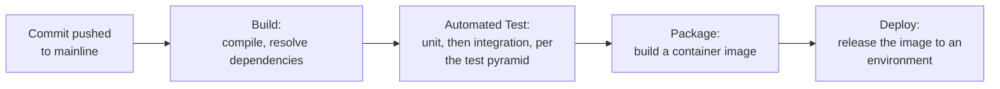

## Learning Objectives

- Trace a real commit through the four stages of a concrete CI/CD pipeline: build, automated test, package, deploy.
- Explain why each stage is ordered to fail fast and cheaply on the kind of problem it is best positioned to catch, and why reordering the stages loses that property.
- Explain why packaging into a container image is the step that makes the tested artifact and the deployed artifact provably identical.
- Connect the container packaging stage directly to `containers-and-os-level-virtualization`, rather than treating "containerize the build" as an unexplained black box.

## Context & Motivation

`continuous-integration` and `continuous-delivery-and-continuous-deployment` established what CI/CD is and where the human decision point sits. This concept makes the pipeline itself concrete: the actual sequence of gated stages a real commit passes through, and why that sequence is ordered the way it is, not arbitrarily. The specific stage this concept treats in the most depth, packaging the application into a container image, is also this discipline's first direct, concrete cross-link to `systems/operating-systems-ii`'s own container material, connecting two disciplines that, on the surface, look unrelated.

## Core Theory

### The four-stage pipeline, and why the order matters

A real CI/CD pipeline is not an arbitrary checklist; each stage exists to catch a specific class of problem as cheaply as possible, and the ordering deliberately puts cheaper, faster checks before more expensive, slower ones:



```text
1. BUILD:   Catches the cheapest class of problem (code that
            does not even compile, a missing dependency) before
            spending any time running a single test against it.

2. TEST:    Catches logic errors, run in the tiered order the
            test pyramid (test-pyramid-strategy) already
            prescribes: fast unit tests first, slower
            integration tests after, so a fast, cheap test
            failure is reported before a slow, expensive one
            even has a chance to run and consume time.

3. PACKAGE: Produces one single, immutable artifact (a
            container image) from code that has already passed
            every prior stage, so nothing that happens after
            this point can introduce a discrepancy between what
            was tested and what gets deployed.

4. DEPLOY:  Releases that exact, already-tested artifact to an
            environment, using one of the strategies
            deployment-strategies-blue-green-and-canary covers
            next.
```

Reversing this order, packaging before testing, for instance, would mean a test failure discovered after packaging wastes the time spent building the package for a change that was never going anywhere; reordering it any other way loses the fail-fast property the sequence is deliberately built around.

### Why packaging into a container makes the artifact provably identical

Before containerization was standard practice, a real, common failure mode plagued deployment pipelines: code that passed every test in a CI environment could still fail once deployed, because the CI environment and the production environment differed in some detail neither side had accounted for, a missing system library, a different runtime version, a different filesystem layout. A container image, built once during the package stage and never rebuilt afterward, eliminates this entire class of failure by construction: the exact same image that ran the automated tests (or an image built from the exact same, already-tested source and dependency graph) is the exact same image deployed to every later environment, staging and production alike. `containers-and-os-level-virtualization` (`systems/operating-systems-ii`) explains the underlying mechanism, namespaces and cgroups providing process isolation without a full virtual machine's overhead, that makes this kind of portable, self-contained image practical to build and run quickly enough to fit inside a CI/CD pipeline's own time budget.

### Gates between stages, not just stages

Each arrow in the pipeline diagram is a gate, not merely a sequence marker: a commit that fails the build stage never reaches the test stage at all, and a commit that fails any test never reaches packaging. This gating is exactly what makes the fail-fast property real rather than aspirational; without it, a pipeline that runs every stage regardless of earlier failures would still eventually report the same failures, just after wasting the time and resources every later stage consumed on a change already known to be broken.

## Worked Examples

### Example 1: a commit caught at the cheapest possible stage

A developer pushes a commit with a typo in an import statement. The build stage fails within seconds, before a single test runs, and the developer is notified immediately. Had testing run before building (an inverted, incorrect order), the pipeline would have had to somehow attempt to run tests against code that does not even compile, which is simply not possible; the natural, correct ordering exists precisely because each stage's checks are meaningless without the previous stage's success as a precondition.

### Example 2: a container image eliminating an "works on my machine" class of bug

A team migrates from deploying directly from a build server's local filesystem to packaging every build into a container image before deployment. Three weeks later, a bug that had intermittently appeared only in production, traced eventually to a subtly different version of a system library present on the production servers but not on the CI build server, stops recurring entirely, because the container image now carries its own exact runtime dependencies with it into every environment, staging and production alike, rather than depending on whatever happened to already be installed on the machine running it.

### Example 3: a gate correctly stopping a bad change before it reaches packaging

An integration test in the automated test stage fails for a specific commit, correctly detecting a real regression in how two services now interact after the change. Because the pipeline gates strictly (Core Theory), the package stage never runs for this commit; no container image is ever built from the broken code, and no deployment stage ever has the opportunity to consider releasing it. The regression is caught and stopped two stages before it could have reached a real environment, at the exact stage designed to catch exactly this class of problem.

## Common Misconceptions & Pitfalls

- **"Pipeline stage order doesn't really matter, as long as everything eventually runs."** Example 1 shows some stages are logically dependent on earlier ones succeeding (testing code that doesn't compile is not meaningful); the specific order in Core Theory is not an arbitrary convention, it reflects real, load-bearing dependencies between what each stage checks.
- **"A container image is just a lighter-weight virtual machine, nothing more."** `containers-and-os-level-virtualization` already draws this distinction precisely (namespaces and cgroups providing isolation without a hypervisor); this concept's own point is narrower but just as real: the image's value in a pipeline is specifically that it is one immutable, portable artifact carrying its own runtime dependencies, eliminating environment-mismatch bugs like Example 2's, independent of exactly how lightweight the isolation mechanism underneath it is.
- **"Gating between stages just means running stages in sequence."** A sequence without a real gate would still run every later stage even after an earlier one fails, wasting the resources those later stages consume; Example 3's actual value depends on the pipeline genuinely stopping, not merely reporting a failure after everything else has already run anyway.

## Summary

A real CI/CD pipeline is a strict sequence of gated stages, build, automated test, package, deploy, ordered deliberately so each stage catches the cheapest class of problem it is capable of catching before more expensive, slower stages ever run, and gated strictly so a failure at any stage stops the commit from proceeding rather than merely being reported after every later stage has already run anyway. The package stage, building the tested code into a container image, is the step that finally makes the artifact that was tested and the artifact that gets deployed provably, exactly identical, eliminating an entire real class of environment-mismatch bugs by construction; `containers-and-os-level-virtualization` (`systems/operating-systems-ii`) explains the underlying isolation mechanism, namespaces and cgroups, that makes building and running such an image practical within a pipeline's own time budget.

## Documentation Links

- [IEEE Computer Society: SWEBOK v4.0 Guide](https://www.computer.org/education/bodies-of-knowledge/software-engineering): the Software Engineering Operations knowledge area this concept's pipeline-stage treatment belongs to.
- [Fowler: Continuous Integration](https://martinfowler.com/articles/continuousIntegration.html): includes "automate deployment" among its core practices, the origin of treating deployment itself as the final, automatable stage of the same pipeline that starts with an automated build.
