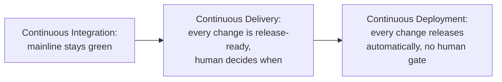

## Learning Objectives

- State Fowler's precise distinction between Continuous Delivery and Continuous Deployment, and identify exactly where human decision-making sits in each.
- Explain why Continuous Deployment strictly requires Continuous Delivery as a prerequisite, never as an independent, alternative choice.
- Identify what property a codebase must have before Continuous Delivery is even honestly claimable: every change on the mainline is release-ready, not merely compilable.
- Connect this distinction to a real branching strategy, explaining why trunk-based development is a practical precondition both terms assume.

## Context & Motivation

`continuous-integration` established the practice of merging small changes into a shared mainline with fast, trustworthy automated feedback. This concept asks the next honest question: once a change passes that automated verification, what happens to it, and specifically, who or what decides it actually reaches real users. Fowler's own writing draws a precise, frequently blurred line between two terms often used as if they were synonyms, and getting this distinction right matters directly for `ci-cd-pipeline-stages-and-containerized-builds` and `deployment-strategies-blue-green-and-canary`, both of which assume the reader already knows exactly where the human decision point sits.

## Core Theory

### The precise distinction

Fowler's own definitions, stated exactly: Continuous Delivery means a team is able to deploy frequently but may choose not to, usually because the business prefers a slower release cadence than the technical capability allows; Continuous Deployment means every change that passes the pipeline automatically gets put into production, with no remaining human decision point at all.

```text
CONTINUOUS DELIVERY:
  Pipeline verifies change is release-ready
       -> human decides WHEN to actually release it
       -> release happens (on demand, or on a schedule)

CONTINUOUS DEPLOYMENT:
  Pipeline verifies change is release-ready
       -> release happens automatically, immediately,
          NO human decision point remains
```

The distinguishing question is not how often releases happen; a team practicing Continuous Delivery could release once a day, or once a month, and still genuinely be practicing it, as long as the technical capability to release on demand is real. The distinguishing question is entirely about whether a human decision still sits between "verified as ready" and "actually released."

### Why Continuous Deployment strictly requires Continuous Delivery first

Fowler states this directly: to do Continuous Deployment, a team must already be doing Continuous Delivery. This is a logical, not merely a stylistic, requirement: Continuous Deployment removes the human decision point, but the pipeline's own automated verification is now the *only* thing standing between a change and production. That verification has to already be trustworthy enough, at Continuous Delivery's own standard, to bear that entire weight alone, before a team can honestly remove the human check without a real, immediate increase in risk of shipping a broken change straight to every user.



### The precondition Continuous Delivery honestly requires: release-ready, not merely compilable

Claiming Continuous Delivery honestly requires more than a green build; it requires every change on the mainline to genuinely be safe to release at any moment, which means the automated test suite (`continuous-integration`'s own self-testing build, tiered per `test-pyramid-strategy`) has to be trusted enough that passing it is treated as sufficient evidence of release-readiness, not merely evidence the code compiles and runs in isolation. A team that still requires a separate, manual QA pass before every release, no matter how automated their build is, has not actually achieved Continuous Delivery yet; they have achieved Continuous Integration with an additional, un-automated gate still standing between "build passes" and "safe to release."

### Trunk-based development as a practical precondition

Both terms assume changes reach a shared, releasable mainline quickly and in small increments, exactly what `branching-and-merging-strategies` (`software-construction`) calls trunk-based development: short-lived branches, merged frequently, rather than long-lived feature branches accumulating large, infrequent, risky merges. A team working on long-lived branches cannot honestly claim either Continuous Delivery or Continuous Deployment, because the mainline itself is not where the real, current state of the product actually lives at any given moment, undermining the entire premise that "the mainline is always release-ready."

## Worked Examples

### Example 1: correctly distinguishing the two on a real team

A team's pipeline verifies every change and stages it, ready to release, but a release manager reviews a short summary of what changed and clicks "release" once a day, at a time chosen for lowest user impact. This is Continuous Delivery: the technical capability to release on demand is real (the pipeline proves every change is ready), but a human decision (the release manager's click, and the timing choice) still sits between verification and actual release.

### Example 2: a team that claims Continuous Deployment but hasn't earned it

A team removes their release manager's manual approval step and configures every passing build to deploy automatically, while their test suite still has known, tolerated gaps in coverage for several critical code paths. Two weeks later, a change with a real defect in one of those uncovered paths passes the pipeline and reaches every user automatically, with no human check left to have caught it. The team's mistake was not choosing Continuous Deployment itself, but choosing it before their pipeline's own verification was trustworthy enough, at Continuous Delivery's own honest standard, to bear that full weight alone.

### Example 3: long-lived branches undermining the claim, even with automation in place

A team has a fully automated pipeline and genuinely wants to claim Continuous Delivery, but individual engineers still work on feature branches that live for two to three weeks before merging. During that entire window, the actual mainline reflects only what was true two or three weeks ago for any given engineer's in-progress work; a release "from the mainline" at any given moment is not truly representative of the product's real, current, intended state. The automation is real, but the branching strategy undermines the honest premise Continuous Delivery depends on, that the mainline is always both current and release-ready.

## Common Misconceptions & Pitfalls

- **"Continuous Delivery and Continuous Deployment are interchangeable terms for the same practice."** Core Theory's precise distinction shows they differ on exactly one point, whether a human decision remains between verification and release, and that one point has real, direct consequences for how much trust a team's automated pipeline needs to have earned first.
- **"A team can adopt Continuous Deployment as an independent choice, skipping Continuous Delivery."** Fowler's own statement, and Example 2's failure mode, show this is a category error: Continuous Deployment is Continuous Delivery with the human gate removed, not a separate, alternative practice a team can adopt on its own terms without first earning the trustworthy pipeline Continuous Delivery requires.
- **"Deploying frequently is what makes a team 'Continuous Delivery.'"** The frequency of actual releases is a business choice, not the defining criterion; a team releasing once a month, with a pipeline proving every single change is release-ready at any moment, is genuinely practicing Continuous Delivery, while a team releasing several times a day through a manual, ad hoc process is not.

## Summary

Fowler's precise distinction is exact: Continuous Delivery means every change on the mainline is proven release-ready by the pipeline, but a human still decides when to actually release; Continuous Deployment removes that decision entirely, releasing every verified change automatically. Continuous Deployment strictly requires Continuous Delivery as its foundation, since removing the human gate means the pipeline's own automated verification now bears the entire weight of catching a bad change alone, and both terms assume a real precondition this discipline already names elsewhere, trunk-based development (`branching-and-merging-strategies`, `software-construction`), keeping the mainline both current and genuinely release-ready at every moment rather than reflecting only what was true weeks earlier on some engineer's long-lived branch.

## Documentation Links

- [Fowler: Continuous Delivery vs. Continuous Deployment](https://martinfowler.com/bliki/ContinuousDelivery.html): the primary source this concept's precise distinction, and Fowler's own statement that Continuous Deployment requires Continuous Delivery first, are drawn from directly.
- [IEEE Computer Society: SWEBOK v4.0 Guide](https://www.computer.org/education/bodies-of-knowledge/software-engineering): the Software Engineering Operations knowledge area both continuous delivery and continuous deployment belong to as formalized, distinct practices.
