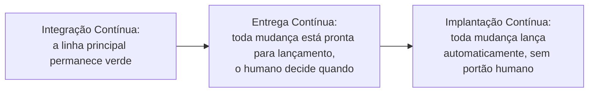

## Objetivos de Aprendizagem

- Enunciar a distinção precisa de Fowler entre Entrega Contínua e Implantação Contínua, e identificar exatamente onde a tomada de decisão humana se situa em cada uma.
- Explicar por que a Implantação Contínua estritamente exige a Entrega Contínua como um pré-requisito, nunca como uma escolha alternativa independente.
- Identificar que propriedade um código tem de ter antes de a Entrega Contínua ser sequer honestamente reivindicável: toda mudança na linha principal está pronta para lançamento, não meramente compilável.
- Conectar esta distinção a uma estratégia de ramificação real, explicando por que o desenvolvimento baseado em trunk é uma pré-condição prática que ambos os termos assumem.

## Contexto e Motivação

`continuous-integration` estabeleceu a prática de mesclar pequenas mudanças numa linha principal compartilhada com feedback automatizado rápido e confiável. Este conceito faz a próxima pergunta honesta: uma vez que uma mudança passa por essa verificação automatizada, o que acontece com ela, e especificamente, quem ou o quê decide que ela de fato alcança usuários reais. A própria escrita de Fowler traça uma linha precisa e frequentemente borrada entre dois termos frequentemente usados como se fossem sinônimos, e acertar esta distinção importa diretamente para `ci-cd-pipeline-stages-and-containerized-builds` e `deployment-strategies-blue-green-and-canary`, ambos os quais assumem que o leitor já sabe exatamente onde o ponto de decisão humano se situa.

## Teoria Central

### A distinção precisa

As próprias definições de Fowler, enunciadas exatamente: Entrega Contínua significa que uma equipe é capaz de implantar frequentemente mas pode escolher não fazê-lo, geralmente porque o negócio prefere uma cadência de lançamento mais lenta do que a capacidade técnica permite; Implantação Contínua significa que toda mudança que passa pelo pipeline automaticamente é posta em produção, sem nenhum ponto de decisão humano restante de forma alguma.

```text
ENTREGA CONTÍNUA:
  O pipeline verifica que a mudança está pronta para lançamento
       -> o humano decide QUANDO de fato lançá-la
       -> o lançamento acontece (sob demanda, ou numa agenda)

IMPLANTAÇÃO CONTÍNUA:
  O pipeline verifica que a mudança está pronta para lançamento
       -> o lançamento acontece automaticamente, imediatamente,
          NENHUM ponto de decisão humano resta
```

A pergunta distintiva não é quão frequentemente os lançamentos acontecem; uma equipe praticando Entrega Contínua poderia lançar uma vez por dia, ou uma vez por mês, e ainda genuinamente estar praticando-a, desde que a capacidade técnica de lançar sob demanda seja real. A pergunta distintiva é inteiramente sobre se uma decisão humana ainda se situa entre "verificada como pronta" e "de fato lançada".

### Por que a Implantação Contínua estritamente exige a Entrega Contínua primeiro

Fowler enuncia isto diretamente: para fazer Implantação Contínua, uma equipe já tem de estar fazendo Entrega Contínua. Este é um requisito lógico, não meramente estilístico: a Implantação Contínua remove o ponto de decisão humano, mas a própria verificação automatizada do pipeline é agora a *única* coisa entre uma mudança e a produção. Essa verificação tem de já ser confiável o bastante, no próprio padrão da Entrega Contínua, para carregar esse peso inteiro sozinha, antes de uma equipe poder honestamente remover a checagem humana sem um aumento real e imediato de risco de enviar uma mudança quebrada direto para todo usuário.



### A pré-condição que a Entrega Contínua honestamente exige: pronta para lançamento, não meramente compilável

Reivindicar Entrega Contínua honestamente exige mais do que um build verde; exige que toda mudança na linha principal genuinamente seja segura de lançar a qualquer momento, o que significa que a suíte de testes automatizada (o próprio build que testa a si mesmo de `continuous-integration`, em camadas por `test-pyramid-strategy`) tem de ser confiada o bastante de forma que passar por ela seja tratado como evidência suficiente de prontidão para lançamento, não meramente evidência de que o código compila e roda isoladamente. Uma equipe que ainda exige uma passagem de QA manual separada antes de todo lançamento, não importa quão automatizado o seu build seja, não alcançou de fato a Entrega Contínua ainda; ela alcançou a Integração Contínua com um portão adicional e não automatizado ainda entre "o build passa" e "seguro de lançar".

### Desenvolvimento baseado em trunk como uma pré-condição prática

Ambos os termos assumem que as mudanças alcançam uma linha principal compartilhada e lançável rapidamente e em pequenos incrementos, exatamente o que `branching-and-merging-strategies` (`software-construction`) chama de desenvolvimento baseado em trunk: branches de vida curta, mesclados frequentemente, em vez de branches de recurso de vida longa acumulando merges grandes, infrequentes e arriscados. Uma equipe trabalhando em branches de vida longa não consegue honestamente reivindicar nem Entrega Contínua nem Implantação Contínua, porque a própria linha principal não é onde o estado real e atual do produto de fato vive em qualquer dado momento, minando a premissa inteira de que "a linha principal está sempre pronta para lançamento".

## Exemplos Resolvidos

### Exemplo 1: distinguindo corretamente as duas numa equipe real

O pipeline de uma equipe verifica toda mudança e a prepara, pronta para lançar, mas um gerente de lançamento revisa um resumo curto do que mudou e clica em "lançar" uma vez por dia, num horário escolhido para o menor impacto de usuário. Isto é Entrega Contínua: a capacidade técnica de lançar sob demanda é real (o pipeline prova que toda mudança está pronta), mas uma decisão humana (o clique do gerente de lançamento, e a escolha de horário) ainda se situa entre a verificação e o lançamento de fato.

### Exemplo 2: uma equipe que reivindica Implantação Contínua mas não a mereceu

Uma equipe remove o passo de aprovação manual do seu gerente de lançamento e configura todo build que passa para implantar automaticamente, enquanto a sua suíte de testes ainda tem lacunas conhecidas e toleradas de cobertura para vários caminhos de código críticos. Duas semanas depois, uma mudança com um defeito real num desses caminhos não cobertos passa pelo pipeline e alcança todo usuário automaticamente, sem nenhuma checagem humana restante para tê-lo pego. O erro da equipe não foi escolher a Implantação Contínua em si, mas escolhê-la antes de a verificação do seu próprio pipeline ser confiável o bastante, no próprio padrão honesto da Entrega Contínua, para carregar esse peso completo sozinha.

### Exemplo 3: branches de vida longa minando a reivindicação, mesmo com automação no lugar

Uma equipe tem um pipeline totalmente automatizado e genuinamente quer reivindicar Entrega Contínua, mas engenheiros individuais ainda trabalham em branches de recurso que vivem por duas a três semanas antes de mesclar. Durante toda essa janela, a linha principal de fato reflete só o que era verdadeiro duas ou três semanas atrás para o trabalho em progresso de qualquer dado engenheiro; um lançamento "da linha principal" em qualquer dado momento não é verdadeiramente representativo do estado real, atual e pretendido do produto. A automação é real, mas a estratégia de ramificação mina a premissa honesta da qual a Entrega Contínua depende, de que a linha principal está sempre tanto atual quanto pronta para lançamento.

## Equívocos Comuns e Armadilhas

- **"Entrega Contínua e Implantação Contínua são termos intercambiáveis para a mesma prática."** A distinção precisa da Teoria Central mostra que elas diferem em exatamente um ponto, se uma decisão humana resta entre a verificação e o lançamento, e esse único ponto tem consequências reais e diretas para quanta confiança o pipeline automatizado de uma equipe precisa ter merecido primeiro.
- **"Uma equipe pode adotar a Implantação Contínua como uma escolha independente, pulando a Entrega Contínua."** A própria declaração de Fowler, e o modo de falha do Exemplo 2, mostram que isto é um erro de categoria: a Implantação Contínua é a Entrega Contínua com o portão humano removido, não uma prática separada e alternativa que uma equipe pode adotar nos seus próprios termos sem primeiro merecer o pipeline confiável que a Entrega Contínua exige.
- **"Implantar frequentemente é o que torna uma equipe 'Entrega Contínua'."** A frequência dos lançamentos de fato é uma escolha de negócio, não o critério definidor; uma equipe lançando uma vez por mês, com um pipeline provando que toda única mudança está pronta para lançamento a qualquer momento, está genuinamente praticando Entrega Contínua, enquanto uma equipe lançando várias vezes por dia por um processo manual e ad hoc não está.

## Resumo

A distinção precisa de Fowler é exata: Entrega Contínua significa que toda mudança na linha principal é comprovada pronta para lançamento pelo pipeline, mas um humano ainda decide quando de fato lançar; a Implantação Contínua remove essa decisão inteiramente, lançando toda mudança verificada automaticamente. A Implantação Contínua estritamente exige a Entrega Contínua como a sua fundação, já que remover o portão humano significa que a própria verificação automatizada do pipeline agora carrega o peso inteiro de pegar uma mudança ruim sozinha, e ambos os termos assumem uma pré-condição real que esta disciplina já nomeia em outro lugar, o desenvolvimento baseado em trunk (`branching-and-merging-strategies`, `software-construction`), mantendo a linha principal tanto atual quanto genuinamente pronta para lançamento a todo momento em vez de refletir só o que era verdadeiro semanas antes no branch de vida longa de algum engenheiro.

## Documentation Links

- [Fowler: Continuous Delivery vs. Continuous Deployment](https://martinfowler.com/bliki/ContinuousDelivery.html): a fonte primária da qual a distinção precisa deste conceito, e a própria declaração de Fowler de que a Implantação Contínua exige a Entrega Contínua primeiro, são tiradas diretamente.
- [IEEE Computer Society: SWEBOK v4.0 Guide](https://www.computer.org/education/bodies-of-knowledge/software-engineering): a área de conhecimento de Operações de Engenharia de Software à qual tanto a entrega contínua quanto a implantação contínua pertencem como práticas formalizadas e distintas.
