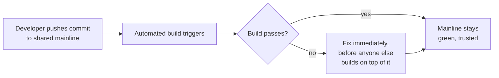

## Learning Objectives

- State Martin Fowler's precise definition of Continuous Integration: merging changes into a shared mainline at least daily, verified by an automated, self-testing build.
- Name the practice's real origin (Kent Beck's Extreme Programming) honestly, distinguishing it from Microsoft's earlier, less rigorous daily builds.
- Explain why each of Fowler's core practices exists to defend one property: fast, trustworthy feedback about whether the mainline still works.
- Connect CI's automated test suite directly to `unit-integration-and-system-testing` and `test-pyramid-strategy`, rather than treating "tests" as a single undifferentiated block inside the pipeline.

## Context & Motivation

`swebok-and-the-scope-beyond-construction` named Software Engineering Operations as the newest SWEBOK knowledge area, added specifically because practices like continuous integration and deployment had grown mature and important enough in real industry practice to deserve a dedicated home. Continuous Integration is the foundational practice this entire area is built on, and, honestly, it did not originate as academic theory: Martin Fowler's own writing, credited directly to Kent Beck's Extreme Programming in the 1990s, is the primary source this concept is grounded in, the same honest industrial sourcing `software-construction`'s own SOLID concept modeled for its own practitioner-originated material.

## Core Theory

### The precise definition

Fowler's definition, stated exactly: Continuous Integration is a software development practice where each member of a team merges their changes into a shared codebase together with their colleagues' changes at least daily, and every integration is verified by an automated build, including tests, to detect integration errors as quickly as possible.

Two words in that definition carry the entire weight of the practice: "automated" and "quickly." A daily merge that is not verified by an automated build is not Continuous Integration under this definition, no matter how frequent the merges are; Fowler's own writing notes that Microsoft's well-known daily builds in this era lacked exactly this automated, rigorous testing discipline, which is precisely why they do not count as an instance of the practice Beck's community was actually describing.

### The eleven practices, and the one property they all defend

Fowler's article lists eleven concrete practices. Read together, every one of them exists for a single reason: keeping feedback about the mainline's health fast and trustworthy.

```text
1. Put everything in a version-controlled mainline
2. Automate the build
3. Make the build self-testing
4. Everyone pushes commits to the mainline every day
5. Every push to mainline should trigger a build
6. Fix broken builds immediately
7. Keep the build fast
8. Hide work-in-progress
9. Test in a clone of the production environment
10. Everyone can see what's happening
11. Automate deployment
```

Practice 6, fixing a broken build immediately, is the practice most often skipped under deadline pressure, and skipping it is the single most damaging failure mode of a real CI setup: a build left broken teaches every engineer on the team to distrust the build's own signal, and once that trust is gone, the entire practice's value (fast, trustworthy feedback) is gone with it, even though the automation itself keeps running.



### Why the automated test suite is not one undifferentiated block

Fowler's definition requires the build to be "self-testing," but a real CI pipeline's test suite is not one monolithic thing; it is structured, and `test-pyramid-strategy` (`testing-concepts`) names the real structure directly: many fast unit tests, fewer integration tests, and few, slower end-to-end tests, deliberately shaped this way because a CI build's own practice 7 (keep the build fast) directly constrains how many slow tests a build can afford to run on every single push. `unit-integration-and-system-testing` (`software-construction`) names the same three tiers from the testing-technique side; a real CI pipeline is where that tiered structure meets Fowler's own speed requirement directly, running the fast tier on every push and reserving the slowest tier for less frequent, gated stages, exactly the structure `ci-cd-pipeline-stages-and-containerized-builds` traces next in this discipline.

## Worked Examples

### Example 1: a build that technically runs but fails the actual practice

A team's build server runs an automated build on every push, but the build only compiles the code and does not run the test suite at all. This satisfies practices 1, 2, and 5 in isolation, but fails practice 3 entirely (self-testing); a broken feature can merge cleanly, pass the "build," and reach every other developer's local checkout before anyone notices, defeating the entire purpose Fowler's definition names, fast detection of integration errors, even though a green checkmark appears next to every commit.

### Example 2: a team that merges daily but still lacks real CI

A team requires every developer to merge to the mainline daily, satisfying practice 4 on its own, but each developer works on a long-lived feature branch for two weeks before that daily merge catches up all at once. The frequent merges are of enormous, infrequent diffs rather than small, incremental ones; when an integration error does surface, it is buried inside two weeks of accumulated changes instead of the small, easily attributable diff Fowler's practice actually depends on for the "detect quickly" half of the definition to mean anything in practice.

### Example 3: fixing a broken build immediately, and what happens when a team doesn't

Two teams both experience a broken mainline build on the same day. Team A treats it as the top priority: someone drops what they're doing, fixes it within twenty minutes, and no one else pushes on top of the broken state in the meantime. Team B lets it sit for three days while people finish their current work first; by the time someone fixes it, four unrelated feature branches have already built on top of the broken state, and untangling which of the now-numerous new failures are caused by the original break versus new, independent problems introduced afterward takes most of another day. The cost of practice 6 (fix immediately) is visible and small (twenty minutes, right now); the cost of skipping it compounds with every commit that lands on top of the broken state.

## Common Misconceptions & Pitfalls

- **"Any automated build server counts as doing CI."** Example 1 shows a build that runs but does not actually test the code fails Fowler's own definition on its most important word, self-testing; automation alone, without genuine test coverage running on every push, does not deliver the fast, trustworthy feedback the whole practice exists to provide.
- **"Merging to mainline once a day is the same as practicing CI, regardless of branch lifetime."** Example 2 shows the practice's real value depends on small, frequent, incrementally integrated changes, not merely a daily cadence applied to large, long-accumulated diffs; the frequency of the merge event matters less than the size of what each merge actually contains.
- **"CI is purely a tooling choice, unrelated to team discipline."** Example 3 shows the practice's actual value depends on a team behavior (fixing a broken build immediately, before building further on top of it), not the tooling alone; the same CI server, used by two different teams with two different disciplines around a broken build, produces two very different real outcomes.

## Summary

Continuous Integration, per Martin Fowler's own precise definition (credited honestly to Kent Beck's Extreme Programming, not to earlier, less rigorous efforts like Microsoft's daily builds), means every team member merges changes into a shared mainline at least daily, and every merge triggers an automated, self-testing build meant to detect integration errors as quickly as possible. Fowler's eleven concrete practices all defend one underlying property: fast, trustworthy feedback about whether the mainline still works, which is why fixing a broken build immediately (practice 6) is the single most consequential practice to skip, and why the automated test suite behind a CI build is not one undifferentiated block but a deliberately tiered structure, exactly the tiers `test-pyramid-strategy` and `unit-integration-and-system-testing` already name from the testing-technique side.

## Documentation Links

- [Fowler: Continuous Integration](https://martinfowler.com/articles/continuousIntegration.html): the primary source this concept's precise definition, origin attribution, and eleven core practices are drawn from directly.
- [IEEE Computer Society: SWEBOK v4.0 Guide](https://www.computer.org/education/bodies-of-knowledge/software-engineering): the Software Engineering Operations knowledge area, added in the 2024 edition specifically to give continuous integration and deployment practices a formal, dedicated home in the field's own body of knowledge.
