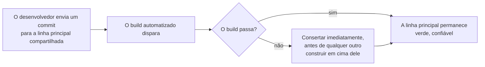

## Objetivos de Aprendizagem

- Enunciar a definição precisa de Martin Fowler para Integração Contínua: mesclar mudanças numa linha principal compartilhada pelo menos diariamente, verificada por um build automatizado que testa a si mesmo.
- Nomear a origem real da prática (o Extreme Programming de Kent Beck) honestamente, distinguindo-a dos daily builds anteriores e menos rigorosos da Microsoft.
- Explicar por que cada uma das práticas centrais de Fowler existe para defender uma propriedade: feedback rápido e confiável sobre se a linha principal ainda funciona.
- Conectar a suíte de testes automatizada da CI diretamente a `unit-integration-and-system-testing` e `test-pyramid-strategy`, em vez de tratar "testes" como um único bloco indiferenciado dentro do pipeline.

## Contexto e Motivação

`swebok-and-the-scope-beyond-construction` nomeou as Operações de Engenharia de Software como a área de conhecimento mais nova do SWEBOK, adicionada especificamente porque práticas como integração e implantação contínua tinham crescido maduras e importantes o bastante na prática real da indústria para merecer um lar dedicado. A Integração Contínua é a prática fundamental sobre a qual esta área inteira é construída, e, honestamente, ela não se originou como teoria acadêmica: a própria escrita de Martin Fowler, creditada diretamente ao Extreme Programming de Kent Beck nos anos 1990, é a fonte primária na qual este conceito é fundamentado, o mesmo fornecimento industrial honesto que o próprio conceito SOLID de `software-construction` modelou para o seu próprio material originado de profissionais.

## Teoria Central

### A definição precisa

A definição de Fowler, enunciada exatamente: a Integração Contínua é uma prática de desenvolvimento de software onde cada membro de uma equipe mescla as suas mudanças num código compartilhado junto às mudanças dos seus colegas pelo menos diariamente, e toda integração é verificada por um build automatizado, incluindo testes, para detectar erros de integração tão rápido quanto possível.

Duas palavras nessa definição carregam o peso inteiro da prática: "automatizado" e "rápido". Um merge diário que não é verificado por um build automatizado não é Integração Contínua sob esta definição, não importa quão frequentes os merges sejam; a própria escrita de Fowler nota que os daily builds bem conhecidos da Microsoft nesta era careciam exatamente desta disciplina de teste automatizado e rigoroso, que é precisamente por que eles não contam como uma instância da prática que a comunidade de Beck estava de fato descrevendo.

### As onze práticas, e a única propriedade que todas defendem

O artigo de Fowler lista onze práticas concretas. Lidas juntas, cada uma delas existe por uma única razão: manter o feedback sobre a saúde da linha principal rápido e confiável.

```text
1. Pôr tudo numa linha principal versionada
2. Automatizar o build
3. Fazer o build testar a si mesmo
4. Todos enviam commits para a linha principal todo dia
5. Todo envio para a linha principal deveria disparar um build
6. Consertar builds quebrados imediatamente
7. Manter o build rápido
8. Esconder o trabalho em progresso
9. Testar num clone do ambiente de produção
10. Todos podem ver o que está acontecendo
11. Automatizar a implantação
```

A prática 6, consertar um build quebrado imediatamente, é a prática mais frequentemente pulada sob pressão de prazo, e pulá-la é o modo de falha individual mais danoso de uma configuração de CI real: um build deixado quebrado ensina todo engenheiro na equipe a desconfiar do próprio sinal do build, e uma vez que essa confiança se foi, o valor inteiro da prática (feedback rápido e confiável) se foi com ela, mesmo que a própria automação continue rodando.



### Por que a suíte de testes automatizada não é um bloco indiferenciado

A definição de Fowler exige que o build "teste a si mesmo", mas a suíte de testes de um pipeline de CI real não é uma coisa monolítica; ela é estruturada, e `test-pyramid-strategy` (`testing-concepts`) nomeia a estrutura real diretamente: muitos testes unitários rápidos, menos testes de integração, e poucos testes de ponta a ponta, mais lentos, deliberadamente moldados assim porque a própria prática 7 de um build de CI (manter o build rápido) restringe diretamente quantos testes lentos um build pode se dar ao luxo de rodar em todo único envio. `unit-integration-and-system-testing` (`software-construction`) nomeia as mesmas três camadas do lado da técnica de teste; um pipeline de CI real é onde essa estrutura em camadas encontra o próprio requisito de velocidade de Fowler diretamente, rodando a camada rápida em todo envio e reservando a camada mais lenta para estágios menos frequentes e com portões, exatamente a estrutura que `ci-cd-pipeline-stages-and-containerized-builds` rastreia em seguida nesta disciplina.

## Exemplos Resolvidos

### Exemplo 1: um build que tecnicamente roda mas falha a prática de fato

O servidor de build de uma equipe roda um build automatizado em todo envio, mas o build só compila o código e não roda a suíte de testes de forma alguma. Isto satisfaz as práticas 1, 2 e 5 isoladamente, mas falha a prática 3 inteiramente (testar a si mesmo); um recurso quebrado pode mesclar de forma limpa, passar pelo "build", e alcançar o checkout local de todo outro desenvolvedor antes de alguém notar, derrotando o propósito inteiro que a definição de Fowler nomeia, detecção rápida de erros de integração, mesmo que um visto verde apareça ao lado de todo commit.

### Exemplo 2: uma equipe que mescla diariamente mas ainda carece de CI real

Uma equipe exige que todo desenvolvedor mescle na linha principal diariamente, satisfazendo a prática 4 por conta própria, mas cada desenvolvedor trabalha num branch de recurso de vida longa por duas semanas antes de esse merge diário alcançar tudo de uma vez. Os merges frequentes são de diffs enormes e infrequentes em vez de pequenos e incrementais; quando um erro de integração de fato surge, ele está enterrado dentro de duas semanas de mudanças acumuladas em vez do diff pequeno e facilmente atribuível do qual a prática de Fowler de fato depende para a metade "detectar rápido" da definição significar algo na prática.

### Exemplo 3: consertar um build quebrado imediatamente, e o que acontece quando uma equipe não o faz

Duas equipes ambas experimentam um build de linha principal quebrado no mesmo dia. A Equipe A o trata como a prioridade máxima: alguém larga o que está fazendo, o conserta em vinte minutos, e nenhum outro envia em cima do estado quebrado nesse meio-tempo. A Equipe B o deixa parado por três dias enquanto as pessoas terminam o seu trabalho atual primeiro; quando alguém o conserta, quatro branches de recurso não relacionados já construíram em cima do estado quebrado, e desembaraçar quais das agora numerosas novas falhas são causadas pela quebra original versus novos problemas independentes introduzidos depois leva a maior parte de outro dia. O custo da prática 6 (consertar imediatamente) é visível e pequeno (vinte minutos, agora mesmo); o custo de pulá-la se compõe com todo commit que aterrissa em cima do estado quebrado.

## Equívocos Comuns e Armadilhas

- **"Qualquer servidor de build automatizado conta como fazer CI."** O Exemplo 1 mostra que um build que roda mas não de fato testa o código falha a própria definição de Fowler na sua palavra mais importante, testar a si mesmo; a automação sozinha, sem cobertura de teste genuína rodando em todo envio, não entrega o feedback rápido e confiável que a prática inteira existe para fornecer.
- **"Mesclar na linha principal uma vez por dia é o mesmo que praticar CI, independentemente do tempo de vida do branch."** O Exemplo 2 mostra que o valor real da prática depende de mudanças pequenas, frequentes e integradas incrementalmente, não meramente uma cadência diária aplicada a diffs grandes e acumulados por muito tempo; a frequência do evento de merge importa menos do que o tamanho do que cada merge de fato contém.
- **"CI é puramente uma escolha de ferramental, não relacionada à disciplina da equipe."** O Exemplo 3 mostra que o valor de fato da prática depende de um comportamento de equipe (consertar um build quebrado imediatamente, antes de construir mais em cima dele), não do ferramental sozinho; o mesmo servidor de CI, usado por duas equipes diferentes com duas disciplinas diferentes em torno de um build quebrado, produz dois resultados reais muito diferentes.

## Resumo

A Integração Contínua, pela própria definição precisa de Martin Fowler (creditada honestamente ao Extreme Programming de Kent Beck, não a esforços anteriores e menos rigorosos como os daily builds da Microsoft), significa que todo membro da equipe mescla mudanças numa linha principal compartilhada pelo menos diariamente, e todo merge dispara um build automatizado que testa a si mesmo feito para detectar erros de integração tão rápido quanto possível. As onze práticas concretas de Fowler todas defendem uma propriedade subjacente: feedback rápido e confiável sobre se a linha principal ainda funciona, que é por que consertar um build quebrado imediatamente (prática 6) é a prática individual mais consequente de pular, e por que a suíte de testes automatizada por trás de um build de CI não é um bloco indiferenciado mas uma estrutura deliberadamente em camadas, exatamente as camadas que `test-pyramid-strategy` e `unit-integration-and-system-testing` já nomeiam do lado da técnica de teste.

## Documentation Links

- [Fowler: Continuous Integration](https://martinfowler.com/articles/continuousIntegration.html): a fonte primária da qual a definição precisa, a atribuição de origem e as onze práticas centrais deste conceito são tiradas diretamente.
- [IEEE Computer Society: SWEBOK v4.0 Guide](https://www.computer.org/education/bodies-of-knowledge/software-engineering): a área de conhecimento de Operações de Engenharia de Software, adicionada na edição de 2024 especificamente para dar às práticas de integração e implantação contínua um lar formal e dedicado no próprio corpo de conhecimento do campo.
