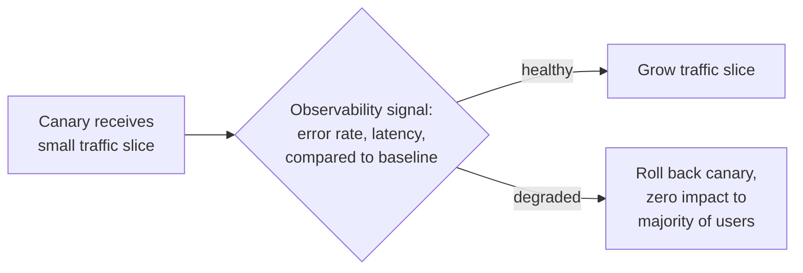

## Learning Objectives

- Define blue-green deployment precisely: two complete production environments, with traffic switched from one to the other in a single cutover.
- Define canary release precisely: routing a small, growing slice of real traffic to a new version before committing it to everyone.
- State exactly what real failure each strategy catches, and what real cost each accepts in exchange, without treating either as strictly superior.
- Explain why a canary release depends on real production observability to be meaningful, foreshadowing `observability-the-three-pillars`.

## Context & Motivation

`ci-cd-pipeline-stages-and-containerized-builds` ended at the deploy stage without specifying exactly how a new, tested container image actually reaches production traffic. That final step is not a single, universal mechanism; Fowler's own writing names two of the most established real strategies, blue-green deployment and canary release, and this concept treats both honestly: what specific kind of failure each is actually good at catching, and what each strategy costs in exchange, rather than presenting either as a simple, unconditional upgrade over directly replacing the old version with the new one.

## Core Theory

### Blue-green deployment: instant cutover, instant rollback

Blue-green deployment maintains two complete, identical production environments, conventionally named blue and green. One is live, serving all real traffic; the new release is deployed fully into the other, idle environment, and, once verified, a router switch redirects all traffic from the old environment to the new one in a single, near-instantaneous cutover.

```text
BEFORE:  Router --> [BLUE  (live, old version)]
                     [GREEN (idle, new version deployed here)]

CUTOVER: Router switches to GREEN

AFTER:   Router --> [GREEN (live, new version)]
                     [BLUE  (idle, previous version, kept warm
                            for instant rollback)]
```

The genuine benefit is instant, clean rollback: if the new version misbehaves after the cutover, switching the router back to the still-warm old environment is just as fast as the original cutover was. The real cost is running two full production-class environments simultaneously during the transition, doubling infrastructure for that window, and the fact that the cutover itself is all-or-nothing: every single user is on the new version the instant the switch happens, with no gradual exposure at all.

### Canary release: gradual exposure, gradual confidence

Canary release instead routes only a small percentage of real traffic to the new version at first, monitoring it directly against the old version's behavior, and grows that percentage over time as confidence builds, only reaching full rollout once the canary has proven itself under real, live conditions:

```text
Stage 1:  95% traffic -> old version   5% traffic -> new version
Stage 2:  75% traffic -> old version  25% traffic -> new version
Stage 3:   0% traffic -> old version 100% traffic -> new version
```

The genuine benefit is earlier detection of a bad release, under real production load and real user behavior, while limiting the actual blast radius of a problem to only the small slice of traffic currently exposed to it. The real cost is running two versions side by side for a longer window than blue-green's single instantaneous switch, and needing a real, reliable way to actually tell the two versions' behavior apart while both are live simultaneously, which is exactly the dependency the next section names directly.

### Why canary release depends on real observability

A canary release's entire value depends on being able to answer, quickly and reliably, whether the small slice of traffic on the new version is actually behaving worse than the slice still on the old version. Without a real signal (an error rate, a latency distribution, a specific metric tied to the feature that changed) comparing the two live populations directly, "canary release" degrades into simply running two versions in production with no actual verification happening, defeating the entire purpose of the gradual rollout. `observability-the-three-pillars`, the next concept in this discipline, is not incidental background to this idea; it is the concrete mechanism that makes a canary release meaningful rather than cosmetic.



## Worked Examples

### Example 1: blue-green catching a deployment-time failure

A new release fails to start correctly due to a missing environment variable, an error that would only surface once the new version actually receives traffic. Under blue-green, this failure is discovered while verifying the idle (green) environment, before any real traffic has ever touched it; the router switch simply never happens, and the live (blue) environment continues serving every user, completely unaffected. The failure was caught with zero user impact, because the entire strategy never exposed a single real user to the broken version in the first place.

### Example 2: canary catching a failure blue-green would have missed entirely

A new release starts correctly and passes every automated test, but under real, live traffic patterns (a specific, unusual sequence of API calls a small fraction of real users happen to make) it triggers a rare but genuine bug that no test in the pipeline exercised. Under blue-green, this bug would not surface until 100% of traffic switches to the new version, at which point every single user is exposed simultaneously. Under canary, the bug surfaces while only 5% of traffic is exposed, the observability signal (a spike in error rate specific to the canary slice) triggers an automatic or manual rollback, and 95% of users never experience the bug at all.

### Example 3: choosing blue-green over canary for a genuine reason

A team is deploying a database schema migration alongside application code, where running two different schema versions simultaneously against a shared database is not safely possible at all. Canary release's core mechanism, two versions live simultaneously, is not viable here regardless of its other benefits; blue-green's instantaneous, all-at-once cutover, paired with a migration strategy that keeps both schema versions compatible only for the brief cutover window rather than for canary's much longer gradual-rollout window, is the correct, deliberate choice for this specific constraint.

## Common Misconceptions & Pitfalls

- **"Canary release is strictly better than blue-green, since it's more gradual."** Example 3 shows canary's core assumption, two versions genuinely running side by side for an extended window, is not always viable (a shared, non-forward-compatible schema migration being a real, concrete case where it isn't); blue-green's instant, all-at-once cutover is the correct choice precisely when that assumption fails.
- **"A canary release with no real monitoring in place is still meaningfully a canary release."** Core Theory's dependency on observability is not decorative; without a real, reliable signal actually comparing the canary slice's behavior to the baseline, the strategy provides no actual verification, only the appearance of caution.
- **"Blue-green's instant rollback capability means it never has downtime or risk."** Example 2 shows blue-green's all-or-nothing cutover has a real cost canary specifically avoids: a bug that only manifests under real traffic patterns is discovered only after every single user is already exposed to it, since blue-green provides no gradual, partial-exposure stage the way canary does.

## Summary

Blue-green deployment keeps two complete production environments and switches all traffic between them in a single, instantaneous cutover, buying instant, clean rollback and catching deployment-time failures with zero user impact, at the cost of doubled infrastructure during the transition and an all-or-nothing exposure the instant the switch happens. Canary release instead routes a small, growing slice of real traffic to the new version first, buying earlier detection of failures that only manifest under real production conditions and limiting the blast radius of a bad release, at the cost of running two versions side by side longer and depending entirely on a real observability signal to compare their behavior meaningfully, without which the strategy provides only the appearance of caution rather than real verification. Neither strategy is universally superior; the right choice depends on real, concrete constraints like whether two versions can safely coexist against shared, mutable state at all.

## Documentation Links

- [Fowler: Blue-Green Deployment](https://martinfowler.com/bliki/BlueGreenDeployment.html): the primary source this concept's blue-green mechanism and rollback-benefit framing are drawn from directly.
- [Fowler: Canary Release](https://martinfowler.com/bliki/CanaryRelease.html): the primary source this concept's canary mechanism and gradual-exposure framing are drawn from directly.
