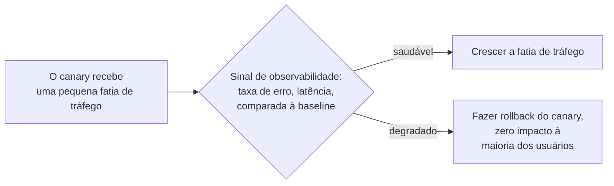

## Objetivos de Aprendizagem

- Definir a implantação blue-green precisamente: dois ambientes de produção completos, com o tráfego trocado de um para o outro num único cutover.
- Definir o lançamento canary precisamente: rotear uma fatia pequena e crescente de tráfego real para uma nova versão antes de comprometê-la a todos.
- Enunciar exatamente que falha real cada estratégia pega, e que custo real cada uma aceita em troca, sem tratar nenhuma como estritamente superior.
- Explicar por que um lançamento canary depende de observabilidade de produção real para ser significativo, prenunciando `observability-the-three-pillars`.

## Contexto e Motivação

`ci-cd-pipeline-stages-and-containerized-builds` terminou no estágio de implantação sem especificar exatamente como uma nova imagem de contêiner testada de fato alcança o tráfego de produção. Esse passo final não é um mecanismo único e universal; a própria escrita de Fowler nomeia duas das estratégias reais mais estabelecidas, implantação blue-green e lançamento canary, e este conceito trata ambas honestamente: que tipo específico de falha cada uma é de fato boa em pegar, e o que cada estratégia custa em troca, em vez de apresentar qualquer uma como um upgrade simples e incondicional sobre substituir diretamente a versão antiga pela nova.

## Teoria Central

### Implantação blue-green: cutover instantâneo, rollback instantâneo

A implantação blue-green mantém dois ambientes de produção completos e idênticos, convencionalmente nomeados blue e green. Um está ao vivo, servindo todo o tráfego real; a nova versão é implantada por completo no outro, o ambiente ocioso, e, uma vez verificada, uma troca de roteador redireciona todo o tráfego do ambiente antigo para o novo num único cutover quase instantâneo.

```text
ANTES:   Roteador --> [BLUE  (ao vivo, versão antiga)]
                      [GREEN (ocioso, nova versão implantada aqui)]

CUTOVER: O roteador troca para GREEN

DEPOIS:  Roteador --> [GREEN (ao vivo, nova versão)]
                      [BLUE  (ocioso, versão anterior, mantida
                             aquecida para rollback instantâneo)]
```

O benefício genuíno é o rollback instantâneo e limpo: se a nova versão se comporta mal depois do cutover, trocar o roteador de volta para o ambiente antigo ainda aquecido é tão rápido quanto o cutover original foi. O custo real é rodar dois ambientes completos de classe de produção simultaneamente durante a transição, dobrando a infraestrutura por aquela janela, e o fato de que o próprio cutover é tudo-ou-nada: todo único usuário está na nova versão no instante em que a troca acontece, sem nenhuma exposição gradual de forma alguma.

### Lançamento canary: exposição gradual, confiança gradual

O lançamento canary em vez disso roteia só uma pequena porcentagem de tráfego real para a nova versão no início, monitorando-a diretamente contra o comportamento da versão antiga, e faz essa porcentagem crescer ao longo do tempo à medida que a confiança se constrói, só alcançando o rollout completo uma vez que o canary provou a si mesmo sob condições reais e ao vivo:

```text
Estágio 1:  95% do tráfego -> versão antiga    5% do tráfego -> nova versão
Estágio 2:  75% do tráfego -> versão antiga   25% do tráfego -> nova versão
Estágio 3:   0% do tráfego -> versão antiga  100% do tráfego -> nova versão
```

O benefício genuíno é a detecção mais cedo de um lançamento ruim, sob carga de produção real e comportamento de usuário real, enquanto limita o raio de impacto de fato de um problema só à pequena fatia de tráfego atualmente exposta a ele. O custo real é rodar duas versões lado a lado por uma janela mais longa do que a única troca instantânea do blue-green, e precisar de uma forma real e confiável de de fato distinguir o comportamento das duas versões enquanto ambas estão ao vivo simultaneamente, que é exatamente a dependência que a próxima seção nomeia diretamente.

### Por que o lançamento canary depende de observabilidade real

O valor inteiro de um lançamento canary depende de poder responder, rápida e confiavelmente, se a pequena fatia de tráfego na nova versão está de fato se comportando pior do que a fatia ainda na versão antiga. Sem um sinal real (uma taxa de erro, uma distribuição de latência, uma métrica específica amarrada ao recurso que mudou) comparando as duas populações ao vivo diretamente, "lançamento canary" degrada em simplesmente rodar duas versões em produção sem nenhuma verificação de fato acontecendo, derrotando o propósito inteiro do rollout gradual. `observability-the-three-pillars`, o próximo conceito nesta disciplina, não é um pano de fundo incidental a esta ideia; ele é o mecanismo concreto que torna um lançamento canary significativo em vez de cosmético.



## Exemplos Resolvidos

### Exemplo 1: blue-green pegando uma falha de tempo de implantação

Uma nova versão falha em iniciar corretamente devido a uma variável de ambiente faltante, um erro que só surgiria uma vez que a nova versão de fato recebesse tráfego. Sob blue-green, esta falha é descoberta enquanto se verifica o ambiente ocioso (green), antes de qualquer tráfego real ter jamais tocado nele; a troca de roteador simplesmente nunca acontece, e o ambiente ao vivo (blue) continua servindo todo usuário, completamente não afetado. A falha foi pega com zero impacto de usuário, porque a estratégia inteira nunca expôs um único usuário real à versão quebrada em primeiro lugar.

### Exemplo 2: canary pegando uma falha que o blue-green teria perdido inteiramente

Uma nova versão inicia corretamente e passa por todo teste automatizado, mas sob padrões de tráfego reais e ao vivo (uma sequência específica e incomum de chamadas de API que uma pequena fração de usuários reais por acaso faz) ela dispara um bug raro mas genuíno que nenhum teste no pipeline exercitou. Sob blue-green, este bug não surgiria até 100% do tráfego trocar para a nova versão, ponto no qual todo único usuário está exposto simultaneamente. Sob canary, o bug surge enquanto só 5% do tráfego está exposto, o sinal de observabilidade (um pico na taxa de erro específico à fatia canary) dispara um rollback automático ou manual, e 95% dos usuários nunca experimentam o bug de forma alguma.

### Exemplo 3: escolhendo blue-green em vez de canary por uma razão genuína

Uma equipe está implantando uma migração de schema de banco de dados junto ao código de aplicação, onde rodar duas versões de schema diferentes simultaneamente contra um banco de dados compartilhado não é seguramente possível de forma alguma. O mecanismo central do lançamento canary, duas versões ao vivo simultaneamente, não é viável aqui independentemente dos seus outros benefícios; o cutover instantâneo e tudo-de-uma-vez do blue-green, pareado com uma estratégia de migração que mantém ambas as versões de schema compatíveis só pela breve janela de cutover em vez de pela janela de rollout-gradual muito mais longa do canary, é a escolha correta e deliberada para esta restrição específica.

## Equívocos Comuns e Armadilhas

- **"O lançamento canary é estritamente melhor do que o blue-green, já que é mais gradual."** O Exemplo 3 mostra que a suposição central do canary, duas versões genuinamente rodando lado a lado por uma janela estendida, nem sempre é viável (uma migração de schema compartilhada e não compatível para frente sendo um caso real e concreto onde não é); o cutover instantâneo e tudo-de-uma-vez do blue-green é a escolha correta precisamente quando essa suposição falha.
- **"Um lançamento canary sem nenhum monitoramento real no lugar ainda é significativamente um lançamento canary."** A dependência da Teoria Central de observabilidade não é decorativa; sem um sinal real e confiável de fato comparando o comportamento da fatia canary à baseline, a estratégia não fornece nenhuma verificação de fato, só a aparência de cautela.
- **"A capacidade de rollback instantâneo do blue-green significa que ele nunca tem downtime ou risco."** O Exemplo 2 mostra que o cutover tudo-ou-nada do blue-green tem um custo real que o canary especificamente evita: um bug que só se manifesta sob padrões de tráfego reais é descoberto só depois de todo único usuário já estar exposto a ele, já que o blue-green não fornece nenhum estágio gradual de exposição parcial da forma que o canary fornece.

## Resumo

A implantação blue-green mantém dois ambientes de produção completos e troca todo o tráfego entre eles num único cutover instantâneo, comprando rollback instantâneo e limpo e pegando falhas de tempo de implantação com zero impacto de usuário, ao custo de infraestrutura dobrada durante a transição e uma exposição tudo-ou-nada no instante em que a troca acontece. O lançamento canary em vez disso roteia uma fatia pequena e crescente de tráfego real para a nova versão primeiro, comprando detecção mais cedo de falhas que só se manifestam sob condições de produção reais e limitando o raio de impacto de um lançamento ruim, ao custo de rodar duas versões lado a lado por mais tempo e depender inteiramente de um sinal de observabilidade real para comparar o seu comportamento significativamente, sem o qual a estratégia fornece só a aparência de cautela em vez de verificação real. Nenhuma estratégia é universalmente superior; a escolha certa depende de restrições reais e concretas como se duas versões podem coexistir com segurança contra estado mutável compartilhado de todo.

## Documentation Links

- [Fowler: Blue-Green Deployment](https://martinfowler.com/bliki/BlueGreenDeployment.html): a fonte primária da qual o mecanismo blue-green e o enquadramento de benefício-de-rollback deste conceito são tirados diretamente.
- [Fowler: Canary Release](https://martinfowler.com/bliki/CanaryRelease.html): a fonte primária da qual o mecanismo canary e o enquadramento de exposição-gradual deste conceito são tirados diretamente.
