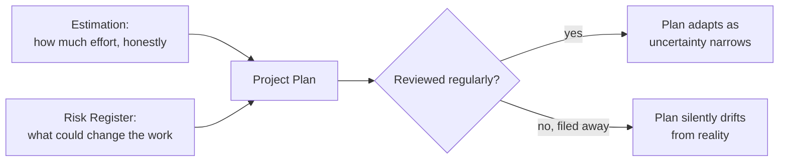

## Learning Objectives

- Explain why a real software estimate is a probability distribution, not a single number, and why treating it as a single number produces predictably broken commitments.
- Describe a risk register as the practical tool that turns an unknown identified during estimation into a tracked item with a likelihood, an impact, and an owner.
- Distinguish estimation uncertainty (the estimate itself might be wrong) from risk (something specific, identifiable might happen that changes the work), and explain why they need different handling.
- Walk a small, concrete project plan through both an honest estimate and a real risk register, rather than treating either as an abstract vocabulary exercise.

## Context & Motivation

SWEBOK's Software Engineering Management knowledge area, one of the four this discipline builds its scope from (`swebok-and-the-scope-beyond-construction`), covers the activities that plan and control a project as a whole, distinct from any single unit of code inside it. Estimation and risk management are its two most immediately practical concepts, and they are treated together here deliberately, because a mature estimate and a risk register are two views of the same underlying problem: what is genuinely unknown about the work ahead, and how should that unknown be represented honestly rather than hidden inside a single confident-sounding number.

## Core Theory

### An estimate is a distribution, not a number

A single number ("this will take three weeks") hides the fact that every real estimate carries genuine uncertainty, and collapsing that uncertainty into one number just moves the uncertainty somewhere it can no longer be seen or managed, typically straight into a broken deadline. A more honest estimate states a range with an associated confidence, or, more rigorously, a full distribution: "50% chance of finishing within two weeks, 90% chance within four weeks." This is not pessimism or hedging; it is stating the actual, honest state of knowledge at estimation time, which by definition is less complete than the state of knowledge that will exist once the work is actually done.

```text
BAD:   "This will take 3 weeks."
        (a single point, presented as if it were certain)

BETTER: "50% chance of 2 weeks, 90% chance of 4 weeks,
         based on similar past work."
        (a distribution, honest about the actual spread
         of plausible outcomes)
```

### Where estimation uncertainty comes from

Estimation uncertainty is largest early in a project (exactly when `requirements-elicitation-specification-and-validation`'s activities are still in progress) and narrows as more is learned, a real, well-documented pattern sometimes called the cone of uncertainty: an estimate made before requirements are validated is honestly less certain than one made after implementation has already begun, simply because less is known at the earlier point. Treating an early, wide estimate as if it carries the same precision as a late, narrow one is a common, real mistake, and one root cause of "this project is always late" patterns on teams that only ever produce one estimate, early, and never revise it as more is learned.

### Risk: a distinct problem from uncertainty about effort

Where estimation deals with genuine uncertainty about how much effort correctly understood work will take, risk deals with a different question: what specific, identifiable things might happen that would change the work itself, not just how long it takes. A risk register tracks these as discrete, named items, each with a likelihood (how probable), an impact (how bad if it happens), and an owner (a specific person responsible for watching it and acting if it materializes):

```text
Risk: "Third-party payment API may deprecate the endpoint
       we depend on before launch."
  Likelihood: Medium (announced deprecation timeline, unclear
              exact date)
  Impact:     High (blocks checkout entirely if it happens
              before we migrate)
  Owner:      Payments team lead
  Mitigation: Begin migration to the new endpoint now,
              in parallel, rather than waiting for a forced
              deadline.
```

A risk register entry that has no owner, or that sits unreviewed after being written once, has lost the actual value of the exercise; the register's job is keeping a live, checked list of what could still go wrong, not producing a document once and filing it away.



## Worked Examples

### Example 1: an honest estimate for a small feature

A team estimating a new notification feature, having built two similar features before, states: "based on the last two similar features (9 days and 14 days), we estimate a 50% chance of finishing within 12 days, and a 90% chance within 18 days." This is directly grounded in real past data (not a guess pulled from nowhere) and honest about the spread rather than picking the midpoint and presenting it as a guarantee. When the feature takes 16 days, the estimate was not "wrong," it correctly anticipated exactly this kind of outcome as plausible within its own stated range.

### Example 2: a risk register catching a real, avoidable delay

Early in a project, a team identifies "our staging environment does not match production configuration" as a risk: likelihood medium (it has caused problems before, though not always), impact high (bugs found only in production are the most expensive kind per `the-cost-of-defects-found-late`), owner the infrastructure lead. Because the risk is tracked, reviewed, and owned, the infrastructure lead proactively schedules time mid-project to align the environments, well before a launch deadline makes doing so disruptive. Without the register, the same problem would likely have surfaced the same way it always had before, as an unplanned emergency discovered during a launch week deploy.

### Example 3: confusing estimation uncertainty with risk, and mishandling both

A team facing schedule pressure responds to "we're not sure how long this will take" by adding a vague risk register entry: "risk: project might be late." This conflates the two ideas this concept keeps separate: "the project might be late" is not a specific, identifiable event with a mitigation, it is exactly the estimation uncertainty that a proper probability-based estimate (Example 1's format) is meant to represent honestly in the first place. A genuine risk register entry needs to name something specific enough to actually mitigate ("the API might be deprecated," "the one engineer who understands this legacy module might be unavailable"), not restate estimation uncertainty in risk-register clothing.

## Common Misconceptions & Pitfalls

- **"A good estimator gives one precise number and hits it."** Core Theory's cone-of-uncertainty framing shows genuine uncertainty is largest early in a project, when most estimates are actually made; a single confident number at that point is not more skillful, it is less honest about what is actually knowable at estimation time.
- **"Risk registers are bureaucratic overhead for large enterprise projects only."** Example 2 shows a risk register entry, tracked and owned, converted a recurring, real, avoidable problem into a proactively scheduled fix; the register's value scales down to a small team just as directly as it scales up to a large one, since the underlying mechanism (naming an unknown, assigning an owner, checking it periodically) does not require enterprise process to work.
- **"Estimation uncertainty and project risk are the same thing, so one document covers both."** Example 3 shows conflating them produces a risk register entry with no real mitigation and an estimate that never states its own honest range; the two need different tools because they answer different questions, how much effort correctly understood work will take, versus what specific, identifiable things might change the work itself.

## Summary

Software Engineering Management, the SWEBOK knowledge area this concept belongs to, treats estimation and risk as two views of the same underlying discipline: representing genuine unknowns honestly instead of hiding them inside a falsely confident plan. A real estimate is a probability distribution, not a single number, and is honestly wider early in a project than late in it, exactly when requirements are still being elicited and validated. A risk register tracks a genuinely different kind of unknown, specific, identifiable events that could change the work itself, each with a likelihood, an impact, and a named owner, reviewed regularly rather than written once and filed away. Confusing the two, restating estimation uncertainty as a vague risk register entry with no real mitigation, loses the value both tools are designed to provide.

## Documentation Links

- [ACM/IEEE: CS2013 Software Engineering Knowledge Area](https://csed.acm.org/knowledge-areas-software-engineering-se-cs2013-version/): lists Software Project Management, including effort estimation and risk management, as a core knowledge unit distinct from design and construction.
- [Sommerville: Software Engineering (10th Edition, Pearson)](https://www.pearson.com/en-us/subject-catalog/p/software-engineering/P200000003258/9780137503148): the standard textbook treatment of project planning, estimation techniques, and risk management this concept's examples are grounded in.
