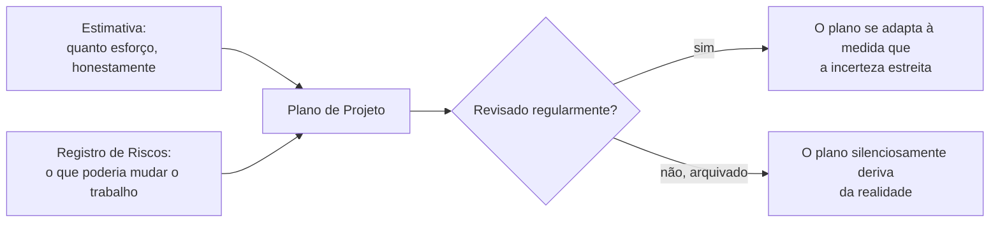

## Objetivos de Aprendizagem

- Explicar por que uma estimativa de software real é uma distribuição de probabilidade, não um único número, e por que tratá-la como um único número produz compromissos previsivelmente quebrados.
- Descrever um registro de riscos como a ferramenta prática que transforma uma incógnita identificada durante a estimativa num item rastreado com uma probabilidade, um impacto e um dono.
- Distinguir a incerteza de estimativa (a própria estimativa pode estar errada) do risco (algo específico e identificável pode acontecer que muda o trabalho), e explicar por que eles precisam de tratamento diferente.
- Percorrer um plano de projeto pequeno e concreto por tanto uma estimativa honesta quanto um registro de riscos real, em vez de tratar qualquer um como um exercício abstrato de vocabulário.

## Contexto e Motivação

A área de conhecimento de Gestão de Engenharia de Software do SWEBOK, uma das quatro das quais esta disciplina constrói o seu escopo (`swebok-and-the-scope-beyond-construction`), cobre as atividades que planejam e controlam um projeto como um todo, distintas de qualquer unidade única de código dentro dele. Estimativa e gestão de risco são os seus dois conceitos mais imediatamente práticos, e eles são tratados juntos aqui deliberadamente, porque uma estimativa madura e um registro de riscos são duas visões do mesmo problema subjacente: o que é genuinamente desconhecido sobre o trabalho à frente, e como esse desconhecido deveria ser representado honestamente em vez de escondido dentro de um único número de som confiante.

## Teoria Central

### Uma estimativa é uma distribuição, não um número

Um único número ("isto vai levar três semanas") esconde o fato de que toda estimativa real carrega incerteza genuína, e colapsar essa incerteza num número só move a incerteza para algum lugar onde ela não pode mais ser vista ou gerenciada, tipicamente direto para um prazo quebrado. Uma estimativa mais honesta enuncia uma faixa com uma confiança associada, ou, mais rigorosamente, uma distribuição completa: "50% de chance de terminar dentro de duas semanas, 90% de chance dentro de quatro semanas". Isto não é pessimismo ou hedging; é enunciar o estado real e honesto do conhecimento no tempo de estimativa, que por definição é menos completo do que o estado de conhecimento que existirá uma vez que o trabalho esteja de fato feito.

```text
RUIM:   "Isto vai levar 3 semanas."
        (um único ponto, apresentado como se fosse certo)

MELHOR: "50% de chance de 2 semanas, 90% de chance de 4 semanas,
         com base em trabalho passado similar."
        (uma distribuição, honesta sobre o espalhamento de fato
         dos desfechos plausíveis)
```

### De onde a incerteza de estimativa vem

A incerteza de estimativa é maior cedo num projeto (exatamente quando as atividades de `requirements-elicitation-specification-and-validation` ainda estão em progresso) e estreita à medida que mais é aprendido, um padrão real e bem documentado às vezes chamado de cone de incerteza: uma estimativa feita antes de os requisitos serem validados é honestamente menos certa do que uma feita depois de a implementação já ter começado, simplesmente porque menos é conhecido no ponto anterior. Tratar uma estimativa inicial e ampla como se ela carregasse a mesma precisão de uma tardia e estreita é um erro comum e real, e uma causa raiz de padrões de "este projeto está sempre atrasado" em equipes que só produzem uma estimativa, cedo, e nunca a revisam à medida que mais é aprendido.

### Risco: um problema distinto da incerteza sobre esforço

Onde a estimativa lida com incerteza genuína sobre quanto esforço um trabalho corretamente entendido levará, o risco lida com uma pergunta diferente: que coisas específicas e identificáveis podem acontecer que mudariam o próprio trabalho, não só quanto tempo ele leva. Um registro de riscos rastreia estas como itens discretos e nomeados, cada um com uma probabilidade (quão provável), um impacto (quão ruim se acontecer) e um dono (uma pessoa específica responsável por observá-lo e agir se ele se materializar):

```text
Risco: "A API de pagamento de terceiro pode obsoletar o endpoint
        do qual dependemos antes do lançamento."
  Probabilidade: Média (cronograma de obsolescência anunciado, data
                 exata incerta)
  Impacto:       Alto (bloqueia o checkout inteiramente se acontecer
                 antes de migrarmos)
  Dono:          Líder da equipe de pagamentos
  Mitigação:     Começar a migração para o novo endpoint agora,
                 em paralelo, em vez de esperar por um prazo forçado.
```

Uma entrada de registro de riscos que não tem dono, ou que fica não revisada depois de escrita uma vez, perdeu o valor de fato do exercício; o trabalho do registro é manter uma lista viva e checada do que ainda pode dar errado, não produzir um documento uma vez e arquivá-lo.



## Exemplos Resolvidos

### Exemplo 1: uma estimativa honesta para um recurso pequeno

Uma equipe estimando um novo recurso de notificação, tendo construído dois recursos similares antes, enuncia: "com base nos últimos dois recursos similares (9 dias e 14 dias), estimamos uma chance de 50% de terminar dentro de 12 dias, e uma chance de 90% dentro de 18 dias". Isto é diretamente fundamentado em dados passados reais (não um palpite tirado do nada) e honesto sobre o espalhamento em vez de escolher o ponto médio e apresentá-lo como uma garantia. Quando o recurso leva 16 dias, a estimativa não estava "errada", ela corretamente antecipou exatamente este tipo de desfecho como plausível dentro da sua própria faixa enunciada.

### Exemplo 2: um registro de riscos pegando um atraso real e evitável

Cedo num projeto, uma equipe identifica "o nosso ambiente de staging não corresponde à configuração de produção" como um risco: probabilidade média (já causou problemas antes, embora não sempre), impacto alto (bugs encontrados só em produção são o tipo mais caro por `the-cost-of-defects-found-late`), dono o líder de infraestrutura. Porque o risco é rastreado, revisado e tem dono, o líder de infraestrutura proativamente agenda tempo no meio do projeto para alinhar os ambientes, bem antes de um prazo de lançamento tornar fazê-lo disruptivo. Sem o registro, o mesmo problema provavelmente teria surgido da mesma forma que sempre tinha surgido antes, como uma emergência não planejada descoberta durante um deploy de semana de lançamento.

### Exemplo 3: confundindo incerteza de estimativa com risco, e tratando ambos mal

Uma equipe enfrentando pressão de cronograma responde a "não temos certeza de quanto tempo isto vai levar" adicionando uma entrada de registro de riscos vaga: "risco: o projeto pode atrasar". Isto conflata as duas ideias que este conceito mantém separadas: "o projeto pode atrasar" não é um evento específico e identificável com uma mitigação, é exatamente a incerteza de estimativa que uma estimativa baseada em probabilidade apropriada (o formato do Exemplo 1) é feita para representar honestamente em primeiro lugar. Uma entrada de registro de riscos genuína precisa nomear algo específico o bastante para de fato mitigar ("a API pode ser obsoletada", "o único engenheiro que entende este módulo legado pode estar indisponível"), não reafirmar incerteza de estimativa em roupas de registro de riscos.

## Equívocos Comuns e Armadilhas

- **"Um bom estimador dá um único número preciso e o acerta."** O enquadramento de cone-de-incerteza da Teoria Central mostra que a incerteza genuína é maior cedo num projeto, quando a maioria das estimativas é de fato feita; um único número confiante nesse ponto não é mais habilidoso, é menos honesto sobre o que é de fato conhecível no tempo de estimativa.
- **"Registros de riscos são sobrecarga burocrática só para grandes projetos corporativos."** O Exemplo 2 mostra que uma entrada de registro de riscos, rastreada e com dono, converteu um problema recorrente, real e evitável num conserto proativamente agendado; o valor do registro se reduz para uma equipe pequena tão diretamente quanto se amplia para uma grande, já que o mecanismo subjacente (nomear uma incógnita, atribuir um dono, checá-la periodicamente) não exige processo corporativo para funcionar.
- **"Incerteza de estimativa e risco de projeto são a mesma coisa, então um documento cobre ambos."** O Exemplo 3 mostra que conflatá-los produz uma entrada de registro de riscos sem mitigação real e uma estimativa que nunca enuncia a sua própria faixa honesta; os dois precisam de ferramentas diferentes porque respondem perguntas diferentes, quanto esforço um trabalho corretamente entendido levará, versus que coisas específicas e identificáveis podem mudar o próprio trabalho.

## Resumo

A Gestão de Engenharia de Software, a área de conhecimento do SWEBOK à qual este conceito pertence, trata estimativa e risco como duas visões da mesma disciplina subjacente: representar incógnitas genuínas honestamente em vez de escondê-las dentro de um plano falsamente confiante. Uma estimativa real é uma distribuição de probabilidade, não um único número, e é honestamente mais ampla cedo num projeto do que tarde nele, exatamente quando os requisitos ainda estão sendo elicitados e validados. Um registro de riscos rastreia um tipo genuinamente diferente de incógnita, eventos específicos e identificáveis que poderiam mudar o próprio trabalho, cada um com uma probabilidade, um impacto e um dono nomeado, revisado regularmente em vez de escrito uma vez e arquivado. Confundir os dois, reafirmar a incerteza de estimativa como uma entrada de registro de riscos vaga sem mitigação real, perde o valor que ambas as ferramentas são projetadas para fornecer.

## Documentation Links

- [ACM/IEEE: CS2013 Software Engineering Knowledge Area](https://csed.acm.org/knowledge-areas-software-engineering-se-cs2013-version/): lista Gestão de Projetos de Software, incluindo estimativa de esforço e gestão de risco, como uma unidade de conhecimento central distinta de design e construção.
- [Sommerville: Software Engineering (10th Edition, Pearson)](https://www.pearson.com/en-us/subject-catalog/p/software-engineering/P200000003258/9780137503148): o tratamento padrão de livro-texto de planejamento de projeto, técnicas de estimativa e gestão de risco nos quais os exemplos deste conceito são fundamentados.
