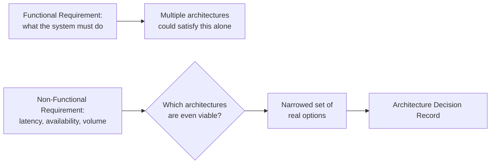

## Learning Objectives

- Explain why a non-functional requirement, not taste or fashion, is what should actually force a choice between architecture options.
- Write an Architecture Decision Record (ADR) that names the specific requirement driving a decision, the options considered, and the tradeoff accepted.
- State this discipline's real, investigated scope decision about deeper distributed architecture: neither this discipline nor `systems/distributed-systems-i` re-teaches it, because it is already covered, at two genuinely different depths, by two already-published disciplines.
- Trace the three-way cross-link this concept deliberately makes instead of picking one side and duplicating it: `software-construction`'s introductory vocabulary, `distributed-systems-i`'s theoretical primitives, and `system-design-concepts`'s applied patterns.

## Context & Motivation

`functional-vs-non-functional-requirements` ended with a specific warning: writing an implementation choice directly into a requirement forecloses the real architecture decision that requirement should instead be driving. This concept is that decision, treated honestly as its own step in the lifecycle, sitting exactly at the boundary between this discipline's Software Requirements area and `software-construction`'s Software Design area.

This concept also carries the single hardest scope question this discipline had to resolve. `software-construction`'s own `software-architecture-styles` concept, published earlier in this curriculum, teaches exactly two architecture styles, client-server and layered, at a deliberately introductory level, and explicitly states that deeper, real distributed architecture is "left to a later, more advanced discipline elsewhere in this curriculum." Two candidate disciplines could plausibly be that later discipline: this one, or `systems/distributed-systems-i`, both published after that statement was written. Investigating both directly, neither is actually that discipline, and the real reason why is worth stating precisely rather than assumed.

`systems/distributed-systems-i` is a theory-first discipline: partial failure, RPC semantics, logical and physical clocks, consistency models, the CAP theorem, replicated state machines, the consensus problem, Paxos, and Raft. It proves properties of distributed algorithms; it does not teach architecture patterns like microservices, event-driven systems, or service meshes as named, chooseable styles, the way `software-architecture-styles` teaches client-server and layered. This discipline, per its own SWEBOK-grounded scope (`swebok-and-the-scope-beyond-construction`), covers Requirements, Process, Management, and Operations, deliberately not Software Architecture as its own knowledge area either. The genuine gap `software-architecture-styles` flagged, real, named, chooseable architecture patterns beyond client-server and layered, turns out to already be filled, honestly and directly, by `system-design-concepts` (Complementary Studies): concepts like `service-mesh-and-sidecar-pattern`, `event-sourcing-and-cqrs`, and `multi-region-architecture-and-disaster-recovery` are exactly this vocabulary, taught as applied, case-study-level material. `distributed-systems-i`'s consensus and replication primitives are what make those patterns correct once chosen; `system-design-concepts`'s patterns are what a real team actually chooses between. Neither this discipline nor `distributed-systems-i` needed to duplicate either.

This concept's own job, then, is deliberately narrower than "teach architecture": it is the decision process, tracing a non-functional requirement to an ADR, cross-linking outward in all three directions (introductory vocabulary, theoretical primitives, applied patterns) rather than picking one and re-teaching it.

## Core Theory

### What actually forces an architecture decision

A functional requirement rarely forces a choice between architectures on its own; it can usually be satisfied by more than one. A non-functional requirement (`functional-vs-non-functional-requirements`) is what actually narrows the field: a latency target, an availability target, an expected request volume, a consistency guarantee a business process genuinely needs. Each of these constrains which architecture options remain viable at all, before questions of preference or familiarity even enter the discussion.



### The Architecture Decision Record: making the decision traceable

An Architecture Decision Record (ADR) is a short, written document capturing one architecture decision: the specific requirement or context that forced it, the real options that were considered, the option chosen, and the tradeoff honestly accepted by choosing it. An ADR is not a design document describing how the chosen option works in detail (that belongs to `software-construction`'s own design-level concepts, `coupling-and-cohesion`, `design-patterns-an-introduction`, once the decision is made); it is a record of *why* this option and not another, connected directly back, via `requirements-traceability-and-change-management`'s traceability link, to the requirement that drove it.

```text
ADR-014: Order Processing Resilience

Context:    Non-functional requirement REQ-091: "Order
            submission must continue accepting new orders
            even if the payment provider is temporarily
            unavailable, for up to 10 minutes."

Options considered:
  A. Synchronous call to payment provider, fail the order
     if unavailable.
  B. Asynchronous processing via a message queue, decoupling
     order acceptance from payment confirmation.
  C. Synchronous call with an in-process retry loop.

Decision:   Option B.

Tradeoff accepted: Orders are accepted before payment is
     confirmed, requiring an explicit "pending payment" state
     and a reconciliation process for the rare case a payment
     ultimately fails after the order was accepted; in
     exchange, REQ-091's 10-minute availability requirement is
     met even during a payment provider outage.
```

### Where deeper architecture vocabulary actually lives, three ways

Once a non-functional requirement narrows the field to "we probably need something more distributed than a single client-server pair," this discipline deliberately routes outward rather than teaching that vocabulary itself, in three distinct directions depending on what is actually needed:

```text
Introductory vocabulary (client-server, layered):
    -> software-architecture-styles (software-construction)

Theoretical primitives underlying a distributed choice
(why replication is correct, what consensus guarantees):
    -> systems/distributed-systems-i

Applied, named architecture patterns to actually choose between
(service mesh, event sourcing, multi-region):
    -> system-design-concepts (Complementary Studies)
```

A real team facing the order-processing decision above would use all three at different points: `software-architecture-styles`'s vocabulary to describe the pieces in conversation, `system-design-concepts`'s `service-mesh-and-sidecar-pattern` or message-broker material to actually pick a mechanism, and, if the chosen mechanism involves its own replicated, distributed state, `distributed-systems-i`'s primitives to reason correctly about what guarantees that mechanism actually provides under failure.

## Worked Examples

### Example 1: a non-functional requirement narrowing real options

A non-functional requirement states the system must tolerate a single data center failure without losing accepted orders. This single sentence eliminates any architecture keeping order data in only one location, regardless of whether that architecture is otherwise simpler or more familiar to the team; `system-design-concepts`'s `multi-region-architecture-and-disaster-recovery` is exactly the applied vocabulary for the remaining options, and any option chosen from it will, if it replicates order data across regions, inherit real questions `distributed-systems-i`'s consistency-model concepts answer precisely (what does a client actually see if it reads from a region that hasn't caught up yet).

### Example 2: an ADR revisited honestly when a requirement changes

Eight months after Example 1's ADR is written, `requirements-traceability-and-change-management`'s traceability link shows a new requirement conflicts with the original decision: a stricter consistency guarantee now needed for financial reconciliation than the original multi-region choice can provide without a real, known cost (higher write latency). Because the original ADR named its own tradeoff explicitly, the team does not have to reverse-engineer why the current architecture looks the way it does before deciding whether to revisit it; the ADR itself already states exactly what was traded away and why, making the new tradeoff decision (accept higher latency, or relax the new requirement) a direct comparison instead of an archaeology exercise.

### Example 3: correctly declining to re-derive what's already covered elsewhere

A team new to this curriculum asks this discipline to explain exactly how a service mesh's sidecar proxies handle traffic routing during a canary release. This concept's own scope decision means the honest answer is a pointer, not a re-derivation: `service-mesh-and-sidecar-pattern` (`system-design-concepts`) already covers this directly and in depth, and `deployment-strategies-blue-green-and-canary`, later in this same discipline, covers canary release itself as a deployment strategy; neither needs a third, competing explanation written here.

## Common Misconceptions & Pitfalls

- **"Choosing an architecture is a matter of engineering taste or the latest trend."** Core Theory's diagram shows a non-functional requirement is what should actually narrow the field of viable options before preference enters the conversation at all; an architecture chosen without a traceable non-functional driver is a decision an ADR would have no honest "Context" section to fill in.
- **"An ADR is the same thing as a design document."** An ADR records why a decision was made and what was traded away, connected back to the requirement that drove it; it deliberately does not describe implementation details, which belong to `software-construction`'s own design-level concepts once the decision is settled.
- **"Since `distributed-systems-i` is the CC discipline about distributed systems, it must be the deep-architecture discipline `software-architecture-styles` promised."** This concept's own investigation, stated honestly in Context & Motivation, found this is not the case: `distributed-systems-i` teaches theoretical primitives (consensus, replication correctness), not named, chooseable architecture patterns; that applied vocabulary already exists, and is already published, in `system-design-concepts` instead.

## Summary

A non-functional requirement, not preference or trend, is what should actually force a choice between architecture options, and an Architecture Decision Record makes that choice traceable: the requirement that drove it, the real options considered, the option chosen, and the tradeoff honestly accepted. This concept investigated directly whether `systems/distributed-systems-i` is the "later, more advanced discipline" `software-construction`'s own `software-architecture-styles` concept promised for deeper distributed architecture, and found it is not: `distributed-systems-i` teaches theoretical primitives, not named architecture patterns, and that applied vocabulary is already covered, honestly and at the right depth, by `system-design-concepts` instead. This concept's own job is therefore deliberately the bridge, not a third re-teaching: tracing a requirement to a decision, and cross-linking outward to introductory vocabulary (`software-construction`), theoretical primitives (`distributed-systems-i`), and applied patterns (`system-design-concepts`) depending on which one a real decision actually needs.

## Documentation Links

- [IEEE Computer Society: SWEBOK v4.0 Guide](https://www.computer.org/education/bodies-of-knowledge/software-engineering): names Software Architecture as its own distinct knowledge area from Software Requirements, the basis for this concept's deliberate framing as a bridge between the two rather than a re-teaching of either.
- [Fowler: Microservice Trade-Offs](https://martinfowler.com/articles/microservice-trade-offs.html): a real, practitioner-level treatment of architecture as a set of genuine tradeoffs to be decided deliberately against real requirements, rather than a single universally correct answer.
