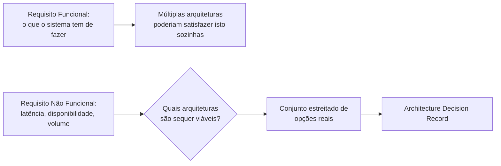

## Objetivos de Aprendizagem

- Explicar por que um requisito não funcional, não o gosto ou a moda, é o que deveria de fato forçar uma escolha entre opções de arquitetura.
- Escrever um Architecture Decision Record (ADR) que nomeia o requisito específico dirigindo uma decisão, as opções consideradas e o trade-off aceito.
- Enunciar a decisão de escopo real e investigada desta disciplina sobre arquitetura distribuída mais profunda: nem esta disciplina nem `systems/distributed-systems-i` a reensinam, porque ela já é coberta, em duas profundidades genuinamente diferentes, por duas disciplinas já publicadas.
- Rastrear o vínculo cruzado de três vias que este conceito deliberadamente faz em vez de escolher um lado e duplicá-lo: o vocabulário introdutório de `software-construction`, os primitivos teóricos de `distributed-systems-i`, e os padrões aplicados de `system-design-concepts`.

## Contexto e Motivação

`functional-vs-non-functional-requirements` terminou com um aviso específico: escrever uma escolha de implementação diretamente num requisito antecipa e elimina a decisão de arquitetura real que esse requisito deveria em vez disso estar dirigindo. Este conceito é essa decisão, tratada honestamente como o seu próprio passo no ciclo de vida, sentando exatamente no limite entre a área de Requisitos de Software desta disciplina e a área de Design de Software de `software-construction`.

Este conceito também carrega a única questão de escopo mais difícil que esta disciplina teve de resolver. O próprio conceito `software-architecture-styles` de `software-construction`, publicado mais cedo neste currículo, ensina exatamente dois estilos de arquitetura, cliente-servidor e em camadas, num nível deliberadamente introdutório, e explicitamente enuncia que a arquitetura distribuída real e mais profunda é "deixada para uma disciplina posterior e mais avançada em outro lugar neste currículo". Duas disciplinas candidatas poderiam plausivelmente ser essa disciplina posterior: esta, ou `systems/distributed-systems-i`, ambas publicadas depois de essa declaração ser escrita. Investigando ambas diretamente, nenhuma é de fato essa disciplina, e a razão real pela qual vale enunciar precisamente em vez de assumir.

`systems/distributed-systems-i` é uma disciplina de teoria-primeiro: falha parcial, semântica de RPC, relógios lógicos e físicos, modelos de consistência, o teorema CAP, máquinas de estado replicadas, o problema do consenso, Paxos e Raft. Ela prova propriedades de algoritmos distribuídos; ela não ensina padrões de arquitetura como microsserviços, sistemas orientados a eventos ou service meshes como estilos nomeados e escolhíveis, da forma que `software-architecture-styles` ensina cliente-servidor e em camadas. Esta disciplina, pelo seu próprio escopo fundamentado no SWEBOK (`swebok-and-the-scope-beyond-construction`), cobre Requisitos, Processo, Gestão e Operações, deliberadamente não Arquitetura de Software como a sua própria área de conhecimento tampouco. A lacuna genuína que `software-architecture-styles` sinalizou, padrões de arquitetura reais, nomeados e escolhíveis além de cliente-servidor e em camadas, acaba por já estar preenchida, honesta e diretamente, por `system-design-concepts` (Estudos Complementares): conceitos como `service-mesh-and-sidecar-pattern`, `event-sourcing-and-cqrs` e `multi-region-architecture-and-disaster-recovery` são exatamente este vocabulário, ensinados como material aplicado, de nível de estudo de caso. Os primitivos de consenso e replicação de `distributed-systems-i` são o que torna esses padrões corretos uma vez escolhidos; os padrões de `system-design-concepts` são o que uma equipe real de fato escolhe. Nem esta disciplina nem `distributed-systems-i` precisaram duplicar qualquer um.

O próprio trabalho deste conceito, então, é deliberadamente mais estreito do que "ensinar arquitetura": é o processo de decisão, rastreando um requisito não funcional a um ADR, cruzando para fora em todas as três direções (vocabulário introdutório, primitivos teóricos, padrões aplicados) em vez de escolher um e reensiná-lo.

## Teoria Central

### O que de fato força uma decisão de arquitetura

Um requisito funcional raramente força uma escolha entre arquiteturas por conta própria; ele geralmente pode ser satisfeito por mais de uma. Um requisito não funcional (`functional-vs-non-functional-requirements`) é o que de fato estreita o campo: um alvo de latência, um alvo de disponibilidade, um volume de requisições esperado, uma garantia de consistência de que um processo de negócio genuinamente precisa. Cada um destes restringe quais opções de arquitetura permanecem viáveis de todo, antes de questões de preferência ou familiaridade sequer entrarem na discussão.



### O Architecture Decision Record: tornando a decisão rastreável

Um Architecture Decision Record (ADR) é um documento curto e escrito capturando uma decisão de arquitetura: o requisito ou contexto específico que a forçou, as opções reais que foram consideradas, a opção escolhida e o trade-off honestamente aceito ao escolhê-la. Um ADR não é um documento de design descrevendo como a opção escolhida funciona em detalhe (isso pertence aos próprios conceitos de nível de design de `software-construction`, `coupling-and-cohesion`, `design-patterns-an-introduction`, uma vez que a decisão é tomada); ele é um registro de *por que* esta opção e não outra, conectado diretamente de volta, via o vínculo de rastreabilidade de `requirements-traceability-and-change-management`, ao requisito que a dirigiu.

```text
ADR-014: Resiliência de Processamento de Pedidos

Contexto:   Requisito não funcional REQ-091: "A submissão de
            pedido tem de continuar aceitando novos pedidos
            mesmo se o provedor de pagamento estiver
            temporariamente indisponível, por até 10 minutos."

Opções consideradas:
  A. Chamada síncrona ao provedor de pagamento, falhar o pedido
     se indisponível.
  B. Processamento assíncrono via uma fila de mensagens, desacoplando
     a aceitação do pedido da confirmação de pagamento.
  C. Chamada síncrona com um laço de retentativa em processo.

Decisão:    Opção B.

Trade-off aceito: Pedidos são aceitos antes de o pagamento ser
     confirmado, exigindo um estado explícito de "pagamento pendente"
     e um processo de reconciliação para o caso raro em que um pagamento
     ultimamente falha depois de o pedido ter sido aceito; em
     troca, o requisito de disponibilidade de 10 minutos do REQ-091 é
     atendido mesmo durante uma indisponibilidade do provedor de pagamento.
```

### Onde o vocabulário de arquitetura mais profundo de fato vive, de três formas

Uma vez que um requisito não funcional estreita o campo para "provavelmente precisamos de algo mais distribuído do que um único par cliente-servidor", esta disciplina deliberadamente roteia para fora em vez de ensinar esse vocabulário ela mesma, em três direções distintas dependendo do que é de fato necessário:

```text
Vocabulário introdutório (cliente-servidor, em camadas):
    -> software-architecture-styles (software-construction)

Primitivos teóricos subjacentes a uma escolha distribuída
(por que a replicação é correta, o que o consenso garante):
    -> systems/distributed-systems-i

Padrões de arquitetura aplicados e nomeados para de fato escolher entre
(service mesh, event sourcing, multi-região):
    -> system-design-concepts (Estudos Complementares)
```

Uma equipe real enfrentando a decisão de processamento de pedidos acima usaria todas as três em pontos diferentes: o vocabulário de `software-architecture-styles` para descrever as peças em conversa, o `service-mesh-and-sidecar-pattern` ou o material de broker de mensagens de `system-design-concepts` para de fato escolher um mecanismo, e, se o mecanismo escolhido envolve o seu próprio estado replicado e distribuído, os primitivos de `distributed-systems-i` para raciocinar corretamente sobre quais garantias esse mecanismo de fato fornece sob falha.

## Exemplos Resolvidos

### Exemplo 1: um requisito não funcional estreitando opções reais

Um requisito não funcional enuncia que o sistema tem de tolerar uma falha de data center único sem perder pedidos aceitos. Esta única frase elimina qualquer arquitetura mantendo dados de pedido em só uma localização, independentemente de essa arquitetura ser de outra forma mais simples ou mais familiar à equipe; o `multi-region-architecture-and-disaster-recovery` de `system-design-concepts` é exatamente o vocabulário aplicado para as opções restantes, e qualquer opção escolhida dele, se ela replica dados de pedido por entre regiões, herdará questões reais que os conceitos de modelo de consistência de `distributed-systems-i` respondem precisamente (o que um cliente de fato vê se ele lê de uma região que ainda não se atualizou).

### Exemplo 2: um ADR revisitado honestamente quando um requisito muda

Oito meses depois de o ADR do Exemplo 1 ser escrito, o vínculo de rastreabilidade de `requirements-traceability-and-change-management` mostra que um novo requisito conflita com a decisão original: uma garantia de consistência mais estrita agora necessária para reconciliação financeira do que a escolha multi-região original consegue fornecer sem um custo real e conhecido (maior latência de escrita). Porque o ADR original nomeou o seu próprio trade-off explicitamente, a equipe não tem de fazer engenharia reversa de por que a arquitetura atual se parece do jeito que se parece antes de decidir se a revisita; o próprio ADR já enuncia exatamente o que foi trocado e por quê, tornando a nova decisão de trade-off (aceitar maior latência, ou relaxar o novo requisito) uma comparação direta em vez de um exercício de arqueologia.

### Exemplo 3: declinando corretamente de rederivar o que já é coberto em outro lugar

Uma equipe nova neste currículo pede a esta disciplina para explicar exatamente como os proxies sidecar de um service mesh tratam o roteamento de tráfego durante um lançamento canary. A própria decisão de escopo deste conceito significa que a resposta honesta é um ponteiro, não uma rederivação: `service-mesh-and-sidecar-pattern` (`system-design-concepts`) já cobre isto diretamente e em profundidade, e `deployment-strategies-blue-green-and-canary`, depois nesta mesma disciplina, cobre o próprio lançamento canary como uma estratégia de implantação; nenhum precisa de uma terceira explicação concorrente escrita aqui.

## Equívocos Comuns e Armadilhas

- **"Escolher uma arquitetura é uma questão de gosto de engenharia ou da tendência mais recente."** O diagrama da Teoria Central mostra que um requisito não funcional é o que deveria de fato estreitar o campo de opções viáveis antes de a preferência entrar na conversa de todo; uma arquitetura escolhida sem um dirigente não funcional rastreável é uma decisão que um ADR não teria seção "Contexto" honesta para preencher.
- **"Um ADR é a mesma coisa que um documento de design."** Um ADR registra por que uma decisão foi tomada e o que foi trocado, conectado de volta ao requisito que a dirigiu; ele deliberadamente não descreve detalhes de implementação, que pertencem aos próprios conceitos de nível de design de `software-construction` uma vez que a decisão é resolvida.
- **"Já que `distributed-systems-i` é a disciplina de CC sobre sistemas distribuídos, ela tem de ser a disciplina de arquitetura profunda que `software-architecture-styles` prometeu."** A própria investigação deste conceito, enunciada honestamente em Contexto e Motivação, descobriu que este não é o caso: `distributed-systems-i` ensina primitivos teóricos (consenso, correção de replicação), não padrões de arquitetura nomeados e escolhíveis; esse vocabulário aplicado já existe, e já está publicado, em `system-design-concepts` em vez disso.

## Resumo

Um requisito não funcional, não a preferência ou a tendência, é o que deveria de fato forçar uma escolha entre opções de arquitetura, e um Architecture Decision Record torna essa escolha rastreável: o requisito que a dirigiu, as opções reais consideradas, a opção escolhida e o trade-off honestamente aceito. Este conceito investigou diretamente se `systems/distributed-systems-i` é a "disciplina posterior e mais avançada" que o próprio conceito `software-architecture-styles` de `software-construction` prometeu para a arquitetura distribuída mais profunda, e descobriu que não é: `distributed-systems-i` ensina primitivos teóricos, não padrões de arquitetura nomeados, e esse vocabulário aplicado já é coberto, honestamente e na profundidade certa, por `system-design-concepts` em vez disso. O próprio trabalho deste conceito é portanto deliberadamente a ponte, não um terceiro reensino: rastreando um requisito a uma decisão, e cruzando para fora com vocabulário introdutório (`software-construction`), primitivos teóricos (`distributed-systems-i`) e padrões aplicados (`system-design-concepts`) dependendo de qual deles uma decisão real de fato precisa.

## Documentation Links

- [IEEE Computer Society: SWEBOK v4.0 Guide](https://www.computer.org/education/bodies-of-knowledge/software-engineering): nomeia Arquitetura de Software como a sua própria área de conhecimento distinta de Requisitos de Software, a base para o enquadramento deliberado deste conceito como uma ponte entre as duas em vez de um reensino de qualquer uma.
- [Fowler: Microservice Trade-Offs](https://martinfowler.com/articles/microservice-trade-offs.html): um tratamento real e de nível de profissional da arquitetura como um conjunto de trade-offs genuínos a serem decididos deliberadamente contra requisitos reais, em vez de uma única resposta universalmente correta.
