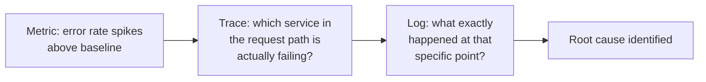

## Learning Objectives

- Define the three pillars of observability precisely: logs, metrics, and traces, and state what each one can answer that the other two cannot.
- Name the finding's real, practitioner origin (Cindy Sridharan's writing) honestly, rather than presenting it as settled academic theory.
- Walk through a real production incident that only one of the three pillars can actually explain, and identify which one and why.
- Connect the three pillars to two already-published, concrete applied examples at two different scales: a single service's health endpoint, and a distributed system's tracing infrastructure.

## Context & Motivation

`deployment-strategies-blue-green-and-canary` ended with an explicit dependency this concept now resolves directly: a canary release is only meaningful if a real, reliable signal exists comparing the new version's behavior against the old one under live conditions. Observability is the discipline of building exactly that signal, generalized beyond canary releases to the broader, constant question every production system eventually faces: something is wrong, or might be, and the only way to find out is by looking at data the system itself produces about its own behavior, since there is no other way to inspect a live, running, distributed system directly.

Cindy Sridharan's own writing, first as a widely read blog post and later expanded into a short O'Reilly ebook, popularized the framing this concept uses, and it is worth naming that origin honestly: like `software-construction`'s SOLID concept and this discipline's own Continuous Integration concept, this is genuinely practitioner-originated material, not classical academic theory dressed up as something older.

## Core Theory

### The three pillars, precisely

```text
LOGS:     Discrete, timestamped records of individual events,
          each carrying a payload of content (what happened,
          what data was involved). Good for: understanding the
          precise sequence and detail of a specific event, after
          you already suspect roughly where to look.

METRICS:  Numeric measurements aggregated over time intervals
          (request rate, error rate, latency percentiles, CPU
          usage). Good for: seeing a trend or a threshold
          breach across the whole system or service, cheaply,
          even when you have no idea yet where to look.

TRACES:   The causal path of ONE request as it flows through
          every service, function, or component it touched, end
          to end. Good for: understanding WHERE, in a
          distributed call chain, time was actually spent or a
          failure actually occurred, when a single log line or
          a single aggregate metric cannot show the whole path.
```

None of the three is a strict superset of the others; each answers a genuinely different shape of question, and a real incident frequently requires moving between all three, in a specific, natural order.

### Why they work together, in a specific order

A metric is usually what first reveals something is wrong at all, since it is cheap to compute and check continuously, even before anyone suspects a specific problem. Once a metric signals a real anomaly (an error rate spike, a latency percentile crossing a threshold), a trace is what narrows down where in a distributed request path the anomaly is actually occurring, since a metric alone says something is slow or failing but not which specific service or call is responsible. Once a trace narrows the search to a specific service or component, a log is what reveals the precise detail of what actually happened at that point, the specific input, the specific error message, the specific data involved.



### Two applied examples at two different scales

This discipline deliberately does not build its own from-scratch observability tooling example; two real, already-published, applied treatments exist in this curriculum at two genuinely different scales, and this concept grounds the three pillars in both directly rather than duplicating either. At the scale of a single service, `spring-boot-actuator-endpoints` (`spring-concepts`) exposes exactly a metrics-and-health-check surface (a `/actuator/health` endpoint, a `/actuator/metrics` endpoint) directly built into a running Spring Boot application, the metrics pillar made concrete for one service. At the scale of a distributed system spanning many services, `distributed-tracing-and-observability` and `metrics-monitoring-and-alerting-system` (`system-design-concepts`) cover the traces pillar and a full metrics-and-alerting system respectively, applied to exactly the multi-service call chains a single service's own health endpoint cannot see across.

## Worked Examples

### Example 1: an incident only a trace can actually explain

A metric shows the overall checkout endpoint's p99 latency has doubled over the past hour. Logs from the checkout service itself show nothing unusual, no errors, no slow individual log entries. Only a trace reveals the actual cause: the checkout service itself is fast, but it now makes a downstream call to an inventory service that has become slow, and that downstream latency is what's showing up in the checkout endpoint's overall metric, invisible to both the checkout service's own logs (which never saw an error, just a slow response from someone else) and to a metric scoped only to the checkout service in isolation. The trace's ability to show the full, cross-service causal path is the only one of the three pillars that reveals where the actual problem lives.

### Example 2: an incident only logs can actually explain

A metric shows a specific background job's failure rate has risen from near-zero to 2%. A trace confirms the failures are occurring inside a single, specific step of the job, but shows nothing about why that step is failing, just that it is. Only the logs from that specific step reveal the actual detail: a small percentage of input records contain a malformed date field in a format the parser does not handle, a level of specific, concrete detail neither the aggregate metric nor the trace's causal-path view was ever designed to carry.

### Example 3: an incident only a metric can catch in time

A slow, gradual memory leak in a service causes it to restart under memory pressure roughly once every three days, each restart brief enough that individual users rarely notice and no specific log line ever states "memory leak detected" (the leak itself produces no error, only gradually rising memory usage). Only a metric, tracking memory usage over time and revealing a slow, steady upward trend across each restart cycle, catches this pattern at all; no single trace or log entry, each scoped to one request or one event, could ever reveal a trend that only becomes visible when aggregated and viewed across days.

## Common Misconceptions & Pitfalls

- **"Logs, being the most detailed, are the most important pillar and the other two are optional extras."** Example 3 shows a real, genuine production problem (a slow memory leak) that logs cannot catch at all, since no single event or log line ever states the problem directly; a trend visible only in aggregate, over time, is exactly what a metric is for.
- **"Once you have distributed tracing, you don't need metrics anymore."** Example 1 shows a trace narrows down where a problem is occurring once you already suspect something is wrong; a metric is usually what reveals that something is wrong in the first place, cheaply and continuously, before a specific trace is even pulled up to investigate.
- **"Observability is a settled academic subject with a single canonical formal definition."** This concept's own honest sourcing (Sridharan's practitioner writing, not a peer-reviewed academic paper) reflects the field's actual, current state: the three-pillars framing is real and widely adopted in industry, but it is genuinely practitioner-originated material, the same honest sourcing this discipline already applied to Continuous Integration and `software-construction` already applied to SOLID.

## Summary

Cindy Sridharan's own practitioner writing popularized the now-standard framing of observability as three complementary data types: logs (discrete, timestamped events carrying detail), metrics (aggregated numeric measurements revealing trends and thresholds cheaply), and traces (the causal path of one request across every service it touched). The three work together in a natural order during a real incident, a metric usually reveals something is wrong first, a trace narrows down where in a distributed call chain, and a log reveals the precise detail of what actually happened there, and no single pillar is a substitute for the other two, as the three worked examples each show for a different, genuine failure mode only one pillar could actually catch. This discipline grounds the framing in two already-published, applied treatments at two different scales, `spring-boot-actuator-endpoints` for a single service's own health and metrics surface, and `distributed-tracing-and-observability` plus `metrics-monitoring-and-alerting-system` for a full, multi-service distributed system, rather than building a third, redundant treatment of either.

## Documentation Links

- [Sridharan: Monitoring and Observability](https://copyconstruct.medium.com/monitoring-and-observability-8417d1952e1c): the primary, original practitioner source this concept's three-pillars framing is grounded in, including Sridharan's own honest distinction between observability and the narrower, older idea of monitoring.
- [Sridharan: Distributed Systems Observability (O'Reilly)](https://www.oreilly.com/library/view/distributed-systems-observability/9781492033431/): the expanded, published treatment of the same framing, further establishing it as real, credible, widely referenced practitioner material rather than a single blog post in isolation.
