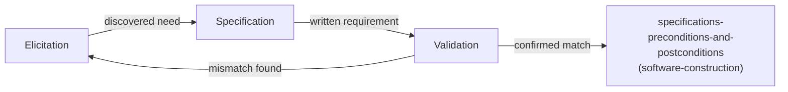

## Learning Objectives

- Define requirements elicitation, specification, and validation as three distinct activities, and state what each one produces that the others do not.
- Explain why requirements engineering is a loop, not a single upfront step, and identify the concrete symptom of skipping the loop (a specification that satisfies nobody, discovered only after implementation begins).
- Name at least two real elicitation techniques (interviews, observation of actual work, prototyping) and explain what each is good at uncovering that the others miss.
- Trace how a validated requirement becomes the input to `specifications-preconditions-and-postconditions`, the point where this discipline's work ends and `software-construction`'s begins.

## Context & Motivation

Every piece of software exists to satisfy some need a stakeholder has, and the entire discipline of requirements engineering exists because that need is almost never available in a form precise enough to build against on day one. A stakeholder can describe a problem accurately and still describe a solution that does not actually solve it; a stakeholder can describe exactly what they want today and be wrong about what they will actually need once they see it running. Sommerville's standard textbook treatment (Software Engineering, 10th Edition) frames requirements engineering as exactly this problem: not a form to fill out once, but a genuine engineering activity with its own techniques, its own failure modes, and its own well-documented cost of getting wrong.

This concept opens this discipline's Software Requirements knowledge area (the first of the four SWEBOK areas `swebok-and-the-scope-beyond-construction` identified as this discipline's real scope) by naming the three activities requirements engineering actually consists of: elicitation, specification, and validation. Each produces something genuinely different, and treating them as one blurred step is exactly the failure mode this concept exists to prevent. Once a requirement survives all three activities, it becomes the input to `software-construction`'s own `specifications-preconditions-and-postconditions`, the point where a validated need gets formalized into the preconditions and postconditions a specific unit of code must satisfy. This concept's job stops exactly there.

## Core Theory

### Elicitation: discovering what stakeholders actually need

Elicitation is the activity of finding out what a system should do, and it is genuinely hard because stakeholders are rarely able to state their own needs completely, consistently, or in a form directly usable by an engineer. Three real techniques, each useful for a different reason:

```text
INTERVIEWS:      Ask stakeholders directly. Good for surfacing
                  explicit, known needs; blind to needs the
                  stakeholder does not think to mention because
                  they consider it "obvious" or "always been that
                  way."

OBSERVATION:      Watch stakeholders do their actual current work.
                  Good for surfacing needs stakeholders cannot
                  articulate because the workaround they use today
                  has become invisible to them; slower and more
                  expensive than an interview.

PROTOTYPING:      Build a rough, disposable version and put it in
                  front of stakeholders. Good for surfacing needs
                  that only become obvious once something concrete
                  exists to react to; risks stakeholders mistaking
                  the throwaway prototype for a real commitment.
```

No single technique is sufficient on its own; real requirements engineering combines several, because each technique's blind spot is a different technique's strength.

### Specification: writing the need down precisely

Specification takes whatever elicitation surfaced and writes it down in a form precise enough that two different engineers reading it would build the same thing. This is a genuinely different skill from elicitation: elicitation is about discovering an accurate picture of a fuzzy, half-formed need; specification is about removing every remaining ambiguity from that picture once discovered. A specification that reads "the system should be fast" has failed at this activity even if elicitation correctly identified that speed matters, because "fast" gives two engineers no shared basis for agreeing whether a given implementation satisfies it. A specification that instead reads "the search endpoint must return results within 200 milliseconds for 95% of requests under expected load" has succeeded, because it converts a vague sentiment into something checkable.

### Validation: checking the specification against the real need

Validation closes the loop: it checks the specification actually produced, not the original fuzzy need, back against real stakeholders, before implementation begins. This is the activity most often skipped under deadline pressure, and skipping it is the single most expensive mistake in this whole discipline, precisely because `the-cost-of-defects-found-late` shows a validation-stage catch costs a small fraction of the same mistake caught after the system is built. Validation techniques include requirements reviews (walking stakeholders through the written specification line by line, in plain language, and asking them to confirm or object), and traceability checks (confirming every stated business need maps to at least one requirement, and every requirement maps back to a real, stated need, catching both gaps and unnecessary scope in the same pass).



### Why this is a loop, not a line

The diagram's feedback arrow is the honest part: validation regularly finds that the written specification does not, in fact, match the real need, sending the process back to elicitation rather than forward. A requirements process drawn as a single straight line from "talk to stakeholders" to "hand off to engineering" is describing an idealized version that real projects rarely achieve on the first pass; the loop is not a failure of the process, it is the process working as intended.

## Worked Examples

### Example 1: an interview that surfaces the wrong requirement

A stakeholder, asked what they need from a new reporting feature, says "I need a button to export the monthly report to Excel." Taken literally and specified as stated, an engineer builds exactly an Excel export button. Only later does it emerge, through observation of the stakeholder's actual workflow, that they were exporting to Excel purely to email the report to three colleagues every month, a task a scheduled email attachment would satisfy directly, with no manual export step at all. The interview surfaced a *solution* the stakeholder had already invented, not the underlying *need*; only observation caught the difference, and only that catch let the team build something genuinely better than what was literally asked for.

### Example 2: a specification ambiguous enough to build two different systems from

"The system must handle concurrent users" is specified for a new booking platform. Two engineers, working independently from that sentence alone, build genuinely different systems: one assumes "concurrent" means "not corrupting data under simultaneous writes" and builds transactional locking; the other assumes it means "serving many users without slowing down" and builds a caching layer with no locking at all. Both satisfy a literal reading of the sentence; neither is provably wrong given what was written. The specification failed the precision test this concept names: two competent engineers reading the same specification produced two different systems, and a validation pass, showing stakeholders exactly this ambiguity before implementation, would have caught it for the cost of one conversation instead of two rewritten systems.

### Example 3: a validation review catching a genuine scope gap

A specification for a new user-registration flow is walked through line by line with the actual support team who will handle registration problems, as a validation review. Midway through, a support team member points out the specification says nothing about what happens if a user's email is already registered under a different, unverified account, a situation the support team already deals with weekly under the current system. The gap was invisible to the engineer who wrote the specification (who was thinking about the happy path) and to the product stakeholder who requested the feature (who never considered the edge case), but immediately obvious to the person who actually lives with the current system's failure mode. This is exactly why validation reviews should include the people who will operate the system, not only the people who requested it.

## Common Misconceptions & Pitfalls

- **"Requirements engineering is a phase you finish before design starts."** The loop diagram in Core Theory shows validation routinely sends the process back to elicitation; treating requirements as a single upfront phase that finishes cleanly before anything else starts is exactly the assumption Sommerville's iterative treatment of the activity argues against, and matches the same critique `software-process-models-waterfall-and-its-real-history` levels against the strict, no-revisiting waterfall model.
- **"A long, detailed specification document is the same thing as a validated one."** Example 2 shows length and detail do not guarantee precision; a specification can be long and still leave a critical ambiguity unresolved, and only a validation pass (not more writing) catches that specific failure mode.
- **"Elicitation just means asking stakeholders what they want."** Example 1 shows a literal answer to a direct question can encode a stakeholder's own assumed solution rather than their underlying need; observation and prototyping exist specifically because interviews alone cannot reliably tell the two apart.

## Summary

Requirements engineering is three distinct activities, not one: elicitation discovers what stakeholders actually need (using interviews, observation, and prototyping, each catching a different blind spot the others miss), specification writes that need down precisely enough that two engineers would build the same thing from it, and validation checks the written specification against the real need before implementation begins, often sending the process back to elicitation when it finds a mismatch. Skipping validation specifically is the most expensive mistake this discipline covers, because `the-cost-of-defects-found-late` shows exactly how much more a mismatch costs once it is discovered after implementation instead of before it. A requirement that survives all three activities becomes the direct input to `software-construction`'s own `specifications-preconditions-and-postconditions`, the handoff point where this discipline's work ends and the unit-level formalization of a contract begins.

## Documentation Links

- [Sommerville: Software Engineering (10th Edition, Pearson)](https://www.pearson.com/en-us/subject-catalog/p/software-engineering/P200000003258/9780137503148): the standard textbook treatment this concept's three-activity breakdown (elicitation, specification, validation) and elicitation techniques are drawn from.
- [ACM/IEEE: CS2013 Software Engineering Knowledge Area](https://csed.acm.org/knowledge-areas-software-engineering-se-cs2013-version/): lists Requirements Engineering as its own knowledge unit, corroborating that this activity is treated as distinct from design and construction in the field's own curriculum guidelines.
