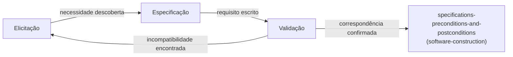

## Objetivos de Aprendizagem

- Definir elicitação, especificação e validação de requisitos como três atividades distintas, e enunciar o que cada uma produz que as outras não produzem.
- Explicar por que a engenharia de requisitos é um laço, não um único passo inicial, e identificar o sintoma concreto de pular o laço (uma especificação que não satisfaz ninguém, descoberta só depois de a implementação começar).
- Nomear pelo menos duas técnicas de elicitação reais (entrevistas, observação do trabalho de fato, prototipagem) e explicar em que cada uma é boa em descobrir que as outras perdem.
- Rastrear como um requisito validado se torna a entrada para `specifications-preconditions-and-postconditions`, o ponto onde o trabalho desta disciplina termina e o de `software-construction` começa.

## Contexto e Motivação

Todo pedaço de software existe para satisfazer alguma necessidade que um stakeholder tem, e a disciplina inteira da engenharia de requisitos existe porque essa necessidade quase nunca está disponível numa forma precisa o bastante para construir contra ela no primeiro dia. Um stakeholder pode descrever um problema com precisão e ainda descrever uma solução que de fato não o resolve; um stakeholder pode descrever exatamente o que quer hoje e estar errado sobre o que de fato precisará uma vez que o veja rodando. O tratamento de livro-texto padrão de Sommerville (Software Engineering, 10ª Edição) enquadra a engenharia de requisitos como exatamente este problema: não um formulário para preencher uma vez, mas uma atividade de engenharia genuína com as suas próprias técnicas, os seus próprios modos de falha e o seu próprio custo bem documentado de errar.

Este conceito abre a área de conhecimento de Requisitos de Software desta disciplina (a primeira das quatro áreas do SWEBOK que `swebok-and-the-scope-beyond-construction` identificou como o escopo real desta disciplina) nomeando as três atividades em que a engenharia de requisitos de fato consiste: elicitação, especificação e validação. Cada uma produz algo genuinamente diferente, e tratá-las como um passo único e borrado é exatamente o modo de falha que este conceito existe para prevenir. Uma vez que um requisito sobrevive a todas as três atividades, ele se torna a entrada para o próprio `specifications-preconditions-and-postconditions` de `software-construction`, o ponto onde uma necessidade validada é formalizada nas pré-condições e pós-condições que uma unidade específica de código tem de satisfazer. O trabalho deste conceito para exatamente ali.

## Teoria Central

### Elicitação: descobrindo o que os stakeholders de fato precisam

A elicitação é a atividade de descobrir o que um sistema deveria fazer, e ela é genuinamente difícil porque stakeholders raramente conseguem enunciar as suas próprias necessidades de forma completa, consistente ou numa forma diretamente usável por um engenheiro. Três técnicas reais, cada uma útil por uma razão diferente:

```text
ENTREVISTAS:     Perguntar aos stakeholders diretamente. Boa para
                  trazer à tona necessidades explícitas e conhecidas;
                  cega a necessidades que o stakeholder não pensa em
                  mencionar porque as considera "óbvias" ou "sempre
                  foram assim".

OBSERVAÇÃO:       Assistir aos stakeholders fazerem o seu trabalho
                  atual de fato. Boa para trazer à tona necessidades que
                  os stakeholders não conseguem articular porque a
                  solução de contorno que usam hoje se tornou invisível
                  para eles; mais lenta e mais cara do que uma entrevista.

PROTOTIPAGEM:     Construir uma versão rústica e descartável e pô-la
                  na frente dos stakeholders. Boa para trazer à tona
                  necessidades que só se tornam óbvias uma vez que algo
                  concreto existe para reagir; arrisca que os stakeholders
                  confundam o protótipo descartável com um compromisso real.
```

Nenhuma técnica única é suficiente por conta própria; a engenharia de requisitos real combina várias, porque o ponto cego de cada técnica é a força de uma técnica diferente.

### Especificação: escrevendo a necessidade de forma precisa

A especificação pega o que quer que a elicitação trouxe à tona e o escreve numa forma precisa o bastante para que dois engenheiros diferentes lendo-a construam a mesma coisa. Esta é uma habilidade genuinamente diferente da elicitação: a elicitação é sobre descobrir uma imagem precisa de uma necessidade difusa e meio formada; a especificação é sobre remover toda ambiguidade restante dessa imagem uma vez descoberta. Uma especificação que diz "o sistema deveria ser rápido" falhou nesta atividade mesmo se a elicitação corretamente identificou que a velocidade importa, porque "rápido" não dá a dois engenheiros nenhuma base compartilhada para concordar se uma dada implementação o satisfaz. Uma especificação que em vez disso diz "o endpoint de busca tem de retornar resultados dentro de 200 milissegundos para 95% das requisições sob carga esperada" teve sucesso, porque converte um sentimento vago em algo checável.

### Validação: checando a especificação contra a necessidade real

A validação fecha o laço: ela checa a especificação de fato produzida, não a necessidade difusa original, de volta contra stakeholders reais, antes de a implementação começar. Esta é a atividade mais frequentemente pulada sob pressão de prazo, e pulá-la é o erro mais caro desta disciplina inteira, precisamente porque `the-cost-of-defects-found-late` mostra que uma captura em estágio de validação custa uma pequena fração do mesmo erro pego depois de o sistema ser construído. Técnicas de validação incluem revisões de requisitos (percorrer com os stakeholders a especificação escrita linha por linha, em linguagem simples, e pedir que confirmem ou objetem) e checagens de rastreabilidade (confirmar que toda necessidade de negócio enunciada mapeia para pelo menos um requisito, e que todo requisito mapeia de volta para uma necessidade real e enunciada, pegando tanto lacunas quanto escopo desnecessário na mesma passagem).



### Por que isto é um laço, não uma linha

A seta de feedback do diagrama é a parte honesta: a validação regularmente encontra que a especificação escrita de fato não corresponde à necessidade real, devolvendo o processo à elicitação em vez de para frente. Um processo de requisitos desenhado como uma única linha reta de "falar com stakeholders" a "entregar à engenharia" está descrevendo uma versão idealizada que projetos reais raramente alcançam na primeira passagem; o laço não é uma falha do processo, é o processo funcionando como pretendido.

## Exemplos Resolvidos

### Exemplo 1: uma entrevista que traz à tona o requisito errado

Um stakeholder, perguntado o que precisa de um novo recurso de relatório, diz "preciso de um botão para exportar o relatório mensal para Excel". Tomado literalmente e especificado como enunciado, um engenheiro constrói exatamente um botão de exportação para Excel. Só depois emerge, por meio de observação do fluxo de trabalho de fato do stakeholder, que ele estava exportando para Excel puramente para enviar o relatório por email a três colegas todo mês, uma tarefa que um anexo de email agendado satisfaria diretamente, sem nenhum passo de exportação manual de todo. A entrevista trouxe à tona uma *solução* que o stakeholder já tinha inventado, não a *necessidade* subjacente; só a observação pegou a diferença, e só essa captura deixou a equipe construir algo genuinamente melhor do que o que foi literalmente pedido.

### Exemplo 2: uma especificação ambígua o bastante para construir dois sistemas diferentes a partir dela

"O sistema tem de tratar usuários concorrentes" é especificado para uma nova plataforma de reservas. Dois engenheiros, trabalhando independentemente a partir dessa frase sozinha, constroem sistemas genuinamente diferentes: um assume que "concorrente" significa "não corromper dados sob escritas simultâneas" e constrói travamento transacional; o outro assume que significa "servir muitos usuários sem desacelerar" e constrói uma camada de cache sem nenhum travamento de todo. Ambos satisfazem uma leitura literal da frase; nenhum está comprovadamente errado dado o que foi escrito. A especificação falhou o teste de precisão que este conceito nomeia: dois engenheiros competentes lendo a mesma especificação produziram dois sistemas diferentes, e uma passagem de validação, mostrando aos stakeholders exatamente esta ambiguidade antes da implementação, a teria pego pelo custo de uma conversa em vez de dois sistemas reescritos.

### Exemplo 3: uma revisão de validação pegando uma lacuna de escopo genuína

Uma especificação para um novo fluxo de registro de usuário é percorrida linha por linha com a equipe de suporte de fato que tratará dos problemas de registro, como uma revisão de validação. No meio, um membro da equipe de suporte aponta que a especificação não diz nada sobre o que acontece se o email de um usuário já está registrado sob uma conta diferente e não verificada, uma situação com a qual a equipe de suporte já lida semanalmente sob o sistema atual. A lacuna era invisível ao engenheiro que escreveu a especificação (que estava pensando no caminho feliz) e ao stakeholder de produto que pediu o recurso (que nunca considerou o caso de borda), mas imediatamente óbvia à pessoa que de fato convive com o modo de falha do sistema atual. É exatamente por isso que revisões de validação deveriam incluir as pessoas que vão operar o sistema, não só as pessoas que o pediram.

## Equívocos Comuns e Armadilhas

- **"A engenharia de requisitos é uma fase que você termina antes de o design começar."** O diagrama de laço na Teoria Central mostra que a validação rotineiramente devolve o processo à elicitação; tratar os requisitos como uma única fase inicial que termina de forma limpa antes de qualquer outra coisa começar é exatamente a suposição contra a qual o tratamento iterativo de Sommerville da atividade argumenta, e corresponde à mesma crítica que `software-process-models-waterfall-and-its-real-history` faz contra o modelo waterfall estrito e sem-revisitação.
- **"Um documento de especificação longo e detalhado é a mesma coisa que um validado."** O Exemplo 2 mostra que comprimento e detalhe não garantem precisão; uma especificação pode ser longa e ainda deixar uma ambiguidade crítica não resolvida, e só uma passagem de validação (não mais escrita) pega esse modo de falha específico.
- **"A elicitação só significa perguntar aos stakeholders o que eles querem."** O Exemplo 1 mostra que uma resposta literal a uma pergunta direta pode codificar a própria solução assumida de um stakeholder em vez da sua necessidade subjacente; observação e prototipagem existem especificamente porque entrevistas sozinhas não conseguem confiavelmente distinguir as duas.

## Resumo

A engenharia de requisitos é três atividades distintas, não uma: a elicitação descobre o que os stakeholders de fato precisam (usando entrevistas, observação e prototipagem, cada uma pegando um ponto cego diferente que as outras perdem), a especificação escreve essa necessidade de forma precisa o bastante para que dois engenheiros construam a mesma coisa a partir dela, e a validação checa a especificação escrita contra a necessidade real antes de a implementação começar, frequentemente devolvendo o processo à elicitação quando encontra uma incompatibilidade. Pular a validação especificamente é o erro mais caro que esta disciplina cobre, porque `the-cost-of-defects-found-late` mostra exatamente quanto mais uma incompatibilidade custa uma vez que é descoberta depois da implementação em vez de antes dela. Um requisito que sobrevive a todas as três atividades se torna a entrada direta para o próprio `specifications-preconditions-and-postconditions` de `software-construction`, o ponto de handoff onde o trabalho desta disciplina termina e a formalização de nível unitário de um contrato começa.

## Documentation Links

- [Sommerville: Software Engineering (10th Edition, Pearson)](https://www.pearson.com/en-us/subject-catalog/p/software-engineering/P200000003258/9780137503148): o tratamento de livro-texto padrão do qual a divisão de três-atividades (elicitação, especificação, validação) e as técnicas de elicitação deste conceito são tiradas.
- [ACM/IEEE: CS2013 Software Engineering Knowledge Area](https://csed.acm.org/knowledge-areas-software-engineering-se-cs2013-version/): lista a Engenharia de Requisitos como a sua própria unidade de conhecimento, corroborando que esta atividade é tratada como distinta de design e construção nas próprias diretrizes de currículo do campo.
