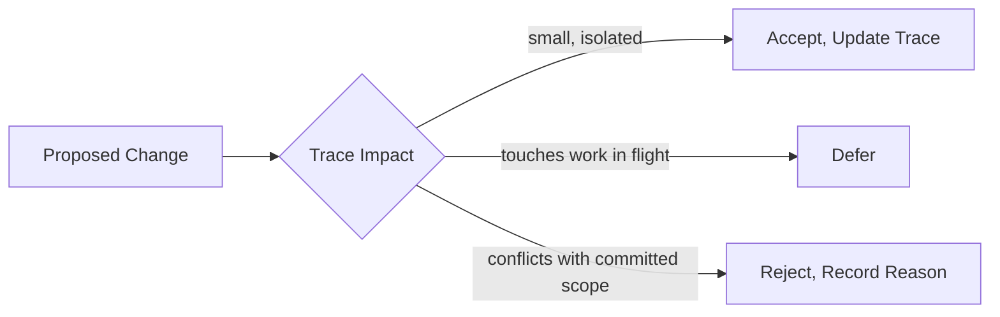

## Learning Objectives

- Define requirements traceability precisely: a maintained, bidirectional link from each requirement to the design decisions, code, and tests that satisfy it, and back.
- Explain why requirements change over the life of a project, and why that is a normal, expected condition rather than a sign of failed elicitation.
- Describe a change control process: how a proposed change is evaluated against its traced impact before being accepted, deferred, or rejected.
- Connect requirements traceability to a concrete, everyday practice this curriculum already teaches: linking a commit to the requirement or issue it addresses.

## Context & Motivation

`requirements-elicitation-specification-and-validation` treated writing and validating a requirement as if it happens once, cleanly, before implementation begins. Real projects are never that clean: a validated requirement written in month one is routinely revisited in month four, because a stakeholder learned something new, a regulation changed, or a competitor shipped a feature that shifts what "done" means. Requirements management is the discipline's honest answer to that reality: not "prevent requirements from changing" (an impossible and counterproductive goal) but "track exactly what a change would affect, before deciding whether to make it." Sommerville's textbook and SWEBOK's own Software Requirements knowledge area both treat requirements management, including traceability and change control, as a genuinely distinct activity from the elicitation, specification, and validation this discipline already covered, precisely because it operates continuously over the project's whole life rather than once at the start.

## Core Theory

### Traceability: a maintained link, not a one-time document

A requirements traceability matrix records, for every requirement, which design decisions, which code modules, and which tests exist specifically to satisfy it. Crucially, this link runs in both directions and both directions matter for a different reason:

```text
FORWARD TRACE   (requirement -> code/tests):
  Answers: "if I change this requirement, what do I need to
  go check or modify?"

BACKWARD TRACE  (code/tests -> requirement):
  Answers: "why does this code exist? what real, stated need
  justifies it?" Surfaces code that traces back to NOTHING,
  a strong signal of unnecessary scope that crept in without
  ever being a validated requirement.
```

A traceability matrix that only runs forward misses exactly the second question, which is why real requirements management tools (and even a disciplined, manually maintained spreadsheet on a small project) track both directions from the start.

### Change control: evaluating a proposed change against its traced impact

Once a traceability link exists, a proposed change to a requirement can be evaluated honestly, before it is accepted: what design decisions does the trace say this touches, what code, what tests, and, transitively, does it touch anything downstream of those. A change control process, at its simplest, is a deliberate checkpoint (a change control board on a large project, a single technical lead's sign-off on a small one) that looks at this traced impact and makes one of three decisions: accept the change and update the trace accordingly, defer it to a later release once the current work in flight is unaffected, or reject it with an explicit, recorded reason. What change control is not is a rubber stamp or a blanket freeze; both extremes defeat its actual purpose, which is making the cost of a change visible before it is paid, not preventing change altogether.



### Traceability in practice: linking a commit to a requirement

The most concrete, everyday form of traceability most engineers actually touch is linking a commit or a pull request to the issue or requirement it addresses, exactly the discipline `commit-hygiene` (`software-construction`) already teaches at the level of an individual commit message. A commit message that reads "fix login bug" traces to nothing; a commit message that reads "fix session token expiry, closes REQ-482" gives a future engineer, or a future automated tool building a traceability report, a direct, checkable link from a specific code change back to a specific, validated requirement. Requirements traceability at the project level and commit hygiene at the individual level are the same idea, applied at two different scales.

## Worked Examples

### Example 1: a forward trace catching a missed impact

A product stakeholder proposes changing the password reset requirement from "valid for 60 minutes" to "valid for 15 minutes," a change that sounds trivially small. A forward trace from that requirement shows three things depend on the 60-minute figure: the code that generates and checks the token expiry, a user-facing help article that states the exact figure, and an integration test that asserts a token is still valid after 45 minutes. Without the trace, the code change alone would ship, silently breaking the help article's accuracy and the test's now-false assumption. The trace turned a "small" change into an accurately scoped one before any code was touched.

### Example 2: a backward trace surfacing scope that was never a requirement

A backward trace exercise on a mature codebase finds an entire admin dashboard feature with no requirement it traces back to. Investigation finds it was added eighteen months earlier by an engineer who thought it would be useful, was never validated against a real stakeholder need, and has had zero real usage since. The backward trace did not just find dead code, it found a concrete example of the exact failure `requirements-elicitation-specification-and-validation`'s validation activity exists to prevent: functionality built without ever confirming it satisfies a genuine, stated need.

### Example 3: change control rejecting a change, with a recorded reason

A mid-release request arrives to add a new required field to an in-progress checkout redesign. The trace shows this touches the payment provider integration, already code-frozen for an upcoming compliance audit. Change control does not silently accept or silently ignore the request; it rejects it for this release, with an explicit recorded reason (payment code freeze for the audit), and schedules it for the next release instead. The requester gets a clear, honest answer instead of either a broken freeze or a request quietly dropped with no explanation, and the recorded reason becomes part of the project's own traceable history for anyone asking the same question later.

## Common Misconceptions & Pitfalls

- **"Requirements changing mid-project means elicitation failed."** Genuine new information (a stakeholder learning more, a market shifting) is a normal, expected source of change over a project's life, not evidence the original elicitation and validation work was done badly; the discipline's job is managing that change deliberately, not preventing it.
- **"A traceability matrix only needs to point forward, from requirement to code."** Example 2 shows the backward direction (code to requirement) catches a different, real failure, unnecessary scope with no validated justification, that a forward-only trace never surfaces.
- **"Change control means slowing everything down with process."** Example 3 shows change control's actual job is making an honest, recorded decision quickly, based on real traced impact, not blocking change on principle; a change control process that takes longer to run than the change itself would take to just make and revert has lost sight of its own purpose.

## Summary

Requirements management tracks two things over a project's whole life, not just at its start: a bidirectional traceability link from each requirement to the design decisions, code, and tests that satisfy it (forward, for assessing the impact of a change; backward, for catching scope that was never a validated need), and a change control process that evaluates a proposed change against its traced impact before deciding to accept, defer, or reject it, with a recorded reason either way. The same idea shows up at the individual-commit scale in `commit-hygiene` (`software-construction`), linking one code change back to the specific requirement or issue it addresses; requirements traceability is that same link, maintained deliberately across an entire project rather than one commit at a time.

## Documentation Links

- [Sommerville: Software Engineering (10th Edition, Pearson)](https://www.pearson.com/en-us/subject-catalog/p/software-engineering/P200000003258/9780137503148): the textbook source for requirements management, traceability, and change control as activities distinct from elicitation, specification, and validation.
- [IEEE Computer Society: SWEBOK v4.0 Guide](https://www.computer.org/education/bodies-of-knowledge/software-engineering): the Software Requirements knowledge area, which explicitly includes requirements management (traceability, change control) as a sub-topic alongside elicitation and specification.
