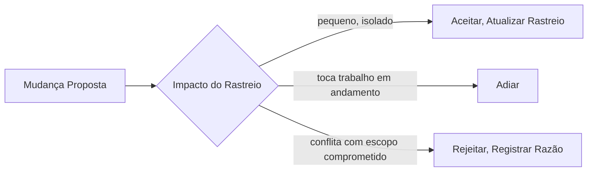

## Objetivos de Aprendizagem

- Definir a rastreabilidade de requisitos precisamente: um vínculo mantido e bidirecional de cada requisito às decisões de design, código e testes que o satisfazem, e de volta.
- Explicar por que os requisitos mudam ao longo da vida de um projeto, e por que isso é uma condição normal e esperada em vez de um sinal de elicitação falha.
- Descrever um processo de controle de mudança: como uma mudança proposta é avaliada contra o seu impacto rastreado antes de ser aceita, adiada ou rejeitada.
- Conectar a rastreabilidade de requisitos a uma prática concreta e cotidiana que este currículo já ensina: ligar um commit ao requisito ou issue que ele aborda.

## Contexto e Motivação

`requirements-elicitation-specification-and-validation` tratou escrever e validar um requisito como se isso acontecesse uma vez, de forma limpa, antes de a implementação começar. Projetos reais nunca são tão limpos: um requisito validado escrito no mês um é rotineiramente revisitado no mês quatro, porque um stakeholder aprendeu algo novo, uma regulação mudou, ou um concorrente enviou um recurso que muda o que "pronto" significa. A gestão de requisitos é a resposta honesta da disciplina a essa realidade: não "prevenir que os requisitos mudem" (um objetivo impossível e contraproducente) mas "rastrear exatamente o que uma mudança afetaria, antes de decidir se a faz". O livro-texto de Sommerville e a própria área de conhecimento de Requisitos de Software do SWEBOK ambos tratam a gestão de requisitos, incluindo rastreabilidade e controle de mudança, como uma atividade genuinamente distinta da elicitação, especificação e validação que esta disciplina já cobriu, precisamente porque ela opera continuamente pela vida inteira do projeto em vez de uma vez no início.

## Teoria Central

### Rastreabilidade: um vínculo mantido, não um documento único

Uma matriz de rastreabilidade de requisitos registra, para todo requisito, quais decisões de design, quais módulos de código e quais testes existem especificamente para satisfazê-lo. Crucialmente, este vínculo corre em ambas as direções e ambas as direções importam por uma razão diferente:

```text
RASTREIO PARA FRENTE   (requisito -> código/testes):
  Responde: "se eu mudar este requisito, o que preciso ir
  checar ou modificar?"

RASTREIO PARA TRÁS     (código/testes -> requisito):
  Responde: "por que este código existe? que necessidade real e
  enunciada o justifica?" Traz à tona código que rastreia de
  volta para NADA, um sinal forte de escopo desnecessário que se
  infiltrou sem jamais ser um requisito validado.
```

Uma matriz de rastreabilidade que só corre para frente perde exatamente a segunda pergunta, que é por que ferramentas de gestão de requisitos reais (e até uma planilha disciplinada e mantida manualmente num projeto pequeno) rastreiam ambas as direções desde o início.

### Controle de mudança: avaliando uma mudança proposta contra o seu impacto rastreado

Uma vez que um vínculo de rastreabilidade existe, uma mudança proposta a um requisito pode ser avaliada honestamente, antes de ser aceita: quais decisões de design o rastreio diz que isto toca, qual código, quais testes, e, transitivamente, isto toca qualquer coisa a jusante deles. Um processo de controle de mudança, na sua forma mais simples, é um checkpoint deliberado (um comitê de controle de mudança num projeto grande, a aprovação de um único líder técnico num pequeno) que olha para este impacto rastreado e toma uma de três decisões: aceitar a mudança e atualizar o rastreio de acordo, adiá-la para um lançamento posterior uma vez que o trabalho atual em andamento não é afetado, ou rejeitá-la com uma razão explícita e registrada. O que o controle de mudança não é é um carimbo de borracha ou um congelamento geral; ambos os extremos derrotam o seu propósito de fato, que é tornar o custo de uma mudança visível antes de ele ser pago, não prevenir a mudança de todo.



### Rastreabilidade na prática: ligando um commit a um requisito

A forma mais concreta e cotidiana de rastreabilidade que a maioria dos engenheiros de fato toca é ligar um commit ou um pull request à issue ou requisito que ele aborda, exatamente a disciplina que `commit-hygiene` (`software-construction`) já ensina no nível de uma mensagem de commit individual. Uma mensagem de commit que diz "corrige bug de login" rastreia para nada; uma mensagem de commit que diz "corrige expiração de token de sessão, fecha REQ-482" dá a um engenheiro futuro, ou a uma ferramenta automatizada futura construindo um relatório de rastreabilidade, um vínculo direto e checável de uma mudança de código específica de volta a um requisito específico e validado. Rastreabilidade de requisitos no nível de projeto e higiene de commit no nível individual são a mesma ideia, aplicada em duas escalas diferentes.

## Exemplos Resolvidos

### Exemplo 1: um rastreio para frente pegando um impacto perdido

Um stakeholder de produto propõe mudar o requisito de redefinição de senha de "válido por 60 minutos" para "válido por 15 minutos", uma mudança que soa trivialmente pequena. Um rastreio para frente a partir desse requisito mostra que três coisas dependem da figura de 60 minutos: o código que gera e checa a expiração do token, um artigo de ajuda voltado ao usuário que enuncia a figura exata, e um teste de integração que afirma que um token ainda é válido depois de 45 minutos. Sem o rastreio, a mudança de código sozinha seria enviada, silenciosamente quebrando a precisão do artigo de ajuda e a suposição agora falsa do teste. O rastreio transformou uma mudança "pequena" numa com escopo preciso antes de qualquer código ser tocado.

### Exemplo 2: um rastreio para trás trazendo à tona escopo que nunca foi um requisito

Um exercício de rastreio para trás num código maduro encontra um recurso inteiro de dashboard de admin sem nenhum requisito para o qual ele rastreie de volta. A investigação encontra que ele foi adicionado dezoito meses antes por um engenheiro que achou que seria útil, nunca foi validado contra uma necessidade de stakeholder real, e teve zero uso real desde então. O rastreio para trás não só encontrou código morto, ele encontrou um exemplo concreto do exato fracasso que a atividade de validação de `requirements-elicitation-specification-and-validation` existe para prevenir: funcionalidade construída sem jamais confirmar que ela satisfaz uma necessidade genuína e enunciada.

### Exemplo 3: controle de mudança rejeitando uma mudança, com uma razão registrada

Um pedido de meio-lançamento chega para adicionar um novo campo obrigatório a uma reformulação de checkout em andamento. O rastreio mostra que isto toca a integração do provedor de pagamento, já congelada em código para uma auditoria de conformidade próxima. O controle de mudança não aceita silenciosamente nem ignora silenciosamente o pedido; ele o rejeita para este lançamento, com uma razão explícita e registrada (congelamento de código de pagamento para a auditoria), e o agenda para o próximo lançamento em vez disso. O requisitante obtém uma resposta clara e honesta em vez de ou um congelamento quebrado ou um pedido silenciosamente descartado sem explicação, e a razão registrada se torna parte da própria história rastreável do projeto para qualquer um fazendo a mesma pergunta depois.

## Equívocos Comuns e Armadilhas

- **"Requisitos mudando no meio do projeto significa que a elicitação falhou."** Informação nova genuína (um stakeholder aprendendo mais, um mercado mudando) é uma fonte normal e esperada de mudança ao longo da vida de um projeto, não evidência de que o trabalho original de elicitação e validação foi mal feito; o trabalho da disciplina é gerenciar essa mudança deliberadamente, não preveni-la.
- **"Uma matriz de rastreabilidade só precisa apontar para frente, do requisito ao código."** O Exemplo 2 mostra que a direção para trás (código ao requisito) pega um fracasso diferente e real, escopo desnecessário sem justificativa validada, que um rastreio só-para-frente nunca traz à tona.
- **"Controle de mudança significa desacelerar tudo com processo."** O Exemplo 3 mostra que o trabalho de fato do controle de mudança é fazer uma decisão honesta e registrada rapidamente, com base no impacto rastreado real, não bloquear a mudança por princípio; um processo de controle de mudança que leva mais tempo para rodar do que a própria mudança levaria para só fazer e reverter perdeu de vista o seu próprio propósito.

## Resumo

A gestão de requisitos rastreia duas coisas pela vida inteira de um projeto, não só no seu início: um vínculo de rastreabilidade bidirecional de cada requisito às decisões de design, código e testes que o satisfazem (para frente, para avaliar o impacto de uma mudança; para trás, para pegar escopo que nunca foi uma necessidade validada), e um processo de controle de mudança que avalia uma mudança proposta contra o seu impacto rastreado antes de decidir aceitar, adiar ou rejeitar, com uma razão registrada em qualquer caso. A mesma ideia aparece na escala de commit-individual em `commit-hygiene` (`software-construction`), ligando uma mudança de código de volta ao requisito ou issue específico que ela aborda; a rastreabilidade de requisitos é esse mesmo vínculo, mantido deliberadamente por um projeto inteiro em vez de um commit por vez.

## Documentation Links

- [Sommerville: Software Engineering (10th Edition, Pearson)](https://www.pearson.com/en-us/subject-catalog/p/software-engineering/P200000003258/9780137503148): a fonte de livro-texto para gestão de requisitos, rastreabilidade e controle de mudança como atividades distintas de elicitação, especificação e validação.
- [IEEE Computer Society: SWEBOK v4.0 Guide](https://www.computer.org/education/bodies-of-knowledge/software-engineering): a área de conhecimento de Requisitos de Software, que explicitamente inclui a gestão de requisitos (rastreabilidade, controle de mudança) como um subtópico ao lado de elicitação e especificação.
