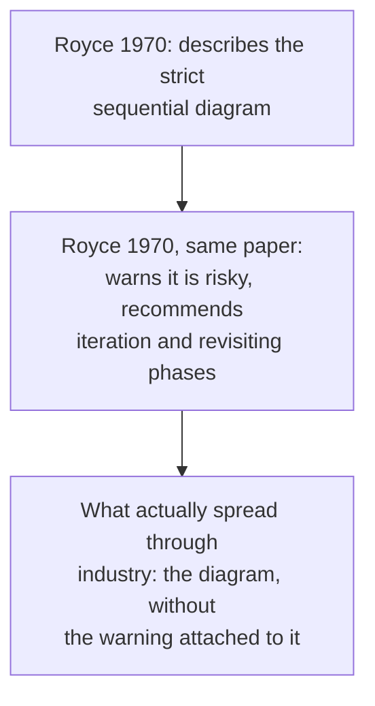

## Learning Objectives

- Describe the waterfall model precisely: a strict, one-directional sequence of phases (requirements, design, implementation, testing, maintenance) with no revisiting an earlier phase.
- State the real, documented irony in the model's history: Royce's own 1970 paper, the source everyone cites for it, described the strict sequential version as risky and argued against using it as described.
- Explain what genuine value the waterfall model still contributes (a shared vocabulary of phases every later model still uses) despite its documented flaws.
- Trace why iterative and incremental models arose specifically as a correction to waterfall's central flaw: the assumption that requirements can be fully known before any implementation begins.

## Context & Motivation

`swebok-and-the-scope-beyond-construction` named Software Engineering Process as one of this discipline's four core SWEBOK areas, and no concept in that area can be built honestly without first understanding the model that shaped how the entire field talks about software process, including by being the model every later model defines itself in opposition to. The waterfall model is the software engineering equivalent of a foundational, deeply flawed first theory: teaching it accurately, including its real, well-documented history, is more useful than skipping straight to its successors, because the successors (iterative development, then Scrum and Kanban in the two concepts that follow this one) only make sense as a genuine response to specific, nameable problems waterfall has.

## Core Theory

### The waterfall model, precisely

The waterfall model organizes a software project into a strict sequence of phases, each one completed and signed off before the next begins, with no planned mechanism for revisiting an earlier phase once it is closed:

```text
Requirements  -->  Design  -->  Implementation  -->  Testing  -->  Maintenance
```

Each arrow is meant to be crossed once. A discovery made during Design that the Requirements phase got something wrong is, under the model as strictly described, not something the process has a designed path for; the phase is already closed.

### Royce (1970): the actual source, and the actual argument it makes

Winston Royce's 1970 paper, "Managing the Development of Large Software Systems," is the paper cited, almost universally, as the origin of the waterfall model, and it does describe exactly the sequential diagram above. What gets lost in most citations of this paper is that Royce's own text, in the very same paper, states about that strict sequential version: "I believe in this concept, but the implementation described above is risky and invites failure." Royce goes on, in the same paper, to recommend modifications that directly anticipate iteration: building a preliminary design and a pilot implementation before committing to the full plan, and explicitly planning to revisit earlier phases based on what is learned. The paper that gets cited as waterfall's founding document is, read in full, an argument that pure waterfall as commonly practiced is a mistake.



### Why the model spread anyway, and what it genuinely got right

Despite Royce's own reservations, the strict sequential model spread widely through the 1970s and 1980s, largely because it maps cleanly onto how large organizations already structured contracts, milestones, and sign-offs: a fixed sequence of phases with a deliverable and a review at each boundary is straightforward to plan, staff, and bill against, independent of whether it produces good software. This is a genuine, honest reason for its popularity, not evidence the model was secretly good at building software. What the model does contribute, and what every later process model this discipline covers still uses, is a shared vocabulary: "requirements," "design," "implementation," "testing," and "maintenance" as named, distinct activities are waterfall's real, lasting contribution, even to processes (Scrum, Kanban) that reject the strict one-directional sequencing entirely.

### The central flaw, named precisely

The strict model assumes requirements can be fully and correctly known before implementation begins, and that assumption is exactly what `requirements-elicitation-specification-and-validation`'s validation loop already showed is unreliable in practice: stakeholders routinely learn what they actually need only once something concrete exists to react to. A process with no designed mechanism for revisiting requirements once implementation starts has no honest answer for what happens when that learning occurs mid-project, other than treating it as an unplanned exception to the process rather than an expected, normal event.

## Worked Examples

### Example 1: a real project where the strict model's flaw surfaces

A team following a strict waterfall schedule signs off on requirements in month one and begins design in month two. In month four, midway through implementation, a stakeholder realizes, upon seeing an early internal demo, that a core assumption in the signed-off requirements (that all reports are generated on demand) does not match how the business actually needs to use the system (reports need to be scheduled and emailed automatically). The process has no designed path for this discovery; the team either forces the change in through an informal, unplanned exception (undermining the whole premise of phase sign-off) or ships the wrong thing on schedule. Neither outcome is a failure of the team's competence; both are the predictable, structural consequence of a process that assumes requirements do not change after month one.

### Example 2: reading Royce's actual recommendation, not just his diagram

A team decides to adopt "the waterfall model" purely from having seen the five-phase diagram, without reading Royce's actual paper. Had they read the full text, they would have found Royce's own suggested corrective, building a pilot implementation before committing fully, and planning explicitly for at least one iteration back through earlier phases. Adopting only the diagram and skipping the paper's own warning is a real, documented pattern in how this model actually spread through industry, and this concept's honest historical treatment exists specifically to prevent repeating that same incomplete reading.

### Example 3: what waterfall's vocabulary still buys a modern agile team

A team running Scrum still uses the words "requirements," "design," "testing," even though their process organizes work into sprints rather than into waterfall's sequential phases. When a Scrum team writes a user story, breaks it into a technical design during sprint planning, and defines a Definition of Done that includes testing, they are using exactly the vocabulary waterfall named, just applied inside a single, short iteration instead of once across an entire project. Waterfall's phases as concepts did not get discarded by later models; only its strict, one-directional sequencing across the whole project did.

## Common Misconceptions & Pitfalls

- **"Royce invented and endorsed the waterfall model as commonly practiced."** Royce's own paper explicitly calls the strict sequential version risky and recommends iteration; the model that spread through industry is a reading of his diagram that dropped his own attached warning, a real, documented irony this concept states honestly rather than repeating the common misattribution.
- **"Waterfall has nothing useful to teach a team using a modern process."** Example 3 shows the phase vocabulary (requirements, design, implementation, testing) survives directly into agile processes, just compressed into a short iteration instead of spread across an entire project; the model's contribution to shared vocabulary outlived its own strict sequencing.
- **"The problem with waterfall was that teams executed it badly, not that the model itself has a structural flaw."** Example 1 shows the flaw is structural: the model, as strictly described, has no designed path for a legitimate, common event (a stakeholder learning something new mid-project), independent of how skilled or careful the team executing it is.

## Summary

The waterfall model organizes a project into a strict, one-directional sequence of phases (requirements, design, implementation, testing, maintenance), with no designed mechanism for revisiting an earlier phase once closed. Winston Royce's 1970 paper is the real, cited source for this diagram, and, read in full, that same paper calls the strict version risky and recommends the iteration and phase-revisiting the model as commonly practiced lacks, a genuine historical irony worth stating accurately rather than repeating the common misattribution that Royce endorsed pure waterfall. The model's central, structural flaw is its assumption that requirements can be fully known before implementation begins, precisely the assumption `requirements-elicitation-specification-and-validation`'s validation loop already showed is unreliable; its lasting, genuine contribution is the shared vocabulary of named phases every later process model, including the agile models covered next in this discipline, still uses, just compressed into shorter, repeated iterations instead of one long, irreversible sequence.

## Documentation Links

- [Royce (1970): Managing the Development of Large Software Systems](https://www.praxisframework.org/files/royce1970.pdf): the original paper, including Royce's own warning that the strict sequential version he diagrams is risky and his own recommendation to iterate, the primary source this concept's historical honesty is built on.
- [Sommerville: Software Engineering (10th Edition, Pearson)](https://www.pearson.com/en-us/subject-catalog/p/software-engineering/P200000003258/9780137503148): the standard textbook treatment of the waterfall model and its critique, and the source for the iterative and incremental models this concept identifies as its correction.
