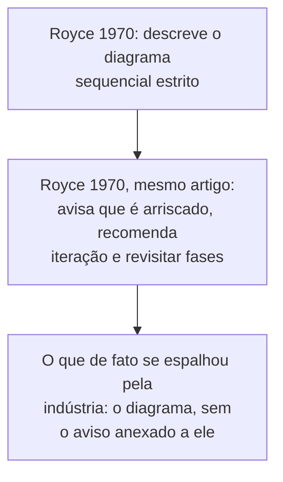

## Objetivos de Aprendizagem

- Descrever o modelo waterfall precisamente: uma sequência estrita e de uma direção de fases (requisitos, design, implementação, teste, manutenção) sem revisitar uma fase anterior.
- Enunciar a ironia real e documentada na história do modelo: o próprio artigo de 1970 de Royce, a fonte que todos citam para ele, descreveu a versão sequencial estrita como arriscada e argumentou contra usá-la como descrita.
- Explicar que valor genuíno o modelo waterfall ainda contribui (um vocabulário compartilhado de fases que todo modelo posterior ainda usa) apesar das suas falhas documentadas.
- Rastrear por que modelos iterativos e incrementais surgiram especificamente como uma correção à falha central do waterfall: a suposição de que os requisitos podem ser totalmente conhecidos antes de qualquer implementação começar.

## Contexto e Motivação

`swebok-and-the-scope-beyond-construction` nomeou o Processo de Engenharia de Software como uma das quatro áreas centrais do SWEBOK desta disciplina, e nenhum conceito nessa área pode ser construído honestamente sem primeiro entender o modelo que moldou como o campo inteiro fala sobre processo de software, inclusive por ser o modelo contra o qual todo modelo posterior se define em oposição. O modelo waterfall é o equivalente de engenharia de software a uma primeira teoria fundacional e profundamente falha: ensiná-lo com precisão, incluindo a sua história real e bem documentada, é mais útil do que pular direto para os seus sucessores, porque os sucessores (desenvolvimento iterativo, depois Scrum e Kanban nos dois conceitos que seguem este) só fazem sentido como uma resposta genuína a problemas específicos e nomeáveis que o waterfall tem.

## Teoria Central

### O modelo waterfall, precisamente

O modelo waterfall organiza um projeto de software numa sequência estrita de fases, cada uma completada e aprovada antes de a próxima começar, sem nenhum mecanismo planejado para revisitar uma fase anterior uma vez que ela é fechada:

```text
Requisitos  -->  Design  -->  Implementação  -->  Teste  -->  Manutenção
```

Cada seta é feita para ser cruzada uma vez. Uma descoberta feita durante o Design de que a fase de Requisitos errou algo é, sob o modelo como estritamente descrito, não algo para o qual o processo tem um caminho projetado; a fase já está fechada.

### Royce (1970): a fonte de fato, e o argumento de fato que ela faz

O artigo de 1970 de Winston Royce, "Managing the Development of Large Software Systems", é o artigo citado, quase universalmente, como a origem do modelo waterfall, e ele de fato descreve exatamente o diagrama sequencial acima. O que se perde na maioria das citações deste artigo é que o próprio texto de Royce, no mesmo artigo, enuncia sobre essa versão sequencial estrita: "Eu acredito neste conceito, mas a implementação descrita acima é arriscada e convida ao fracasso." Royce continua, no mesmo artigo, a recomendar modificações que antecipam diretamente a iteração: construir um design preliminar e uma implementação piloto antes de comprometer-se com o plano completo, e explicitamente planejar revisitar fases anteriores com base no que é aprendido. O artigo que é citado como o documento fundador do waterfall é, lido por completo, um argumento de que o waterfall puro como comumente praticado é um erro.



### Por que o modelo se espalhou mesmo assim, e o que ele genuinamente acertou

Apesar das reservas do próprio Royce, o modelo sequencial estrito se espalhou amplamente pelos anos 1970 e 1980, em grande parte porque ele mapeia de forma limpa sobre como grandes organizações já estruturavam contratos, marcos e aprovações: uma sequência fixa de fases com um entregável e uma revisão em cada limite é direta de planejar, dotar de pessoal e faturar, independentemente de produzir bom software. Esta é uma razão genuína e honesta para a sua popularidade, não evidência de que o modelo era secretamente bom em construir software. O que o modelo de fato contribui, e o que todo modelo de processo posterior que esta disciplina cobre ainda usa, é um vocabulário compartilhado: "requisitos", "design", "implementação", "teste" e "manutenção" como atividades nomeadas e distintas são a contribuição real e duradoura do waterfall, mesmo a processos (Scrum, Kanban) que rejeitam o sequenciamento estrito e de uma direção inteiramente.

### A falha central, nomeada precisamente

O modelo estrito assume que os requisitos podem ser total e corretamente conhecidos antes de a implementação começar, e essa suposição é exatamente o que o laço de validação de `requirements-elicitation-specification-and-validation` já mostrou ser não confiável na prática: stakeholders rotineiramente aprendem o que de fato precisam só uma vez que algo concreto existe para reagir. Um processo sem nenhum mecanismo projetado para revisitar requisitos uma vez que a implementação começa não tem resposta honesta para o que acontece quando esse aprendizado ocorre no meio do projeto, exceto tratá-lo como uma exceção não planejada ao processo em vez de um evento esperado e normal.

## Exemplos Resolvidos

### Exemplo 1: um projeto real onde a falha do modelo estrito surge

Uma equipe seguindo um cronograma waterfall estrito aprova os requisitos no mês um e começa o design no mês dois. No mês quatro, no meio da implementação, um stakeholder percebe, ao ver uma demo interna inicial, que uma suposição central nos requisitos aprovados (que todos os relatórios são gerados sob demanda) não corresponde a como o negócio de fato precisa usar o sistema (relatórios precisam ser agendados e enviados por email automaticamente). O processo não tem nenhum caminho projetado para esta descoberta; a equipe ou força a mudança por meio de uma exceção informal e não planejada (minando a premissa inteira da aprovação de fase) ou envia a coisa errada no cronograma. Nenhum desfecho é uma falha da competência da equipe; ambos são a consequência previsível e estrutural de um processo que assume que os requisitos não mudam depois do mês um.

### Exemplo 2: lendo a recomendação de fato de Royce, não só o seu diagrama

Uma equipe decide adotar "o modelo waterfall" puramente por ter visto o diagrama de cinco fases, sem ler o artigo de fato de Royce. Tivessem lido o texto completo, teriam encontrado o próprio corretivo sugerido de Royce, construir uma implementação piloto antes de comprometer-se por completo, e planejar explicitamente para pelo menos uma iteração de volta por fases anteriores. Adotar só o diagrama e pular o próprio aviso do artigo é um padrão real e documentado em como este modelo de fato se espalhou pela indústria, e o tratamento histórico honesto deste conceito existe especificamente para prevenir repetir essa mesma leitura incompleta.

### Exemplo 3: o que o vocabulário do waterfall ainda compra para uma equipe ágil moderna

Uma equipe rodando Scrum ainda usa as palavras "requisitos", "design", "teste", mesmo que o seu processo organize o trabalho em sprints em vez de nas fases sequenciais do waterfall. Quando uma equipe Scrum escreve uma user story, a quebra num design técnico durante o sprint planning, e define uma Definition of Done que inclui teste, ela está usando exatamente o vocabulário que o waterfall nomeou, só que aplicado dentro de uma única iteração curta em vez de uma vez por um projeto inteiro. As fases do waterfall como conceitos não foram descartadas por modelos posteriores; só o seu sequenciamento estrito e de uma direção pelo projeto inteiro foi.

## Equívocos Comuns e Armadilhas

- **"Royce inventou e endossou o modelo waterfall como comumente praticado."** O próprio artigo de Royce explicitamente chama a versão sequencial estrita de arriscada e recomenda a iteração; o modelo que se espalhou pela indústria é uma leitura do seu diagrama que descartou o seu próprio aviso anexado, uma ironia real e documentada que este conceito enuncia honestamente em vez de repetir a atribuição errada comum.
- **"Waterfall não tem nada de útil para ensinar a uma equipe usando um processo moderno."** O Exemplo 3 mostra que o vocabulário de fases (requisitos, design, implementação, teste) sobrevive diretamente em processos ágeis, só comprimido numa iteração curta em vez de espalhado por um projeto inteiro; a contribuição do modelo ao vocabulário compartilhado sobreviveu ao seu próprio sequenciamento estrito.
- **"O problema com o waterfall era que as equipes o executavam mal, não que o próprio modelo tem uma falha estrutural."** O Exemplo 1 mostra que a falha é estrutural: o modelo, como estritamente descrito, não tem nenhum caminho projetado para um evento legítimo e comum (um stakeholder aprendendo algo novo no meio do projeto), independentemente de quão habilidosa ou cuidadosa é a equipe executando-o.

## Resumo

O modelo waterfall organiza um projeto numa sequência estrita e de uma direção de fases (requisitos, design, implementação, teste, manutenção), sem nenhum mecanismo projetado para revisitar uma fase anterior uma vez fechada. O artigo de 1970 de Winston Royce é a fonte real e citada para este diagrama, e, lido por completo, esse mesmo artigo chama a versão estrita de arriscada e recomenda a iteração e a revisitação de fase que o modelo como comumente praticado carece, uma ironia histórica genuína que vale enunciar com precisão em vez de repetir a atribuição errada comum de que Royce endossou o waterfall puro. A falha central e estrutural do modelo é a sua suposição de que os requisitos podem ser totalmente conhecidos antes de a implementação começar, precisamente a suposição que o laço de validação de `requirements-elicitation-specification-and-validation` já mostrou ser não confiável; a sua contribuição duradoura e genuína é o vocabulário compartilhado de fases nomeadas que todo modelo de processo posterior, incluindo os modelos ágeis cobertos em seguida nesta disciplina, ainda usa, só comprimido em iterações mais curtas e repetidas em vez de uma longa sequência irreversível.

## Documentation Links

- [Royce (1970): Managing the Development of Large Software Systems](https://www.praxisframework.org/files/royce1970.pdf): o artigo original, incluindo o próprio aviso de Royce de que a versão sequencial estrita que ele diagrama é arriscada e a sua própria recomendação de iterar, a fonte primária sobre a qual a honestidade histórica deste conceito é construída.
- [Sommerville: Software Engineering (10th Edition, Pearson)](https://www.pearson.com/en-us/subject-catalog/p/software-engineering/P200000003258/9780137503148): o tratamento de livro-texto padrão do modelo waterfall e da sua crítica, e a fonte para os modelos iterativos e incrementais que este conceito identifica como a sua correção.
