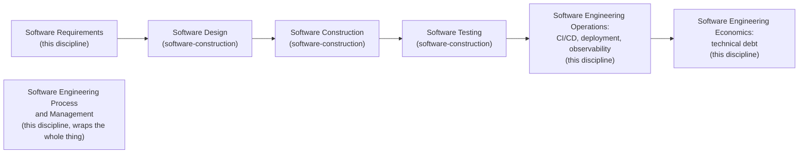

## Learning Objectives

- State the real, citable knowledge area breakdown SWEBOK v4.0 uses to organize software engineering, and name which areas this discipline covers.
- Explain precisely what `algorithms-software/software-construction` already covers (Software Design, Software Construction, Software Testing, in SWEBOK's own naming) and why this discipline does not re-derive any of it.
- Name the four SWEBOK knowledge areas this discipline actually builds its scope from: Software Requirements, Software Engineering Process, Software Engineering Management, and Software Engineering Operations, plus Software Engineering Economics for its closing concept.
- Recognize Software Engineering Operations specifically as the newest of these areas, added in SWEBOK v4.0 (2024), and understand why CI/CD and production observability, genuinely new material on this platform, live there rather than being an informal afterthought.

## Context & Motivation

Every discipline in this curriculum's `software-distributed` module needs a real answer to one question before a single concept gets written: what, exactly, is left to teach once a sibling discipline has already taught something adjacent. `algorithms-software/software-construction`, twenty concepts published earlier in this curriculum, already answers "how do I build software that works and stays manutenible": specifications and contracts, information hiding, coupling and cohesion, design patterns, the two architecture styles taught at an introductory level, SOLID, the full spectrum of testing from unit to system, test-driven development, systematic debugging, version control, code review, refactoring, and the individual versus team dimension of process. That is a real, complete, and honest treatment of the unit level of software engineering. This discipline's job is everything SWEBOK treats as knowledge outside that unit level.

The IEEE Computer Society's Guide to the Software Engineering Body of Knowledge (SWEBOK), now in its fourth edition, is the actual, current, citable authority for this split, not an invented convenience. SWEBOK v4.0 organizes the field into eighteen knowledge areas. Three of them, named exactly as SWEBOK names them, map directly onto what `software-construction` already covers: Software Design, Software Construction, and Software Testing. This discipline is built from four different knowledge areas that discipline does not touch at all: Software Requirements, Software Engineering Process, Software Engineering Management, and Software Engineering Operations, the last of these a genuinely new addition in the 2024 edition, added specifically to capture practices (continuous integration and deployment pipelines, production monitoring, incident response) that had grown large and important enough in real industry practice to deserve their own area rather than living as a footnote inside Software Maintenance. This discipline closes with one concept from a ninth area, Software Engineering Economics, because technical debt is best understood as a genuine economic concept, not a metaphor left loose.

The ACM/IEEE CS2013 curriculum guideline, the same citation family already used across this whole curriculum's other CS2013-anchored disciplines, corroborates this split independently: its own Software Engineering knowledge area lists Requirements Engineering, Software Processes, and Software Project Management as distinct knowledge units alongside Software Design, Software Construction, and Software Verification and Validation, the same construction-versus-everything-else line SWEBOK draws. Two independent, real curriculum authorities agreeing on the same boundary is strong evidence this is a real, well-established distinction in the field, not a convenient split invented for this platform.

## Core Theory

### The nine SWEBOK knowledge areas relevant to this curriculum's split

SWEBOK v4.0 lists eighteen knowledge areas in total. The nine that matter for drawing this discipline's boundary against its sibling are:

```text
Already covered by algorithms-software/software-construction:
  - Software Design
  - Software Construction
  - Software Testing

Covered by THIS discipline (software-distributed/software-engineering):
  - Software Requirements
  - Software Engineering Process
  - Software Engineering Management
  - Software Engineering Operations   (new in v4.0)
  - Software Engineering Economics    (one closing concept)

Out of scope for both, covered elsewhere in this curriculum or not yet reached:
  - Software Architecture             (deliberately shallow in software-construction;
                                        deeper treatment lives in system-design-concepts
                                        and systems/distributed-systems-i, see
                                        from-requirements-to-architecture-decisions)
  - Software Maintenance, Software Configuration Management,
    Software Quality, Software Security, Software Engineering
    Professional Practice, Computing/Mathematical/Engineering
    Foundations
```

The last block is worth being honest about: this discipline does not claim to cover every remaining SWEBOK area either. Software Configuration Management, for instance, is already substantially covered by `software-construction`'s version-control-with-git and branching-and-merging-strategies concepts, even though SWEBOK treats it as its own area. This discipline's job is specifically to fill the four-and-a-half areas listed as covered above, not to become a second, redundant pass through the whole guide.

### What Software Construction, precisely, already owns

It matters to be precise about where the line actually falls, because "software construction" as an everyday phrase sounds like it could mean almost anything about building software. SWEBOK's own definition is narrower and more useful: Software Construction is the detailed creation of working software through coding, verification (unit testing, debugging), and integration, at the level of an individual programmer or a small team writing and immediately checking one unit of code. Everything upstream of that (why this feature exists at all, what process organizes the team writing it) and everything downstream of that (how it gets deployed, how it behaves once real users are hitting it) is explicitly out of scope for Software Construction as SWEBOK defines it, and is exactly this discipline's territory.



### Why Software Engineering Operations is the genuinely new part

Continuous integration, continuous delivery, deployment pipelines, and production observability are not classical academic material the way Requirements Engineering or process models are; they grew directly out of real industry practice over roughly the last two decades and were formalized enough, recently enough, that SWEBOK only gave them a dedicated knowledge area in its 2024 edition. This discipline treats that history honestly rather than pretending these ideas are older or more academically settled than they are: the concepts in this discipline's CI/CD and observability sections are sourced from practitioner writing (Martin Fowler's own articles on continuous integration and delivery, Cindy Sridharan's own writing on observability) the same way `software-construction`'s SOLID concept honestly sourced Robert C. Martin as an industrial, not academic, origin.

## Worked Examples

### Example 1: routing a real question to the right discipline

A team is deciding whether a new payment feature needs a queue-based architecture or a direct synchronous call. Is that a `software-construction` question or a `software-engineering` question? Neither discipline alone answers it: the *decision itself*, tracing from a non-functional requirement (a target throughput, a tolerance for eventual consistency) to an architecture choice, is this discipline's `from-requirements-to-architecture-decisions`. The actual queue implementation, coupling and cohesion between the producer and consumer code, and the unit tests around it, are `software-construction`'s territory. Neither discipline claims the whole question; each owns a distinct half of it.

### Example 2: a bug found in production

A null pointer exception surfaces in production three weeks after release. Diagnosing and fixing the code defect itself, `systematic-debugging`, is `software-construction`. But *how the team found out* (an alert fired from a metric, a trace showing where the request failed) is this discipline's observability material, and *whether that fix should ship immediately or wait for the next release train* is a Software Engineering Process question, also this discipline's. The same incident touches both disciplines at genuinely different points in its lifecycle, which is exactly what this discipline's capstone traces end to end.

### Example 3: a knowledge area that stays explicitly out of scope

A team wants deep guidance on choosing between a monolith and a microservices architecture for a new system. `software-construction`'s own `software-architecture-styles` concept explicitly flags that deeper distributed architecture is "left to a later, more advanced discipline elsewhere in this curriculum." This discipline investigated that gap directly (see `from-requirements-to-architecture-decisions`) and found it is already filled, at two different depths, by two already-published disciplines: `system-design-concepts` (Complementary Studies) for applied, case-study-level architecture patterns, and `systems/distributed-systems-i` for the theoretical consensus and replication primitives such architectures are built on. This discipline's own architecture concept is deliberately a bridge that cross-links outward to both rather than a third, competing treatment.

## Common Misconceptions & Pitfalls

- **"Software engineering just means writing good code."** SWEBOK's eighteen knowledge areas make clear this is only three of them (Design, Construction, Testing); a huge, well-established body of knowledge exists for the surrounding activities (deciding what to build, organizing how a team builds it, getting it safely into production, tracking the debt of shortcuts taken along the way) that has nothing to do with code quality directly.
- **"CI/CD and observability are just tooling, not real engineering knowledge."** SWEBOK's own 2024 decision to add Software Engineering Operations as a dedicated knowledge area is direct, current evidence against this: the field's own authoritative body of knowledge judged these practices mature and important enough to deserve formal status, not a footnote.
- **"This discipline duplicates `software-construction`."** A concept-by-concept comparison (see Core Theory's block diagram) shows zero slug overlap and a clean SWEBOK-area boundary; every cross-link in this discipline points outward to a construction-level concept for depth this discipline deliberately does not re-derive, rather than repeating it.

## Summary

This discipline's real, citable scope decision rests on SWEBOK v4.0's own eighteen knowledge areas, corroborated independently by ACM/IEEE CS2013's own Software Engineering knowledge area: `algorithms-software/software-construction` already fully covers Software Design, Software Construction, and Software Testing, the unit level of building software, and this discipline covers what SWEBOK treats as separate knowledge entirely, Software Requirements, Software Engineering Process, Software Engineering Management, and the newly added Software Engineering Operations (continuous integration and deployment, production observability), closing with one concept from Software Engineering Economics for technical debt. Software Architecture beyond the introductory vocabulary `software-construction` already teaches is deliberately left out of both disciplines, because it is already covered, at two different depths, by two other already-published disciplines this one cross-links to rather than duplicates.

## Documentation Links

- [IEEE Computer Society: SWEBOK v4.0 Guide](https://www.computer.org/education/bodies-of-knowledge/software-engineering): the official, current knowledge area breakdown this whole discipline's scope decision is built on, including the three new areas added in the 2024 edition.
- [ACM/IEEE: CS2013 Software Engineering Knowledge Area](https://csed.acm.org/knowledge-areas-software-engineering-se-cs2013-version/): an independent curriculum authority corroborating the same construction-versus-everything-else split, naming Requirements Engineering, Software Processes, and Software Project Management as distinct units from Software Design, Construction, and Verification and Validation.
